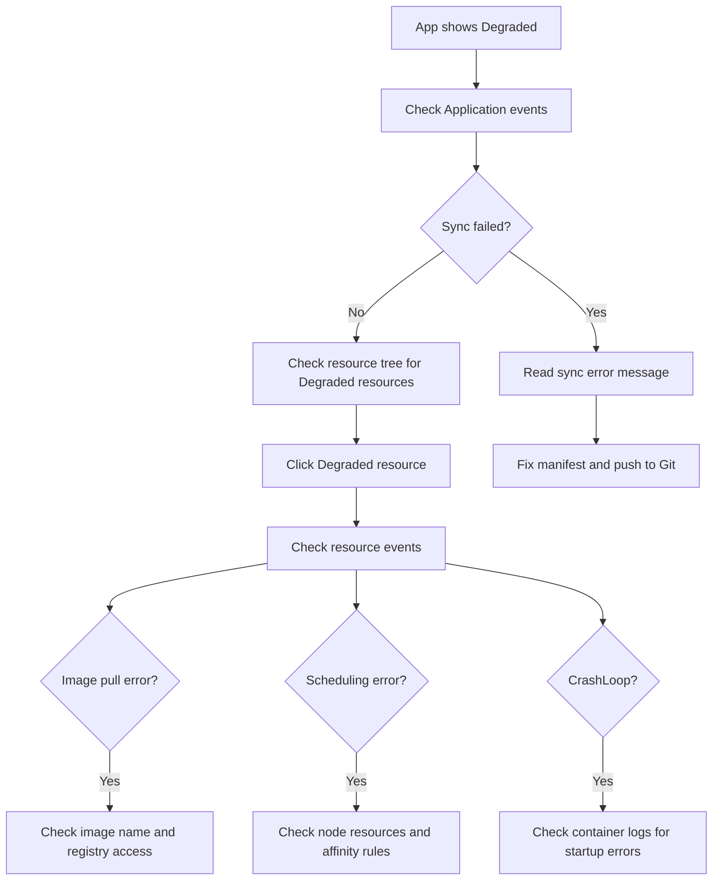

# How to View Application Events in ArgoCD

Author: [nawazdhandala](https://github.com/nawazdhandala)

Tags: ArgoCD, GitOps, Kubernetes, Troubleshooting

Description: Learn how to view and interpret Kubernetes events for ArgoCD-managed applications to troubleshoot deployment issues, sync failures, and resource problems.

---

Kubernetes events are one of the most valuable debugging tools available, and ArgoCD makes them easy to access for every resource in your application. Events tell you what Kubernetes controllers are doing behind the scenes - why a Pod is Pending, why a Deployment is not progressing, or why a PersistentVolumeClaim is stuck. This guide shows you how to find and interpret events in ArgoCD.

## What Are Kubernetes Events?

Events are short-lived records that describe state changes and errors in Kubernetes resources. Every time a controller takes an action - scheduling a Pod, pulling an image, mounting a volume, scaling a ReplicaSet - it creates an event.

Events have a standard structure:

```
Type:     Normal or Warning
Reason:   Short code describing what happened
Message:  Human-readable description
Source:   Which controller generated the event
Count:    How many times this event occurred
Age:      When the event was last seen
```

Events are automatically garbage collected (default retention is 1 hour), so they capture recent activity rather than historical data.

## Viewing Events in the ArgoCD UI

### Application-Level Events

To see events for the ArgoCD Application resource itself:

1. Open your application in the ArgoCD UI
2. Click on the application name to open the details panel
3. Switch to the **Events** tab

Application-level events show ArgoCD-specific operations:

```
LAST SEEN   TYPE      REASON              MESSAGE
1m ago      Normal    OperationStarted    Sync operation started
1m ago      Normal    OperationCompleted  Sync operation to abc1234 succeeded
5m ago      Normal    ResourceUpdated     Updated Deployment/web
```

### Resource-Level Events

For more detailed troubleshooting, view events for individual resources:

1. Navigate to the resource tree view of your application
2. Click on the specific resource (Pod, Deployment, etc.)
3. In the side panel, switch to the **Events** tab

Resource-level events come directly from Kubernetes and provide detailed operational information.

## Common Event Patterns and What They Mean

### Pod Events

Pod events are the most frequently examined because they reveal scheduling, image pull, and container startup issues.

**Successful Pod startup:**
```
LAST SEEN   TYPE     REASON      MESSAGE
2m ago      Normal   Scheduled   Successfully assigned my-app/web-abc123 to node-1
2m ago      Normal   Pulling     Pulling image "myregistry.io/web:v1.2.0"
1m ago      Normal   Pulled      Successfully pulled image "myregistry.io/web:v1.2.0"
1m ago      Normal   Created     Created container web
1m ago      Normal   Started     Started container web
```

**Failed image pull:**
```
LAST SEEN   TYPE      REASON          MESSAGE
30s ago     Normal    Scheduled       Successfully assigned my-app/web-def456 to node-2
25s ago     Normal    Pulling         Pulling image "myregistry.io/web:v9.9.9"
10s ago     Warning   Failed          Failed to pull image "myregistry.io/web:v9.9.9":
                                      rpc error: code = NotFound desc = manifest unknown
5s ago      Warning   Failed          Error: ErrImagePull
3s ago      Normal    BackOff         Back-off pulling image "myregistry.io/web:v9.9.9"
1s ago      Warning   Failed          Error: ImagePullBackOff
```

**Insufficient resources:**
```
LAST SEEN   TYPE      REASON             MESSAGE
1m ago      Warning   FailedScheduling   0/3 nodes are available:
                                         3 Insufficient memory.
                                         preemption: 0/3 nodes are available:
                                         3 No preemption victims found
```

**CrashLoopBackOff:**
```
LAST SEEN   TYPE      REASON      MESSAGE
30s ago     Normal    Created     Created container web
28s ago     Normal    Started     Started container web
25s ago     Warning   BackOff     Back-off restarting failed container web
20s ago     Normal    Pulled      Container image already present on machine
15s ago     Normal    Created     Created container web
13s ago     Normal    Started     Started container web
10s ago     Warning   BackOff     Back-off restarting failed container web
```

### Deployment Events

Deployment events show scaling operations:

```
LAST SEEN   TYPE     REASON              MESSAGE
5m ago      Normal   ScalingReplicaSet   Scaled up replica set web-abc123 to 3
3m ago      Normal   ScalingReplicaSet   Scaled down replica set web-xyz789 to 0
```

**Stuck rollout:**
```
LAST SEEN   TYPE      REASON                MESSAGE
10m ago     Normal    ScalingReplicaSet     Scaled up replica set web-new123 to 1
10m ago     Warning   ProgressDeadlineExceeded
                      Deployment has exceeded its progress deadline
```

### PersistentVolumeClaim Events

PVC events show storage provisioning status:

```
LAST SEEN   TYPE      REASON                MESSAGE
2m ago      Normal    Provisioning          External provisioner is provisioning
                                            volume for claim "my-app/data-pvc"
1m ago      Normal    ProvisioningSucceeded Successfully provisioned volume pv-12345
```

**Failed provisioning:**
```
LAST SEEN   TYPE      REASON               MESSAGE
5m ago      Warning   ProvisioningFailed   storageclass.storage.k8s.io "fast-ssd"
                                           not found
```

### Service Events

Service events typically relate to endpoint management:

```
LAST SEEN   TYPE     REASON                MESSAGE
1m ago      Normal   EnsuringLoadBalancer   Ensuring load balancer
30s ago     Normal   EnsuredLoadBalancer    Ensured load balancer
```

### Ingress Events

```
LAST SEEN   TYPE      REASON    MESSAGE
2m ago      Normal    Sync      Scheduled for sync
1m ago      Normal    CREATE    Ingress my-app/web-ingress
```

## Viewing Events via the ArgoCD CLI

The CLI provides access to resource events without needing the UI:

```bash
# Get all resources and their statuses for an application
argocd app get my-app

# Get detailed info about a specific resource
argocd app resources my-app --kind Pod --name web-abc123-x7k9l
```

For more detailed events, use kubectl against the target cluster:

```bash
# All events in the application namespace
kubectl get events -n my-app --sort-by='.lastTimestamp'

# Events for a specific resource
kubectl get events -n my-app \
  --field-selector involvedObject.name=web-abc123-x7k9l

# Warning events only
kubectl get events -n my-app --field-selector type=Warning

# Watch events in real time
kubectl get events -n my-app --watch
```

## Interpreting ArgoCD Sync Events

ArgoCD generates its own events on Application resources during sync operations:

### Successful Sync

```
Type:     Normal
Reason:   OperationStarted
Message:  Sync operation to abc1234 started

Type:     Normal
Reason:   OperationCompleted
Message:  Sync operation to abc1234 succeeded
```

### Failed Sync

```
Type:     Warning
Reason:   OperationCompleted
Message:  Sync operation to abc1234 failed:
          one or more objects failed to apply:
          Deployment.apps "web" is invalid:
          spec.template.spec.containers[0].resources.limits:
          Invalid value: "abc": must match the regex
```

### Sync with Hooks

```
Type:     Normal
Reason:   PreSyncHookStarted
Message:  Running PreSync hook: Job/db-migrate

Type:     Normal
Reason:   PreSyncHookSucceeded
Message:  PreSync hook Job/db-migrate succeeded

Type:     Normal
Reason:   OperationCompleted
Message:  Sync operation to abc1234 succeeded
```

## Event-Based Troubleshooting Workflow

When an application is unhealthy or out of sync, follow this troubleshooting workflow:



## Events and Notifications

You can set up ArgoCD notifications to alert on specific events. This turns passive event viewing into proactive monitoring:

```yaml
metadata:
  annotations:
    # Get notified when health degrades
    notifications.argoproj.io/subscribe.on-health-degraded.slack: alerts
    # Get notified on sync failures
    notifications.argoproj.io/subscribe.on-sync-failed.slack: alerts
```

For more on notification setup, see [How to Configure Notifications in ArgoCD](https://oneuptime.com/blog/post/argocd-notifications/view).

## Tips for Working with Events

1. **Check events immediately after a sync** - If something goes wrong, events captured in the first few minutes tell you exactly what happened.

2. **Look at Warning events first** - Normal events are informational. Warning events indicate problems that need attention.

3. **Events disappear after an hour** - Kubernetes garbage collects events. If you need to investigate an issue from hours ago, you will need a proper event collection system.

4. **Combine events with logs** - Events tell you what Kubernetes controllers did. Logs tell you what your application did. Use both together for complete debugging.

5. **Check events on parent resources** - If a Pod is failing, also check events on its parent Deployment and ReplicaSet for additional context.

Understanding Kubernetes events through ArgoCD is a fundamental debugging skill. Events bridge the gap between "something is wrong" and "here is exactly what went wrong," making them indispensable for operating applications in production.
