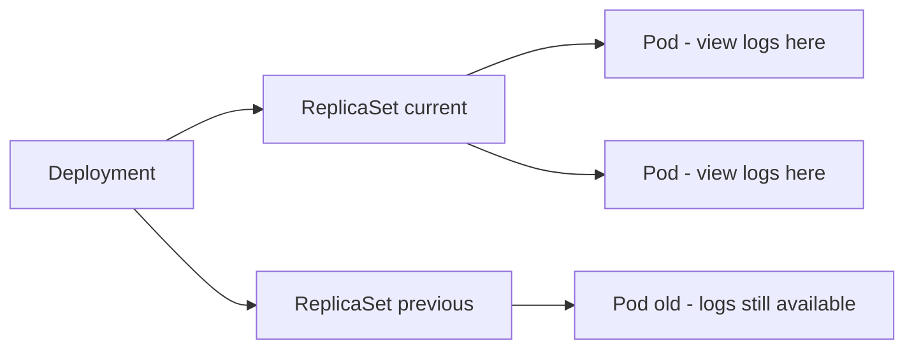

# How to View Application Logs in ArgoCD UI

Author: [nawazdhandala](https://github.com/nawazdhandala)

Tags: ArgoCD, GitOps, Kubernetes, Logging

Description: Step-by-step guide to viewing, streaming, and filtering application container logs directly in the ArgoCD UI without needing kubectl access.

---

One of the underappreciated features of ArgoCD is its built-in log viewer. Instead of switching to a terminal and running kubectl commands every time you need to check logs, you can view container logs directly in the ArgoCD UI. This is particularly valuable for teams where not everyone has direct kubectl access to production clusters.

## Why View Logs in ArgoCD?

There are several situations where viewing logs in ArgoCD makes sense:

1. **Quick debugging** - You see a Degraded health status and want to check what is going wrong without leaving the UI
2. **Limited access** - Not everyone on the team has kubectl access, but they have ArgoCD UI access
3. **Multi-cluster environments** - When you manage applications across multiple clusters, switching kubectl contexts is tedious
4. **Deployment verification** - After syncing, you want to quickly verify the new version is starting correctly

## Accessing Logs from the Resource Tree

The most common way to access logs is through the application resource tree:

1. Navigate to your application in the ArgoCD UI
2. Find the Pod you want to inspect in the resource tree
3. Click on the Pod node
4. In the side panel that opens, click the **Logs** tab

The log viewer opens showing real-time log output from the Pod's containers.

### Alternative Access Points

You can also access logs from:

- **Deployment node** - Click a Deployment, then navigate to its Pods through the tree
- **ReplicaSet node** - Click a ReplicaSet to see its child Pods
- **StatefulSet node** - Same pattern for StatefulSet-managed Pods
- **Job/CronJob node** - View logs from completed or running Jobs

## Log Viewer Features

### Container Selection

If your Pod has multiple containers (including init containers and sidecars), you will see a dropdown to select which container's logs to view:

```text
Container: [app-container ▾]

Options:
- app-container (main application)
- sidecar-proxy (Envoy/Istio sidecar)
- init-db (init container)
```

Select the appropriate container to see its logs.

### Real-Time Streaming

The log viewer streams logs in real time by default. New log lines appear at the bottom as they are generated. This is equivalent to running:

```bash
kubectl logs -f <pod-name> -c <container-name>
```

You can toggle streaming on/off using the follow button. When streaming is off, the view stays static and you can scroll through existing logs without them jumping.

### Log Filtering

The ArgoCD log viewer includes a filter/search box at the top. Type a keyword to filter log lines:

```text
Filter: "ERROR"

# Only shows lines containing "ERROR"
2026-02-26T10:23:45Z ERROR: Failed to connect to database
2026-02-26T10:23:50Z ERROR: Retry failed after 3 attempts
```

This filter works client-side, searching through the logs already loaded in the browser. For large log volumes, this is faster than scrolling manually.

### Timestamp Display

Logs are displayed with their Kubernetes timestamps. You can toggle timestamp display on/off for cleaner output when debugging.

### Wrapping and Formatting

Long log lines can be wrapped or shown in a single scrollable line. The viewer handles JSON-formatted logs reasonably well, though it does not pretty-print JSON by default.

### Copy and Download

You can:
- Select and copy specific log lines
- Use the download button to save the full log output as a text file

## Viewing Logs for Different Resource Types

### Deployment Logs

For Deployments, you typically want to view logs from the current ReplicaSet's Pods:



Click on any running Pod under the current ReplicaSet to see active logs. You can also check Pods from previous ReplicaSets if you need to compare behavior before and after a deployment.

### StatefulSet Logs

StatefulSet Pods have stable identities, so you can reliably find the same Pod by its ordinal name:

```text
my-db-0  (primary)
my-db-1  (replica)
my-db-2  (replica)
```

Click on the specific StatefulSet Pod to view its logs.

### Job and CronJob Logs

For Jobs, logs are available even after the Job completes (as long as the Pod has not been garbage collected):

1. Click the CronJob or Job in the resource tree
2. Navigate to the child Pod
3. View logs to see the job execution output

This is useful for verifying that database migration jobs or batch processing jobs ran correctly after a sync.

### Init Container Logs

If a Pod is stuck in the Init phase, you need to check init container logs:

1. Click on the stuck Pod in the resource tree
2. Open the Logs tab
3. Switch the container selector to the init container
4. Check the logs for errors

Common init container issues include failed database connectivity checks, missing ConfigMaps, or image pull errors.

## Configuring Log Access in RBAC

ArgoCD RBAC controls who can view logs. By default, the log viewing permission must be explicitly granted:

```csv
# In argocd-rbac-cm ConfigMap
p, role:developer, logs, get, */*, allow
p, role:viewer, logs, get, */*, deny
```

The RBAC policy format for logs:

```text
p, <role>, logs, get, <project>/<application>, <allow|deny>
```

You can scope log access per project or application:

```csv
# Allow developers to view logs only in staging projects
p, role:developer, logs, get, staging/*, allow

# Allow the oncall role to view all logs
p, role:oncall, logs, get, */*, allow
```

Without explicit log permissions, the Logs tab will either be hidden or show an access denied error.

## Enabling the Logs Feature

If the Logs tab does not appear, you may need to enable it in the ArgoCD server configuration:

```yaml
# In argocd-cmd-params-cm ConfigMap
apiVersion: v1
kind: ConfigMap
metadata:
  name: argocd-cmd-params-cm
  namespace: argocd
data:
  # Enable the server-side streaming logs feature
  server.enable.gzip: "true"
```

Make sure the ArgoCD server has the necessary Kubernetes RBAC permissions to read Pod logs:

```yaml
# ArgoCD needs these permissions on managed clusters
apiVersion: rbac.authorization.k8s.io/v1
kind: ClusterRole
metadata:
  name: argocd-application-controller
rules:
  - apiGroups: [""]
    resources: ["pods/log"]
    verbs: ["get", "list"]
```

## Limitations of the Built-In Log Viewer

While convenient, the ArgoCD log viewer has limitations:

1. **No persistent log storage** - ArgoCD shows live logs from Kubernetes. Once a Pod is deleted, its logs are gone. For persistent logs, use a log aggregation system like Loki, Elasticsearch, or a cloud logging service.

2. **No cross-pod aggregation** - You view logs one Pod at a time. There is no way to aggregate logs across all Pods of a Deployment in a single view.

3. **Limited search** - The filter is a simple text match. For regex searches or complex queries, you need a proper log management tool.

4. **Browser memory** - Very high-volume log output can slow down the browser. If a container produces thousands of lines per second, the UI log viewer may struggle.

5. **No log level filtering** - You cannot filter by log level (ERROR, WARN, INFO) unless you use the text filter to match those strings.

## When to Use ArgoCD Logs vs Dedicated Tooling

Use ArgoCD logs for:
- Quick checks after a deployment
- Debugging a specific Pod that is failing
- Verifying that a new version started correctly
- Checking init container output

Use dedicated logging tools (Loki, ELK, CloudWatch) for:
- Searching across all Pods in a service
- Historical log analysis
- Complex queries and aggregations
- Alerting on log patterns
- Long-term log retention

For comprehensive application monitoring that goes beyond logs, consider setting up [OneUptime](https://oneuptime.com) for uptime monitoring, performance tracking, and incident management alongside your ArgoCD deployments.

## Quick CLI Alternative

If you prefer the terminal, the ArgoCD CLI also supports log viewing:

```bash
# View logs for a specific resource in an application
argocd app logs my-app --kind Deployment --name web --follow

# View logs for a specific container
argocd app logs my-app --kind Pod --name web-abc123-x7k9l --container app

# View previous container logs (useful for crash loops)
argocd app logs my-app --kind Pod --name web-abc123-x7k9l --previous
```

The built-in log viewer in ArgoCD is a practical tool for everyday debugging. It does not replace a proper logging stack, but it eliminates the need to switch tools for quick log checks. Combined with the resource tree view and health status indicators, it gives you a complete picture of your application's state from a single interface.
