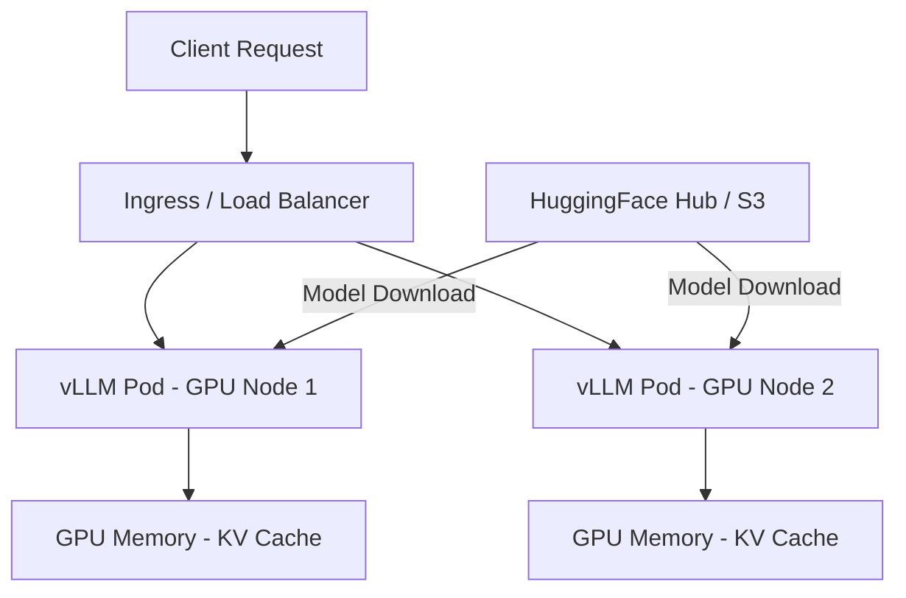

# How to Deploy vLLM with ArgoCD

Author: [nawazdhandala](https://github.com/nawazdhandala)

Tags: ArgoCD, GitOps, Kubernetes, vLLM, LLM Serving

Description: Learn how to deploy vLLM for high-performance large language model serving on Kubernetes using ArgoCD, with GPU scheduling, model management, and autoscaling configuration.

---

vLLM is the fastest open-source engine for serving large language models. It uses PagedAttention to deliver up to 24x higher throughput than naive HuggingFace serving, making it practical to serve models like Llama, Mistral, and Qwen on GPU infrastructure. Deploying vLLM through ArgoCD gives you GitOps-managed LLM serving - model versions tracked in Git, GPU resources properly scheduled, and rollbacks available at a commit.

This guide walks through deploying vLLM on Kubernetes with ArgoCD, covering GPU node configuration, model downloads, autoscaling, and production-ready settings.

## vLLM Architecture on Kubernetes



vLLM runs as a standard HTTP server that exposes an OpenAI-compatible API. Each pod loads the model into GPU memory and serves inference requests using continuous batching.

## Prerequisites: GPU Nodes

Your Kubernetes cluster needs GPU nodes. For most LLMs, you need at least an NVIDIA A10G (24GB) or L4 (24GB) for 7B parameter models, and A100 (40GB/80GB) or H100 for larger models.

Ensure the NVIDIA GPU operator is installed:

```yaml
# ArgoCD Application for NVIDIA GPU Operator
apiVersion: argoproj.io/v1alpha1
kind: Application
metadata:
  name: nvidia-gpu-operator
  namespace: argocd
spec:
  project: infrastructure
  source:
    repoURL: https://helm.ngc.nvidia.com/nvidia
    chart: gpu-operator
    targetRevision: v23.9.1
    helm:
      values: |
        operator:
          defaultRuntime: containerd
        driver:
          enabled: true
        toolkit:
          enabled: true
  destination:
    server: https://kubernetes.default.svc
    namespace: gpu-operator
  syncPolicy:
    automated:
      prune: true
      selfHeal: true
    syncOptions:
      - CreateNamespace=true
```

## Basic vLLM Deployment

Deploy vLLM serving a 7B parameter model:

```yaml
# apps/vllm/deployment.yaml
apiVersion: apps/v1
kind: Deployment
metadata:
  name: vllm-server
  labels:
    app: vllm
    model: mistral-7b
spec:
  replicas: 1
  selector:
    matchLabels:
      app: vllm
  template:
    metadata:
      labels:
        app: vllm
        model: mistral-7b
    spec:
      containers:
        - name: vllm
          image: vllm/vllm-openai:v0.3.3
          ports:
            - containerPort: 8000
              name: http
          args:
            - --model
            - mistralai/Mistral-7B-Instruct-v0.2
            - --host
            - "0.0.0.0"
            - --port
            - "8000"
            - --max-model-len
            - "8192"
            - --gpu-memory-utilization
            - "0.90"
            - --dtype
            - auto
            - --enforce-eager
          env:
            - name: HUGGING_FACE_HUB_TOKEN
              valueFrom:
                secretKeyRef:
                  name: hf-token
                  key: token
            # Cache models on persistent storage
            - name: HF_HOME
              value: /models/cache
          resources:
            requests:
              cpu: "4"
              memory: 16Gi
              nvidia.com/gpu: 1
            limits:
              cpu: "8"
              memory: 32Gi
              nvidia.com/gpu: 1
          readinessProbe:
            httpGet:
              path: /health
              port: 8000
            initialDelaySeconds: 120
            periodSeconds: 10
            timeoutSeconds: 5
          livenessProbe:
            httpGet:
              path: /health
              port: 8000
            initialDelaySeconds: 180
            periodSeconds: 30
            timeoutSeconds: 5
          volumeMounts:
            - name: model-cache
              mountPath: /models/cache
            - name: shm
              mountPath: /dev/shm
      volumes:
        # Persistent cache for downloaded models
        - name: model-cache
          persistentVolumeClaim:
            claimName: vllm-model-cache
        # Shared memory for torch multiprocessing
        - name: shm
          emptyDir:
            medium: Memory
            sizeLimit: 8Gi
      nodeSelector:
        nvidia.com/gpu.product: NVIDIA-A10G
      tolerations:
        - key: nvidia.com/gpu
          operator: Exists
          effect: NoSchedule
---
apiVersion: v1
kind: PersistentVolumeClaim
metadata:
  name: vllm-model-cache
spec:
  accessModes:
    - ReadWriteOnce
  resources:
    requests:
      storage: 100Gi
  storageClassName: gp3
---
apiVersion: v1
kind: Service
metadata:
  name: vllm-server
spec:
  selector:
    app: vllm
  ports:
    - name: http
      port: 8000
      targetPort: 8000
```

## Serving Models from S3 or Custom Storage

Instead of downloading from HuggingFace at startup, serve models from your own storage:

```yaml
initContainers:
  # Download model from S3 before vLLM starts
  - name: model-downloader
    image: amazon/aws-cli:2.15.0
    command:
      - sh
      - -c
      - |
        if [ ! -f /models/mistral-7b/config.json ]; then
          echo "Downloading model from S3..."
          aws s3 sync s3://ml-models/mistral-7b-instruct-v0.2/ /models/mistral-7b/
          echo "Download complete"
        else
          echo "Model already cached"
        fi
    env:
      - name: AWS_ACCESS_KEY_ID
        valueFrom:
          secretKeyRef:
            name: s3-credentials
            key: access-key
      - name: AWS_SECRET_ACCESS_KEY
        valueFrom:
          secretKeyRef:
            name: s3-credentials
            key: secret-key
    volumeMounts:
      - name: model-cache
        mountPath: /models
containers:
  - name: vllm
    image: vllm/vllm-openai:v0.3.3
    args:
      - --model
      - /models/mistral-7b
      - --host
      - "0.0.0.0"
      - --port
      - "8000"
```

## Multi-GPU Tensor Parallel Serving

For larger models that do not fit on a single GPU, use tensor parallelism:

```yaml
apiVersion: apps/v1
kind: Deployment
metadata:
  name: vllm-70b
  labels:
    app: vllm
    model: llama-70b
spec:
  replicas: 1
  selector:
    matchLabels:
      app: vllm-70b
  template:
    spec:
      containers:
        - name: vllm
          image: vllm/vllm-openai:v0.3.3
          args:
            - --model
            - meta-llama/Llama-2-70b-chat-hf
            - --host
            - "0.0.0.0"
            - --port
            - "8000"
            # Split model across 4 GPUs
            - --tensor-parallel-size
            - "4"
            - --max-model-len
            - "4096"
            - --gpu-memory-utilization
            - "0.92"
          resources:
            requests:
              cpu: "16"
              memory: 64Gi
              nvidia.com/gpu: 4
            limits:
              nvidia.com/gpu: 4
          volumeMounts:
            - name: shm
              mountPath: /dev/shm
      volumes:
        - name: shm
          emptyDir:
            medium: Memory
            sizeLimit: 32Gi
      nodeSelector:
        # Need a node with 4 GPUs
        nvidia.com/gpu.count: "4"
```

## Model Version Management

Track model versions in your GitOps repository:

```yaml
# apps/vllm/model-config.yaml
apiVersion: v1
kind: ConfigMap
metadata:
  name: vllm-model-config
data:
  # Update these values to switch models
  MODEL_ID: "mistralai/Mistral-7B-Instruct-v0.2"
  MAX_MODEL_LEN: "8192"
  GPU_MEMORY_UTILIZATION: "0.90"
  DTYPE: "auto"
```

Reference the ConfigMap in your deployment:

```yaml
containers:
  - name: vllm
    image: vllm/vllm-openai:v0.3.3
    args:
      - --model
      - $(MODEL_ID)
      - --max-model-len
      - $(MAX_MODEL_LEN)
      - --gpu-memory-utilization
      - $(GPU_MEMORY_UTILIZATION)
      - --dtype
      - $(DTYPE)
    envFrom:
      - configMapRef:
          name: vllm-model-config
```

To deploy a new model, update the ConfigMap in Git:

```bash
# Switch to a different model
git checkout -b switch-to-mixtral
# Edit model-config.yaml
# MODEL_ID: "mistralai/Mixtral-8x7B-Instruct-v0.1"
git add apps/vllm/model-config.yaml
git commit -m "Switch LLM to Mixtral 8x7B"
git push
# ArgoCD deploys the change
```

## Autoscaling LLM Serving

Scale based on pending requests and GPU utilization:

```yaml
apiVersion: autoscaling/v2
kind: HorizontalPodAutoscaler
metadata:
  name: vllm-hpa
spec:
  scaleTargetRef:
    apiVersion: apps/v1
    kind: Deployment
    name: vllm-server
  minReplicas: 1
  maxReplicas: 5
  metrics:
    - type: Pods
      pods:
        metric:
          name: vllm_pending_requests
        target:
          type: AverageValue
          averageValue: "10"
  behavior:
    scaleUp:
      stabilizationWindowSeconds: 120
      policies:
        - type: Pods
          value: 1
          periodSeconds: 120
    scaleDown:
      # Scale down slowly - model loading takes time
      stabilizationWindowSeconds: 600
      policies:
        - type: Pods
          value: 1
          periodSeconds: 300
```

Note the conservative scale-down policy. Loading a large model into GPU memory can take 2 to 5 minutes, so you want to avoid unnecessary scale-down/up cycles.

## Exposing the OpenAI-Compatible API

vLLM exposes an OpenAI-compatible API, so clients can use standard OpenAI SDKs:

```yaml
apiVersion: networking.k8s.io/v1
kind: Ingress
metadata:
  name: vllm-ingress
  annotations:
    nginx.ingress.kubernetes.io/proxy-read-timeout: "300"
    nginx.ingress.kubernetes.io/proxy-send-timeout: "300"
    # Streaming support
    nginx.ingress.kubernetes.io/proxy-buffering: "off"
spec:
  ingressClassName: nginx
  tls:
    - hosts:
        - llm-api.example.com
      secretName: llm-api-tls
  rules:
    - host: llm-api.example.com
      http:
        paths:
          - path: /
            pathType: Prefix
            backend:
              service:
                name: vllm-server
                port:
                  number: 8000
```

Clients connect using the standard OpenAI format:

```python
from openai import OpenAI

client = OpenAI(
    base_url="https://llm-api.example.com/v1",
    api_key="not-needed",  # or your auth token
)

response = client.chat.completions.create(
    model="mistralai/Mistral-7B-Instruct-v0.2",
    messages=[{"role": "user", "content": "Explain Kubernetes in simple terms"}],
    max_tokens=512,
    temperature=0.7,
)
print(response.choices[0].message.content)
```

## Monitoring vLLM

vLLM exposes Prometheus metrics for monitoring:

```yaml
apiVersion: monitoring.coreos.com/v1
kind: ServiceMonitor
metadata:
  name: vllm-monitor
spec:
  selector:
    matchLabels:
      app: vllm
  endpoints:
    - port: http
      path: /metrics
      interval: 15s
```

Key vLLM metrics to monitor:

- `vllm:num_requests_running` - Active requests
- `vllm:num_requests_waiting` - Queued requests
- `vllm:gpu_cache_usage_perc` - GPU KV cache utilization
- `vllm:avg_prompt_throughput_toks_per_s` - Input token throughput
- `vllm:avg_generation_throughput_toks_per_s` - Output token throughput

Use OneUptime to monitor vLLM endpoints, track inference latency per model, and set up alerts when GPU cache utilization reaches critical levels or request queues grow too long.

## ArgoCD Application

```yaml
apiVersion: argoproj.io/v1alpha1
kind: Application
metadata:
  name: vllm-serving
  namespace: argocd
spec:
  project: ml-platform
  source:
    repoURL: https://github.com/myorg/ml-gitops.git
    targetRevision: main
    path: apps/vllm
  destination:
    server: https://kubernetes.default.svc
    namespace: llm-serving
  syncPolicy:
    automated:
      prune: true
      selfHeal: true
    syncOptions:
      - CreateNamespace=true
  ignoreDifferences:
    - group: apps
      kind: Deployment
      jsonPointers:
        - /spec/replicas
```

For alternative LLM serving approaches, see our guide on [deploying Ollama with ArgoCD](https://oneuptime.com/blog/post/2026-02-26-argocd-ollama-deployment/view). For traditional ML model serving, see [ML model serving with ArgoCD](https://oneuptime.com/blog/post/2026-02-26-argocd-ml-model-serving/view).

## Best Practices

1. **Cache models on persistent volumes** - Downloading a 14GB model at every pod startup wastes time and bandwidth.
2. **Use shared memory volumes** - vLLM and PyTorch need `/dev/shm` for multiprocessing. Mount it as a memory-backed emptyDir.
3. **Set generous readiness probes** - Model loading takes 1 to 5 minutes. Set `initialDelaySeconds` accordingly.
4. **Scale down slowly** - Model loading is expensive. Keep the scale-down stabilization window long (10+ minutes).
5. **Match GPU to model size** - A 7B model needs about 14GB GPU RAM. A 13B model needs about 26GB. A 70B model needs about 140GB (4x A100).
6. **Monitor GPU memory** - When KV cache fills up, request latency increases dramatically.
7. **Use tensor parallelism for large models** - Split models across multiple GPUs when they do not fit on one.
8. **Set request timeouts** - LLM generation can take 30+ seconds. Configure ingress and client timeouts accordingly.

vLLM with ArgoCD gives you a production-ready LLM serving platform managed through GitOps. Model switches are Git commits, scaling is automatic, and your entire LLM infrastructure is versioned and reproducible.
