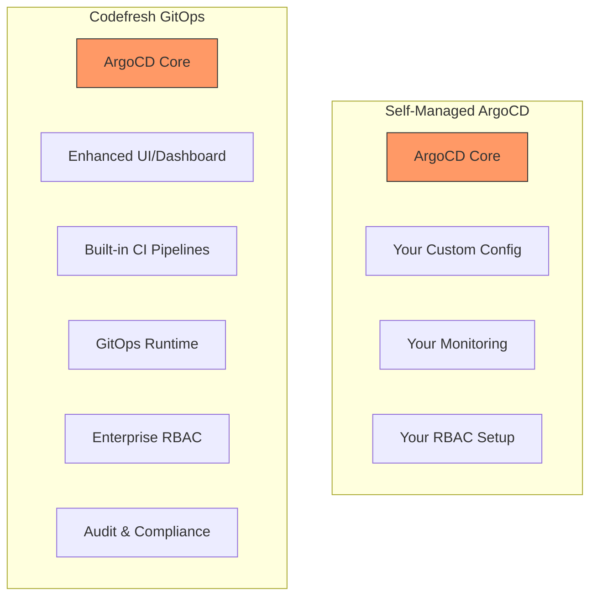

# ArgoCD vs Codefresh: GitOps Platform Comparison

Author: [nawazdhandala](https://github.com/nawazdhandala)

Tags: ArgoCD, GitOps, Kubernetes, Codefresh, Comparison

Description: Compare ArgoCD open source with Codefresh GitOps platform, covering architecture, developer experience, enterprise features, and pricing considerations.

---

The relationship between ArgoCD and Codefresh is unique in the GitOps landscape. Codefresh was founded by the creators of the Argo project, and the Codefresh GitOps platform is built directly on top of ArgoCD. This means you are not really comparing two different GitOps engines - you are comparing running ArgoCD yourself versus using a managed platform that enhances ArgoCD with additional capabilities. Understanding this relationship is key to making the right decision.

## The ArgoCD and Codefresh Connection

Dan Garfield and the team behind Codefresh are also significant contributors to the ArgoCD project. Codefresh's GitOps platform uses ArgoCD as its deployment engine and adds a layer of enterprise features, CI integration, and improved developer experience on top.



## Architecture Differences

### Self-Managed ArgoCD

When you run ArgoCD yourself, you deploy and manage all components.

```yaml
# You manage the full ArgoCD stack
# Installation via Helm
helm install argocd argo/argo-cd -n argocd --create-namespace \
  --set server.replicas=2 \
  --set controller.replicas=2 \
  --set repoServer.replicas=2

# Plus you need:
# - Ingress configuration
# - TLS certificates
# - SSO setup (Dex or OIDC)
# - Monitoring (Prometheus/Grafana)
# - Backup strategy
# - Upgrade procedures
```

### Codefresh GitOps

Codefresh deploys a "GitOps Runtime" in your cluster that connects to the Codefresh SaaS control plane. ArgoCD runs in your cluster, but the management layer is hosted.

```bash
# Codefresh runtime installation
# Install the Codefresh CLI
brew install codefresh

# Install the GitOps runtime in your cluster
cf runtime install my-runtime \
  --cluster-context production-cluster \
  --ingress-host https://gitops.mycompany.com
```

The runtime installs ArgoCD along with additional Codefresh components for event handling, CI pipeline execution, and reporting.

## User Interface Comparison

### ArgoCD UI

The ArgoCD UI is functional and focused on application management. It provides resource trees, sync status, diff views, and log access.

### Codefresh GitOps Dashboard

Codefresh builds a richer dashboard on top of ArgoCD that adds:

- **Unified CI/CD view** - See both pipeline runs and deployments in one place
- **Environment dashboard** - View all environments and their status side by side
- **DORA metrics** - Built-in deployment frequency, lead time, change failure rate, and MTTR tracking
- **GitOps timeline** - Visual timeline of all changes across all applications
- **Cross-application dependency views** - See how applications relate to each other

| UI Feature | ArgoCD | Codefresh |
|------------|--------|-----------|
| Application tree | Yes | Yes (enhanced) |
| Diff view | Yes | Yes |
| Sync history | Yes | Yes + timeline |
| Environment comparison | Manual | Built-in dashboard |
| DORA metrics | Not built-in | Built-in |
| CI pipeline status | Not included | Integrated |
| Multi-runtime overview | Not applicable | Built-in |

## CI Pipeline Integration

### ArgoCD (Bring Your Own CI)

ArgoCD does not include CI capabilities. You pair it with an external CI system.

```yaml
# Typical CI + ArgoCD workflow
# GitHub Actions handles build
name: Build
on:
  push:
    branches: [main]
jobs:
  build:
    runs-on: ubuntu-latest
    steps:
      - uses: actions/checkout@v4
      - run: docker build -t myapp:${{ github.sha }} .
      - run: docker push registry.example.com/myapp:${{ github.sha }}
      # Update GitOps repo to trigger ArgoCD
      - run: |
          git clone https://github.com/org/gitops-repo
          cd gitops-repo
          yq e ".image.tag = \"${{ github.sha }}\"" -i apps/myapp/values.yaml
          git commit -am "Update myapp to ${{ github.sha }}"
          git push
```

### Codefresh CI + GitOps

Codefresh includes a CI pipeline engine that integrates seamlessly with the GitOps deployment.

```yaml
# codefresh.yml - CI pipeline with GitOps promotion
version: '1.0'
stages:
  - build
  - test
  - deploy

steps:
  build_image:
    type: build
    stage: build
    image_name: myapp
    tag: '${{CF_SHORT_REVISION}}'

  run_tests:
    type: freestyle
    stage: test
    image: '${{build_image}}'
    commands:
      - npm test

  report_image:
    type: codefresh-report-image
    stage: deploy
    arguments:
      CF_IMAGE: 'registry.example.com/myapp:${{CF_SHORT_REVISION}}'
      CF_GIT_REPO: 'org/gitops-repo'
      CF_GIT_BRANCH: main
      # Codefresh automatically updates the GitOps repo
      # and triggers ArgoCD sync
```

The key advantage of Codefresh CI is its deep integration with the GitOps layer. It automatically tracks which commit triggered which build, which image was deployed, and which ArgoCD application consumed it.

## Progressive Delivery

### ArgoCD + Argo Rollouts

```yaml
# You install and manage Argo Rollouts separately
apiVersion: argoproj.io/v1alpha1
kind: Rollout
metadata:
  name: my-app
spec:
  strategy:
    canary:
      steps:
        - setWeight: 20
        - pause: {duration: 300}
        - setWeight: 50
        - pause: {duration: 300}
        - setWeight: 80
        - pause: {duration: 300}
```

### Codefresh + Argo Rollouts

Codefresh includes Argo Rollouts integration with enhanced visualization and management.

- Visual rollout progress in the dashboard
- One-click promote or rollback
- Integrated analysis templates with metric providers
- Historical rollout data and success rates

## Secret Management

**ArgoCD** requires external tools (Sealed Secrets, External Secrets Operator, or Vault).

**Codefresh** includes built-in secret management that integrates with the GitOps runtime and CI pipelines, while also supporting external secret managers.

## Pricing

### ArgoCD

```text
Cost: $0 for the software
Hidden costs:
  - Infrastructure to run ArgoCD
  - Engineering time for setup, maintenance, upgrades
  - Building custom integrations (CI, monitoring, compliance)
  - On-call for ArgoCD infrastructure
```

### Codefresh

```text
Free tier:
  - Limited builds and deployments
  - 1 runtime
  - Community support

Pro tier (~$75/user/month):
  - Unlimited builds
  - Multiple runtimes
  - RBAC and SSO
  - Email support

Enterprise tier (custom):
  - Advanced governance
  - Dedicated support
  - Custom integrations
  - SLA guarantees
```

## Operational Overhead

This is where the managed vs self-managed distinction matters most.

**Self-managed ArgoCD** requires your team to handle:

```bash
# Regular operational tasks
# 1. Upgrade ArgoCD versions
helm upgrade argocd argo/argo-cd -n argocd -f values.yaml

# 2. Monitor ArgoCD health
kubectl get pods -n argocd
kubectl logs -n argocd deployment/argocd-server

# 3. Scale components as needed
kubectl scale deployment argocd-repo-server -n argocd --replicas=3

# 4. Manage certificates and secrets
kubectl create secret tls argocd-server-tls -n argocd

# 5. Backup and disaster recovery
kubectl get applications -n argocd -o yaml > backup.yaml
```

**Codefresh** handles much of this operational burden through the managed runtime. You still need to maintain the runtime in your cluster, but Codefresh manages updates, monitoring, and many operational concerns.

## When to Choose Self-Managed ArgoCD

- You have a strong platform engineering team
- You want full control over every aspect of your deployment tool
- Budget is tight and you can invest engineering time instead
- You have specific customization needs that require direct ArgoCD modification
- You prefer to avoid vendor dependency

## When to Choose Codefresh

- You want integrated CI/CD with GitOps in one platform
- You need DORA metrics and deployment analytics out of the box
- You value reduced operational overhead for deployment infrastructure
- You want an enhanced UI experience beyond stock ArgoCD
- Your team is growing and you need managed RBAC and governance

The decision often comes down to build versus buy. If you have the team and expertise to build a robust deployment platform around ArgoCD, the open source tool gives you maximum flexibility. If you want those capabilities without the engineering investment, Codefresh provides them as a managed service with ArgoCD at its core.
