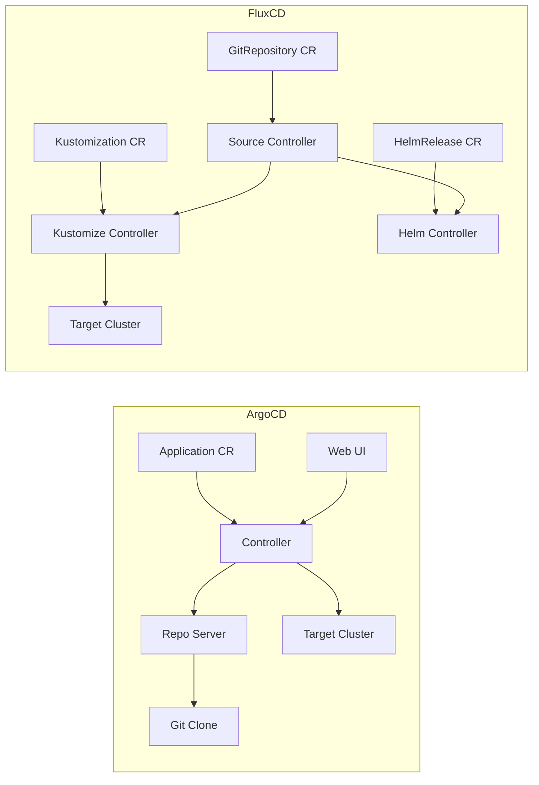

# ArgoCD vs FluxCD in 2026: Which is Better?

Author: [nawazdhandala](https://github.com/nawazdhandala)

Tags: ArgoCD, GitOps, Kubernetes, fluxcd, Comparison

Description: An honest comparison of ArgoCD and FluxCD in 2026 covering features, architecture, usability, ecosystem, and recommendations for different team sizes and use cases.

---

The ArgoCD vs FluxCD debate has been running since both projects reached CNCF Graduated status. In 2026, both tools are mature, well-supported, and capable of handling production GitOps workflows. The right choice depends on your team's preferences, existing tooling, and how you think about deployment automation.

This is not a "one is better than the other" comparison. Both tools have clear strengths. Let me break down the differences that actually matter in practice.

## Architecture Differences

The most fundamental difference is architectural philosophy.

**ArgoCD** follows a centralized, UI-driven approach. It runs as a set of controllers with a web UI and CLI. You create Application custom resources that tell ArgoCD what to deploy and where.

**FluxCD** follows a distributed, Git-native approach. It runs as a set of controllers that reconcile Kubernetes resources directly. There is no built-in UI (though third-party UIs exist). You define GitRepository, Kustomization, and HelmRelease resources.



## Feature Comparison

| Feature | ArgoCD | FluxCD |
|---------|--------|--------|
| Web UI | Built-in, feature-rich | Third-party (Weave GitOps, Capacitor) |
| CLI | Comprehensive | Flux CLI for management |
| Multi-cluster | Built-in with cluster registration | Via Kustomization targeting |
| Helm support | Native | Native via Helm Controller |
| Kustomize support | Native | Native via Kustomize Controller |
| OCI support | Yes | Yes (first-class for Helm and Kustomize) |
| Image automation | Via Image Updater (separate) | Built-in image reflector/automation |
| SSO/RBAC | Built-in SSO with OIDC, SAML | Relies on Kubernetes RBAC |
| Notifications | Built-in notification engine | Via notification controller |
| Diff previews | Built-in diff view | Limited (PR comments via CI) |
| ApplicationSets | Yes, with generators | Not applicable (uses Kustomization) |
| Progressive delivery | Via Argo Rollouts | Via Flagger |

## Where ArgoCD Excels

### The Web UI

ArgoCD's web UI is its killer feature. You can visualize your entire application topology, see the sync status of every resource, inspect live manifests, view diffs between Git and cluster state, and trigger syncs with a click.

For teams that include non-engineers (project managers, stakeholders) who need deployment visibility, ArgoCD's UI is invaluable. FluxCD requires terminal access for most operations.

### Multi-Cluster Management

ArgoCD has first-class multi-cluster support. Register a cluster, and you can deploy to it from a central ArgoCD instance. The UI shows all applications across all clusters in one place.

```bash
# Register a remote cluster
argocd cluster add production-context --name production

# Deploy to it
argocd app create my-app \
  --repo https://github.com/my-org/manifests.git \
  --path apps/my-app \
  --dest-server https://production:6443 \
  --dest-namespace my-app
```

FluxCD can also manage remote clusters, but it requires more manual configuration with kubeconfig secrets and is less intuitive.

### ApplicationSets

ApplicationSets let you generate hundreds of Application resources from templates. This is powerful for managing many similar applications.

```yaml
apiVersion: argoproj.io/v1alpha1
kind: ApplicationSet
metadata:
  name: all-services
spec:
  generators:
    - git:
        repoURL: https://github.com/my-org/config.git
        revision: main
        directories:
          - path: services/*
  template:
    metadata:
      name: '{{path.basename}}'
    spec:
      source:
        repoURL: https://github.com/my-org/config.git
        path: '{{path}}'
```

FluxCD achieves similar results through Kustomization with patches, but the pattern is different and less intuitive for this use case.

### RBAC and Access Control

ArgoCD has sophisticated built-in RBAC that integrates with SSO providers. You can control who can view, sync, or modify specific applications in specific projects.

FluxCD relies on Kubernetes RBAC, which gives you cluster-level access control but not the fine-grained application-level control that ArgoCD provides.

## Where FluxCD Excels

### Image Automation

FluxCD's built-in image automation is more tightly integrated than ArgoCD's separate Image Updater. The image reflector controller watches registries and the image automation controller updates Git repos.

```yaml
apiVersion: image.toolkit.fluxcd.io/v1
kind: ImagePolicy
metadata:
  name: my-app
spec:
  imageRepositoryRef:
    name: my-app
  policy:
    semver:
      range: ">=1.0.0"
---
apiVersion: image.toolkit.fluxcd.io/v1
kind: ImageUpdateAutomation
metadata:
  name: my-app
spec:
  sourceRef:
    kind: GitRepository
    name: fleet-config
  git:
    commit:
      author:
        email: flux@example.com
        name: Flux
    push:
      branch: main
  update:
    path: ./clusters/production
    strategy: Setters
```

### Lightweight Resource Footprint

FluxCD uses fewer resources than ArgoCD. It does not need a repo server, Redis, or a web UI server. For clusters where resources are constrained (edge, IoT, development), FluxCD's smaller footprint is an advantage.

### Composability

FluxCD's controller-based architecture means you can install only what you need. If you only use Kustomize, you do not need the Helm controller. If you do not need image automation, skip those controllers.

### OCI-First Approach

FluxCD was early to support OCI artifacts as a first-class source. You can store both Helm charts and Kustomize configurations as OCI artifacts.

```yaml
apiVersion: source.toolkit.fluxcd.io/v1
kind: OCIRepository
metadata:
  name: my-app
spec:
  interval: 5m
  url: oci://ghcr.io/my-org/manifests/my-app
  ref:
    tag: latest
```

## Performance and Scalability

Both tools can handle large-scale deployments, but they scale differently.

**ArgoCD**: Performance depends on the repo-server and controller resources. With sharding and tuning, it handles 1000+ applications. The repo-server can become a bottleneck if it needs to clone and render many large repositories.

**FluxCD**: Scales more linearly because each controller handles its own resource type. No central repo-server bottleneck. But managing thousands of Kustomization resources requires careful organization.

## Community and Ecosystem

Both projects are CNCF Graduated. ArgoCD has a larger community and more third-party integrations. FluxCD has strong backing from Weaveworks alumni and the CNCF ecosystem.

**ArgoCD ecosystem**: Argo Rollouts (progressive delivery), Argo Workflows (CI/CD), Argo Events (event-driven automation).

**FluxCD ecosystem**: Flagger (progressive delivery), Weave GitOps (UI), tf-controller (Terraform via GitOps).

## Decision Framework

Choose **ArgoCD** if:
- You need a web UI for deployment visibility
- Your team includes non-engineers who need deployment access
- You manage multiple clusters from a central location
- You need fine-grained RBAC with SSO integration
- You want the larger community and ecosystem

Choose **FluxCD** if:
- You prefer a CLI-first, Kubernetes-native approach
- You want a lighter resource footprint
- You need tight image automation workflows
- Your team is comfortable with Kubernetes-native tooling
- You value composability and only want what you need

Choose **either** if:
- You need basic GitOps for Kubernetes
- You use Helm or Kustomize for configuration management
- You want CNCF-graduated, production-ready tooling

## Monitoring Either Tool

Whichever tool you choose, monitoring deployment health is critical. [OneUptime](https://oneuptime.com) can monitor both ArgoCD and FluxCD deployments, tracking application health, sync status, and alerting on failures.

The "best" GitOps tool is the one your team will actually use consistently. Try both with a non-critical workload and see which workflow feels more natural for your team.
