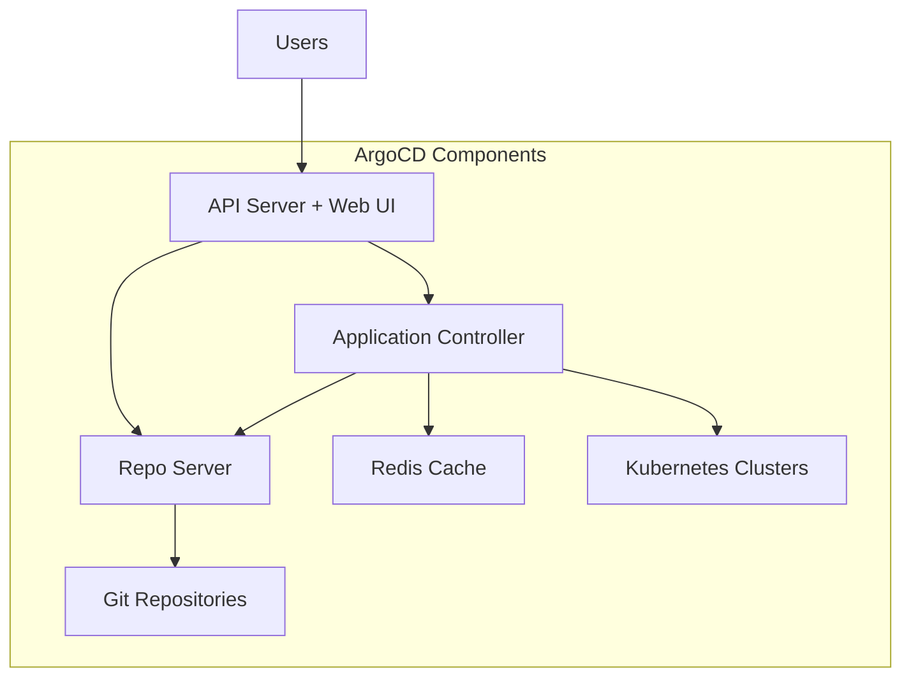
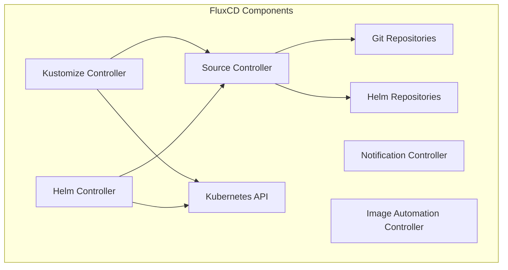

# ArgoCD vs FluxCD: Detailed Feature Comparison

Author: [nawazdhandala](https://github.com/nawazdhandala)

Tags: ArgoCD, GitOps, Kubernetes, FluxCD, Comparison

Description: A comprehensive feature-by-feature comparison of ArgoCD and FluxCD, covering architecture, UI, multi-tenancy, scalability, and ecosystem to help you choose the right GitOps tool.

---

ArgoCD and FluxCD are the two dominant GitOps tools in the Kubernetes ecosystem. Both are CNCF graduated projects, both implement the GitOps pattern, and both have large, active communities. Yet they take fundamentally different approaches to solving the same problem. This comparison breaks down the differences across every dimension that matters for real-world production deployments.

## Architecture Overview

The architectural differences between ArgoCD and FluxCD influence everything from deployment complexity to scalability.

### ArgoCD Architecture

ArgoCD runs as a set of Kubernetes deployments in a dedicated namespace. It uses a centralized controller model with a web UI, API server, repository server, and application controller.



### FluxCD Architecture

FluxCD uses a distributed controller model. Each concern - source management, Kustomize, Helm, notifications - is handled by a separate controller that communicates through Kubernetes custom resources.



**Key difference:** ArgoCD is a monolithic application with a centralized server. FluxCD is a set of independent controllers that work together through the Kubernetes API.

## User Interface

This is the most visible difference between the two tools.

**ArgoCD** ships with a full-featured web UI that displays application status, resource trees, diff views, sync history, and logs. The UI is production-ready and often the primary way teams interact with ArgoCD.

**FluxCD** has no built-in web UI. It is CLI-first and API-first. Third-party dashboards like Weave GitOps (now part of the Flux project) and Capacitor provide UI capabilities, but they are separate installations.

| Feature | ArgoCD | FluxCD |
|---------|--------|--------|
| Built-in Web UI | Yes, full-featured | No (third-party options) |
| CLI Tool | `argocd` CLI | `flux` CLI |
| Resource Tree View | Yes, visual tree | CLI/API only |
| Diff Visualization | Yes, in UI | CLI only (`flux diff`) |
| Sync History | Yes, with UI timeline | Through Kubernetes events |
| SSO Integration | Built-in (Dex) | Depends on UI choice |

## Application Management

Both tools manage Kubernetes resources from Git, but they model this differently.

### ArgoCD Application Model

```yaml
apiVersion: argoproj.io/v1alpha1
kind: Application
metadata:
  name: my-app
  namespace: argocd
spec:
  project: default
  source:
    repoURL: https://github.com/org/repo.git
    targetRevision: main
    path: manifests/
  destination:
    server: https://kubernetes.default.svc
    namespace: production
  syncPolicy:
    automated:
      prune: true
      selfHeal: true
```

### FluxCD Application Model

```yaml
# Source definition
apiVersion: source.toolkit.fluxcd.io/v1
kind: GitRepository
metadata:
  name: my-repo
  namespace: flux-system
spec:
  url: https://github.com/org/repo.git
  ref:
    branch: main
  interval: 1m

---
# Deployment definition
apiVersion: kustomize.toolkit.fluxcd.io/v1
kind: Kustomization
metadata:
  name: my-app
  namespace: flux-system
spec:
  sourceRef:
    kind: GitRepository
    name: my-repo
  path: ./manifests
  targetNamespace: production
  prune: true
  interval: 5m
```

**Key difference:** ArgoCD bundles everything into a single Application resource. FluxCD separates the source (GitRepository) from the deployment (Kustomization/HelmRelease), which allows reusing sources across multiple deployments.

## Helm Support

Both tools handle Helm charts, but differently.

**ArgoCD** renders Helm charts during sync using its built-in Helm support. It stores rendered manifests and tracks them like any other Kubernetes resource.

```yaml
# ArgoCD Helm Application
spec:
  source:
    repoURL: https://charts.example.com
    chart: my-chart
    targetRevision: 1.2.3
    helm:
      values: |
        replicas: 3
        image:
          tag: latest
      parameters:
        - name: service.type
          value: ClusterIP
```

**FluxCD** uses a dedicated HelmController and HelmRelease CRD. It manages the actual Helm release lifecycle, including rollback on failure.

```yaml
# FluxCD HelmRelease
apiVersion: helm.toolkit.fluxcd.io/v2
kind: HelmRelease
metadata:
  name: my-chart
spec:
  chart:
    spec:
      chart: my-chart
      version: "1.2.3"
      sourceRef:
        kind: HelmRepository
        name: my-repo
  values:
    replicas: 3
  install:
    remediation:
      retries: 3
  upgrade:
    remediation:
      retries: 3
      remediateLastFailure: true
```

**Key difference:** FluxCD manages actual Helm releases (you can see them with `helm list`), while ArgoCD renders Helm templates and manages the resulting resources directly. This means FluxCD supports Helm hooks and rollback natively, while ArgoCD treats Helm as a template engine.

## Multi-Cluster Management

**ArgoCD** manages multiple clusters from a single instance. You register clusters and deploy applications to any registered cluster.

```bash
# ArgoCD: register a remote cluster
argocd cluster add my-remote-cluster
```

**FluxCD** typically runs in each cluster independently. For multi-cluster management, you use a "management cluster" pattern where FluxCD in the management cluster deploys FluxCD and its configuration to other clusters.

**Key difference:** ArgoCD has a hub-and-spoke model that is simpler for centralized management. FluxCD's distributed model is more resilient but requires more initial setup.

## Multi-Tenancy

**ArgoCD** uses Projects and RBAC for multi-tenancy. Teams share a single ArgoCD instance with different permissions.

**FluxCD** uses Kubernetes namespaces and RBAC natively. Each team can run their own Flux resources in their namespace.

## Scalability

| Metric | ArgoCD | FluxCD |
|--------|--------|--------|
| Applications tested | 10,000+ per instance | Scales with cluster resources |
| Clusters | 100+ per instance | One instance per cluster |
| Reconciliation model | Centralized controller | Distributed controllers |
| Bottleneck | API server, repo server | Individual controller limits |

ArgoCD's centralized model means you need to scale the ArgoCD instance as you add applications. FluxCD's distributed model scales more naturally since each controller handles its own subset of resources.

## Progressive Delivery

**ArgoCD** integrates with Argo Rollouts for canary deployments, blue-green deployments, and analysis-based promotions. This is a separate installation but tightly integrated.

**FluxCD** integrates with Flagger (now also a CNCF project) for similar progressive delivery capabilities.

## Image Automation

**FluxCD** has built-in image automation controllers that can watch container registries for new images and automatically update Git repositories.

**ArgoCD** requires the Argo CD Image Updater (a separate component) for similar functionality, or you can use CI pipeline-based image updates.

## When to Choose ArgoCD

- You want a production-ready web UI out of the box
- Your team prefers visual application management
- You need centralized multi-cluster management
- You want SSO and RBAC built into the tool
- You are already using other Argo tools (Workflows, Events, Rollouts)

## When to Choose FluxCD

- You prefer a CLI-first, API-first approach
- You want native Helm release management with rollback
- You prefer a distributed architecture without a central server
- You need built-in image automation
- You want each cluster to be self-managing

## Can You Use Both?

Some organizations use both tools. A common pattern is using ArgoCD for application deployments (where the UI adds value) and FluxCD for infrastructure components (where its distributed model and Helm support shine).

Both tools are excellent choices for GitOps on Kubernetes. The "right" choice depends on your team's preferences, existing tooling, and operational requirements. For monitoring whichever tool you choose, [OneUptime](https://oneuptime.com/blog/post/2026-02-26-gitops-argocd-vs-traditional-cicd/view) provides comprehensive observability for your GitOps pipelines.
