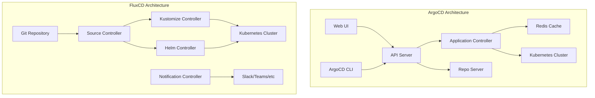

# ArgoCD vs FluxCD: Which GitOps Tool Should You Choose?

Author: [nawazdhandala](https://github.com/nawazdhandala)

Tags: ArgoCD, GitOps, Kubernetes, FluxCD, DevOps

Description: A detailed comparison of ArgoCD and FluxCD covering architecture, features, UI, multi-cluster support, and use cases to help you pick the right GitOps tool.

---

Choosing a GitOps tool for Kubernetes can feel overwhelming. ArgoCD and FluxCD are the two dominant options, and both are CNCF graduated projects. They solve the same fundamental problem - keeping your cluster state in sync with a Git repository - but they take very different approaches to get there.

This guide breaks down the real differences so you can make an informed choice for your team and infrastructure.

## Architecture Differences

The first thing you will notice is how differently these tools are designed.

ArgoCD follows a centralized, server-based architecture. It runs as a set of microservices inside your cluster: an API server, a repo server, an application controller, and a Redis cache. It exposes a full web UI and a gRPC/REST API. You interact with it through a browser, CLI, or API calls.

FluxCD takes a decentralized, controller-based approach. It runs as a set of Kubernetes controllers - source-controller, kustomize-controller, helm-controller, and notification-controller. There is no built-in UI or API server. Everything is managed through Kubernetes custom resources.

Here is a simplified view of the architectural difference:



## User Interface and Experience

This is where the biggest gap exists.

ArgoCD ships with a polished web UI that shows your applications, their sync status, health, and a resource tree view. You can see every Kubernetes resource, its YAML, events, logs, and even diff against the desired state. For teams that want visibility without touching kubectl, this is a major selling point.

FluxCD has no built-in UI. You manage everything through kubectl and Flux CLI commands. Third-party dashboards like Weave GitOps exist, but they are separate projects with varying levels of maturity.

If your team includes developers who are not comfortable with the command line, ArgoCD's UI is a significant advantage.

## Application Definition

In ArgoCD, you define applications using the `Application` custom resource:

```yaml
# ArgoCD Application definition
apiVersion: argoproj.io/v1alpha1
kind: Application
metadata:
  name: my-app
  namespace: argocd
spec:
  project: default
  source:
    repoURL: https://github.com/myorg/my-app.git
    targetRevision: main
    path: k8s/overlays/production
  destination:
    server: https://kubernetes.default.svc
    namespace: production
  syncPolicy:
    automated:
      prune: true
      selfHeal: true
```

In FluxCD, you split the same concept across multiple resources:

```yaml
# FluxCD GitRepository source
apiVersion: source.toolkit.fluxcd.io/v1
kind: GitRepository
metadata:
  name: my-app
  namespace: flux-system
spec:
  interval: 1m
  url: https://github.com/myorg/my-app.git
  ref:
    branch: main
---
# FluxCD Kustomization (deployment target)
apiVersion: kustomize.toolkit.fluxcd.io/v1
kind: Kustomization
metadata:
  name: my-app
  namespace: flux-system
spec:
  interval: 5m
  sourceRef:
    kind: GitRepository
    name: my-app
  path: ./k8s/overlays/production
  prune: true
  targetNamespace: production
```

FluxCD's approach is more Kubernetes-native since each concern is a separate resource. ArgoCD's single Application resource is simpler to understand for newcomers.

## Multi-Cluster Management

ArgoCD handles multi-cluster deployments from a single control plane. You register external clusters, and the ArgoCD instance in your management cluster can deploy to all of them. This hub-and-spoke model works well when you want centralized visibility.

FluxCD typically runs in each cluster independently. Each cluster has its own Flux installation that pulls from Git. You can coordinate across clusters using a shared repository structure, but there is no single pane of glass by default.

For organizations managing dozens of clusters, ArgoCD's centralized approach is often easier to reason about. For highly decoupled teams that want each cluster to be self-managing, FluxCD's distributed model may fit better.

## Helm and Kustomize Support

Both tools support Helm and Kustomize natively.

ArgoCD renders Helm templates on the repo server side and applies the rendered manifests. It does not use Helm's release mechanism - there are no Helm releases tracked by Tiller or the Helm SDK. This means you cannot use `helm list` to see ArgoCD-managed releases.

FluxCD uses the Helm SDK directly through its helm-controller. Helm releases show up in `helm list`. If you rely on Helm's native rollback mechanism or have tools that read Helm release metadata, FluxCD preserves that workflow.

## Sync and Reconciliation

ArgoCD polls Git repositories on a configurable interval (default 3 minutes) and also supports webhooks for immediate sync triggers. It compares the live state with the desired state and shows you a diff before applying changes.

FluxCD reconciles on a configurable interval for each resource independently. The source-controller checks Git, and then the kustomize-controller or helm-controller reconciles the actual resources. This event-driven chain is more granular but can be harder to debug when things go wrong.

## RBAC and Access Control

ArgoCD has a built-in RBAC system with fine-grained policies. You can control who can view, sync, or delete specific applications within specific projects. It integrates with SSO providers through Dex or direct OIDC. For more on ArgoCD RBAC, see [how to configure RBAC policies](https://oneuptime.com/blog/post/2026-01-25-rbac-policies-argocd/view).

FluxCD relies on Kubernetes RBAC entirely. Access control is managed through standard Kubernetes roles and role bindings. This is simpler if you already have a mature Kubernetes RBAC setup, but it does not give you application-level granularity the way ArgoCD does.

## Notifications and Observability

ArgoCD has a built-in notification system that can send alerts to Slack, Teams, email, PagerDuty, and more. You define triggers and templates to customize what gets sent and when. See [how to configure notifications in ArgoCD](https://oneuptime.com/blog/post/2026-01-25-notifications-argocd/view) for details.

FluxCD uses its notification-controller to send alerts to similar targets. The configuration is done through Kubernetes custom resources (Provider and Alert), which fits the GitOps model well.

Both tools expose Prometheus metrics for monitoring sync status, application health, and reconciliation performance.

## Community and Ecosystem

Both projects are CNCF graduated, which means they have passed rigorous maturity requirements.

ArgoCD has a larger ecosystem of companion tools - Argo Rollouts for progressive delivery, Argo Workflows for CI pipelines, and Argo Events for event-driven automation. These integrate naturally with ArgoCD.

FluxCD is tightly integrated with the broader Kubernetes ecosystem and follows the Kubernetes controller pattern more closely. Tools like Flagger provide progressive delivery capabilities similar to Argo Rollouts.

## When to Choose ArgoCD

Pick ArgoCD if:

- Your team values a web UI for visibility and debugging
- You need centralized multi-cluster management from one place
- You want built-in RBAC with SSO integration
- You prefer a single Application resource to define deployments
- You plan to use Argo Rollouts for canary and blue-green deployments

## When to Choose FluxCD

Pick FluxCD if:

- You want a purely Kubernetes-native approach using CRDs and controllers
- You need Helm release compatibility with `helm list` and `helm rollback`
- You prefer decentralized, per-cluster GitOps installations
- Your team is comfortable with kubectl and does not need a UI
- You want each team or cluster to be fully self-managing

## Feature Comparison Table

| Feature | ArgoCD | FluxCD |
|---------|--------|--------|
| Web UI | Built-in | Third-party only |
| CLI | Yes | Yes |
| Multi-cluster | Hub-and-spoke | Per-cluster |
| Helm support | Template rendering | Native Helm SDK |
| Kustomize | Yes | Yes |
| RBAC | Built-in + SSO | Kubernetes RBAC |
| Notifications | Built-in | Controller-based |
| ApplicationSets | Yes | N/A (uses CRD patterns) |
| Progressive delivery | Argo Rollouts | Flagger |
| CNCF status | Graduated | Graduated |

## The Bottom Line

There is no universally "better" tool here. ArgoCD gives you more out of the box - a UI, RBAC, multi-cluster management, and a cohesive experience. FluxCD gives you a more Kubernetes-native, composable approach that may feel more natural if you are already deep in the Kubernetes ecosystem.

Many organizations actually run both. They might use ArgoCD for application teams who want the UI, and FluxCD for platform teams managing cluster infrastructure. The tools are not mutually exclusive.

Start by evaluating what matters most to your team: visibility, Kubernetes-nativeness, multi-cluster strategy, or ecosystem integration. That will point you toward the right choice.
