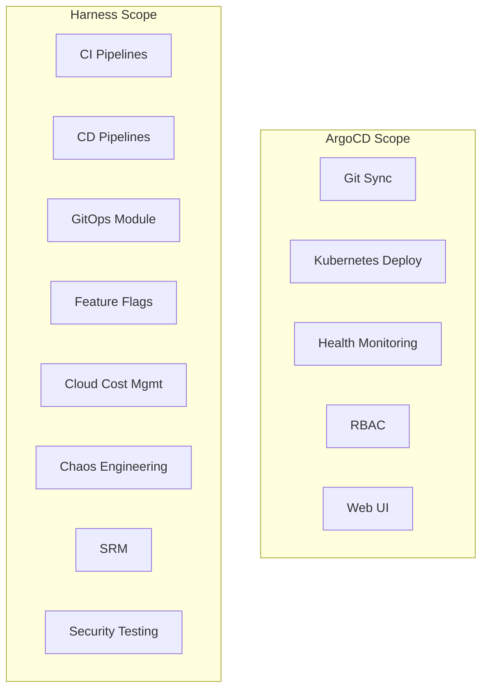

# ArgoCD vs Harness: Feature and Cost Comparison

Author: [nawazdhandala](https://github.com/nawazdhandala)

Tags: ArgoCD, GitOps, Kubernetes, Harness, Comparison

Description: A detailed comparison of ArgoCD and Harness across features, pricing, scalability, and enterprise readiness to help you choose the right deployment platform.

---

ArgoCD and Harness represent two different approaches to software delivery. ArgoCD is an open source, Kubernetes-native GitOps tool. Harness is a commercial software delivery platform with GitOps being one of many capabilities. Interestingly, Harness acquired Drone CI and has been building its own GitOps module that actually uses ArgoCD under the hood. This comparison helps you understand when the open source tool is enough and when a commercial platform adds real value.

## Platform Scope

The first thing to understand is that you are comparing an open source tool with a commercial platform. The scope is very different.

**ArgoCD** focuses on one thing: continuous delivery of Kubernetes applications from Git. It does this extremely well.

**Harness** is a full software delivery platform that includes CI, CD, feature flags, cloud cost management, chaos engineering, service reliability management, and more. Its GitOps module is just one piece of a larger puzzle.



## GitOps Capabilities

When comparing just the GitOps deployment capabilities, here is how they stack up.

### ArgoCD GitOps

```yaml
# ArgoCD Application - straightforward GitOps
apiVersion: argoproj.io/v1alpha1
kind: Application
metadata:
  name: my-service
  namespace: argocd
spec:
  project: default
  source:
    repoURL: https://github.com/org/gitops-repo.git
    targetRevision: main
    path: services/my-service
    helm:
      valueFiles:
        - values-production.yaml
  destination:
    server: https://kubernetes.default.svc
    namespace: production
  syncPolicy:
    automated:
      prune: true
      selfHeal: true
    syncOptions:
      - CreateNamespace=true
```

### Harness GitOps

Harness GitOps uses ArgoCD as its underlying engine but wraps it with additional governance, pipeline integration, and enterprise features.

```yaml
# Harness GitOps - application with governance
# Configured through Harness UI or YAML pipeline
pipeline:
  name: Deploy My Service
  stages:
    - stage:
        name: GitOps Deploy
        type: GitOps
        spec:
          gitOpsCluster:
            identifier: production_cluster
          service:
            identifier: my_service
          environment:
            identifier: production
          execution:
            steps:
              - step:
                  type: GitOpsSync
                  name: Sync Application
                  spec:
                    prune: true
                    dryRun: false
                    applicationsList:
                      - my-service
```

## Feature Comparison

| Feature | ArgoCD (Open Source) | Harness GitOps |
|---------|---------------------|----------------|
| Git-to-cluster sync | Yes | Yes (uses ArgoCD) |
| Web UI | Yes, built-in | Yes, enhanced |
| Multi-cluster | Yes | Yes, with centralized management |
| RBAC | Project-based | Organization/Project/Pipeline |
| SSO | Dex integration | Built-in with enterprise IdP |
| Audit logging | Basic | Enterprise-grade |
| Approval gates | Manual sync | Pipeline-based approvals |
| Drift detection | Yes | Yes, with policy enforcement |
| Cost | Free | Free tier + paid tiers |
| Support | Community | Commercial support |

## Pricing Analysis

This is where the decision often comes down to.

### ArgoCD Cost

ArgoCD itself is free. Your costs are:

```
Infrastructure:
- Kubernetes resources for ArgoCD (~1-2 vCPU, 2-4 GB RAM)
- Estimated cloud cost: $50-150/month

Operational costs:
- Engineering time for setup and maintenance
- No commercial support (community only)
- Custom development for enterprise features
```

### Harness Pricing

Harness uses a tiered pricing model:

```
Free Tier:
- Limited to 5 services
- Basic features
- Community support

Team Tier (~$100/developer/month):
- More services
- Basic RBAC
- Email support

Enterprise Tier (custom pricing):
- Unlimited services
- Advanced governance
- SSO, RBAC, audit trails
- 24/7 support
- SLA guarantees
```

### Total Cost of Ownership

For a team of 20 engineers managing 50 services:

```
ArgoCD (self-managed):
  Infrastructure: $150/month
  Engineering time (20%): 1 FTE = ~$10,000/month
  Total: ~$10,150/month

Harness (Enterprise):
  Platform cost: $2,000-5,000/month (varies by contract)
  Reduced engineering time (5%): 0.25 FTE = ~$2,500/month
  Total: ~$4,500-7,500/month
```

The breakeven depends heavily on your team's size and operational maturity. Smaller teams with Kubernetes expertise often find ArgoCD more cost-effective. Larger organizations with compliance requirements may find Harness worth the investment.

## Enterprise Features

### Governance and Compliance

**ArgoCD** provides:
- AppProjects for isolation
- RBAC through `argocd-rbac-cm`
- Sync windows for change control
- Basic audit through Kubernetes events

**Harness** adds:
- OPA (Open Policy Agent) policy engine
- Pipeline-based approval workflows
- Freeze windows with exception handling
- Detailed audit trails exportable to SIEM
- Compliance dashboards

### Pipeline Integration

**ArgoCD** is deployment-only. You need external tools for pre-deployment and post-deployment steps.

**Harness** wraps GitOps in pipelines with verification steps.

```yaml
# Harness pipeline with pre/post deployment steps
pipeline:
  stages:
    - stage:
        name: Pre-Deploy Checks
        type: Custom
        spec:
          execution:
            steps:
              - step:
                  type: ShellScript
                  name: Run Integration Tests
              - step:
                  type: Policy
                  name: Check OPA Policies

    - stage:
        name: Deploy
        type: GitOps
        spec:
          execution:
            steps:
              - step:
                  type: GitOpsSync
                  name: Sync

    - stage:
        name: Verify
        type: Verify
        spec:
          execution:
            steps:
              - step:
                  type: Verify
                  name: Continuous Verification
                  spec:
                    type: Auto
                    monitoredService:
                      type: Configured
```

### Secret Management

**ArgoCD** relies on external tools like Sealed Secrets, External Secrets Operator, or HashiCorp Vault through plugins.

**Harness** has built-in secret management with integrations to AWS Secrets Manager, Azure Key Vault, HashiCorp Vault, and Google Secret Manager.

## Multi-Cluster and Multi-Environment

Both tools support multi-cluster deployments, but differently.

**ArgoCD** manages clusters through cluster registration. You deploy Applications targeting different clusters.

```bash
# ArgoCD: register clusters
argocd cluster add staging-cluster
argocd cluster add production-cluster
```

**Harness** models environments as first-class entities with associated infrastructure definitions, making environment promotion a built-in concept.

## Developer Experience

**ArgoCD** has a lower learning curve. Developers interact with familiar Kubernetes concepts and YAML. The ArgoCD CLI and UI are straightforward.

**Harness** has a steeper learning curve due to its broader feature set. The platform has its own concepts (services, environments, infrastructure definitions, connectors) that developers need to learn.

## Migration Path

If you start with ArgoCD and later need Harness, the migration is relatively smooth since Harness uses ArgoCD under the hood. Your Application manifests and GitOps repository structure can remain largely the same.

## When to Choose ArgoCD

- Your team has Kubernetes and GitOps expertise
- You want full control and customization
- Budget is a primary concern
- You only need Kubernetes CD (not full CI/CD platform)
- You prefer open source with no vendor lock-in

## When to Choose Harness

- You need enterprise governance, audit, and compliance out of the box
- You want a unified platform for CI, CD, and more
- You need commercial support with SLAs
- Your organization requires approval workflows and policy enforcement
- You want to reduce operational overhead with managed infrastructure

Both options serve different segments of the market. ArgoCD excels as a focused, powerful GitOps tool. Harness excels as an enterprise software delivery platform. Choose based on your organization's needs, team capabilities, and budget. For monitoring either deployment tool, explore [ArgoCD observability best practices](https://oneuptime.com/blog/post/2026-02-26-argocd-vs-fluxcd-comparison/view) for comprehensive insights.
