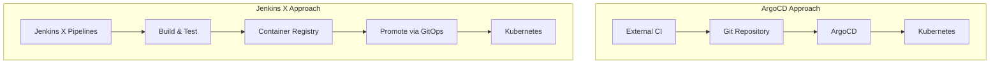

# ArgoCD vs Jenkins X: Which GitOps Tool Wins

Author: [nawazdhandala](https://github.com/nawazdhandala)

Tags: ArgoCD, GitOps, Kubernetes, Jenkins X, CI/CD

Description: Compare ArgoCD and Jenkins X across architecture, CI/CD integration, developer experience, and production readiness to determine which GitOps tool fits your workflow.

---

ArgoCD and Jenkins X approach Kubernetes deployments from very different angles. ArgoCD is a pure GitOps continuous delivery tool that focuses exclusively on deploying and synchronizing Kubernetes resources from Git. Jenkins X is a full-stack CI/CD platform built on Kubernetes that includes GitOps deployment as one of its many capabilities. Understanding these different philosophies is essential for choosing the right tool for your team.

## Philosophical Differences

ArgoCD follows the Unix philosophy: do one thing well. It handles continuous delivery from Git to Kubernetes and nothing else. You pair it with whatever CI system you prefer.

Jenkins X aims to be a complete developer platform. It provides CI pipelines (using Tekton), preview environments, automated versioning, promotion between environments, and GitOps deployment - all in one package.



## Architecture Comparison

### ArgoCD

ArgoCD runs as a set of components in a single namespace. It watches Git repositories and reconciles the desired state with the actual cluster state.

```yaml
# ArgoCD components (typical deployment)
# - argocd-server (API + UI)
# - argocd-application-controller (sync engine)
# - argocd-repo-server (manifest generation)
# - argocd-redis (caching)
# - argocd-dex-server (authentication)
```

Resource requirements for ArgoCD are modest. A standard installation uses about 500Mi to 1Gi of memory.

### Jenkins X

Jenkins X deploys a much larger set of components including Tekton (pipeline engine), Lighthouse (webhook handler), various controllers, and storage backends.

```yaml
# Jenkins X components (typical deployment)
# - Tekton Pipelines (pipeline execution engine)
# - Lighthouse (GitHub webhook handler, ChatOps)
# - Jenkins X Controllers (various)
# - Chartmuseum (Helm chart storage)
# - Nexus or Harbor (artifact storage)
# - Vault or External Secrets (secret management)
# - Multiple CRDs and operators
```

Jenkins X has significantly higher resource requirements. A basic installation can consume 4Gi or more of memory.

## CI/CD Pipeline Integration

### ArgoCD

ArgoCD is CI-agnostic. It does not build, test, or create artifacts. You bring your own CI system - GitHub Actions, GitLab CI, Jenkins, CircleCI, or anything else.

```yaml
# Example: GitHub Actions builds, ArgoCD deploys
# .github/workflows/build.yaml
name: Build and Deploy
on:
  push:
    branches: [main]

jobs:
  build:
    runs-on: ubuntu-latest
    steps:
      - uses: actions/checkout@v4
      - name: Build and push image
        run: |
          docker build -t myregistry/app:${{ github.sha }} .
          docker push myregistry/app:${{ github.sha }}
      - name: Update manifest
        run: |
          # Update the image tag in the GitOps repo
          cd gitops-repo
          kustomize edit set image myregistry/app:${{ github.sha }}
          git commit -am "Update image to ${{ github.sha }}"
          git push
  # ArgoCD automatically detects the change and syncs
```

### Jenkins X

Jenkins X provides built-in CI pipelines using Tekton. Pipelines are defined in the source repository.

```yaml
# jenkins-x.yml
buildPack: go
pipelineConfig:
  pipelines:
    release:
      pipeline:
        stages:
          - name: build
            steps:
              - command: make build
              - command: make test
          - name: promote
            steps:
              - command: jx promote --all-auto --timeout 1h
```

**Key difference:** ArgoCD gives you freedom to use any CI system. Jenkins X provides an opinionated CI solution. If you already have a CI system you like, ArgoCD integrates more cleanly. If you are starting fresh and want everything in one platform, Jenkins X provides more out of the box.

## Environment Promotion

### ArgoCD

With ArgoCD, you implement environment promotion through your Git workflow. Each environment has its own directory or branch, and promotion means updating the target environment's configuration.

```bash
# Promoting from staging to production with ArgoCD
# Option 1: Directory-based environments
cp environments/staging/values.yaml environments/production/values.yaml
git commit -am "Promote staging to production"
git push

# Option 2: Using ApplicationSets with generators
# ArgoCD ApplicationSet automatically generates apps per environment
```

### Jenkins X

Jenkins X has built-in promotion with the `jx promote` command. It uses pull requests to promote between environments.

```bash
# Jenkins X promotion
jx promote my-app --version 1.2.3 --env production

# This creates a PR in the production environment repository
# Once merged, the change is applied via GitOps
```

**Key difference:** Jenkins X promotion is more opinionated and automated. ArgoCD gives you flexibility but requires you to build your own promotion workflow.

## Preview Environments

**Jenkins X** has built-in preview environments. Every pull request automatically gets a temporary Kubernetes environment where the application is deployed for testing.

**ArgoCD** does not have built-in preview environments. You can build this pattern using ApplicationSets with pull request generators.

```yaml
# ArgoCD: Preview environments with ApplicationSet
apiVersion: argoproj.io/v1alpha1
kind: ApplicationSet
metadata:
  name: pr-previews
spec:
  generators:
    - pullRequest:
        github:
          owner: myorg
          repo: myapp
        requeueAfterSeconds: 60
  template:
    metadata:
      name: 'preview-{{number}}'
    spec:
      source:
        repoURL: https://github.com/myorg/myapp.git
        targetRevision: '{{head_sha}}'
        path: manifests/
      destination:
        server: https://kubernetes.default.svc
        namespace: 'preview-{{number}}'
```

## Developer Experience

| Aspect | ArgoCD | Jenkins X |
|--------|--------|-----------|
| Learning curve | Moderate | Steep |
| Initial setup time | 15-30 minutes | 1-2 hours |
| Web UI | Built-in, polished | Available, less mature |
| CLI tools | `argocd` CLI | `jx` CLI (extensive) |
| Documentation | Excellent | Good but complex |
| Community support | Very active | Active but smaller |
| ChatOps | Through notifications | Built-in via Lighthouse |

## Multi-Cluster Support

**ArgoCD** has first-class multi-cluster support. A single ArgoCD instance can manage applications across many clusters.

**Jenkins X** is primarily designed to run within a single cluster. Multi-cluster setups require running Jenkins X in each cluster or using additional tooling.

## Scalability

**ArgoCD** can manage thousands of applications across hundreds of clusters from a single instance. It has proven scalability with documented tuning guides.

**Jenkins X** scalability depends on the underlying Tekton pipeline engine and the various components. It can handle production workloads but the complexity of its component stack means more potential bottlenecks.

## Project Maturity and Community

| Metric | ArgoCD | Jenkins X |
|--------|--------|-----------|
| CNCF Status | Graduated | Graduated (via CDF) |
| GitHub Stars | 16,000+ | 4,500+ |
| Contributors | 800+ | 400+ |
| Release Cadence | Monthly | Monthly |
| Enterprise Offerings | Akuity Platform | CloudBees |

## When to Choose ArgoCD

- You have an existing CI system and only need CD
- You want a focused, lightweight tool
- You need multi-cluster management
- Your team prefers a visual UI for deployment management
- You want to integrate with the broader Argo ecosystem (Workflows, Events, Rollouts)

## When to Choose Jenkins X

- You want an all-in-one CI/CD platform for Kubernetes
- You need built-in preview environments for every PR
- You want automated environment promotion out of the box
- Your team is comfortable with an opinionated workflow
- You are starting from scratch without existing CI infrastructure

## The Hybrid Approach

Many organizations combine the strengths of both worlds by using Jenkins X for CI and build automation while using ArgoCD for the deployment and synchronization layer. This gives you Jenkins X's powerful build pipelines with ArgoCD's superior deployment management and UI.

Both tools serve the GitOps ecosystem well. Your choice depends on how much of the CI/CD pipeline you want to manage yourself versus having an opinionated platform handle it for you. For monitoring your deployments regardless of which tool you choose, see our guide on [comprehensive GitOps monitoring](https://oneuptime.com/blog/post/2026-02-26-argocd-vs-fluxcd-comparison/view).
