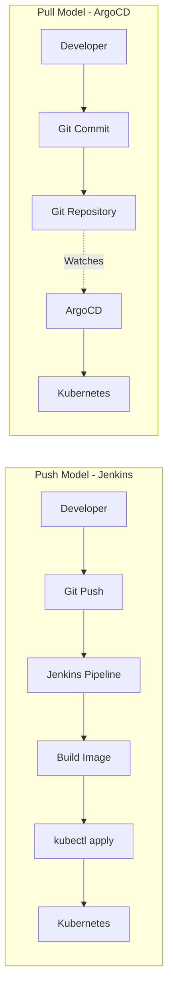

# ArgoCD vs Jenkins: Why GitOps Beats Traditional CI/CD

Author: [nawazdhandala](https://github.com/nawazdhandala)

Tags: ArgoCD, GitOps, Kubernetes, Jenkins, CI/CD

Description: A practical comparison of ArgoCD and Jenkins for Kubernetes deployments explaining why GitOps with ArgoCD is replacing traditional push-based CI/CD pipelines.

---

Jenkins has been the workhorse of CI/CD for over a decade. It can build, test, and deploy just about anything. But when it comes to Kubernetes deployments, a new pattern called GitOps has emerged, and ArgoCD is its most popular implementation. This post explains why many teams are replacing Jenkins-based Kubernetes deployments with ArgoCD, and when Jenkins still makes sense.

## The Fundamental Difference: Push vs Pull

The core distinction between Jenkins and ArgoCD is push-based versus pull-based deployment.

Jenkins uses a push model. A pipeline runs, builds your container image, and then pushes changes to your cluster using kubectl apply, helm upgrade, or a similar command. The CI server initiates the deployment.

ArgoCD uses a pull model. It continuously watches a Git repository for changes. When someone commits a new manifest or updates an image tag, ArgoCD detects the difference and pulls the new state into the cluster. The cluster converges toward what Git declares.



## Why Push-Based Deployments Break Down

The push model worked fine when we deployed to a handful of servers. With Kubernetes, it introduces several problems.

**Credential sprawl.** Jenkins needs direct access to your Kubernetes cluster. That means storing kubeconfig files, service account tokens, or cloud credentials in Jenkins. Every Jenkins agent that can deploy becomes an attack surface. If Jenkins is compromised, your clusters are compromised.

With ArgoCD, the tool runs inside the cluster. It does not need external credentials pushed in from outside. The blast radius of a compromise is fundamentally smaller.

**Drift detection is nonexistent.** If someone runs a manual kubectl command that changes a deployment, Jenkins has no idea. The pipeline ran successfully last time, so Jenkins reports green. Meanwhile, your cluster has drifted from what Git says it should look like.

ArgoCD continuously compares live state against desired state. If someone makes an unauthorized change, ArgoCD detects it immediately and can even auto-correct it with [self-healing](https://oneuptime.com/blog/post/2026-01-25-self-healing-applications-argocd/view).

**No single source of truth.** In a Jenkins setup, the "truth" is scattered across Jenkinsfiles, pipeline configurations, shell scripts, and whatever the last person ran manually. Answering "what is currently deployed?" requires checking the cluster directly.

With ArgoCD, Git is the single source of truth. If you want to know what is deployed, look at the Git repository. Every change is a commit with an author, timestamp, and message.

## What Jenkins Does That ArgoCD Does Not

Let us be clear: ArgoCD is not a CI tool. It does not build container images, run tests, lint code, or generate artifacts. It only handles the CD (continuous delivery) part - specifically, the Kubernetes deployment part.

Jenkins covers the full pipeline:

```groovy
// Jenkinsfile - full CI/CD pipeline
pipeline {
    agent any
    stages {
        stage('Build') {
            steps {
                sh 'docker build -t myapp:${BUILD_NUMBER} .'
            }
        }
        stage('Test') {
            steps {
                sh 'npm test'
            }
        }
        stage('Push Image') {
            steps {
                sh 'docker push myregistry/myapp:${BUILD_NUMBER}'
            }
        }
        stage('Deploy') {
            steps {
                // This is the part ArgoCD replaces
                sh 'kubectl set image deployment/myapp myapp=myregistry/myapp:${BUILD_NUMBER}'
            }
        }
    }
}
```

With ArgoCD, you keep Jenkins (or any CI tool) for building and testing, but replace the deploy stage with a Git commit:

```groovy
// Jenkinsfile - CI only, ArgoCD handles CD
pipeline {
    agent any
    stages {
        stage('Build') {
            steps {
                sh 'docker build -t myapp:${BUILD_NUMBER} .'
            }
        }
        stage('Test') {
            steps {
                sh 'npm test'
            }
        }
        stage('Push Image') {
            steps {
                sh 'docker push myregistry/myapp:${BUILD_NUMBER}'
            }
        }
        stage('Update Manifests') {
            steps {
                // Update the image tag in the GitOps repo
                sh '''
                    git clone https://github.com/myorg/gitops-repo.git
                    cd gitops-repo
                    sed -i "s|image: myregistry/myapp:.*|image: myregistry/myapp:${BUILD_NUMBER}|" apps/myapp/deployment.yaml
                    git add .
                    git commit -m "Update myapp to ${BUILD_NUMBER}"
                    git push
                '''
                // ArgoCD detects the change and deploys automatically
            }
        }
    }
}
```

## Rollback Comparison

Rolling back in Jenkins typically means re-running a previous pipeline or manually running kubectl commands. There is no built-in concept of deployment history in the pipeline itself.

ArgoCD provides multiple rollback approaches. You can revert the Git commit (the GitOps way), or use ArgoCD's built-in history to roll back to a previous sync. For details, see [rollback strategies in ArgoCD](https://oneuptime.com/blog/post/2026-01-25-rollback-strategies-argocd/view).

```bash
# ArgoCD rollback using CLI - instant and auditable
argocd app history my-app
argocd app rollback my-app 3
```

With Jenkins, you might have something like:

```bash
# Jenkins rollback - rerun a previous build or manual intervention
# No built-in mechanism, each team does it differently
kubectl rollout undo deployment/myapp
```

## Security Model

Jenkins' security model for Kubernetes deployments is fundamentally weaker because of the push model.

**Jenkins approach:**
- Jenkins agents need cluster credentials
- Credentials stored in Jenkins credential store or environment variables
- Multiple people may have access to the Jenkins admin console
- Pipeline scripts can execute arbitrary commands against the cluster

**ArgoCD approach:**
- ArgoCD runs inside the cluster with a Kubernetes service account
- No external systems need cluster credentials for deployment
- RBAC controls who can sync which applications
- Git is the only interface for making changes

This does not mean ArgoCD is inherently more secure, but the attack surface for deployment operations is significantly reduced.

## Audit Trail

Jenkins provides build logs that show what happened during a pipeline run. But if someone deploys outside the pipeline, there is no record in Jenkins.

ArgoCD combined with Git gives you a complete audit trail. Every deployment corresponds to a Git commit. You know who changed what, when, and why. ArgoCD also tracks sync history, showing when each sync happened and what changed.

## Multi-Environment Deployments

In Jenkins, promoting across environments usually means triggering downstream pipelines or parameterizing a single pipeline:

```groovy
// Jenkins multi-environment - complex and error-prone
stage('Deploy to Staging') {
    steps {
        sh 'kubectl --context staging apply -f manifests/'
    }
}
stage('Approval') {
    steps {
        input 'Deploy to production?'
    }
}
stage('Deploy to Production') {
    steps {
        sh 'kubectl --context production apply -f manifests/'
    }
}
```

With ArgoCD, environments are separate Applications pointing to different Git paths or branches:

```yaml
# Staging application
apiVersion: argoproj.io/v1alpha1
kind: Application
metadata:
  name: my-app-staging
spec:
  source:
    path: overlays/staging
  destination:
    namespace: staging
---
# Production application
apiVersion: argoproj.io/v1alpha1
kind: Application
metadata:
  name: my-app-production
spec:
  source:
    path: overlays/production
  destination:
    namespace: production
```

Promotion is a Git merge or a PR from the staging branch to the production branch. This is reviewable, auditable, and reversible.

## When to Keep Jenkins

Do not throw out Jenkins entirely. Jenkins is still valuable for:

- Building and testing code
- Running integration and end-to-end tests
- Building container images
- Generating artifacts and reports
- Orchestrating complex multi-stage pipelines that go beyond Kubernetes

The ideal setup for most teams is Jenkins for CI (build, test, push) and ArgoCD for CD (deploy to Kubernetes). They complement each other.

## When to Replace Jenkins Entirely

Some teams have moved away from Jenkins completely, using tools like GitHub Actions or GitLab CI for the build/test phase and ArgoCD for deployment. This eliminates the operational overhead of maintaining Jenkins infrastructure.

If your Jenkins instance is primarily used for Kubernetes deployments and you are spending significant time maintaining Jenkins itself - plugins, agents, security updates - it may be time to consider ArgoCD plus a lighter CI tool.

## Migration Strategy

If you are currently using Jenkins for Kubernetes deployments, here is a practical migration path:

1. Keep Jenkins for build and test stages
2. Create a GitOps repository for your Kubernetes manifests
3. Install ArgoCD in your cluster (see the [installation guide](https://oneuptime.com/blog/post/2026-01-25-install-argocd-kubernetes/view))
4. Modify Jenkins pipelines to update the GitOps repo instead of running kubectl
5. Let ArgoCD handle the actual deployment
6. Gradually move more applications to this pattern

## The Bottom Line

Jenkins and ArgoCD solve different problems. Jenkins is a general-purpose automation server. ArgoCD is a purpose-built Kubernetes deployment tool that implements GitOps principles.

For Kubernetes deployments specifically, ArgoCD provides better security (no external cluster credentials), better drift detection (continuous reconciliation), better auditability (Git-based history), and better rollback capabilities. Jenkins remains valuable for everything that happens before deployment - building, testing, and preparing artifacts.

The future of Kubernetes CD is GitOps, and ArgoCD is leading that charge. But the future of CI is not ArgoCD. Use each tool where it excels.
