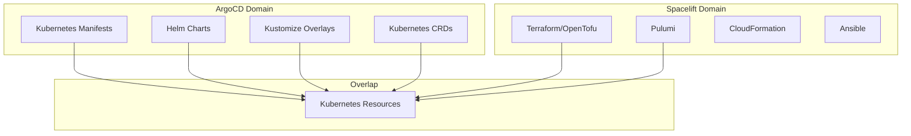
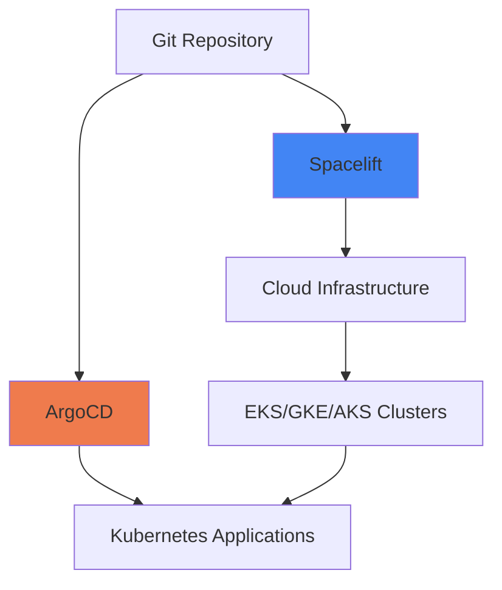

# ArgoCD vs Spacelift: Infrastructure Deployment Comparison

Author: [nawazdhandala](https://github.com/nawazdhandala)

Tags: ArgoCD, GitOps, Kubernetes, Spacelift, Infrastructure as Code

Description: Compare ArgoCD and Spacelift for infrastructure and application deployment, covering their different strengths in Kubernetes GitOps versus IaC management.

---

ArgoCD and Spacelift operate in related but different parts of the infrastructure deployment landscape. ArgoCD is a Kubernetes-native GitOps tool designed for deploying applications and configurations to Kubernetes clusters. Spacelift is an infrastructure-as-code management platform that orchestrates Terraform, OpenTofu, Pulumi, CloudFormation, Kubernetes, and Ansible workflows. While there is some overlap in Kubernetes deployment, these tools solve fundamentally different problems. Understanding where each excels helps you build a deployment strategy that covers both application delivery and infrastructure management.

## Core Focus



**ArgoCD** watches Git repositories and synchronizes Kubernetes manifests to clusters. It understands Kubernetes resource types, health statuses, and relationships.

**Spacelift** manages infrastructure-as-code workflows. It orchestrates plan/apply cycles for Terraform, handles state management, provides drift detection for cloud infrastructure, and manages policy enforcement through Open Policy Agent.

## Kubernetes Deployment: Head-to-Head

When both tools are used for Kubernetes deployment, they take very different approaches.

### ArgoCD Kubernetes Deployment

```yaml
# ArgoCD understands Kubernetes deeply
apiVersion: argoproj.io/v1alpha1
kind: Application
metadata:
  name: web-frontend
  namespace: argocd
spec:
  project: default
  source:
    repoURL: https://github.com/org/k8s-manifests.git
    path: apps/web-frontend
    targetRevision: main
  destination:
    server: https://kubernetes.default.svc
    namespace: production
  syncPolicy:
    automated:
      prune: true
      selfHeal: true
```

ArgoCD provides:
- Real-time sync status for every Kubernetes resource
- Visual resource tree showing parent-child relationships
- Health assessment for all resource types
- Live diff between Git state and cluster state
- Automatic drift detection and correction (self-heal)
- Kubernetes-native RBAC through Projects

### Spacelift Kubernetes Deployment

```hcl
# Spacelift manages Kubernetes through Terraform
resource "kubernetes_deployment" "web_frontend" {
  metadata {
    name      = "web-frontend"
    namespace = "production"
  }

  spec {
    replicas = 3

    selector {
      match_labels = {
        app = "web-frontend"
      }
    }

    template {
      metadata {
        labels = {
          app = "web-frontend"
        }
      }

      spec {
        container {
          image = "myregistry/web-frontend:1.2.3"
          name  = "web-frontend"
        }
      }
    }
  }
}
```

Spacelift provides:
- Plan/apply workflow with previews before changes
- Policy-as-code enforcement for Kubernetes resources
- Drift detection through periodic plan runs
- Integration with cloud infrastructure that supports the Kubernetes workloads

## Where ArgoCD Wins

### Kubernetes-Native Experience

ArgoCD was built from the ground up for Kubernetes. It understands resource health, sync status, hooks, and the entire Kubernetes resource model. This means:

```bash
# ArgoCD knows if your deployment is healthy
argocd app get my-app
# Shows: Health Status: Healthy, Sync Status: Synced

# It knows resource relationships
# Deployment -> ReplicaSet -> Pods -> Containers

# It can show you live logs from pods
argocd app logs my-app --pod my-app-abc123

# It detects and heals drift immediately
# If someone manually changes a resource, ArgoCD reverts it
```

Spacelift does not have this level of Kubernetes awareness. It manages resources through the Terraform provider, which treats Kubernetes resources like any other cloud resource.

### Real-Time Sync

ArgoCD continuously watches for changes and syncs in near-real-time (default 3-minute polling, or instant with webhooks).

Spacelift runs on a schedule or trigger basis. There is a delay between a Git push and the change being applied, typically measured in minutes.

### Multi-Cluster Management

ArgoCD manages multiple Kubernetes clusters from a single instance with ease.

```bash
# ArgoCD: add clusters effortlessly
argocd cluster add staging-cluster
argocd cluster add production-cluster

# Deploy to any cluster
spec:
  destination:
    server: https://staging-cluster-api.example.com
```

Spacelift manages Kubernetes clusters through separate stacks, each with its own Terraform configuration. Cross-cluster coordination requires stack dependencies.

## Where Spacelift Wins

### Infrastructure Management

Spacelift excels at managing the cloud infrastructure that supports Kubernetes.

```hcl
# Spacelift manages the full infrastructure stack
module "eks_cluster" {
  source  = "terraform-aws-modules/eks/aws"
  version = "~> 19.0"

  cluster_name    = "production"
  cluster_version = "1.28"

  vpc_id     = module.vpc.vpc_id
  subnet_ids = module.vpc.private_subnets

  eks_managed_node_groups = {
    general = {
      desired_size = 3
      min_size     = 2
      max_size     = 10
      instance_types = ["m5.xlarge"]
    }
  }
}
```

ArgoCD cannot manage VPCs, EKS clusters, RDS databases, or any non-Kubernetes infrastructure. It operates strictly within the Kubernetes API.

### Policy Enforcement

Spacelift has a sophisticated policy engine built on Open Policy Agent.

```rego
# Spacelift OPA policy
package spacelift

# Prevent deploying to production without approval
deny[reason] {
  input.spacelift.stack.labels[_] == "production"
  not input.spacelift.run.triggered_by == "approval"
  reason := "Production deployments require approval"
}

# Enforce resource naming conventions
deny[reason] {
  resource := input.terraform.resource_changes[_]
  resource.type == "kubernetes_deployment"
  not startswith(resource.change.after.metadata[0].name, "app-")
  reason := sprintf("Deployment %s must start with 'app-' prefix", [resource.change.after.metadata[0].name])
}
```

ArgoCD has sync windows and project restrictions, but not the same level of policy granularity.

### State Management

Spacelift manages Terraform state, providing:
- Encrypted state storage
- State locking to prevent concurrent modifications
- State versioning and rollback
- Import and migration tools

ArgoCD does not manage state - Kubernetes is the source of truth, and Git is the desired state.

## The Complementary Approach

In practice, most organizations use both tools (or tools like them) for different layers.



**Spacelift manages:**
- VPCs, networking, DNS
- Kubernetes cluster provisioning
- Databases, caches, message queues
- IAM roles and policies
- Storage buckets, CDNs

**ArgoCD manages:**
- Application deployments
- Kubernetes operators and controllers
- Service mesh configuration
- Ingress and networking policies
- ConfigMaps and Secrets

```yaml
# Example: Spacelift creates the cluster, ArgoCD deploys to it

# Step 1: Spacelift provisions the EKS cluster and registers it with ArgoCD
# (Terraform)
resource "argocd_cluster" "production" {
  server = module.eks_cluster.cluster_endpoint
  name   = "production"
  config {
    bearer_token = data.aws_eks_cluster_auth.production.token
    tls_client_config {
      ca_data = base64decode(module.eks_cluster.cluster_certificate_authority_data)
    }
  }
}

# Step 2: ArgoCD deploys applications to the cluster
# (ArgoCD Application)
apiVersion: argoproj.io/v1alpha1
kind: Application
spec:
  destination:
    server: https://production-cluster.example.com
```

## Cost Comparison

| Aspect | ArgoCD | Spacelift |
|--------|--------|-----------|
| Software cost | Free (open source) | Free tier + paid plans |
| Typical monthly cost | $0 + infrastructure | $100-2,000+ depending on scale |
| Infrastructure needed | Small (in-cluster) | SaaS (no self-hosting) |
| Operational overhead | Medium (self-managed) | Low (managed service) |

## When to Choose ArgoCD

- Your primary need is Kubernetes application deployment
- You want a Kubernetes-native tool with deep cluster integration
- You need real-time sync and drift correction
- You prefer open source with no vendor lock-in
- You are already managing infrastructure with other tools

## When to Choose Spacelift

- Your primary need is infrastructure-as-code management
- You use Terraform, Pulumi, or CloudFormation extensively
- You need sophisticated policy enforcement for infrastructure changes
- You want managed state management for Terraform
- You need to manage both cloud infrastructure and Kubernetes resources in one platform

## When to Use Both

- You need separate tools optimized for their respective domains
- Your infrastructure team manages cloud resources with Terraform
- Your application team deploys to Kubernetes with GitOps
- You want best-in-class tools for each layer of your stack

The choice between ArgoCD and Spacelift is not really a choice at all for most organizations - they solve different problems. Use ArgoCD for Kubernetes application delivery and Spacelift (or similar tools) for infrastructure management. Together, they provide a complete GitOps solution across your entire stack.
