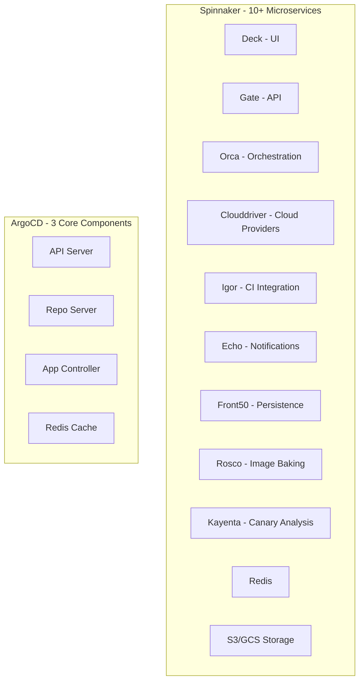

# ArgoCD vs Spinnaker: Choosing the Right Deployment Tool

Author: [nawazdhandala](https://github.com/nawazdhandala)

Tags: ArgoCD, GitOps, Kubernetes, Spinnaker, Continuous Delivery

Description: An in-depth comparison of ArgoCD and Spinnaker for Kubernetes deployments covering architecture, deployment strategies, complexity, and ideal use cases.

---

ArgoCD and Spinnaker are both continuous delivery tools, but they come from very different worlds. Spinnaker was built by Netflix for multi-cloud deployment orchestration. ArgoCD was built for Kubernetes-native GitOps. Understanding where each tool shines - and where it struggles - will help you make the right choice for your organization.

## Architecture and Complexity

This is where the biggest difference hits you immediately.

Spinnaker is a large, complex platform. It consists of multiple microservices: Deck (UI), Gate (API), Orca (orchestration), Clouddriver (cloud provider integration), Igor (CI integration), Echo (notifications), Front50 (persistence), Rosco (image baking), and Kayenta (canary analysis). Each service has its own configuration, scaling requirements, and failure modes.

Installing Spinnaker typically requires Halyard (its configuration management tool), a backing store like S3 or GCS, a Redis instance, and significant operational expertise. Many teams spend weeks getting Spinnaker running and stable.

ArgoCD is comparatively lightweight. It runs as three main components - the API server, the repo server, and the application controller - plus a Redis cache. Installation takes minutes with a single kubectl apply or Helm chart. The operational overhead is dramatically lower.



## Deployment Model

Spinnaker uses a pipeline-based model. You build multi-stage pipelines with triggers, bake stages, deploy stages, manual judgment stages, and verification stages. Pipelines are configured through the Spinnaker UI or JSON definitions.

ArgoCD uses a declarative, Git-based model. You define what you want deployed in Git manifests, and ArgoCD ensures the cluster matches that state. There are no pipelines in the traditional sense - the "pipeline" is your Git workflow (branches, PRs, merges).

Here is how a typical deployment looks in each tool:

Spinnaker pipeline configuration (simplified JSON):

```json
{
  "name": "Deploy My App",
  "stages": [
    {
      "type": "bake",
      "name": "Bake Manifest",
      "templateRenderer": "HELM3",
      "inputArtifacts": [
        {"account": "my-helm-repo", "artifact": {"name": "my-chart"}}
      ]
    },
    {
      "type": "deployManifest",
      "name": "Deploy to Staging",
      "account": "staging-cluster",
      "manifests": [],
      "requiredArtifactIds": ["baked-manifest"]
    },
    {
      "type": "manualJudgment",
      "name": "Approve for Production"
    },
    {
      "type": "deployManifest",
      "name": "Deploy to Production",
      "account": "production-cluster"
    }
  ]
}
```

ArgoCD equivalent using Git-based promotion:

```yaml
# ArgoCD Application - staging auto-syncs from Git
apiVersion: argoproj.io/v1alpha1
kind: Application
metadata:
  name: my-app-staging
  namespace: argocd
spec:
  project: default
  source:
    repoURL: https://github.com/myorg/gitops-repo.git
    path: apps/my-app/overlays/staging
    targetRevision: main
  destination:
    server: https://staging-cluster.example.com
    namespace: my-app
  syncPolicy:
    automated:
      prune: true
      selfHeal: true
```

Production promotion happens by merging changes through a PR or updating the production overlay in Git.

## Multi-Cloud vs Kubernetes-Native

Spinnaker was designed for multi-cloud deployments. It supports AWS, GCP, Azure, Oracle Cloud, and Kubernetes through its Clouddriver abstraction. If you deploy to multiple cloud providers - VMs on AWS, Cloud Run on GCP, and Kubernetes clusters - Spinnaker can orchestrate all of it.

ArgoCD is Kubernetes-only. It manages Kubernetes resources across clusters, but it does not deploy to VMs, serverless platforms, or other cloud-native services directly. If your infrastructure is all Kubernetes, this is not a limitation. If you need to deploy Lambda functions alongside Kubernetes workloads, Spinnaker is the more capable choice.

## Deployment Strategies

Spinnaker has built-in support for sophisticated deployment strategies: red/black (blue/green), canary with automated analysis through Kayenta, rolling updates, and custom strategies. The canary analysis feature integrates with monitoring systems like Datadog, Prometheus, and New Relic to automatically evaluate canary deployments.

ArgoCD handles deployment strategies differently. Basic rolling updates work through standard Kubernetes Deployment resources. For canary and blue-green deployments, you need Argo Rollouts as a companion tool. For details, see [progressive delivery with ArgoCD](https://oneuptime.com/blog/post/2026-01-25-progressive-delivery-argocd/view).

Spinnaker's canary analysis is more mature and deeply integrated. If automated canary analysis with statistical significance testing is important to your workflow, Spinnaker has an edge here.

## Drift Detection and Self-Healing

This is where ArgoCD clearly wins.

ArgoCD continuously monitors the cluster state and compares it against the Git repository. If someone manually changes a deployment, ArgoCD detects the drift and can automatically correct it. You always know whether your cluster matches what Git says.

Spinnaker has no built-in drift detection. Once a pipeline executes, Spinnaker does not monitor whether the deployed resources change. Manual changes to the cluster go unnoticed. There is no concept of continuous reconciliation.

## User Interface

Both tools have web UIs, but they serve different purposes.

Spinnaker's Deck UI is designed for pipeline management. You can build, configure, and visualize multi-stage pipelines. It shows execution history, stage outputs, and infrastructure inventory. The UI is powerful but complex - it reflects the complexity of the tool itself.

ArgoCD's UI focuses on application state. You see your applications, their sync status, health, and a visual resource tree. You can drill into individual resources, view logs, see events, and manually trigger syncs. The UI is simpler and more focused on the "what is deployed" question.

## GitOps and Audit Trail

ArgoCD is built on GitOps principles from the ground up. Every change goes through Git, providing a complete audit trail. Rollbacks are Git reverts. Approvals are pull request reviews. The entire deployment history is your Git log.

Spinnaker stores pipeline configurations and execution history in its own backing store (Front50). While you can store pipeline JSON in Git, the runtime state and execution history live outside Git. The audit trail is in Spinnaker's database, not in your version control system.

## Learning Curve and Operational Overhead

Spinnaker has a steep learning curve. Understanding the pipeline model, configuring cloud providers, managing Halyard, and debugging multi-service interactions takes significant time and expertise. Many organizations dedicate a team to managing their Spinnaker installation.

ArgoCD is straightforward to learn, especially if you already know Kubernetes. The concepts map directly to Kubernetes primitives - Applications, namespaces, manifests. Most teams can get productive with ArgoCD in a day or two.

The operational overhead follows the same pattern. Spinnaker requires ongoing maintenance of 10+ microservices, database backups, version upgrades through Halyard, and cloud provider configuration updates. ArgoCD upgrades are a Helm chart update or a kubectl apply.

## Scaling

Spinnaker scales well for large organizations with dedicated platform teams. Netflix, Google, and other large companies run Spinnaker at massive scale. But scaling requires expertise - tuning Orca thread pools, Clouddriver caching, and Front50 storage.

ArgoCD scales well for Kubernetes-focused organizations. It can manage thousands of applications across hundreds of clusters. The sharding feature lets you distribute the application controller load across multiple replicas. For high availability configuration, see [ArgoCD high availability](https://oneuptime.com/blog/post/2026-02-02-argocd-high-availability/view).

## When to Choose Spinnaker

Pick Spinnaker if:

- You deploy to multiple cloud providers, not just Kubernetes
- You need built-in canary analysis with statistical significance testing
- You have a dedicated platform team to maintain the installation
- You need complex multi-stage deployment pipelines with manual approvals baked into the tool
- You deploy to VMs, serverless, and Kubernetes from one tool

## When to Choose ArgoCD

Pick ArgoCD if:

- Your deployments are Kubernetes-only or primarily Kubernetes
- You want GitOps with Git as the single source of truth
- You need drift detection and self-healing capabilities
- You want a tool that is simple to install and maintain
- Your team values auditability through Git history
- You want a lightweight tool with low operational overhead

## Can You Use Both?

Some organizations use Spinnaker for non-Kubernetes deployments and ArgoCD for Kubernetes workloads. This is a valid approach if you have diverse infrastructure. However, managing two deployment platforms adds complexity, so make sure the benefits justify the overhead.

## The Bottom Line

Spinnaker is a powerful, multi-cloud deployment platform built for enterprise scale. ArgoCD is a focused, Kubernetes-native GitOps tool built for simplicity and developer experience.

If you are going all-in on Kubernetes and want a GitOps workflow, ArgoCD is the clear choice. It is simpler to run, easier to learn, and provides continuous drift detection that Spinnaker cannot match.

If you need to orchestrate deployments across multiple cloud providers with sophisticated canary analysis, Spinnaker still has capabilities that ArgoCD does not cover. But for most Kubernetes-focused teams in 2026, ArgoCD delivers more value with less operational burden.
