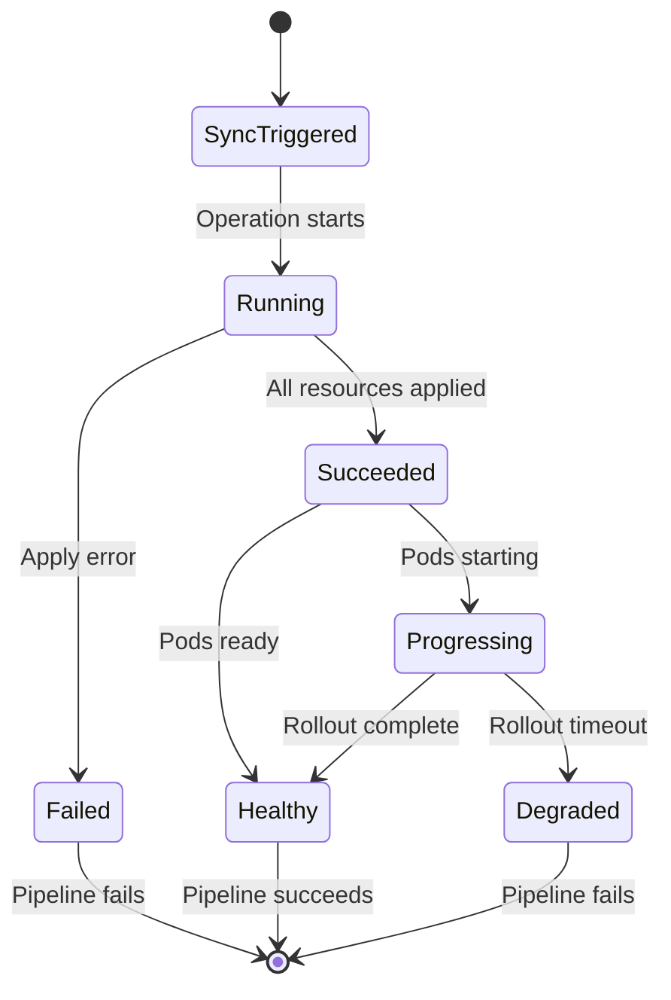

# How to Wait for ArgoCD Sync Completion in CI

Author: [nawazdhandala](https://github.com/nawazdhandala)

Tags: ArgoCD, GitOps, Kubernetes, CI/CD

Description: Learn how to reliably wait for ArgoCD sync completion in CI/CD pipelines using the CLI, REST API, and custom scripts with proper timeout and error handling.

---

When you trigger an ArgoCD sync from a CI pipeline, you almost always need to know whether it succeeded before continuing. Maybe you want to run integration tests after deployment, update a status check, or trigger the next pipeline stage. This guide covers every approach to waiting for sync completion and handling the various outcomes.

## Understanding Sync States

Before writing wait logic, you need to understand what ArgoCD reports during a sync operation. There are three key status fields:

- **Operation Phase** - The current phase of the sync operation: `Running`, `Succeeded`, `Failed`, `Error`, `Terminating`
- **Sync Status** - Whether the live state matches Git: `Synced`, `OutOfSync`, `Unknown`
- **Health Status** - The health of the application: `Healthy`, `Degraded`, `Progressing`, `Suspended`, `Missing`, `Unknown`

A successful deployment means: Operation Phase is `Succeeded`, Sync Status is `Synced`, and Health Status is `Healthy`.



## Method 1: ArgoCD CLI Wait Command

The simplest and most reliable approach is the `argocd app wait` command.

```bash
# Wait for sync and health
argocd app wait my-app \
  --server $ARGOCD_SERVER \
  --auth-token $ARGOCD_TOKEN \
  --grpc-web \
  --health \
  --timeout 300
```

The `--health` flag tells ArgoCD to wait not just for the sync operation to complete, but also for the application to become healthy. Without it, the command returns as soon as resources are applied, even if pods are still starting.

### Wait Options Explained

```bash
# Wait only for sync to complete (resources applied)
argocd app wait my-app --sync --timeout 300

# Wait only for health (useful if auto-sync is handling the sync)
argocd app wait my-app --health --timeout 300

# Wait for both sync and health
argocd app wait my-app --health --sync --timeout 300

# Wait for specific operation to complete
argocd app wait my-app --operation --timeout 300

# Wait for suspended state (useful for Argo Rollouts)
argocd app wait my-app --suspended --timeout 300
```

### Combined Sync and Wait

You can sync and wait in a single flow:

```bash
# Sync the app and wait for it to become healthy
argocd app sync my-app \
  --server $ARGOCD_SERVER \
  --auth-token $ARGOCD_TOKEN \
  --grpc-web \
  --retry-limit 3

# Then wait for health
argocd app wait my-app \
  --server $ARGOCD_SERVER \
  --auth-token $ARGOCD_TOKEN \
  --grpc-web \
  --health \
  --timeout 300
```

## Method 2: REST API Polling

When you cannot install the ArgoCD CLI in your CI environment, poll the REST API.

```bash
#!/bin/bash
# wait-for-argocd.sh - Poll ArgoCD API until sync completes
set -e

ARGOCD_SERVER="${ARGOCD_SERVER:?}"
ARGOCD_TOKEN="${ARGOCD_TOKEN:?}"
APP_NAME="${1:?Usage: $0 <app-name> [timeout]}"
TIMEOUT="${2:-300}"
POLL_INTERVAL=10
ELAPSED=0

echo "Waiting for $APP_NAME to sync and become healthy (timeout: ${TIMEOUT}s)"

while [ $ELAPSED -lt $TIMEOUT ]; do
  # Fetch application status
  RESPONSE=$(curl -sf \
    -H "Authorization: Bearer $ARGOCD_TOKEN" \
    "https://$ARGOCD_SERVER/api/v1/applications/$APP_NAME" 2>/dev/null) || {
    echo "  [${ELAPSED}s] Failed to reach ArgoCD API, retrying..."
    sleep $POLL_INTERVAL
    ELAPSED=$((ELAPSED + POLL_INTERVAL))
    continue
  }

  # Extract status fields
  SYNC_STATUS=$(echo "$RESPONSE" | jq -r '.status.sync.status // "Unknown"')
  HEALTH_STATUS=$(echo "$RESPONSE" | jq -r '.status.health.status // "Unknown"')
  OP_PHASE=$(echo "$RESPONSE" | jq -r '.status.operationState.phase // "None"')

  echo "  [${ELAPSED}s] Sync=$SYNC_STATUS Health=$HEALTH_STATUS Operation=$OP_PHASE"

  # Success condition
  if [ "$SYNC_STATUS" = "Synced" ] && [ "$HEALTH_STATUS" = "Healthy" ]; then
    echo "Application $APP_NAME is synced and healthy!"
    exit 0
  fi

  # Failure conditions
  if [ "$OP_PHASE" = "Failed" ] || [ "$OP_PHASE" = "Error" ]; then
    echo "Sync operation failed!"
    echo "$RESPONSE" | jq -r '.status.operationState.message // "No error message"'
    exit 1
  fi

  if [ "$HEALTH_STATUS" = "Degraded" ] && [ "$OP_PHASE" = "Succeeded" ]; then
    echo "Sync succeeded but application is degraded!"
    echo "$RESPONSE" | jq -r '.status.conditions[]? | .message'
    exit 1
  fi

  sleep $POLL_INTERVAL
  ELAPSED=$((ELAPSED + POLL_INTERVAL))
done

echo "Timeout after ${TIMEOUT}s waiting for $APP_NAME"
exit 1
```

## Method 3: Using kubectl to Watch Resources

If you have kubectl access to the cluster, you can watch the actual Kubernetes resources instead of polling ArgoCD.

```bash
#!/bin/bash
# Wait for deployment rollout
kubectl rollout status deployment/my-app -n production --timeout=300s

# Check pod readiness
kubectl wait --for=condition=ready pod \
  -l app=my-app \
  -n production \
  --timeout=300s
```

This approach bypasses ArgoCD entirely and watches the actual Kubernetes state. It is useful as a secondary verification.

## CI Platform Examples

### GitHub Actions

```yaml
- name: Wait for ArgoCD deployment
  env:
    ARGOCD_SERVER: ${{ secrets.ARGOCD_SERVER }}
    ARGOCD_AUTH_TOKEN: ${{ secrets.ARGOCD_TOKEN }}
  run: |
    # Install CLI
    curl -sSL -o /usr/local/bin/argocd \
      https://github.com/argoproj/argo-cd/releases/latest/download/argocd-linux-amd64
    chmod +x /usr/local/bin/argocd

    # Sync and wait
    argocd app sync my-app --grpc-web --retry-limit 3
    argocd app wait my-app --grpc-web --health --timeout 300

- name: Run integration tests
  if: success()
  run: |
    # Only runs if deployment succeeded
    ./run-integration-tests.sh
```

### GitLab CI

```yaml
deploy:
  stage: deploy
  image: argoproj/argocd:v2.10.0
  script:
    - argocd app sync my-app
        --auth-token $ARGOCD_TOKEN
        --server $ARGOCD_SERVER
        --grpc-web
    - argocd app wait my-app
        --auth-token $ARGOCD_TOKEN
        --server $ARGOCD_SERVER
        --grpc-web
        --health
        --timeout 300
  after_script:
    # Always show final status, even on failure
    - argocd app get my-app
        --auth-token $ARGOCD_TOKEN
        --server $ARGOCD_SERVER
        --grpc-web
```

## Handling Edge Cases

### Application Stuck in Progressing

Sometimes pods get stuck in a `Progressing` state due to image pull errors or insufficient resources. Set a reasonable timeout and add detection:

```bash
# If health is Progressing for too long, check pod events
if [ "$HEALTH_STATUS" = "Progressing" ] && [ $ELAPSED -gt 120 ]; then
  echo "Application stuck in Progressing state. Checking pod events..."
  kubectl get events -n production \
    --field-selector involvedObject.kind=Pod \
    --sort-by='.lastTimestamp' | tail -20
fi
```

### Handling Auto-Sync Race Conditions

If auto-sync is enabled, your CI pipeline might trigger a sync that conflicts with an auto-sync already in progress:

```bash
# Wait for any existing operation to complete first
argocd app wait my-app --operation --grpc-web --timeout 60 2>/dev/null || true

# Now trigger our sync
argocd app sync my-app --grpc-web
argocd app wait my-app --grpc-web --health --timeout 300
```

### Multiple Applications

When deploying multiple applications, wait for all of them:

```bash
#!/bin/bash
# Wait for multiple apps in parallel
APPS="app-frontend app-backend app-worker"
PIDS=""

for app in $APPS; do
  argocd app wait $app --grpc-web --health --timeout 300 &
  PIDS="$PIDS $!"
done

# Wait for all background processes
FAILED=0
for pid in $PIDS; do
  wait $pid || FAILED=$((FAILED + 1))
done

if [ $FAILED -gt 0 ]; then
  echo "$FAILED application(s) failed to sync"
  exit 1
fi
echo "All applications synced successfully"
```

## Best Practices

1. **Set realistic timeouts** - Account for image pull time, pod scheduling, and readiness probe delays. 5 minutes is a good starting point.

2. **Always show status on failure** - When the wait fails, dump the application status so developers can diagnose the issue without opening the ArgoCD UI.

3. **Use health checks, not just sync status** - A synced application can still be unhealthy if pods fail to start.

4. **Handle network errors** - The CI runner might lose connectivity to ArgoCD. Add retry logic around API calls.

5. **Monitor deployment duration** - Track how long syncs take over time. If they are getting slower, investigate resource constraints. For comprehensive monitoring, explore [ArgoCD Prometheus metrics](https://oneuptime.com/blog/post/2026-02-26-argocd-prometheus-metrics/view).
