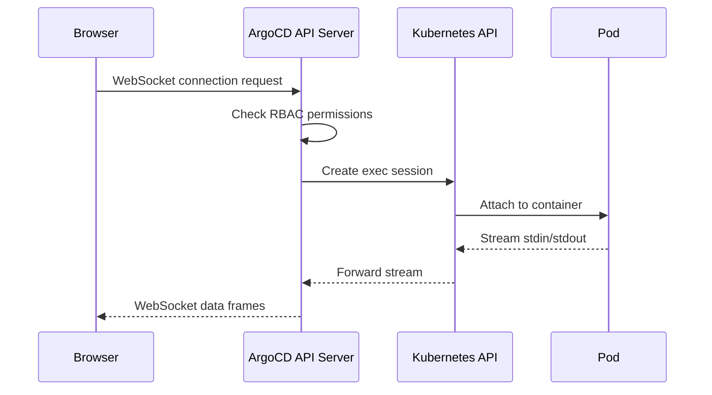

# How to Enable Web-Based Terminal in ArgoCD

Author: [nawazdhandala](https://github.com/nawazdhandala)

Tags: ArgoCD, GitOps, Kubernetes, Debugging, Terminal

Description: Learn how to enable and configure the web-based terminal feature in ArgoCD to get interactive shell access to pods directly from the ArgoCD UI for debugging and troubleshooting.

---

ArgoCD ships with a powerful but often overlooked feature: a web-based terminal that lets you open an interactive shell session directly into any running pod from the ArgoCD UI. If you have ever found yourself switching between the ArgoCD dashboard and a terminal window just to run kubectl exec, this feature is for you.

In this guide, we will walk through how to enable the web-based terminal, configure it properly, and understand the security implications of turning it on.

## Why Use the Web-Based Terminal?

The web-based terminal in ArgoCD provides a few compelling advantages over traditional kubectl exec workflows:

- **No local kubectl required**: Team members who do not have kubectl configured locally can still troubleshoot pods.
- **Centralized access**: All pod access goes through ArgoCD, which means it is subject to ArgoCD RBAC policies.
- **Audit trail**: Terminal sessions initiated through ArgoCD can be tracked alongside other ArgoCD operations.
- **Faster debugging**: You do not need to look up pod names or namespace details - just click from the resource tree.

## Prerequisites

Before enabling the terminal, make sure you have:

- ArgoCD v2.4 or later installed on your cluster
- Admin access to modify ArgoCD ConfigMaps
- The ArgoCD API server configured with exec permissions

## Step 1: Enable the Terminal Feature

The web-based terminal is disabled by default for security reasons. You need to explicitly enable it in the `argocd-cm` ConfigMap.

```yaml
# Edit the argocd-cm ConfigMap
apiVersion: v1
kind: ConfigMap
metadata:
  name: argocd-cm
  namespace: argocd
data:
  # Enable the exec feature for web terminal
  exec.enabled: "true"
```

Apply this change:

```bash
# Apply the ConfigMap update
kubectl apply -f argocd-cm.yaml -n argocd
```

Alternatively, you can patch it directly:

```bash
# Patch the ConfigMap to enable exec
kubectl patch configmap argocd-cm -n argocd --type merge \
  -p '{"data": {"exec.enabled": "true"}}'
```

## Step 2: Configure RBAC for Terminal Access

Enabling the feature alone is not enough. You also need to grant the `exec` permission in ArgoCD's RBAC configuration. Without this, users will see the terminal option but get a permission denied error.

Edit the `argocd-rbac-cm` ConfigMap:

```yaml
apiVersion: v1
kind: ConfigMap
metadata:
  name: argocd-rbac-cm
  namespace: argocd
data:
  policy.csv: |
    # Grant exec (terminal) access to the admin role
    p, role:admin, exec, create, */*, allow

    # Grant exec access to a specific group for a specific project
    p, role:developer, exec, create, my-project/*, allow
  policy.default: role:readonly
```

The RBAC policy format for exec permissions follows this pattern:

```
p, <role>, exec, create, <project>/<namespace>/<app>, <allow|deny>
```

Here is a breakdown of the fields:

- **role**: The ArgoCD role or group
- **exec**: The resource type for terminal access
- **create**: The action (always "create" for exec)
- **project/namespace/app**: The scope, supporting wildcards

## Step 3: Configure the Kubernetes RBAC

ArgoCD's API server needs Kubernetes-level permissions to exec into pods. If you installed ArgoCD with the default manifests, these permissions are usually already included. However, if you use a restricted installation, you may need to verify the ClusterRole.

```yaml
# Ensure the ArgoCD API server has exec permissions
apiVersion: rbac.authorization.k8s.io/v1
kind: ClusterRole
metadata:
  name: argocd-server
rules:
  # Other rules...
  - apiGroups: [""]
    resources: ["pods/exec"]
    verbs: ["create"]
```

## Step 4: Configure Default Shell

By default, ArgoCD uses `/bin/bash` as the shell. If your containers use minimal images that only have `/bin/sh`, you can configure the default shell:

```yaml
apiVersion: v1
kind: ConfigMap
metadata:
  name: argocd-cm
  namespace: argocd
data:
  exec.enabled: "true"
  # Configure available shells
  exec.shells: "bash,sh,powershell,cmd"
```

The terminal will try each shell in order and use the first one available in the container.

## Step 5: Restart the ArgoCD API Server

After making configuration changes, restart the API server to pick them up:

```bash
# Restart the ArgoCD API server
kubectl rollout restart deployment argocd-server -n argocd

# Wait for the rollout to complete
kubectl rollout status deployment argocd-server -n argocd
```

## Using the Web Terminal

Once enabled, navigate to any application in the ArgoCD UI:

1. Open the application resource tree
2. Click on a Pod resource
3. Look for the "Terminal" tab in the resource details panel
4. Select the container (if the pod has multiple containers)
5. Choose the shell you want to use
6. Click "Connect"

You now have an interactive shell session running inside the container.

## Architecture Overview

Understanding how the terminal works under the hood helps with troubleshooting:



The terminal uses WebSocket connections between your browser and the ArgoCD API server, which then proxies the connection to the Kubernetes API server's exec endpoint.

## Security Considerations

Enabling the web terminal has significant security implications:

**Principle of least privilege**: Only grant exec access to roles that genuinely need it. Developers who need to debug pods should get access, but read-only dashboard viewers should not.

**Network security**: Make sure your ArgoCD API server is not publicly exposed without authentication. The terminal provides direct shell access to your containers.

**Audit logging**: Enable ArgoCD audit logging to track who uses the terminal and when:

```yaml
apiVersion: v1
kind: ConfigMap
metadata:
  name: argocd-cm
  namespace: argocd
data:
  exec.enabled: "true"
  # Enable audit logging for all operations
  server.audit.enabled: "true"
```

**Container security**: If your containers run as root, anyone with terminal access effectively has root access inside the container. Use securityContext settings to run containers as non-root users.

## Troubleshooting Common Issues

### Terminal Tab Not Showing

If you do not see the Terminal tab after enabling it:

```bash
# Verify the ConfigMap has the correct setting
kubectl get configmap argocd-cm -n argocd -o jsonpath='{.data.exec\.enabled}'
# Should output: true

# Check if the API server has been restarted
kubectl get pods -n argocd -l app.kubernetes.io/name=argocd-server
```

### Permission Denied

If you see "permission denied" when trying to connect:

```bash
# Test RBAC policies with the argocd CLI
argocd admin settings rbac validate \
  --policy-file policy.csv \
  --action create \
  --resource exec
```

### WebSocket Connection Failures

If the terminal connects but immediately disconnects, the issue is often with ingress configuration. WebSocket connections need special handling:

```yaml
# For Nginx Ingress, ensure WebSocket support
apiVersion: networking.k8s.io/v1
kind: Ingress
metadata:
  name: argocd-server
  annotations:
    # Enable WebSocket proxying
    nginx.ingress.kubernetes.io/proxy-read-timeout: "3600"
    nginx.ingress.kubernetes.io/proxy-send-timeout: "3600"
    nginx.ingress.kubernetes.io/proxy-http-version: "1.1"
    nginx.ingress.kubernetes.io/configuration-snippet: |
      proxy_set_header Upgrade $http_upgrade;
      proxy_set_header Connection "upgrade";
```

## Helm Values Configuration

If you deployed ArgoCD with Helm, you can enable the terminal through values:

```yaml
# values.yaml for ArgoCD Helm chart
server:
  config:
    exec.enabled: "true"
    exec.shells: "bash,sh"
  rbacConfig:
    policy.csv: |
      p, role:admin, exec, create, */*, allow
```

## Conclusion

The web-based terminal in ArgoCD is a valuable debugging tool that brings interactive shell access directly into your GitOps workflow. By enabling it with proper RBAC controls and security considerations, you can give your team fast access to troubleshoot running pods without requiring local kubectl configuration.

Remember to keep terminal access restricted to those who need it, and always monitor usage through ArgoCD's audit logging capabilities. For more on ArgoCD RBAC configuration, check out our guide on [configuring RBAC policies in ArgoCD](https://oneuptime.com/blog/post/2026-02-26-argocd-restrict-terminal-access-rbac/view).
