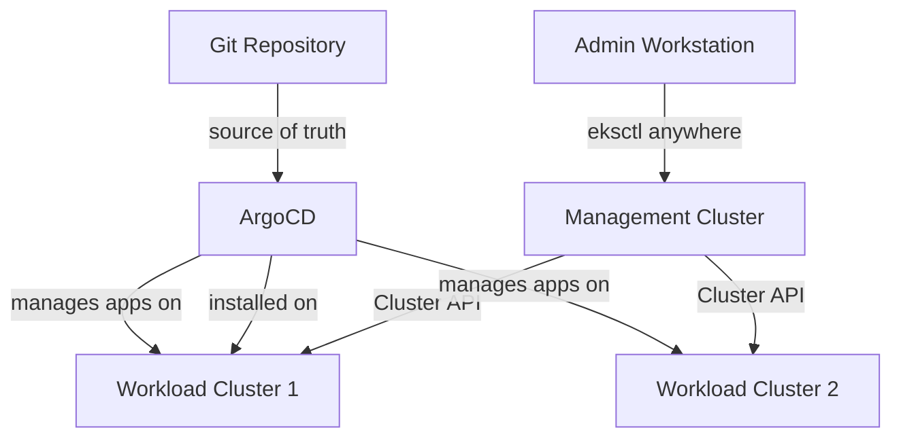

# How to Use ArgoCD with EKS Anywhere

Author: [nawazdhandala](https://github.com/nawazdhandala)

Tags: ArgoCD, GitOps, Kubernetes, EKS Anywhere, AWS

Description: Learn how to deploy and configure ArgoCD on EKS Anywhere clusters for on-premises Kubernetes with AWS API compatibility and GitOps-driven infrastructure.

---

EKS Anywhere lets you run Amazon EKS on your own infrastructure - vSphere, bare metal, Nutanix, or CloudStack. It uses the same EKS distribution that runs in AWS but deploys on-premises. ArgoCD pairs naturally with EKS Anywhere because EKS-A already uses a GitOps model for cluster management. This guide covers how to set up ArgoCD on EKS Anywhere and leverage its unique capabilities.

## EKS Anywhere Architecture

EKS Anywhere has a management cluster and workload clusters, similar to TKG. The management cluster runs Cluster API providers that manage workload cluster lifecycle.



EKS Anywhere already ships with an optional GitOps integration using Flux. However, many teams prefer ArgoCD for its UI and broader feature set.

## Prerequisites

Set up your EKS Anywhere cluster and verify access.

```bash
# Check your EKS Anywhere cluster
eksctl anywhere get clusters

# Set kubeconfig
export KUBECONFIG=${HOME}/${CLUSTER_NAME}/${CLUSTER_NAME}-eks-a-cluster.kubeconfig

# Verify access
kubectl get nodes
kubectl get pods -A
```

## Installing ArgoCD on EKS Anywhere

```bash
# Create the namespace
kubectl create namespace argocd

# Install ArgoCD (use HA for production)
kubectl apply -n argocd -f https://raw.githubusercontent.com/argoproj/argo-cd/stable/manifests/install.yaml

# Wait for all components
kubectl wait --for=condition=Ready pods --all -n argocd --timeout=300s

# Verify installation
kubectl get pods -n argocd
```

## Coexisting with Flux (EKS-A Default GitOps)

EKS Anywhere can bootstrap with Flux for cluster configuration. You have three options for coexistence.

### Option 1: Replace Flux with ArgoCD

If you prefer ArgoCD entirely, create EKS-A clusters without the GitOps option and install ArgoCD manually.

```bash
# Create EKS-A cluster without GitOps (no Flux)
eksctl anywhere create cluster -f cluster.yaml
# Then install ArgoCD as shown above
```

### Option 2: Use Flux for Cluster Config, ArgoCD for Apps

Keep Flux for managing cluster-level configuration and use ArgoCD for application deployments.

```yaml
# ArgoCD project that avoids Flux-managed namespaces
apiVersion: argoproj.io/v1alpha1
kind: AppProject
metadata:
  name: applications
  namespace: argocd
spec:
  description: Application workloads - ArgoCD manages these
  destinations:
    - namespace: 'app-*'
      server: https://kubernetes.default.svc
    - namespace: 'service-*'
      server: https://kubernetes.default.svc
  # Exclude Flux system namespaces
  sourceRepos:
    - '*'
  namespaceResourceBlacklist:
    - group: source.toolkit.fluxcd.io
      kind: '*'
    - group: kustomize.toolkit.fluxcd.io
      kind: '*'
```

### Option 3: Remove Flux After Cluster Creation

```bash
# After cluster is stable, remove Flux components
kubectl delete namespace flux-system
kubectl delete clusterrole flux-edit flux-view
kubectl delete clusterrolebinding flux-edit flux-view
```

## Exposing ArgoCD on EKS Anywhere

EKS Anywhere does not include a built-in load balancer solution. You need to install one.

### Using MetalLB (Bare Metal / vSphere)

```bash
# Install MetalLB
kubectl apply -f https://raw.githubusercontent.com/metallb/metallb/v0.14.3/config/manifests/metallb-native.yaml

# Wait for MetalLB to be ready
kubectl wait --for=condition=Ready pods -l app=metallb -n metallb-system --timeout=120s
```

```yaml
# Configure MetalLB IP pool
apiVersion: metallb.io/v1beta1
kind: IPAddressPool
metadata:
  name: default-pool
  namespace: metallb-system
spec:
  addresses:
    - 10.0.0.200-10.0.0.250
---
apiVersion: metallb.io/v1beta1
kind: L2Advertisement
metadata:
  name: default
  namespace: metallb-system
spec:
  ipAddressPools:
    - default-pool
```

Then expose ArgoCD.

```bash
kubectl patch svc argocd-server -n argocd -p '{"spec": {"type": "LoadBalancer"}}'
kubectl get svc argocd-server -n argocd
```

### Using Ingress

Install an ingress controller first.

```bash
# Install Nginx ingress controller
kubectl apply -f https://raw.githubusercontent.com/kubernetes/ingress-nginx/controller-v1.9.4/deploy/static/provider/baremetal/deploy.yaml
```

```yaml
# ArgoCD Ingress
apiVersion: networking.k8s.io/v1
kind: Ingress
metadata:
  name: argocd-server
  namespace: argocd
  annotations:
    nginx.ingress.kubernetes.io/ssl-passthrough: "true"
    nginx.ingress.kubernetes.io/backend-protocol: "HTTPS"
spec:
  ingressClassName: nginx
  rules:
    - host: argocd.internal.example.com
      http:
        paths:
          - path: /
            pathType: Prefix
            backend:
              service:
                name: argocd-server
                port:
                  number: 443
```

## EKS Anywhere Packages and ArgoCD

EKS Anywhere has its own package system (curated packages). You can manage these through ArgoCD.

```yaml
# Manage EKS-A packages through ArgoCD
apiVersion: argoproj.io/v1alpha1
kind: Application
metadata:
  name: eks-packages
  namespace: argocd
spec:
  project: default
  source:
    repoURL: https://github.com/org/eks-anywhere-config.git
    targetRevision: main
    path: packages
  destination:
    server: https://kubernetes.default.svc
    namespace: eksa-packages
  ignoreDifferences:
    # EKS-A package controller modifies these
    - group: packages.eks.amazonaws.com
      kind: Package
      jsonPointers:
        - /status
  syncPolicy:
    automated:
      selfHeal: true
```

## IAM and AWS Authentication

EKS Anywhere supports AWS IAM authentication through the aws-iam-authenticator. Configure ArgoCD to use it for cluster access.

```yaml
# argocd-cm ConfigMap for AWS IAM authentication
apiVersion: v1
kind: ConfigMap
metadata:
  name: argocd-cm
  namespace: argocd
data:
  # If using aws-iam-authenticator for cluster auth
  exec.enabled: "true"
```

For adding EKS (cloud) clusters to an on-premises ArgoCD instance.

```bash
# Add an EKS cloud cluster to your EKS-A ArgoCD
aws eks update-kubeconfig --name my-eks-cluster --region us-east-1

# Add to ArgoCD
argocd cluster add arn:aws:eks:us-east-1:123456789:cluster/my-eks-cluster \
  --name eks-cloud-cluster
```

## Multi-Cluster Management

A common pattern is running ArgoCD on EKS Anywhere to manage both on-premises and cloud clusters.

```yaml
# ApplicationSet for hybrid cloud deployment
apiVersion: argoproj.io/v1alpha1
kind: ApplicationSet
metadata:
  name: platform-services
  namespace: argocd
spec:
  generators:
    - clusters:
        selector:
          matchExpressions:
            - key: environment
              operator: In
              values:
                - production
                - staging
  template:
    metadata:
      name: '{{name}}-platform'
    spec:
      project: default
      source:
        repoURL: https://github.com/org/platform.git
        targetRevision: main
        path: 'overlays/{{metadata.labels.environment}}'
      destination:
        server: '{{server}}'
        namespace: platform
      syncPolicy:
        automated:
          selfHeal: true
        syncOptions:
          - CreateNamespace=true
```

## Storage on EKS Anywhere

EKS Anywhere supports different storage providers depending on the infrastructure.

```bash
# Check available storage classes
kubectl get storageclass

# On vSphere: vsphere-csi storage class
# On bare metal: you need to install a storage provider
```

For bare metal, install a storage solution like Longhorn.

```yaml
# Install Longhorn through ArgoCD
apiVersion: argoproj.io/v1alpha1
kind: Application
metadata:
  name: longhorn
  namespace: argocd
spec:
  project: default
  source:
    repoURL: https://charts.longhorn.io
    chart: longhorn
    targetRevision: 1.6.0
    helm:
      values: |
        defaultSettings:
          defaultReplicaCount: 2
        persistence:
          defaultClassReplicaCount: 2
  destination:
    server: https://kubernetes.default.svc
    namespace: longhorn-system
  syncPolicy:
    automated:
      selfHeal: true
    syncOptions:
      - CreateNamespace=true
```

## EKS Anywhere Cluster Upgrades and ArgoCD

During EKS-A cluster upgrades, nodes are replaced in a rolling fashion. ArgoCD needs to handle the temporary disruption.

```yaml
# ArgoCD Application with upgrade-tolerant settings
apiVersion: argoproj.io/v1alpha1
kind: Application
metadata:
  name: critical-app
  namespace: argocd
spec:
  project: default
  source:
    repoURL: https://github.com/org/app.git
    targetRevision: main
    path: manifests
  destination:
    server: https://kubernetes.default.svc
    namespace: production
  syncPolicy:
    automated:
      selfHeal: true
    retry:
      limit: 10
      backoff:
        duration: 30s
        factor: 2
        maxDuration: 10m
```

Also configure Pod Disruption Budgets for ArgoCD itself.

```yaml
# PDB for ArgoCD server during cluster upgrades
apiVersion: policy/v1
kind: PodDisruptionBudget
metadata:
  name: argocd-server-pdb
  namespace: argocd
spec:
  minAvailable: 1
  selector:
    matchLabels:
      app.kubernetes.io/name: argocd-server
```

## Summary

EKS Anywhere and ArgoCD complement each other well, especially for hybrid cloud scenarios where you need to manage both on-premises and AWS clusters from a single GitOps control plane. The key decisions are whether to coexist with Flux or replace it, how to handle load balancing and ingress without cloud providers, and how to configure storage on bare metal deployments. Use MetalLB for load balancing, install an ingress controller, and set up retry policies to handle EKS-A cluster upgrade events gracefully.
