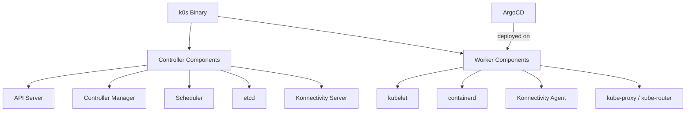

# How to Use ArgoCD with K0s

Author: [nawazdhandala](https://github.com/nawazdhandala)

Tags: ArgoCD, GitOps, Kubernetes, K0s, Mirantis

Description: Learn how to deploy and configure ArgoCD on K0s, the zero-friction Kubernetes distribution from Mirantis, including single-binary setup and production hardening.

---

K0s (pronounced "k-zeros") is a lightweight, CNCF-certified Kubernetes distribution created by Mirantis. Its claim to fame is zero friction - a single binary, zero host OS dependencies (beyond the kernel), and zero configuration needed to get started. Running ArgoCD on K0s gives you a minimal-overhead GitOps platform that works on everything from Raspberry Pi to enterprise data centers.

## What Makes K0s Different

K0s has several characteristics that affect how you run ArgoCD:

- **Single binary**: The entire control plane and worker components are in one binary
- **No host OS dependencies**: Everything is bundled (containerd, kubelet, etcd)
- **Konnectivity**: Uses the Konnectivity service for control plane to worker communication
- **Autopilot**: Built-in update controller for automated Kubernetes upgrades
- **Default CNI**: Kube-Router (with Calico available as an option)



## Installing K0s

### Single Node (Development)

```bash
# Download k0s
curl -sSLf https://get.k0s.sh | sudo sh

# Install and start as a single node (controller + worker)
sudo k0s install controller --single
sudo k0s start

# Wait for the cluster to be ready
sudo k0s status

# Get kubeconfig
sudo k0s kubeconfig admin > ~/.kube/config
chmod 600 ~/.kube/config

# Verify
kubectl get nodes
```

### Multi-Node (Production)

```bash
# On the controller node
sudo k0s install controller
sudo k0s start

# Get the join token for workers
sudo k0s token create --role=worker

# On each worker node
sudo k0s install worker --token-file /path/to/token
sudo k0s start
```

## Installing ArgoCD on K0s

The standard ArgoCD installation works on K0s.

```bash
# Create namespace
kubectl create namespace argocd

# Install ArgoCD
kubectl apply -n argocd -f https://raw.githubusercontent.com/argoproj/argo-cd/stable/manifests/install.yaml

# Wait for pods
kubectl wait --for=condition=Ready pods --all -n argocd --timeout=300s

# Check the installation
kubectl get pods -n argocd
```

## Exposing ArgoCD

K0s does not include a built-in load balancer or ingress controller. Set these up first.

### NodePort Access

The simplest approach for getting started.

```bash
# Patch ArgoCD server to NodePort
kubectl patch svc argocd-server -n argocd -p '{"spec": {"type": "NodePort"}}'

# Get the port
NODE_PORT=$(kubectl get svc argocd-server -n argocd -o jsonpath='{.spec.ports[?(@.name=="https")].nodePort}')
echo "ArgoCD UI: https://<node-ip>:$NODE_PORT"
```

### Installing an Ingress Controller

```bash
# Install Nginx ingress controller
kubectl apply -f https://raw.githubusercontent.com/kubernetes/ingress-nginx/controller-v1.9.4/deploy/static/provider/baremetal/deploy.yaml

# Wait for it
kubectl wait --for=condition=Ready pods -l app.kubernetes.io/component=controller -n ingress-nginx --timeout=120s
```

```yaml
# ArgoCD Ingress
apiVersion: networking.k8s.io/v1
kind: Ingress
metadata:
  name: argocd-server
  namespace: argocd
  annotations:
    nginx.ingress.kubernetes.io/ssl-passthrough: "true"
    nginx.ingress.kubernetes.io/backend-protocol: "HTTPS"
spec:
  ingressClassName: nginx
  rules:
    - host: argocd.example.com
      http:
        paths:
          - path: /
            pathType: Prefix
            backend:
              service:
                name: argocd-server
                port:
                  number: 443
```

### Using MetalLB for LoadBalancer Support

```bash
# Install MetalLB
kubectl apply -f https://raw.githubusercontent.com/metallb/metallb/v0.14.3/config/manifests/metallb-native.yaml
kubectl wait --for=condition=Ready pods -l app=metallb -n metallb-system --timeout=120s
```

```yaml
# Configure MetalLB
apiVersion: metallb.io/v1beta1
kind: IPAddressPool
metadata:
  name: argocd-pool
  namespace: metallb-system
spec:
  addresses:
    - 192.168.1.200-192.168.1.210
---
apiVersion: metallb.io/v1beta1
kind: L2Advertisement
metadata:
  name: default
  namespace: metallb-system
```

```bash
# Now use LoadBalancer type
kubectl patch svc argocd-server -n argocd -p '{"spec": {"type": "LoadBalancer"}}'
```

## Getting the Admin Password

```bash
# Get the initial password
kubectl -n argocd get secret argocd-initial-admin-secret -o jsonpath='{.data.password}' | base64 -d
echo

# Login with CLI
argocd login argocd.example.com --username admin --password <password>
```

## K0s Storage

K0s does not include a storage provisioner by default. You need to install one.

### OpenEBS Local PV

```yaml
# Install OpenEBS through ArgoCD
apiVersion: argoproj.io/v1alpha1
kind: Application
metadata:
  name: openebs
  namespace: argocd
spec:
  project: default
  source:
    repoURL: https://openebs.github.io/charts
    chart: openebs
    targetRevision: 3.10.0
    helm:
      values: |
        localprovisioner:
          enabled: true
        ndm:
          enabled: false
        cstor:
          enabled: false
        jiva:
          enabled: false
  destination:
    server: https://kubernetes.default.svc
    namespace: openebs
  syncPolicy:
    automated:
      selfHeal: true
    syncOptions:
      - CreateNamespace=true
```

### Host Path Provisioner

For simpler setups, use a host path provisioner.

```yaml
# Simple host path StorageClass
apiVersion: storage.k8s.io/v1
kind: StorageClass
metadata:
  name: local-storage
  annotations:
    storageclass.kubernetes.io/is-default-class: "true"
provisioner: kubernetes.io/no-provisioner
volumeBindingMode: WaitForFirstConsumer
```

## K0s Configuration for ArgoCD

K0s is configured through a YAML file. Here are settings that benefit ArgoCD.

```yaml
# /etc/k0s/k0s.yaml
apiVersion: k0s.k0sproject.io/v1beta1
kind: ClusterConfig
metadata:
  name: k0s-argocd
spec:
  api:
    # External address for multi-node setups
    externalAddress: k0s-api.example.com
    sans:
      - k0s-api.example.com
      - 10.0.0.10
  network:
    provider: calico  # Better NetworkPolicy support than kube-router
    calico:
      mode: vxlan
  extensions:
    helm:
      # K0s can install Helm charts at cluster creation
      repositories:
        - name: argo
          url: https://argoproj.github.io/argo-helm
      charts:
        - name: argocd
          chartname: argo/argo-cd
          version: "5.51.6"
          namespace: argocd
          values: |
            server:
              service:
                type: NodePort
```

This bootstraps ArgoCD during cluster creation using K0s's built-in Helm extension.

## K0s Autopilot and ArgoCD

K0s has a built-in Autopilot controller for automated Kubernetes upgrades. When K0s upgrades, nodes are cordoned and drained. ArgoCD needs to handle this.

```yaml
# Pod Disruption Budget for ArgoCD during K0s upgrades
apiVersion: policy/v1
kind: PodDisruptionBudget
metadata:
  name: argocd-server-pdb
  namespace: argocd
spec:
  minAvailable: 1
  selector:
    matchLabels:
      app.kubernetes.io/name: argocd-server
---
apiVersion: policy/v1
kind: PodDisruptionBudget
metadata:
  name: argocd-repo-server-pdb
  namespace: argocd
spec:
  minAvailable: 1
  selector:
    matchLabels:
      app.kubernetes.io/name: argocd-repo-server
```

## Multi-Cluster K0s with ArgoCD

Manage multiple K0s clusters from a single ArgoCD instance.

```bash
# Get kubeconfig from each K0s cluster
# On each controller node:
sudo k0s kubeconfig admin > k0s-cluster-X.yaml

# Add clusters to ArgoCD
argocd cluster add k0s-staging --name staging --kubeconfig k0s-staging.yaml
argocd cluster add k0s-production --name production --kubeconfig k0s-production.yaml
```

```yaml
# ApplicationSet targeting all K0s clusters
apiVersion: argoproj.io/v1alpha1
kind: ApplicationSet
metadata:
  name: monitoring-stack
  namespace: argocd
spec:
  generators:
    - clusters:
        selector:
          matchLabels:
            distribution: k0s
  template:
    metadata:
      name: '{{name}}-monitoring'
    spec:
      project: default
      source:
        repoURL: https://github.com/org/monitoring.git
        targetRevision: main
        path: k0s-overlay
      destination:
        server: '{{server}}'
        namespace: monitoring
      syncPolicy:
        automated:
          selfHeal: true
        syncOptions:
          - CreateNamespace=true
```

## Resource Optimization

K0s is often chosen for its small footprint. Keep ArgoCD lean.

```bash
# Reduce ArgoCD reconciliation frequency
kubectl patch configmap argocd-cm -n argocd --type merge -p '{
  "data": {
    "timeout.reconciliation": "300s"
  }
}'

# Reduce repo server parallelism
kubectl patch configmap argocd-cmd-params-cm -n argocd --type merge -p '{
  "data": {
    "reposerver.parallelism.limit": "2"
  }
}'
```

## K0s-Specific Gotchas

### Konnectivity and Network Connectivity

K0s uses Konnectivity for control-plane-to-node communication. If ArgoCD pods cannot reach the API server, check Konnectivity.

```bash
# Check Konnectivity agent status on worker nodes
sudo k0s status

# Check for connectivity issues
kubectl logs -n kube-system -l k8s-app=konnectivity-agent
```

### Single Binary Means No kubeadm

K0s does not use kubeadm. Tools that assume kubeadm-based clusters may not work. ArgoCD itself does not depend on kubeadm, so this is not an issue for ArgoCD directly, but custom health checks or scripts that rely on kubeadm artifacts will need adjustment.

### Default CNI Limitations

K0s's default CNI (kube-router) has limited NetworkPolicy support compared to Calico. If you need strict network policies around ArgoCD, switch to Calico in the k0s configuration.

## Summary

K0s and ArgoCD make a great pairing for environments where simplicity is paramount. K0s eliminates the complexity of Kubernetes installation and maintenance, while ArgoCD brings GitOps-driven application management. The main setup tasks beyond the standard ArgoCD install are providing a storage provisioner, an ingress controller, and optionally a load balancer. Use K0s's built-in Helm extension to bootstrap ArgoCD during cluster creation, and leverage the Autopilot controller alongside Pod Disruption Budgets for smooth Kubernetes upgrades.
