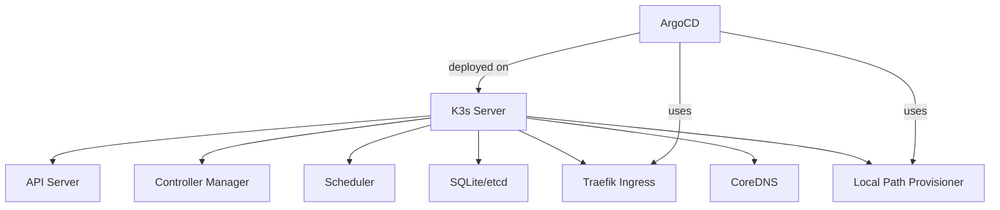

# How to Use ArgoCD with K3s

Author: [nawazdhandala](https://github.com/nawazdhandala)

Tags: ArgoCD, GitOps, Kubernetes, k3s, Lightweight Kubernetes

Description: Learn how to install and configure ArgoCD on K3s, the lightweight Kubernetes distribution, including Traefik integration, embedded storage, and resource optimization.

---

K3s is Rancher's lightweight Kubernetes distribution, designed for edge computing, IoT, CI/CD, and resource-constrained environments. It packages the entire Kubernetes control plane into a single binary under 100MB. Running ArgoCD on K3s is a popular choice for small teams, development environments, and edge deployments. This guide covers the specific considerations and configurations you need.

## K3s-Specific Differences That Affect ArgoCD

K3s differs from standard Kubernetes in several ways that impact ArgoCD:

1. **Traefik is the default ingress controller** (not Nginx)
2. **SQLite is the default datastore** (not etcd, unless you configure it)
3. **Local Path Provisioner** is included for storage
4. **Service Load Balancer** (Klipper) handles LoadBalancer services
5. **Containerd** is the only container runtime (no Docker)



## Installing K3s

If you do not have K3s yet, install it with a single command.

```bash
# Install K3s with default options
curl -sfL https://get.k3s.io | sh -

# Verify K3s is running
sudo k3s kubectl get nodes

# Set up kubeconfig for non-root access
mkdir -p ~/.kube
sudo cp /etc/rancher/k3s/k3s.yaml ~/.kube/config
sudo chown $(id -u):$(id -g) ~/.kube/config
export KUBECONFIG=~/.kube/config
```

## Installing ArgoCD on K3s

The standard ArgoCD installation works on K3s without modification.

```bash
# Create the argocd namespace
kubectl create namespace argocd

# Install ArgoCD
kubectl apply -n argocd -f https://raw.githubusercontent.com/argoproj/argo-cd/stable/manifests/install.yaml

# Wait for pods to be ready
kubectl wait --for=condition=Ready pods --all -n argocd --timeout=300s
```

Check the resource usage since K3s environments are often resource-constrained.

```bash
# Check ArgoCD resource consumption
kubectl top pods -n argocd
```

## Exposing ArgoCD with Traefik

K3s ships with Traefik v2 as the default ingress controller. Configure it for ArgoCD.

```yaml
# IngressRoute for Traefik v2 (K3s default)
apiVersion: traefik.containo.us/v1alpha1
kind: IngressRoute
metadata:
  name: argocd-server
  namespace: argocd
spec:
  entryPoints:
    - websecure
  routes:
    - match: Host(`argocd.example.com`)
      kind: Rule
      services:
        - name: argocd-server
          port: 443
      # Enable TLS passthrough so ArgoCD handles its own TLS
  tls:
    passthrough: true
```

If you prefer the standard Kubernetes Ingress resource, Traefik supports that too.

```yaml
# Standard Ingress resource (Traefik handles it)
apiVersion: networking.k8s.io/v1
kind: Ingress
metadata:
  name: argocd-server-ingress
  namespace: argocd
  annotations:
    # Traefik-specific annotation for SSL passthrough
    traefik.ingress.kubernetes.io/router.tls: "true"
spec:
  ingressClassName: traefik
  rules:
    - host: argocd.example.com
      http:
        paths:
          - path: /
            pathType: Prefix
            backend:
              service:
                name: argocd-server
                port:
                  number: 443
  tls:
    - hosts:
        - argocd.example.com
```

For more on ArgoCD with Traefik, see [ArgoCD Traefik ingress configuration](https://oneuptime.com/blog/post/2026-02-26-argocd-traefik-ingress/view).

## Configuring ArgoCD for TLS Without Passthrough

If you want Traefik to terminate TLS instead of passing through to ArgoCD, disable TLS on the ArgoCD server.

```bash
# Tell ArgoCD server to run in insecure mode (Traefik handles TLS)
kubectl patch deployment argocd-server -n argocd \
  --type json \
  -p '[{"op": "add", "path": "/spec/template/spec/containers/0/command/-", "value": "--insecure"}]'
```

Then configure the IngressRoute without passthrough.

```yaml
apiVersion: traefik.containo.us/v1alpha1
kind: IngressRoute
metadata:
  name: argocd-server
  namespace: argocd
spec:
  entryPoints:
    - websecure
  routes:
    - match: Host(`argocd.example.com`)
      kind: Rule
      services:
        - name: argocd-server
          port: 80
  tls:
    # Traefik handles TLS with a cert from a secret or Let's Encrypt
    certResolver: letsencrypt
```

## Resource Optimization for K3s

K3s environments often have limited RAM and CPU. Tune ArgoCD's resource requests.

```yaml
# Kustomize overlay to reduce ArgoCD resource requests for K3s
# kustomization.yaml
apiVersion: kustomize.config.k8s.io/v1beta1
kind: Kustomization
resources:
  - https://raw.githubusercontent.com/argoproj/argo-cd/stable/manifests/install.yaml
patches:
  - target:
      kind: Deployment
      name: argocd-server
    patch: |
      - op: replace
        path: /spec/template/spec/containers/0/resources
        value:
          requests:
            cpu: 50m
            memory: 128Mi
          limits:
            cpu: 500m
            memory: 256Mi
  - target:
      kind: Deployment
      name: argocd-repo-server
    patch: |
      - op: replace
        path: /spec/template/spec/containers/0/resources
        value:
          requests:
            cpu: 50m
            memory: 128Mi
          limits:
            cpu: 500m
            memory: 512Mi
  - target:
      kind: StatefulSet
      name: argocd-application-controller
    patch: |
      - op: replace
        path: /spec/template/spec/containers/0/resources
        value:
          requests:
            cpu: 100m
            memory: 256Mi
          limits:
            cpu: 1000m
            memory: 512Mi
```

Apply with Kustomize.

```bash
kubectl apply -k .
```

## Using K3s Local Path Provisioner

K3s includes the Local Path Provisioner, which creates PersistentVolumes backed by local directories. ArgoCD's Redis can use this for persistence.

```bash
# Verify the storage class exists
kubectl get storageclass

# Expected output:
# NAME                   PROVISIONER             AGE
# local-path (default)   rancher.io/local-path   5d
```

If you need Redis persistence (useful for caching), no extra storage configuration is needed. K3s handles it.

## K3s with Embedded etcd (Multi-Server)

For production K3s clusters, use embedded etcd instead of SQLite. This supports multi-server setups.

```bash
# Initialize the first server with embedded etcd
curl -sfL https://get.k3s.io | sh -s - server \
  --cluster-init \
  --tls-san argocd.example.com

# Join additional servers
curl -sfL https://get.k3s.io | sh -s - server \
  --server https://first-server:6443 \
  --token <node-token>
```

With multi-server K3s, you can run ArgoCD in HA mode.

```bash
# Install ArgoCD HA manifests
kubectl apply -n argocd -f https://raw.githubusercontent.com/argoproj/argo-cd/stable/manifests/ha/install.yaml
```

## Managing Multiple K3s Clusters

A common pattern is running ArgoCD on one K3s cluster and managing multiple edge K3s clusters.

```bash
# On each edge cluster, get the kubeconfig
# Then add the cluster to ArgoCD
argocd cluster add k3s-edge-01 --name edge-site-01
argocd cluster add k3s-edge-02 --name edge-site-02
```

```yaml
# ApplicationSet to deploy across all edge clusters
apiVersion: argoproj.io/v1alpha1
kind: ApplicationSet
metadata:
  name: edge-apps
  namespace: argocd
spec:
  generators:
    - clusters:
        selector:
          matchLabels:
            environment: edge
  template:
    metadata:
      name: '{{name}}-monitoring'
    spec:
      project: default
      source:
        repoURL: https://github.com/org/edge-apps.git
        targetRevision: main
        path: monitoring
      destination:
        server: '{{server}}'
        namespace: monitoring
      syncPolicy:
        automated:
          selfHeal: true
```

## K3s-Specific Gotchas

### Traefik CRDs and ArgoCD

K3s auto-installs Traefik and its CRDs. If ArgoCD also tries to manage Traefik, you get conflicts. Either disable Traefik in K3s or exclude it from ArgoCD.

```bash
# Option 1: Install K3s without Traefik
curl -sfL https://get.k3s.io | INSTALL_K3S_EXEC="--disable traefik" sh -

# Then manage Traefik entirely through ArgoCD
```

### Service Load Balancer

K3s uses Klipper as a simple service load balancer. If you use `type: LoadBalancer` for ArgoCD server, Klipper assigns a node IP.

```bash
# Check the external IP assigned by Klipper
kubectl get svc argocd-server -n argocd
```

### K3s Agent Nodes and ArgoCD Scheduling

By default, K3s server nodes have a taint that prevents workload scheduling. If your K3s cluster only has server nodes, ArgoCD pods will not schedule unless you remove the taint.

```bash
# Remove the taint from server nodes to allow ArgoCD to schedule
kubectl taint nodes --all node-role.kubernetes.io/master:NoSchedule- 2>/dev/null || true
kubectl taint nodes --all node-role.kubernetes.io/control-plane:NoSchedule- 2>/dev/null || true
```

## Summary

ArgoCD works well on K3s with minimal configuration changes. The main differences from vanilla Kubernetes are the Traefik ingress controller (use IngressRoute CRDs or standard Ingress with Traefik annotations), the included Local Path Provisioner for storage, and potentially tighter resource constraints. For edge deployments, K3s plus ArgoCD is a strong combination - use a central K3s cluster running ArgoCD to manage multiple edge K3s clusters through ApplicationSets.
