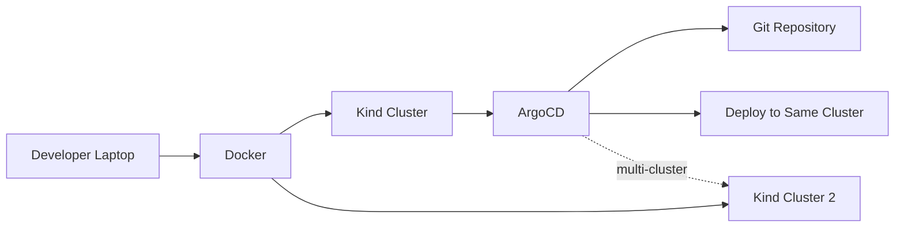

# How to Use ArgoCD with Kind for Local Development

Author: [nawazdhandala](https://github.com/nawazdhandala)

Tags: ArgoCD, GitOps, Kubernetes, Kind, Local Development

Description: Learn how to set up ArgoCD on Kind (Kubernetes in Docker) for local development, testing GitOps workflows, and CI/CD pipeline integration.

---

Kind (Kubernetes in Docker) runs Kubernetes clusters using Docker containers as nodes. It was originally designed for testing Kubernetes itself, but it has become the go-to tool for local development and CI/CD pipelines. Running ArgoCD on Kind gives you a full GitOps development environment on your laptop without cloud costs or complex infrastructure.

## Why Kind for ArgoCD Development

Kind is ideal for ArgoCD development and testing because:

- Clusters spin up in under 60 seconds
- Multiple clusters can run simultaneously (test multi-cluster ArgoCD)
- Full Kubernetes API compatibility (no missing features)
- Works in CI/CD pipelines (GitHub Actions, GitLab CI, Jenkins)
- Easy to destroy and recreate for clean testing



## Setting Up a Kind Cluster for ArgoCD

Create a Kind cluster with extra port mappings for the ArgoCD UI.

```yaml
# kind-config.yaml
kind: Cluster
apiVersion: kind.x-k8s.io/v1alpha4
nodes:
  - role: control-plane
    # Map ports for ArgoCD access
    extraPortMappings:
      - containerPort: 30080
        hostPort: 8080
        protocol: TCP
      - containerPort: 30443
        hostPort: 8443
        protocol: TCP
  - role: worker
  - role: worker
```

```bash
# Create the cluster
kind create cluster --name argocd-dev --config kind-config.yaml

# Verify the cluster is running
kubectl cluster-info --context kind-argocd-dev
kubectl get nodes
```

## Installing ArgoCD on Kind

```bash
# Create namespace and install ArgoCD
kubectl create namespace argocd
kubectl apply -n argocd -f https://raw.githubusercontent.com/argoproj/argo-cd/stable/manifests/install.yaml

# Wait for all pods to be ready
kubectl wait --for=condition=Ready pods --all -n argocd --timeout=300s
```

## Accessing the ArgoCD UI

Kind does not have a LoadBalancer provider, so use NodePort to expose ArgoCD.

```bash
# Patch the argocd-server service to NodePort on port 30443
kubectl patch svc argocd-server -n argocd --type merge -p '{
  "spec": {
    "type": "NodePort",
    "ports": [
      {
        "name": "https",
        "port": 443,
        "targetPort": 8080,
        "nodePort": 30443
      }
    ]
  }
}'
```

Now access the ArgoCD UI at `https://localhost:8443` (the hostPort we mapped in the Kind config).

Alternatively, use port-forwarding for a simpler approach.

```bash
# Port forward is simpler and always works
kubectl port-forward svc/argocd-server -n argocd 8080:443 &

# Get the admin password
kubectl -n argocd get secret argocd-initial-admin-secret -o jsonpath='{.data.password}' | base64 -d
echo
```

## Loading Local Images into Kind

Kind clusters cannot pull from your local Docker daemon by default. Load images explicitly.

```bash
# Build your application image
docker build -t my-app:dev .

# Load it into the Kind cluster
kind load docker-image my-app:dev --name argocd-dev

# Verify the image is available in the cluster
docker exec argocd-dev-control-plane crictl images | grep my-app
```

This is crucial when developing applications that ArgoCD will deploy. Your manifests can reference `my-app:dev` and Kind will find the image.

```yaml
# Application manifest referencing the local image
apiVersion: apps/v1
kind: Deployment
metadata:
  name: my-app
spec:
  replicas: 1
  selector:
    matchLabels:
      app: my-app
  template:
    metadata:
      labels:
        app: my-app
    spec:
      containers:
        - name: app
          image: my-app:dev
          # Never pull from registry - use the locally loaded image
          imagePullPolicy: Never
```

## Testing GitOps Workflows Locally

### Using a Local Git Repository

You can point ArgoCD at a local Git repository for rapid iteration. Host a Git server inside the cluster.

```yaml
# Simple Git server for local development
apiVersion: apps/v1
kind: Deployment
metadata:
  name: git-server
  namespace: argocd
spec:
  replicas: 1
  selector:
    matchLabels:
      app: git-server
  template:
    metadata:
      labels:
        app: git-server
    spec:
      containers:
        - name: git
          image: gitea/gitea:latest
          ports:
            - containerPort: 3000
            - containerPort: 22
          volumeMounts:
            - name: data
              mountPath: /data
      volumes:
        - name: data
          emptyDir: {}
---
apiVersion: v1
kind: Service
metadata:
  name: git-server
  namespace: argocd
spec:
  selector:
    app: git-server
  ports:
    - name: http
      port: 3000
    - name: ssh
      port: 22
```

### Using a Public Repository for Quick Testing

For simple testing, use a public GitHub repository.

```yaml
# Quick test application
apiVersion: argoproj.io/v1alpha1
kind: Application
metadata:
  name: guestbook
  namespace: argocd
spec:
  project: default
  source:
    repoURL: https://github.com/argoproj/argocd-example-apps.git
    targetRevision: HEAD
    path: guestbook
  destination:
    server: https://kubernetes.default.svc
    namespace: guestbook
  syncPolicy:
    automated:
      selfHeal: true
    syncOptions:
      - CreateNamespace=true
```

## Multi-Cluster Testing with Kind

One of Kind's strengths is running multiple clusters simultaneously. Test ArgoCD multi-cluster management locally.

```bash
# Create the management cluster (runs ArgoCD)
kind create cluster --name management

# Create target clusters
kind create cluster --name staging
kind create cluster --name production

# Install ArgoCD on the management cluster
kubectl config use-context kind-management
kubectl create namespace argocd
kubectl apply -n argocd -f https://raw.githubusercontent.com/argoproj/argo-cd/stable/manifests/install.yaml

# Wait for ArgoCD to be ready
kubectl wait --for=condition=Ready pods --all -n argocd --timeout=300s
```

Add the target clusters to ArgoCD.

```bash
# Login to ArgoCD
kubectl port-forward svc/argocd-server -n argocd 8080:443 &
argocd login localhost:8080 --insecure --username admin --password $(kubectl -n argocd get secret argocd-initial-admin-secret -o jsonpath='{.data.password}' | base64 -d)

# Add the staging and production clusters
argocd cluster add kind-staging --name staging
argocd cluster add kind-production --name production

# Verify clusters are registered
argocd cluster list
```

Now deploy applications to different clusters.

```yaml
# Deploy to staging cluster
apiVersion: argoproj.io/v1alpha1
kind: Application
metadata:
  name: app-staging
  namespace: argocd
spec:
  project: default
  source:
    repoURL: https://github.com/org/app.git
    targetRevision: develop
    path: manifests
  destination:
    name: staging
    namespace: default
  syncPolicy:
    automated:
      selfHeal: true
```

## CI/CD Pipeline Integration

Kind is excellent for running ArgoCD tests in CI pipelines. Here is a GitHub Actions example.

```yaml
# .github/workflows/test-argocd.yaml
name: Test ArgoCD Deployment
on: [pull_request]

jobs:
  test:
    runs-on: ubuntu-latest
    steps:
      - uses: actions/checkout@v4

      - name: Create Kind cluster
        uses: helm/kind-action@v1
        with:
          cluster_name: test-cluster

      - name: Install ArgoCD
        run: |
          kubectl create namespace argocd
          kubectl apply -n argocd -f https://raw.githubusercontent.com/argoproj/argo-cd/stable/manifests/install.yaml
          kubectl wait --for=condition=Ready pods --all -n argocd --timeout=300s

      - name: Deploy test application
        run: |
          kubectl apply -f test/argocd-app.yaml
          # Wait for sync to complete
          sleep 30
          kubectl get applications -n argocd

      - name: Verify deployment
        run: |
          kubectl get pods -n test-app
          kubectl wait --for=condition=Ready pods --all -n test-app --timeout=120s
```

## Performance Tips for Kind

### Pre-Pull ArgoCD Images

Speed up cluster creation by pre-pulling ArgoCD images.

```bash
# Pull images before creating the cluster
docker pull quay.io/argoproj/argocd:v2.10.0
docker pull redis:7.0.14-alpine
docker pull ghcr.io/dexidp/dex:v2.37.0

# Load them into the Kind cluster
kind load docker-image quay.io/argoproj/argocd:v2.10.0 --name argocd-dev
kind load docker-image redis:7.0.14-alpine --name argocd-dev
kind load docker-image ghcr.io/dexidp/dex:v2.37.0 --name argocd-dev
```

### Use Kind's Built-In Registry

For faster image loading, use a local Docker registry connected to Kind.

```bash
# Create a local registry
docker run -d --restart=always -p 5001:5000 --name local-registry registry:2

# Connect it to the Kind network
docker network connect kind local-registry

# Create a Kind cluster that uses the registry
cat <<EOF | kind create cluster --name argocd-dev --config=-
kind: Cluster
apiVersion: kind.x-k8s.io/v1alpha4
containerdConfigPatches:
  - |-
    [plugins."io.containerd.grpc.v1.cri".registry.mirrors."localhost:5001"]
      endpoint = ["http://local-registry:5000"]
EOF
```

## Cleanup

```bash
# Delete a specific cluster
kind delete cluster --name argocd-dev

# Delete all Kind clusters
kind delete clusters --all
```

## Summary

Kind is the best choice for local ArgoCD development and CI/CD testing. Clusters are disposable, fast to create, and support the full Kubernetes API. Use port-forwarding or NodePort to access the ArgoCD UI, load local images with `kind load`, and leverage multiple clusters to test multi-cluster GitOps workflows. In CI pipelines, Kind provides a reliable way to validate ArgoCD configurations before they reach production.
