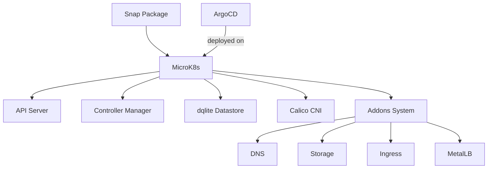

# How to Use ArgoCD with MicroK8s

Author: [nawazdhandala](https://github.com/nawazdhandala)

Tags: ArgoCD, GitOps, Kubernetes, MicroK8s, Canonical

Description: Learn how to install and configure ArgoCD on MicroK8s, Canonical's lightweight Kubernetes distribution, including addon integration and snap-based management.

---

MicroK8s is Canonical's lightweight, snap-based Kubernetes distribution. It is popular for development workstations, CI/CD pipelines, and small production deployments. Running ArgoCD on MicroK8s requires understanding its addon system, snap-based architecture, and some networking quirks. This guide walks through the complete setup.

## MicroK8s Architecture Overview

MicroK8s differs from other Kubernetes distributions in several ways:

- Installed and managed via Snap (Linux package manager)
- Uses its own kubectl: `microk8s kubectl` (or alias it)
- Has a built-in addon system for common components
- Runs dqlite (distributed SQLite) as its datastore instead of etcd by default
- Uses Calico as the default CNI



## Prerequisites

Install MicroK8s and enable required addons.

```bash
# Install MicroK8s
sudo snap install microk8s --classic --channel=1.28/stable

# Add your user to the microk8s group
sudo usermod -a -G microk8s $USER
sudo chown -R $USER ~/.kube
newgrp microk8s

# Wait for MicroK8s to be ready
microk8s status --wait-ready

# Enable required addons
microk8s enable dns          # CoreDNS for service discovery
microk8s enable storage      # Local storage provisioner
microk8s enable ingress      # Nginx ingress controller
microk8s enable rbac         # RBAC for security
```

Set up kubectl access. You can either use `microk8s kubectl` or export the kubeconfig.

```bash
# Option 1: Alias microk8s kubectl
alias kubectl='microk8s kubectl'

# Option 2: Export kubeconfig for standard kubectl
microk8s config > ~/.kube/config
```

## Installing ArgoCD on MicroK8s

The standard ArgoCD installation works on MicroK8s.

```bash
# Create the argocd namespace
microk8s kubectl create namespace argocd

# Install ArgoCD
microk8s kubectl apply -n argocd -f https://raw.githubusercontent.com/argoproj/argo-cd/stable/manifests/install.yaml

# Wait for all pods to be ready
microk8s kubectl wait --for=condition=Ready pods --all -n argocd --timeout=300s

# Verify the installation
microk8s kubectl get pods -n argocd
```

## Exposing ArgoCD with MicroK8s Ingress

MicroK8s uses the Nginx ingress controller when you enable the ingress addon.

```yaml
# ArgoCD Ingress for MicroK8s
apiVersion: networking.k8s.io/v1
kind: Ingress
metadata:
  name: argocd-server-ingress
  namespace: argocd
  annotations:
    nginx.ingress.kubernetes.io/force-ssl-redirect: "true"
    nginx.ingress.kubernetes.io/ssl-passthrough: "true"
    nginx.ingress.kubernetes.io/backend-protocol: "HTTPS"
spec:
  ingressClassName: nginx
  rules:
    - host: argocd.local
      http:
        paths:
          - path: /
            pathType: Prefix
            backend:
              service:
                name: argocd-server
                port:
                  number: 443
  tls:
    - hosts:
        - argocd.local
      secretName: argocd-server-tls
```

For local development, add the host to your `/etc/hosts` file.

```bash
# Add the ArgoCD hostname to /etc/hosts
echo "127.0.0.1 argocd.local" | sudo tee -a /etc/hosts
```

Alternatively, use port forwarding for quick access.

```bash
microk8s kubectl port-forward svc/argocd-server -n argocd 8080:443
# Access at https://localhost:8080
```

## Using MetalLB with ArgoCD

For a more production-like setup, enable MetalLB to provide LoadBalancer IPs.

```bash
# Enable MetalLB with an IP range
microk8s enable metallb:192.168.1.200-192.168.1.210
```

Then change the ArgoCD server to use LoadBalancer type.

```bash
microk8s kubectl patch svc argocd-server -n argocd -p '{"spec": {"type": "LoadBalancer"}}'

# Get the assigned external IP
microk8s kubectl get svc argocd-server -n argocd
```

## Retrieving the Admin Password

```bash
# Get the initial admin password
microk8s kubectl -n argocd get secret argocd-initial-admin-secret \
  -o jsonpath='{.data.password}' | base64 -d
echo

# Install the ArgoCD CLI
curl -sSL -o argocd https://github.com/argoproj/argo-cd/releases/latest/download/argocd-linux-amd64
chmod +x argocd
sudo mv argocd /usr/local/bin/

# Login
argocd login argocd.local --username admin --password <password> --insecure
```

## MicroK8s Storage with ArgoCD

MicroK8s storage addon provides a hostpath-based StorageClass.

```bash
# Verify the storage class is available
microk8s kubectl get storageclass

# Expected output:
# NAME                          PROVISIONER            AGE
# microk8s-hostpath (default)   microk8s.io/hostpath   1h
```

This storage class works for ArgoCD's needs, but it is not suitable for production. For production MicroK8s clusters, consider using OpenEBS or Rook-Ceph.

```bash
# Enable the community OpenEBS addon for production storage
microk8s enable community
microk8s enable openebs
```

## Deploying Applications with ArgoCD on MicroK8s

Create a sample application to verify everything works.

```yaml
# sample-app.yaml
apiVersion: argoproj.io/v1alpha1
kind: Application
metadata:
  name: sample-app
  namespace: argocd
spec:
  project: default
  source:
    repoURL: https://github.com/argoproj/argocd-example-apps.git
    targetRevision: HEAD
    path: guestbook
  destination:
    server: https://kubernetes.default.svc
    namespace: sample
  syncPolicy:
    automated:
      selfHeal: true
      prune: true
    syncOptions:
      - CreateNamespace=true
```

```bash
microk8s kubectl apply -f sample-app.yaml
argocd app get sample-app
```

## MicroK8s Multi-Node Clustering

MicroK8s supports clustering for HA setups. Here is how to set it up with ArgoCD.

```bash
# On the primary node, generate a join token
microk8s add-node

# On each additional node, join the cluster
microk8s join <primary-ip>:25000/<token>

# Verify the cluster
microk8s kubectl get nodes
```

With multiple nodes, you can run ArgoCD in HA mode.

```bash
# Install ArgoCD HA manifests
microk8s kubectl apply -n argocd -f https://raw.githubusercontent.com/argoproj/argo-cd/stable/manifests/ha/install.yaml
```

## MicroK8s-Specific Gotchas

### DNS Resolution Issues

MicroK8s sometimes has DNS resolution issues that affect ArgoCD's ability to reach Git repositories. If you see errors about resolving hostnames, check the DNS addon.

```bash
# Check if DNS is working
microk8s kubectl run dns-test --image=busybox --restart=Never --rm -it -- nslookup github.com

# If DNS fails, restart the addon
microk8s disable dns
microk8s enable dns
```

### Snap Confinement and File Access

MicroK8s runs inside a snap, which limits file access. If you use local Git repositories or custom CA certificates, you need to place them in accessible paths.

```bash
# Custom CA certificates should go here
sudo cp my-ca.crt /var/snap/microk8s/current/certs/

# Refresh MicroK8s to pick up new certificates
sudo snap restart microk8s
```

For ArgoCD to trust custom CAs, add them to the ArgoCD TLS configuration.

```yaml
# argocd-tls-certs-cm ConfigMap
apiVersion: v1
kind: ConfigMap
metadata:
  name: argocd-tls-certs-cm
  namespace: argocd
data:
  git.internal.example.com: |
    -----BEGIN CERTIFICATE-----
    # Your custom CA certificate here
    -----END CERTIFICATE-----
```

### Container Image Registry

MicroK8s has a built-in registry addon. If you use it for application images, ArgoCD-deployed workloads can pull from it.

```bash
# Enable the built-in registry
microk8s enable registry

# The registry is available at localhost:32000
# Use it in your Kubernetes manifests
```

```yaml
# Deployment using the MicroK8s built-in registry
apiVersion: apps/v1
kind: Deployment
metadata:
  name: my-app
spec:
  replicas: 2
  selector:
    matchLabels:
      app: my-app
  template:
    metadata:
      labels:
        app: my-app
    spec:
      containers:
        - name: app
          # MicroK8s built-in registry
          image: localhost:32000/my-app:v1
```

### Resource Limits

MicroK8s on a development machine may have limited resources. Monitor ArgoCD's resource usage.

```bash
# Enable the metrics server for resource monitoring
microk8s enable metrics-server

# Check ArgoCD resource consumption
microk8s kubectl top pods -n argocd

# If resources are tight, reduce ArgoCD polling frequency
microk8s kubectl patch configmap argocd-cm -n argocd --type merge -p '{
  "data": {
    "timeout.reconciliation": "300s"
  }
}'
```

## Upgrading MicroK8s and ArgoCD

MicroK8s upgrades through snap channels.

```bash
# Check current version
microk8s version

# Switch to a newer channel
sudo snap refresh microk8s --channel=1.29/stable

# After Kubernetes upgrade, verify ArgoCD is healthy
microk8s kubectl get pods -n argocd
microk8s kubectl rollout status deployment/argocd-server -n argocd
```

For ArgoCD upgrades, apply the new manifests.

```bash
microk8s kubectl apply -n argocd -f https://raw.githubusercontent.com/argoproj/argo-cd/v2.10.0/manifests/install.yaml
```

## Summary

MicroK8s provides a convenient, snap-based Kubernetes experience that works well with ArgoCD. The addon system handles common infrastructure like DNS, storage, ingress, and MetalLB, reducing the setup work. The main things to watch for are DNS resolution reliability, snap confinement limitations with file access, and resource constraints on development machines. For production, enable multi-node clustering and use the HA ArgoCD manifests.
