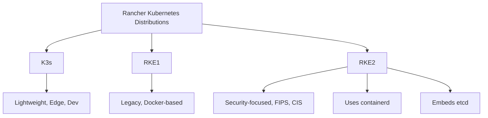
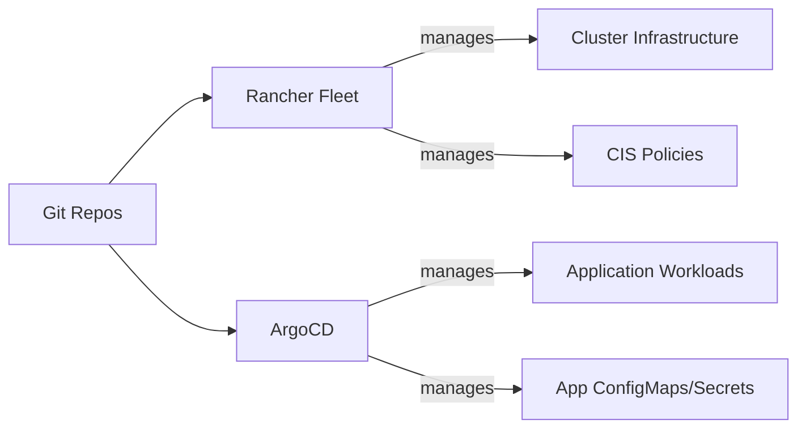

# How to Use ArgoCD with Rancher RKE2

Author: [nawazdhandala](https://github.com/nawazdhandala)

Tags: ArgoCD, GitOps, Kubernetes, Rancher, RKE2

Description: Learn how to deploy and configure ArgoCD on Rancher RKE2 clusters, including Rancher Fleet coexistence, STIG compliance, and multi-cluster management.

---

RKE2 (also called RKE Government) is Rancher's next-generation Kubernetes distribution focused on security and compliance. It is FIPS 140-2 compliant, CIS hardened by default, and designed for government and regulated industry workloads. Running ArgoCD on RKE2 requires understanding its security posture, how it integrates with the Rancher management platform, and how to coexist with Rancher Fleet.

## RKE2 vs RKE1 vs K3s

RKE2 combines the security focus of RKE1 with the simplicity of K3s. Here is how they compare for ArgoCD usage:



Key RKE2 characteristics:

- Containerd as the container runtime (no Docker dependency)
- Embedded etcd (not dqlite like K3s)
- CIS Benchmark hardened by default
- FIPS 140-2 validated cryptographic modules
- No Traefik or ServiceLB by default (unlike K3s)

## Installing ArgoCD on RKE2

### Step 1: Verify Your RKE2 Cluster

```bash
# Check RKE2 is running
sudo systemctl status rke2-server

# Set up kubeconfig
export KUBECONFIG=/etc/rancher/rke2/rke2.yaml
# Or copy it for non-root access
mkdir -p ~/.kube
sudo cp /etc/rancher/rke2/rke2.yaml ~/.kube/config
sudo chown $(id -u):$(id -g) ~/.kube/config

# Verify cluster access
kubectl get nodes
```

### Step 2: Install ArgoCD

```bash
# Create the namespace
kubectl create namespace argocd

# Install ArgoCD
kubectl apply -n argocd -f https://raw.githubusercontent.com/argoproj/argo-cd/stable/manifests/install.yaml

# Wait for all pods to be ready
kubectl wait --for=condition=Ready pods --all -n argocd --timeout=300s
```

### Step 3: Handle CIS Hardening

RKE2's CIS hardening may restrict certain pod security settings. If ArgoCD pods fail to start, check for Pod Security Admission violations.

```bash
# Check if pods are failing due to PSA
kubectl get pods -n argocd
kubectl describe pod <failing-pod> -n argocd | grep -A5 "Warning"

# If PSA is blocking, label the namespace appropriately
kubectl label namespace argocd pod-security.kubernetes.io/enforce=privileged
kubectl label namespace argocd pod-security.kubernetes.io/audit=privileged
kubectl label namespace argocd pod-security.kubernetes.io/warn=privileged
```

For a more secure approach, use the `baseline` profile and adjust ArgoCD's security contexts.

```yaml
# Label namespace with baseline profile
# Then adjust ArgoCD deployment security contexts
apiVersion: apps/v1
kind: Deployment
metadata:
  name: argocd-server
  namespace: argocd
spec:
  template:
    spec:
      securityContext:
        runAsNonRoot: true
        runAsUser: 999
        fsGroup: 999
      containers:
        - name: argocd-server
          securityContext:
            allowPrivilegeEscalation: false
            readOnlyRootFilesystem: true
            capabilities:
              drop:
                - ALL
```

## Exposing ArgoCD on RKE2

RKE2 does not include an ingress controller by default. You need to install one.

### Option 1: Install Nginx Ingress Controller

```bash
# Install Nginx ingress controller
kubectl apply -f https://raw.githubusercontent.com/kubernetes/ingress-nginx/controller-v1.9.4/deploy/static/provider/cloud/deploy.yaml

# Wait for it to be ready
kubectl wait --for=condition=Ready pods -l app.kubernetes.io/component=controller -n ingress-nginx --timeout=120s
```

Then create an Ingress for ArgoCD.

```yaml
apiVersion: networking.k8s.io/v1
kind: Ingress
metadata:
  name: argocd-server
  namespace: argocd
  annotations:
    nginx.ingress.kubernetes.io/ssl-passthrough: "true"
    nginx.ingress.kubernetes.io/backend-protocol: "HTTPS"
spec:
  ingressClassName: nginx
  rules:
    - host: argocd.example.com
      http:
        paths:
          - path: /
            pathType: Prefix
            backend:
              service:
                name: argocd-server
                port:
                  number: 443
```

### Option 2: NodePort for Simpler Access

```bash
kubectl patch svc argocd-server -n argocd -p '{"spec": {"type": "NodePort"}}'
kubectl get svc argocd-server -n argocd -o jsonpath='{.spec.ports[0].nodePort}'
```

## Coexisting with Rancher Fleet

When RKE2 clusters are managed by Rancher, Fleet (Rancher's built-in GitOps engine) is automatically installed. You need to decide whether to use Fleet, ArgoCD, or both.

### Strategy 1: ArgoCD for Applications, Fleet for Infrastructure



### Strategy 2: Disable Fleet, Use ArgoCD for Everything

```bash
# Disable Fleet on the downstream cluster
# In the Rancher UI: Cluster Management > Fleet > Disable

# Or via kubectl on the management cluster
kubectl patch clusters.fleet.cattle.io <cluster-name> \
  -n fleet-default \
  --type merge \
  -p '{"spec":{"agentDeploymentCustomization":{"appendTolerations":null}}}'
```

### Strategy 3: Use Both with Clear Namespace Boundaries

```yaml
# ArgoCD project that excludes Fleet-managed namespaces
apiVersion: argoproj.io/v1alpha1
kind: AppProject
metadata:
  name: applications
  namespace: argocd
spec:
  description: Application workloads managed by ArgoCD
  destinations:
    # Only deploy to application namespaces
    - namespace: 'app-*'
      server: https://kubernetes.default.svc
  # Explicitly exclude Fleet namespaces
  clusterResourceBlacklist:
    - group: fleet.cattle.io
      kind: '*'
  sourceRepos:
    - '*'
```

## FIPS Compliance Considerations

RKE2 in FIPS mode uses FIPS-validated cryptographic modules. ArgoCD needs to be compatible.

```bash
# Check if RKE2 is running in FIPS mode
cat /etc/rancher/rke2/config.yaml | grep fips
# profile: cis-1.6
```

ArgoCD's Go runtime uses FIPS-compliant crypto when built with BoringCrypto. The standard ArgoCD images may not be FIPS-compliant. For strict FIPS environments, build custom ArgoCD images.

```dockerfile
# Dockerfile for FIPS-compliant ArgoCD (simplified example)
FROM golang:1.21-fips as builder
# ... build ArgoCD with FIPS crypto ...

FROM registry.access.redhat.com/ubi9/ubi-minimal:9.3
COPY --from=builder /go/bin/argocd /usr/local/bin/argocd
```

## Network Policies for RKE2

RKE2 uses Canal (Calico + Flannel) as the default CNI, which supports NetworkPolicies. Lock down ArgoCD networking.

```yaml
# Allow ArgoCD components to communicate
apiVersion: networking.k8s.io/v1
kind: NetworkPolicy
metadata:
  name: argocd-internal
  namespace: argocd
spec:
  podSelector: {}
  policyTypes:
    - Ingress
    - Egress
  ingress:
    # Allow traffic within the argocd namespace
    - from:
        - podSelector: {}
    # Allow ingress from the ingress controller
    - from:
        - namespaceSelector:
            matchLabels:
              app.kubernetes.io/name: ingress-nginx
  egress:
    # Allow DNS
    - to:
        - namespaceSelector: {}
          podSelector:
            matchLabels:
              k8s-app: kube-dns
      ports:
        - port: 53
          protocol: UDP
        - port: 53
          protocol: TCP
    # Allow HTTPS to Git repos and container registries
    - to:
        - ipBlock:
            cidr: 0.0.0.0/0
      ports:
        - port: 443
          protocol: TCP
        - port: 22
          protocol: TCP
    # Allow access to Kubernetes API
    - to:
        - ipBlock:
            cidr: 0.0.0.0/0
      ports:
        - port: 6443
          protocol: TCP
```

## Managing Multiple RKE2 Clusters with ArgoCD

Rancher often manages multiple RKE2 clusters. Use ArgoCD on the management cluster to deploy across all of them.

```bash
# Get kubeconfig for each downstream cluster from Rancher
# Then add them to ArgoCD
argocd cluster add rke2-production --name production
argocd cluster add rke2-staging --name staging
```

```yaml
# ApplicationSet for deploying across RKE2 clusters
apiVersion: argoproj.io/v1alpha1
kind: ApplicationSet
metadata:
  name: platform-apps
  namespace: argocd
spec:
  generators:
    - clusters:
        selector:
          matchLabels:
            vendor: rke2
  template:
    metadata:
      name: '{{name}}-monitoring'
    spec:
      project: default
      source:
        repoURL: https://github.com/org/platform.git
        targetRevision: main
        path: monitoring
      destination:
        server: '{{server}}'
        namespace: monitoring
      syncPolicy:
        automated:
          selfHeal: true
        syncOptions:
          - CreateNamespace=true
```

## Audit Logging

RKE2 has built-in audit logging. Configure ArgoCD's audit logging to complement it.

```yaml
# ArgoCD ConfigMap for audit logging
apiVersion: v1
kind: ConfigMap
metadata:
  name: argocd-cm
  namespace: argocd
data:
  # Enable detailed audit logging
  server.audit.enabled: "true"
  server.audit.logformat: json
```

## Summary

ArgoCD on RKE2 requires attention to the security-hardened environment - Pod Security Admission labels, network policies, and potentially FIPS-compliant container images. When Rancher manages the RKE2 clusters, decide early how ArgoCD coexists with Fleet. The cleanest approach is to use Fleet for cluster infrastructure and ArgoCD for application workloads, with clear namespace boundaries. Install an ingress controller since RKE2 does not include one, and leverage RKE2's built-in CIS hardening rather than fighting against it.
