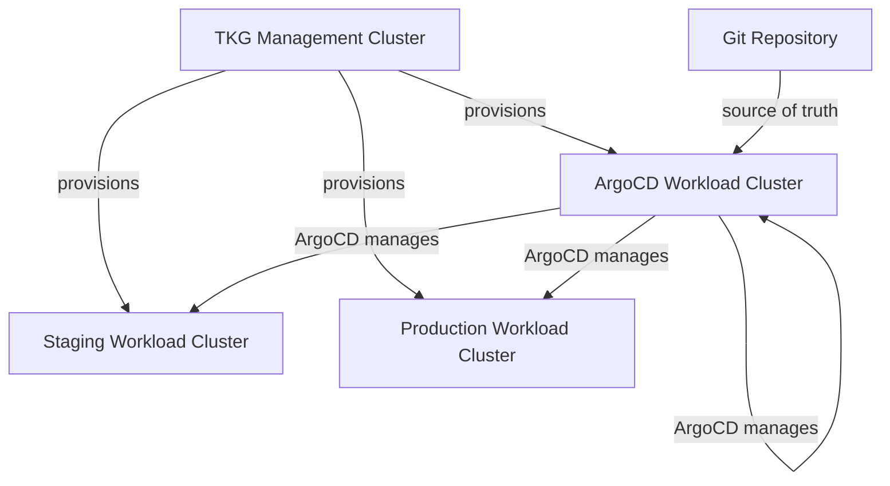

# How to Use ArgoCD with Tanzu Kubernetes Grid

Author: [nawazdhandala](https://github.com/nawazdhandala)

Tags: ArgoCD, GitOps, Kubernetes, Tanzu, VMware

Description: Learn how to deploy ArgoCD on VMware Tanzu Kubernetes Grid clusters, including TKG-specific networking, storage classes, and integration with vSphere.

---

VMware Tanzu Kubernetes Grid (TKG) provides enterprise Kubernetes on vSphere, AWS, and Azure. TKG uses Cluster API under the hood to provision and manage workload clusters. Running ArgoCD on TKG requires understanding TKG's networking model, storage classes, and how it manages cluster lifecycle. This guide covers the TKG-specific considerations.

## TKG Architecture and ArgoCD Placement

TKG has two types of clusters:

- **Management Cluster**: Runs Cluster API controllers, manages workload cluster lifecycle
- **Workload Clusters**: Where your applications run

You can install ArgoCD on either, but the common pattern is to run ArgoCD on a dedicated workload cluster that manages deployments across all other workload clusters.



## Prerequisites

Ensure you have TKG set up and can access workload clusters.

```bash
# Verify TKG CLI and cluster access
tanzu cluster list

# Get kubeconfig for the target workload cluster
tanzu cluster kubeconfig get argocd-cluster --admin --export-file argocd-kubeconfig
export KUBECONFIG=argocd-kubeconfig

# Verify access
kubectl get nodes
```

## Installing ArgoCD on TKG

The standard ArgoCD installation works on TKG workload clusters.

```bash
# Create the namespace
kubectl create namespace argocd

# Install ArgoCD
kubectl apply -n argocd -f https://raw.githubusercontent.com/argoproj/argo-cd/stable/manifests/install.yaml

# Wait for pods
kubectl wait --for=condition=Ready pods --all -n argocd --timeout=300s

# Verify
kubectl get pods -n argocd
```

## TKG Networking and Load Balancers

### vSphere with NSX-T

If your TKG runs on vSphere with NSX-T, you get native LoadBalancer support.

```bash
# Change ArgoCD server to LoadBalancer
kubectl patch svc argocd-server -n argocd -p '{"spec": {"type": "LoadBalancer"}}'

# NSX-T will assign an external IP automatically
kubectl get svc argocd-server -n argocd
```

### vSphere without NSX-T

Without NSX-T, use MetalLB or HAProxy load balancer (which TKG can install).

```bash
# Check if the HAProxy load balancer is configured
kubectl get svc argocd-server -n argocd

# If no external IP is assigned, use NodePort or install MetalLB
kubectl patch svc argocd-server -n argocd -p '{"spec": {"type": "NodePort"}}'
```

### TKG on AWS or Azure

Cloud-based TKG clusters get cloud load balancers natively.

```bash
# On TKG/AWS or TKG/Azure, LoadBalancer works out of the box
kubectl patch svc argocd-server -n argocd -p '{"spec": {"type": "LoadBalancer"}}'
```

## TKG Ingress with Contour

TKG ships with Contour as its recommended ingress controller. You can install it via TKG packages.

```bash
# Install Contour via TKG package
tanzu package install contour \
  --package contour.tanzu.vmware.com \
  --version 1.24.4+vmware.1-tkg.1 \
  --namespace tkg-system \
  --values-file contour-values.yaml
```

Create an HTTPProxy for ArgoCD (Contour's custom resource).

```yaml
# ArgoCD HTTPProxy for Contour
apiVersion: projectcontour.io/v1
kind: HTTPProxy
metadata:
  name: argocd-server
  namespace: argocd
spec:
  virtualhost:
    fqdn: argocd.example.com
    tls:
      passthrough: true
  tcpproxy:
    services:
      - name: argocd-server
        port: 443
```

Or use a standard Ingress resource that Contour will handle.

```yaml
apiVersion: networking.k8s.io/v1
kind: Ingress
metadata:
  name: argocd-server
  namespace: argocd
  annotations:
    projectcontour.io/tls-passthrough: "true"
spec:
  rules:
    - host: argocd.example.com
      http:
        paths:
          - path: /
            pathType: Prefix
            backend:
              service:
                name: argocd-server
                port:
                  number: 443
```

## TKG Storage Classes

TKG provisions storage classes based on the underlying infrastructure. Use them for ArgoCD's Redis persistence.

```bash
# List available storage classes
kubectl get storageclass

# On vSphere, you will see something like:
# NAME                 PROVISIONER                    AGE
# default              csi.vsphere.vmware.com         2d
# tkg-storage-policy   csi.vsphere.vmware.com         2d
```

ArgoCD works fine with ephemeral Redis (the default). For production, configure persistent Redis.

```yaml
# Kustomize patch for Redis persistence on TKG
apiVersion: apps/v1
kind: Deployment
metadata:
  name: argocd-redis
  namespace: argocd
spec:
  template:
    spec:
      containers:
        - name: redis
          volumeMounts:
            - name: redis-data
              mountPath: /data
      volumes:
        - name: redis-data
          persistentVolumeClaim:
            claimName: argocd-redis-pvc
---
apiVersion: v1
kind: PersistentVolumeClaim
metadata:
  name: argocd-redis-pvc
  namespace: argocd
spec:
  accessModes:
    - ReadWriteOnce
  storageClassName: default
  resources:
    requests:
      storage: 5Gi
```

## Managing TKG Workload Clusters with ArgoCD

After installing ArgoCD, add your other TKG workload clusters.

```bash
# Get kubeconfig for each workload cluster
tanzu cluster kubeconfig get staging-cluster --admin --export-file staging-kubeconfig
tanzu cluster kubeconfig get production-cluster --admin --export-file production-kubeconfig

# Add clusters to ArgoCD
KUBECONFIG=staging-kubeconfig argocd cluster add staging-cluster-admin@staging-cluster --name staging
KUBECONFIG=production-kubeconfig argocd cluster add production-cluster-admin@production-cluster --name production

# List registered clusters
argocd cluster list
```

## TKG Packages and ArgoCD

TKG uses the Carvel toolchain (kapp, ytt, imgpkg) for package management. You can manage TKG packages through ArgoCD.

```yaml
# Deploy a TKG package via ArgoCD
apiVersion: argoproj.io/v1alpha1
kind: Application
metadata:
  name: cert-manager-package
  namespace: argocd
spec:
  project: default
  source:
    repoURL: https://github.com/org/tkg-packages.git
    targetRevision: main
    path: cert-manager
  destination:
    server: https://kubernetes.default.svc
    namespace: tkg-system
  ignoreDifferences:
    # TKG package controllers modify these resources
    - group: packaging.carvel.dev
      kind: PackageInstall
      jsonPointers:
        - /status
  syncPolicy:
    automated:
      selfHeal: true
```

### Custom Health Checks for TKG Resources

```yaml
# argocd-cm - health checks for TKG/Carvel resources
apiVersion: v1
kind: ConfigMap
metadata:
  name: argocd-cm
  namespace: argocd
data:
  resource.customizations.health.packaging.carvel.dev_PackageInstall: |
    hs = {}
    if obj.status ~= nil and obj.status.conditions ~= nil then
      for i, condition in ipairs(obj.status.conditions) do
        if condition.type == "ReconcileSucceeded" then
          if condition.status == "True" then
            hs.status = "Healthy"
            hs.message = "Package installed successfully"
          else
            hs.status = "Degraded"
            hs.message = condition.message or "Package reconciliation failed"
          end
          return hs
        end
      end
    end
    hs.status = "Progressing"
    hs.message = "Waiting for package reconciliation"
    return hs
```

## Pod Security on TKG

TKG workload clusters enforce pod security policies or Pod Security Admission depending on the version. Configure the ArgoCD namespace appropriately.

```bash
# For TKG 2.x with Pod Security Admission
kubectl label namespace argocd \
  pod-security.kubernetes.io/enforce=baseline \
  pod-security.kubernetes.io/warn=restricted \
  pod-security.kubernetes.io/audit=restricted
```

If ArgoCD pods fail to start due to security restrictions, check the events.

```bash
kubectl get events -n argocd --sort-by='.lastTimestamp'
```

## Integrating with vSphere SSO

For TKG on vSphere, integrate ArgoCD with vSphere SSO through OIDC.

```yaml
# argocd-cm ConfigMap for vSphere SSO
apiVersion: v1
kind: ConfigMap
metadata:
  name: argocd-cm
  namespace: argocd
data:
  url: https://argocd.example.com
  dex.config: |
    connectors:
      - type: oidc
        id: vsphere
        name: vSphere SSO
        config:
          issuer: https://vcenter.example.com/openidconnect/vsphere.local
          clientID: argocd
          clientSecret: $dex.vsphere.clientSecret
          insecureEnableGroups: true
          scopes:
            - openid
            - email
            - groups
```

## TKG Cluster Lifecycle and ArgoCD

When TKG upgrades or scales workload clusters, ArgoCD applications may temporarily lose connectivity. Handle this gracefully.

```yaml
# Application with retry configured for cluster maintenance
apiVersion: argoproj.io/v1alpha1
kind: Application
metadata:
  name: my-app
  namespace: argocd
spec:
  project: default
  source:
    repoURL: https://github.com/org/app.git
    targetRevision: main
    path: manifests
  destination:
    name: production
    namespace: default
  syncPolicy:
    automated:
      selfHeal: true
    retry:
      limit: 5
      backoff:
        duration: 30s
        factor: 2
        maxDuration: 5m
```

## Summary

ArgoCD on TKG integrates well once you understand the networking model (Contour for ingress, NSX-T or cloud LBs for services), storage provisioning (vSphere CSI), and the TKG package system. Install ArgoCD on a dedicated workload cluster and use it to manage all your other TKG clusters. Add custom health checks for TKG-specific resources like PackageInstall, configure Dex for vSphere SSO integration, and set up retry policies to handle TKG cluster lifecycle events gracefully.
