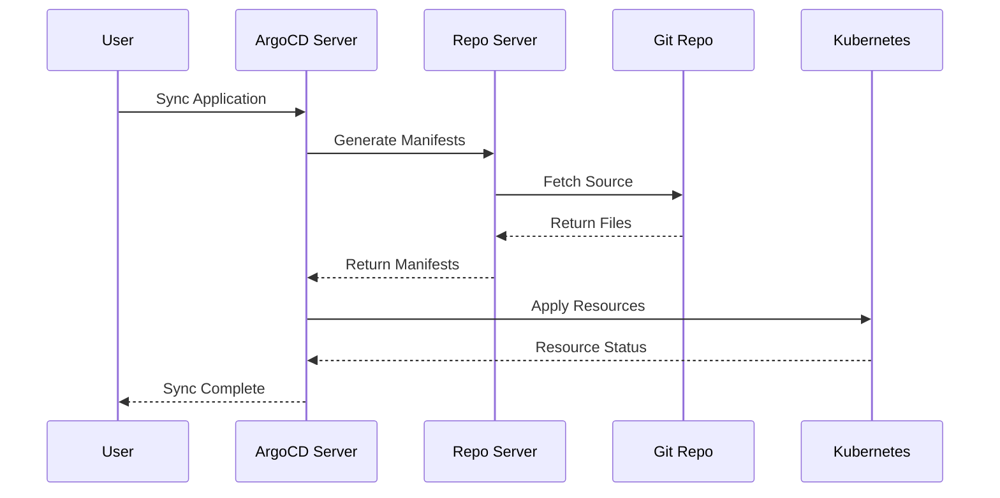

# How to Write ArgoCD Documentation

Author: [nawazdhandala](https://github.com/nawazdhandala)

Tags: ArgoCD, GitOps, Kubernetes, Documentation, Open Source

Description: Learn how to contribute documentation to the ArgoCD project, including setting up the docs site locally, writing guides, and following documentation standards.

---

Documentation contributions are among the most valuable and often most needed contributions to any open source project. ArgoCD is no exception. As the project grows in features and complexity, clear and accurate documentation becomes essential for the thousands of teams that depend on it. Whether you are fixing a typo, updating outdated instructions, or writing entirely new guides, this article covers everything you need to know about contributing to ArgoCD documentation.

## ArgoCD Documentation Architecture

ArgoCD uses MkDocs with the Material theme for its documentation site, hosted at `argo-cd.readthedocs.io`. The documentation source lives in the `docs/` directory of the main ArgoCD repository.

```text
argo-cd/
  docs/
    operator-manual/      # Installation, configuration, administration
    user-guide/           # Day-to-day usage documentation
    developer-guide/      # Contributing and development
    faq.md                # Frequently asked questions
    getting_started.md    # Quick start guide
    assets/               # Images and static files
  mkdocs.yml             # MkDocs configuration
```

The documentation follows a clear organizational pattern. The **operator manual** covers everything a platform team needs to install, configure, and maintain ArgoCD. The **user guide** covers application deployment and management. The **developer guide** targets contributors.

## Setting Up the Documentation Locally

To preview your documentation changes, you need to run the MkDocs development server locally.

```bash
# Clone the repository
git clone https://github.com/argoproj/argo-cd.git
cd argo-cd

# Install Python dependencies (recommended: use a virtual environment)
python3 -m venv venv
source venv/bin/activate

# Install MkDocs and required plugins
pip install -r docs/requirements.txt

# Start the development server
mkdocs serve

# The documentation is now available at http://localhost:8000
# Changes are auto-reloaded when you save files
```

If you do not want to install Python dependencies globally, you can use Docker.

```bash
# Run MkDocs in a container
docker run --rm -it -p 8000:8000 -v ${PWD}:/docs squidfunk/mkdocs-material serve -a 0.0.0.0:8000
```

## Finding Documentation Gaps

There are several ways to identify documentation that needs improvement.

**Check GitHub issues.** Search for issues tagged with the `documentation` label. These are often requests from users who could not find information they needed.

```bash
gh issue list --repo argoproj/argo-cd --label documentation --state open
```

**Review the FAQ.** Questions that appear frequently in the FAQ, Slack, or Stack Overflow indicate areas where the main documentation could be improved.

**Follow the user journey.** Try to accomplish common tasks using only the documentation. Where do you get stuck? Those are the gaps that need filling.

**Check for version drift.** When new features are added, the documentation sometimes lags behind the code. Compare recent changelog entries with the documentation.

## Writing Style Guide

ArgoCD documentation follows several conventions that keep the content consistent and accessible.

### Language and Tone

Write in clear, direct English. Use the second person ("you") when addressing the reader. Avoid jargon when possible, and define technical terms when they first appear.

```markdown
<!-- Good -->
To configure SSO for ArgoCD, you need to set up a Dex connector
in the `argocd-cm` ConfigMap.

<!-- Avoid -->
SSO configuration necessitates the establishment of a Dex connector
within the argocd-cm ConfigMap resource.
```

### Code Examples

All code examples should be complete, tested, and copy-paste ready. Include the language identifier for syntax highlighting.

```markdown
<!-- Good: complete, working example -->
```yaml
apiVersion: argoproj.io/v1alpha1
kind: Application
metadata:
  name: my-app
  namespace: argocd
spec:
  project: default
  source:
    repoURL: https://github.com/example/app.git
    targetRevision: HEAD
    path: manifests
  destination:
    server: https://kubernetes.default.svc
    namespace: default
```

<!-- Avoid: incomplete snippets without context -->
```yaml
source:
  repoURL: https://github.com/example/app.git
```
```text

### Admonitions

MkDocs Material supports admonition blocks for notes, warnings, and tips. Use them to highlight important information.

```markdown
!!! note
    This feature requires ArgoCD v2.8 or later.

!!! warning
    Changing this setting will cause all applications to re-sync.

!!! tip
    You can use `argocd app diff` to preview changes before syncing.

!!! danger
    Never store plain-text secrets in your Git repository.
```

### Document Structure

Each page should follow a consistent structure.

```markdown
# Page Title

Brief introduction explaining what this page covers and who it is for.

## Prerequisites

List what the reader needs before starting.

## Step 1: First Action

Instructions with code examples.

## Step 2: Second Action

More instructions.

## Verification

How to verify the configuration works.

## Troubleshooting

Common issues and their solutions.
```

## Adding New Documentation Pages

When you add a new page, you also need to register it in `mkdocs.yml` so it appears in the navigation.

```yaml
# mkdocs.yml
nav:
  - Overview: index.md
  - Getting Started: getting_started.md
  - Operator Manual:
    - Overview: operator-manual/index.md
    - Installation: operator-manual/installation.md
    - Your New Page: operator-manual/your-new-page.md  # Add your page here
  - User Guide:
    - Overview: user-guide/index.md
```

## Documenting Configuration Options

ArgoCD has many configuration options spread across ConfigMaps and command-line flags. When documenting these, use a consistent format.

```markdown
## Configuration Reference

### `application.instanceLabelKey`

**ConfigMap:** `argocd-cm`
**Default:** `app.kubernetes.io/instance`
**Description:** The label key used to track which ArgoCD Application
manages a resource.

```yaml
apiVersion: v1
kind: ConfigMap
metadata:
  name: argocd-cm
  namespace: argocd
data:
  application.instanceLabelKey: my-company.com/argocd-instance
```

!!! warning
    Changing this value on an existing installation will cause ArgoCD
    to lose track of previously managed resources.
```text

## Adding Diagrams

ArgoCD documentation uses Mermaid for diagrams. MkDocs Material has built-in Mermaid support.

```markdown

```text

## Submitting Documentation PRs

Documentation PRs follow the same process as code PRs but are typically reviewed faster.

```bash
# Create a branch for your documentation change
git checkout -b docs/improve-sso-guide

# Make your changes in the docs/ directory
# Preview locally with mkdocs serve

# Commit with a docs prefix
git commit -s -m "docs: improve SSO configuration guide with OIDC examples"

# Push and create a PR
git push origin docs/improve-sso-guide
```

In your PR description, explain what documentation gap you are addressing and link to any related issues.

```markdown
## Description
Improve the SSO configuration documentation with:
- Complete OIDC setup instructions for Okta, Azure AD, and Google
- Troubleshooting section for common SSO errors
- Screenshots of the SSO login flow

Fixes #12345

## Checklist
- [x] Tested locally with `mkdocs serve`
- [x] All code examples are tested and working
- [x] Screenshots are added for UI elements
- [x] Navigation updated in mkdocs.yml
```

## Common Documentation Contributions

Here are areas that consistently need documentation help:

- **Upgrading guides** between major versions
- **Troubleshooting sections** for common error messages
- **Integration guides** for popular tools and platforms
- **Performance tuning** documentation for large-scale deployments
- **Security hardening** guides
- **Examples** for complex configurations like multi-source Applications, ApplicationSets with generators, and custom health checks

Documentation is the bridge between a powerful tool and its users. Every improvement you make helps someone deploy their applications more confidently. For more ways to contribute to ArgoCD, see our guide on [contributing to the ArgoCD open source project](https://oneuptime.com/blog/post/2026-02-26-argocd-contribute-open-source/view).
