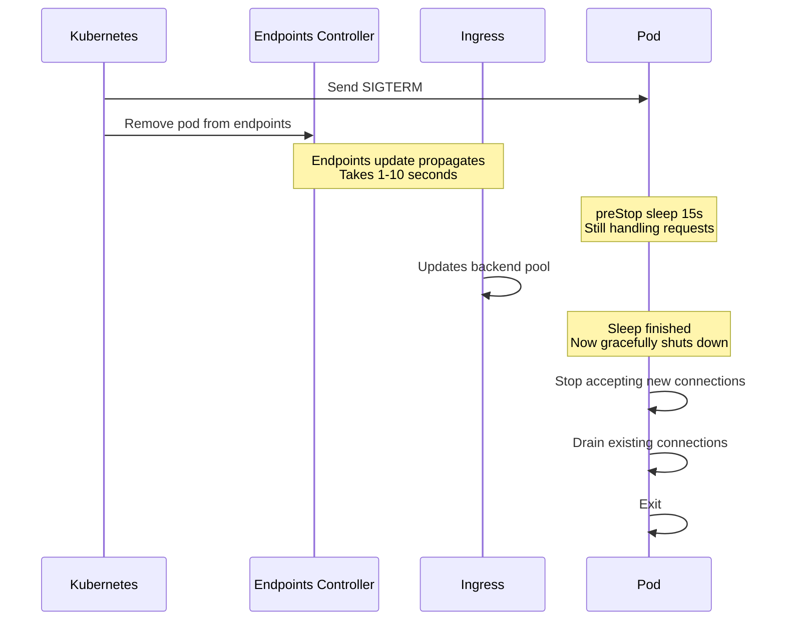

# How to Handle Zero-Downtime Deployments with ArgoCD

Author: [nawazdhandala](https://github.com/nawazdhandala)

Tags: ArgoCD, GitOps, Kubernetes, Zero Downtime, Deployment

Description: A practical guide to achieving zero-downtime deployments with ArgoCD covering rolling updates, readiness probes, PDB configuration, and traffic management strategies.

---

Zero-downtime deployments sound simple in theory but are surprisingly hard to get right in practice. Even with Kubernetes handling rolling updates, there are edge cases where connections get dropped, requests hit terminating pods, or new pods start receiving traffic before they are truly ready. ArgoCD adds another layer of complexity since it manages the sync lifecycle. This guide covers how to achieve true zero-downtime deployments with ArgoCD.

## Why Deployments Cause Downtime

Before diving into solutions, let us understand why downtime happens during deployments:

1. **Pod termination before connection draining** - Kubernetes removes pods from service endpoints and sends SIGTERM simultaneously. In-flight requests get terminated.
2. **Readiness probe gaps** - New pods pass readiness checks before they have warmed up caches or established connections.
3. **Insufficient replicas during rollout** - With `maxUnavailable: 1`, you temporarily lose capacity.
4. **Database migrations** - Schema changes break old code before new code is ready.
5. **Ingress controller lag** - Load balancers take time to update their backend pools.

## Rolling Update Configuration

Start with a properly configured rolling update strategy:

```yaml
# deployment.yaml
apiVersion: apps/v1
kind: Deployment
metadata:
  name: api-server
spec:
  replicas: 4
  strategy:
    type: RollingUpdate
    rollingUpdate:
      maxSurge: 1        # Add 1 extra pod during rollout
      maxUnavailable: 0  # Never remove a pod until the new one is ready
  template:
    spec:
      terminationGracePeriodSeconds: 60
      containers:
        - name: api
          image: myregistry/api:v2.0.0
          ports:
            - containerPort: 8080
          readinessProbe:
            httpGet:
              path: /healthz/ready
              port: 8080
            initialDelaySeconds: 10
            periodSeconds: 5
            failureThreshold: 3
            successThreshold: 2  # Must pass twice before receiving traffic
          livenessProbe:
            httpGet:
              path: /healthz/live
              port: 8080
            initialDelaySeconds: 30
            periodSeconds: 10
            failureThreshold: 5
          lifecycle:
            preStop:
              exec:
                command: ["/bin/sh", "-c", "sleep 15"]
          resources:
            requests:
              cpu: "500m"
              memory: "512Mi"
```

Key settings explained:

- `maxUnavailable: 0` ensures you never lose capacity during the rollout
- `maxSurge: 1` adds one extra pod before removing an old one
- `successThreshold: 2` on the readiness probe requires two consecutive passes, reducing false positives
- `preStop` hook with `sleep 15` gives time for the service endpoints to update before the pod starts shutting down

## The preStop Hook Is Critical

The `preStop` sleep is the most important detail for zero-downtime deployments. Here is why:



Without the preStop sleep, the pod starts shutting down immediately after SIGTERM, but the ingress controller might still be sending traffic to it.

## Pod Disruption Budgets

Protect your deployment from unexpected disruptions:

```yaml
# pdb.yaml
apiVersion: policy/v1
kind: PodDisruptionBudget
metadata:
  name: api-server-pdb
spec:
  minAvailable: 3  # Always keep at least 3 pods running
  selector:
    matchLabels:
      app: api-server
```

This prevents node drains and cluster autoscaler from removing too many pods simultaneously.

## ArgoCD Sync Strategy

Configure ArgoCD to handle deployments gracefully:

```yaml
apiVersion: argoproj.io/v1alpha1
kind: Application
metadata:
  name: api-server
  namespace: argocd
spec:
  project: production
  source:
    repoURL: https://github.com/myorg/api-server.git
    targetRevision: main
    path: k8s/production
  destination:
    server: https://kubernetes.default.svc
    namespace: api
  syncPolicy:
    automated:
      prune: true
      selfHeal: true
    syncOptions:
      - CreateNamespace=true
      - ApplyOutOfSyncOnly=true
    retry:
      limit: 5
      backoff:
        duration: 30s
        factor: 2
        maxDuration: 5m
```

The `ApplyOutOfSyncOnly=true` option is important for zero-downtime. It tells ArgoCD to only apply resources that have actually changed, avoiding unnecessary restarts of healthy pods.

## Health Checks in ArgoCD

ArgoCD has its own health assessment for Deployments. Make sure ArgoCD waits for rollouts to complete before declaring the sync healthy:

```yaml
# argocd-cm ConfigMap
apiVersion: v1
kind: ConfigMap
metadata:
  name: argocd-cm
  namespace: argocd
data:
  resource.customizations.health.apps_Deployment: |
    hs = {}
    if obj.status ~= nil then
      if obj.status.conditions ~= nil then
        for i, condition in ipairs(obj.status.conditions) do
          if condition.type == "Available" and condition.status == "False" then
            hs.status = "Degraded"
            hs.message = condition.message
            return hs
          end
          if condition.type == "Progressing" and condition.status == "True" and condition.reason == "ReplicaSetUpdated" then
            hs.status = "Progressing"
            hs.message = "Waiting for rollout to finish"
            return hs
          end
        end
      end
      if obj.status.replicas ~= nil and obj.status.updatedReplicas ~= nil and obj.status.availableReplicas ~= nil then
        if obj.status.updatedReplicas == obj.status.replicas and obj.status.availableReplicas == obj.status.replicas then
          hs.status = "Healthy"
          hs.message = "All replicas updated and available"
          return hs
        end
      end
    end
    hs.status = "Progressing"
    hs.message = "Waiting for rollout"
    return hs
```

## Using Argo Rollouts for Advanced Zero-Downtime

For more control, use Argo Rollouts instead of plain Deployments:

```yaml
apiVersion: argoproj.io/v1alpha1
kind: Rollout
metadata:
  name: api-server
spec:
  replicas: 4
  strategy:
    canary:
      canaryService: api-server-canary
      stableService: api-server-stable
      steps:
        - setWeight: 10
        - pause: { duration: 2m }
        - setWeight: 30
        - pause: { duration: 5m }
        - setWeight: 60
        - pause: { duration: 5m }
        - setWeight: 100
      trafficRouting:
        nginx:
          stableIngress: api-server-ingress
  template:
    # Same as Deployment template
    spec:
      terminationGracePeriodSeconds: 60
      containers:
        - name: api
          image: myregistry/api:v2.0.0
          lifecycle:
            preStop:
              exec:
                command: ["/bin/sh", "-c", "sleep 15"]
```

This gradually shifts traffic from the old version to the new version, giving you time to detect issues at each step.

## Database Migration Strategy

Database migrations are the most common cause of deployment-related downtime. Use the expand-and-contract pattern:

```yaml
# Pre-sync hook for backward-compatible schema changes
apiVersion: batch/v1
kind: Job
metadata:
  name: db-migrate-expand
  annotations:
    argocd.argoproj.io/hook: PreSync
    argocd.argoproj.io/hook-delete-policy: HookSucceeded
spec:
  template:
    spec:
      restartPolicy: Never
      containers:
        - name: migrate
          image: myregistry/api:v2.0.0
          command: ["./migrate", "--phase", "expand"]
          # Phase 1: Add new columns, create new tables
          # Both old and new code can work with this schema
```

```yaml
# Post-sync hook for cleanup after old code is gone
apiVersion: batch/v1
kind: Job
metadata:
  name: db-migrate-contract
  annotations:
    argocd.argoproj.io/hook: PostSync
    argocd.argoproj.io/hook-delete-policy: HookSucceeded
spec:
  template:
    spec:
      restartPolicy: Never
      containers:
        - name: migrate
          image: myregistry/api:v2.0.0
          command: ["./migrate", "--phase", "contract"]
          # Phase 2: Drop old columns, rename tables
          # Only safe after all old pods are gone
```

## Graceful Shutdown in Your Application

Your application code needs to handle SIGTERM properly:

```python
# Python example with graceful shutdown
import signal
import sys
from threading import Event

shutdown_event = Event()

def handle_sigterm(signum, frame):
    print("Received SIGTERM, starting graceful shutdown")
    # Stop accepting new requests
    server.stop_accepting()
    # Wait for in-flight requests to complete (max 45 seconds)
    shutdown_event.set()

signal.signal(signal.SIGTERM, handle_sigterm)

# In your request handler
def health_ready():
    if shutdown_event.is_set():
        return 503  # Fail readiness check during shutdown
    return 200
```

## Connection Draining Checklist

Here is a complete checklist for zero-downtime deployments:

1. `maxUnavailable: 0` in your rolling update strategy
2. `preStop` hook with at least 15 seconds of sleep
3. `terminationGracePeriodSeconds` set higher than preStop sleep plus your longest request duration
4. Readiness probe with `successThreshold: 2`
5. Pod Disruption Budget with appropriate `minAvailable`
6. Graceful shutdown handler in your application
7. Health endpoint that returns 503 during shutdown
8. `ApplyOutOfSyncOnly: true` in ArgoCD sync options

## Best Practices

1. **Always use preStop hooks** - This is the single most important thing for zero-downtime. 15 seconds is a good default.

2. **Set terminationGracePeriodSeconds appropriately** - This should be `preStop sleep + max request duration + buffer`. The default 30 seconds is often too short.

3. **Use maxUnavailable: 0** - Never remove a pod before a replacement is ready.

4. **Test with traffic** - Run load tests during deployments to verify zero-downtime in staging before trusting it in production.

5. **Monitor during rollouts** - Set up alerts for error rate spikes during deployments using tools like [OneUptime](https://oneuptime.com) to catch issues early.

Zero-downtime deployments with ArgoCD are achievable when you get the details right. The combination of proper Kubernetes configuration, application-level graceful shutdown, and ArgoCD sync strategies gives you deployments that your users will never notice.
