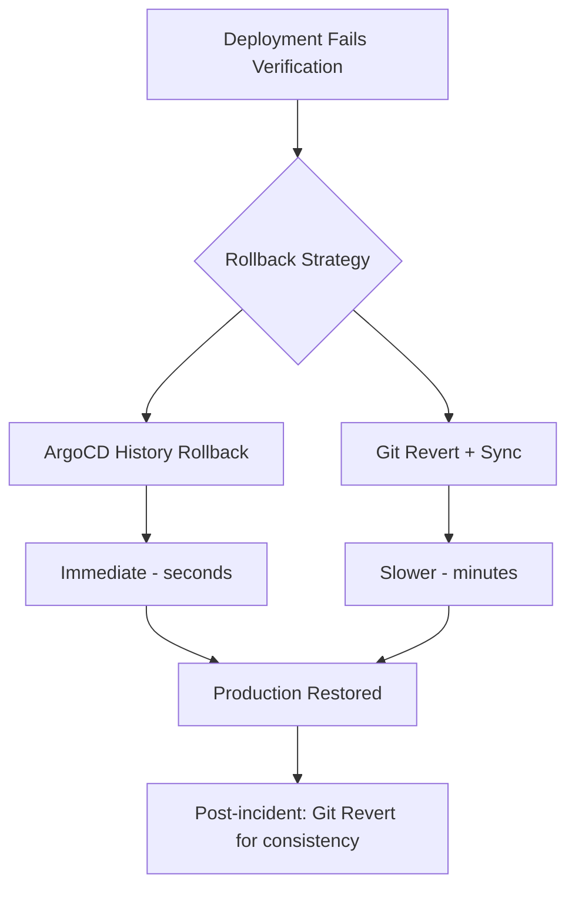

# How to Implement Automated Rollback on Verification Failure in ArgoCD

Author: [nawazdhandala](https://github.com/nawazdhandala)

Tags: ArgoCD, GitOps, Kubernetes, Rollback, Deployment Safety

Description: Learn how to set up automated rollback in ArgoCD that triggers when post-deployment verification fails, keeping your production safe.

---

The whole point of deployment verification is to catch problems early. But verification only helps if you act on failures quickly. Manual rollback processes introduce delays - someone has to notice the failure, assess the situation, and decide to roll back. Automated rollback removes that delay and gets your production back to a known-good state within minutes.

## The Rollback Philosophy in GitOps

In a GitOps workflow, the "proper" rollback is a Git revert - you undo the commit that introduced the bad change, and ArgoCD syncs the previous version. But during an incident, waiting for a Git revert, PR approval, and ArgoCD sync is too slow.

ArgoCD provides two faster rollback mechanisms:

1. **Application history rollback** - Roll back to a previous sync revision
2. **Sync to a specific Git revision** - Force sync to a known-good commit



## Automated Rollback with PostSync Hooks

The simplest approach uses a PostSync hook that triggers rollback when verification fails:

```yaml
# verify-and-rollback.yaml
apiVersion: batch/v1
kind: Job
metadata:
  name: verify-and-rollback
  annotations:
    argocd.argoproj.io/hook: PostSync
    argocd.argoproj.io/hook-delete-policy: BeforeHookCreation
spec:
  backoffLimit: 0
  activeDeadlineSeconds: 600
  template:
    spec:
      serviceAccountName: argocd-rollback
      containers:
        - name: verify
          image: myorg/deployment-verifier:latest
          command:
            - /bin/sh
            - -c
            - |
              APP_NAME="backend-api-production"
              SERVICE_URL="http://backend-api.production.svc.cluster.local:8080"

              # Wait for metrics to stabilize
              echo "Waiting for deployment to stabilize..."
              sleep 60

              # Run verification checks
              VERIFICATION_PASSED=true

              # Check 1: Health endpoint
              echo "Checking health..."
              HTTP_CODE=$(curl -s -o /dev/null -w "%{http_code}" "$SERVICE_URL/healthz" --max-time 10)
              if [ "$HTTP_CODE" != "200" ]; then
                echo "FAILED: Health check returned $HTTP_CODE"
                VERIFICATION_PASSED=false
              fi

              # Check 2: Error rate
              echo "Checking error rate..."
              ERROR_RATE=$(curl -s "http://prometheus:9090/api/v1/query" \
                --data-urlencode "query=sum(rate(http_requests_total{service=\"backend-api\",code=~\"5..\"}[2m])) / sum(rate(http_requests_total{service=\"backend-api\"}[2m]))" \
                | jq -r '.data.result[0].value[1] // "0"')

              if [ "$(echo "$ERROR_RATE > 0.01" | bc -l 2>/dev/null || echo "0")" = "1" ]; then
                echo "FAILED: Error rate $ERROR_RATE exceeds 1%"
                VERIFICATION_PASSED=false
              fi

              # Check 3: Latency
              echo "Checking latency..."
              P95=$(curl -s "http://prometheus:9090/api/v1/query" \
                --data-urlencode "query=histogram_quantile(0.95, sum(rate(http_request_duration_seconds_bucket{service=\"backend-api\"}[2m])) by (le))" \
                | jq -r '.data.result[0].value[1] // "0"')

              if [ "$(echo "$P95 > 0.5" | bc -l 2>/dev/null || echo "0")" = "1" ]; then
                echo "FAILED: P95 latency ${P95}s exceeds 500ms"
                VERIFICATION_PASSED=false
              fi

              if [ "$VERIFICATION_PASSED" = "false" ]; then
                echo ""
                echo "=== VERIFICATION FAILED - TRIGGERING ROLLBACK ==="
                echo ""

                # Get the previous successful revision
                HISTORY=$(curl -s -k "https://argocd-server.argocd.svc.cluster.local/api/v1/applications/$APP_NAME" \
                  -H "Authorization: Bearer $ARGOCD_TOKEN" | jq -r '.status.history')

                HISTORY_LENGTH=$(echo "$HISTORY" | jq 'length')

                if [ "$HISTORY_LENGTH" -gt 1 ]; then
                  # Get the second-to-last revision (previous successful deployment)
                  PREV_REVISION=$(echo "$HISTORY" | jq -r ".[-2].revision")
                  echo "Rolling back to revision: $PREV_REVISION"

                  # Trigger rollback via ArgoCD API
                  curl -s -k -X POST \
                    "https://argocd-server.argocd.svc.cluster.local/api/v1/applications/$APP_NAME/sync" \
                    -H "Authorization: Bearer $ARGOCD_TOKEN" \
                    -H "Content-Type: application/json" \
                    -d "{\"revision\": \"$PREV_REVISION\"}"

                  echo "Rollback initiated to $PREV_REVISION"
                else
                  echo "ERROR: No previous revision to roll back to"
                fi

                # Exit with failure to mark the sync as failed
                exit 1
              fi

              echo "=== All verification checks PASSED ==="
          env:
            - name: ARGOCD_TOKEN
              valueFrom:
                secretKeyRef:
                  name: argocd-api-token
                  key: token
      restartPolicy: Never
```

## RBAC for Automated Rollback

The rollback Job needs permission to interact with the ArgoCD API. Create a dedicated service account:

```yaml
# Service account for rollback operations
apiVersion: v1
kind: ServiceAccount
metadata:
  name: argocd-rollback
  namespace: production

---
# ArgoCD RBAC policy allowing rollback
apiVersion: v1
kind: ConfigMap
metadata:
  name: argocd-rbac-cm
  namespace: argocd
data:
  policy.csv: |
    # Allow the rollback service account to sync and rollback specific apps
    p, role:rollback, applications, sync, */backend-api-production, allow
    p, role:rollback, applications, get, */backend-api-production, allow
    p, role:rollback, applications, action/rollback, */backend-api-production, allow

    # Bind the role to the service account
    g, system:serviceaccount:production:argocd-rollback, role:rollback
```

Generate an API token for the service account:

```bash
# Create an ArgoCD API token for the rollback service
argocd account generate-token --account rollback-bot

# Store it as a Kubernetes secret
kubectl create secret generic argocd-api-token \
  --from-literal=token="<generated-token>" \
  -n production
```

## Using ArgoCD CLI for Rollback

An alternative approach uses the ArgoCD CLI directly in the verification Job:

```yaml
apiVersion: batch/v1
kind: Job
metadata:
  name: verify-with-cli-rollback
  annotations:
    argocd.argoproj.io/hook: PostSync
    argocd.argoproj.io/hook-delete-policy: BeforeHookCreation
spec:
  template:
    spec:
      containers:
        - name: verify
          image: argoproj/argocd:v2.10.0
          command:
            - /bin/sh
            - -c
            - |
              # Login to ArgoCD
              argocd login argocd-server.argocd.svc.cluster.local \
                --username admin \
                --password "$ARGOCD_ADMIN_PASSWORD" \
                --insecure

              # Wait for deployment to stabilize
              sleep 60

              # Run health verification
              APP="backend-api-production"
              HEALTH=$(argocd app get "$APP" -o json | jq -r '.status.health.status')

              if [ "$HEALTH" != "Healthy" ]; then
                echo "Application health is $HEALTH - triggering rollback"

                # Get application history
                HISTORY_ID=$(argocd app history "$APP" | tail -2 | head -1 | awk '{print $1}')

                if [ -n "$HISTORY_ID" ]; then
                  argocd app rollback "$APP" "$HISTORY_ID"
                  echo "Rolled back to history ID $HISTORY_ID"
                fi

                exit 1
              fi

              # Run custom checks
              HTTP_CODE=$(curl -s -o /dev/null -w "%{http_code}" \
                http://backend-api.production:8080/healthz)

              if [ "$HTTP_CODE" != "200" ]; then
                echo "Service health check failed ($HTTP_CODE) - rolling back"
                HISTORY_ID=$(argocd app history "$APP" | tail -2 | head -1 | awk '{print $1}')
                argocd app rollback "$APP" "$HISTORY_ID"
                exit 1
              fi

              echo "Verification passed"
          env:
            - name: ARGOCD_ADMIN_PASSWORD
              valueFrom:
                secretKeyRef:
                  name: argocd-admin-creds
                  key: password
      restartPolicy: Never
```

## External Rollback Controller

For organization-wide rollback automation, build an external controller that watches ArgoCD Application health:

```yaml
# Deployment for the rollback controller
apiVersion: apps/v1
kind: Deployment
metadata:
  name: auto-rollback-controller
  namespace: argocd
spec:
  replicas: 1
  selector:
    matchLabels:
      app: auto-rollback-controller
  template:
    metadata:
      labels:
        app: auto-rollback-controller
    spec:
      serviceAccountName: auto-rollback-controller
      containers:
        - name: controller
          image: myorg/auto-rollback-controller:latest
          env:
            - name: ARGOCD_SERVER
              value: "argocd-server.argocd.svc.cluster.local"
            - name: CHECK_INTERVAL
              value: "30"
            - name: DEGRADED_THRESHOLD_MINUTES
              value: "5"
```

The controller logic in Python:

```python
# auto_rollback_controller.py
import time
import os
import requests
from datetime import datetime, timedelta

ARGOCD_SERVER = os.environ.get("ARGOCD_SERVER")
CHECK_INTERVAL = int(os.environ.get("CHECK_INTERVAL", "30"))
DEGRADED_THRESHOLD = int(os.environ.get("DEGRADED_THRESHOLD_MINUTES", "5"))
ARGOCD_TOKEN = os.environ.get("ARGOCD_TOKEN")

# Track when apps first became degraded
degraded_since = {}


def get_applications():
    """Fetch all ArgoCD applications."""
    response = requests.get(
        f"https://{ARGOCD_SERVER}/api/v1/applications",
        headers={"Authorization": f"Bearer {ARGOCD_TOKEN}"},
        verify=False
    )
    return response.json().get("items", [])


def should_auto_rollback(app):
    """Check if the app has auto-rollback enabled."""
    annotations = app.get("metadata", {}).get("annotations", {})
    return annotations.get("auto-rollback.example.com/enabled") == "true"


def rollback_application(app_name):
    """Trigger a rollback for the application."""
    # Get history
    response = requests.get(
        f"https://{ARGOCD_SERVER}/api/v1/applications/{app_name}",
        headers={"Authorization": f"Bearer {ARGOCD_TOKEN}"},
        verify=False
    )
    app = response.json()
    history = app.get("status", {}).get("history", [])

    if len(history) < 2:
        print(f"  No previous revision to roll back to for {app_name}")
        return False

    prev_revision = history[-2]["revision"]
    print(f"  Rolling back {app_name} to revision {prev_revision}")

    response = requests.post(
        f"https://{ARGOCD_SERVER}/api/v1/applications/{app_name}/sync",
        headers={
            "Authorization": f"Bearer {ARGOCD_TOKEN}",
            "Content-Type": "application/json"
        },
        json={"revision": prev_revision},
        verify=False
    )

    return response.status_code == 200


def main():
    print(f"Auto-rollback controller started")
    print(f"Check interval: {CHECK_INTERVAL}s")
    print(f"Degraded threshold: {DEGRADED_THRESHOLD}min")

    while True:
        apps = get_applications()

        for app in apps:
            name = app["metadata"]["name"]

            if not should_auto_rollback(app):
                continue

            health = app.get("status", {}).get("health", {}).get("status", "Unknown")

            if health == "Degraded":
                if name not in degraded_since:
                    degraded_since[name] = datetime.now()
                    print(f"{name}: Became degraded, starting timer")
                else:
                    elapsed = datetime.now() - degraded_since[name]
                    if elapsed > timedelta(minutes=DEGRADED_THRESHOLD):
                        print(f"{name}: Degraded for {elapsed} - triggering rollback")
                        if rollback_application(name):
                            print(f"{name}: Rollback initiated")
                            del degraded_since[name]
            elif health == "Healthy":
                if name in degraded_since:
                    print(f"{name}: Recovered to healthy")
                    del degraded_since[name]

        time.sleep(CHECK_INTERVAL)


if __name__ == "__main__":
    main()
```

Enable auto-rollback per application with an annotation:

```yaml
apiVersion: argoproj.io/v1alpha1
kind: Application
metadata:
  name: backend-api-production
  annotations:
    auto-rollback.example.com/enabled: "true"
```

## Notifications After Rollback

Always notify when an automated rollback happens:

```yaml
apiVersion: v1
kind: ConfigMap
metadata:
  name: argocd-notifications-cm
  namespace: argocd
data:
  trigger.on-rollback: |
    - when: app.status.operationState.operation.sync.revision !=
            app.status.history[-1].revision
      send: [rollback-notification]

  template.rollback-notification: |
    message: |
      AUTOMATED ROLLBACK for {{.app.metadata.name}}
      Previous revision: {{.app.status.history[-1].revision}}
      Rolled back to: {{.app.status.sync.revision}}
      Health before rollback: {{.app.status.health.status}}

      ACTION REQUIRED:
      1. Investigate the failure
      2. Fix the issue in a new commit
      3. The rolled-back deployment is temporary

  service.slack: |
    token: $slack-token
```

## Post-Rollback Verification

After an automated rollback, verify that the rollback itself was successful:

```yaml
apiVersion: batch/v1
kind: Job
metadata:
  name: post-rollback-verification
  annotations:
    argocd.argoproj.io/hook: PostSync
    argocd.argoproj.io/hook-delete-policy: BeforeHookCreation
    argocd.argoproj.io/sync-wave: "10"  # Run after everything else
spec:
  template:
    spec:
      containers:
        - name: verify
          image: curlimages/curl:latest
          command:
            - /bin/sh
            - -c
            - |
              # Simple health check to confirm rollback worked
              sleep 30
              HTTP_CODE=$(curl -s -o /dev/null -w "%{http_code}" \
                http://backend-api.production:8080/healthz)

              if [ "$HTTP_CODE" = "200" ]; then
                echo "Post-rollback verification: PASSED"
              else
                echo "POST-ROLLBACK VERIFICATION FAILED"
                echo "Service still unhealthy after rollback"
                echo "Manual intervention required"
                # Do NOT exit 1 - we do not want to trigger another rollback
              fi
      restartPolicy: Never
```

## Summary

Automated rollback in ArgoCD closes the loop between deployment verification and incident response. Use PostSync hooks that trigger ArgoCD API rollbacks when verification fails. Set up proper RBAC for rollback service accounts. For organization-wide automation, build an external controller that watches Application health and rolls back after a degradation threshold. Always notify your team when automated rollbacks happen - the rollback buys time, but someone still needs to fix the underlying issue. The combination of SLO-based verification and automated rollback creates a safety net that lets you deploy frequently with confidence.
