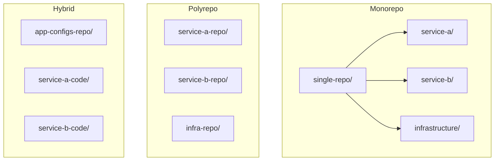

# What's the Best Git Repo Structure for ArgoCD?

Author: [nawazdhandala](https://github.com/nawazdhandala)

Tags: ArgoCD, GitOps, Kubernetes, Best Practices, Architecture

Description: Explore the best Git repository structures for ArgoCD, comparing monorepo, polyrepo, and hybrid approaches with practical examples for each pattern.

---

One of the first decisions you face when adopting ArgoCD is how to organize your Git repositories. Should you put everything in one repo? Separate repos for each service? Keep manifests alongside application code? This decision affects your team's workflow, access control, and operational complexity for years.

There is no single "best" structure - it depends on your team size, number of services, and how you want to manage deployments. Let me walk through the main patterns with their tradeoffs.

## The Three Main Approaches

Before diving into details, here is an overview of the three primary strategies.



## Pattern 1: Monorepo (Single Repository for Everything)

All Kubernetes manifests live in one repository, organized by service and environment.

```
k8s-manifests/
  apps/
    service-a/
      base/
        deployment.yaml
        service.yaml
        kustomization.yaml
      overlays/
        dev/
          kustomization.yaml
          replica-patch.yaml
        staging/
          kustomization.yaml
        production/
          kustomization.yaml
          hpa.yaml
    service-b/
      base/
        deployment.yaml
        service.yaml
        kustomization.yaml
      overlays/
        dev/
        staging/
        production/
  infrastructure/
    cert-manager/
    ingress-nginx/
    monitoring/
  argocd/
    applications/
      service-a.yaml
      service-b.yaml
    projects/
      team-a.yaml
```

**ArgoCD Application for this structure**:

```yaml
apiVersion: argoproj.io/v1alpha1
kind: Application
metadata:
  name: service-a-production
  namespace: argocd
spec:
  source:
    repoURL: https://github.com/my-org/k8s-manifests.git
    targetRevision: main
    path: apps/service-a/overlays/production
  destination:
    server: https://kubernetes.default.svc
    namespace: service-a
```

**Pros**:
- Single place to see all configurations
- Easy to make cross-cutting changes (update all services at once)
- Simple CI/CD - one repo to manage
- ArgoCD only needs access to one repository
- Easy to review changes across services

**Cons**:
- Can become unwieldy with hundreds of services
- Every team commits to the same repo, creating merge conflicts
- Access control is coarse-grained (everyone can see everything)
- A single bad commit can affect all services

**Best for**: Small to medium teams (up to 50 services), teams where everyone needs visibility into all configurations.

## Pattern 2: Polyrepo (Manifests with Application Code)

Each service has its own repository containing both application code and Kubernetes manifests.

```
service-a/
  src/
    main.go
  Dockerfile
  k8s/
    base/
      deployment.yaml
      service.yaml
      kustomization.yaml
    overlays/
      dev/
      staging/
      production/
  .github/
    workflows/
      build.yaml
```

**ArgoCD Application**:

```yaml
apiVersion: argoproj.io/v1alpha1
kind: Application
metadata:
  name: service-a-production
  namespace: argocd
spec:
  source:
    repoURL: https://github.com/my-org/service-a.git
    targetRevision: main
    path: k8s/overlays/production
  destination:
    server: https://kubernetes.default.svc
    namespace: service-a
```

**Pros**:
- Each team owns their service and its deployment config
- Access control maps to team boundaries
- Changes to code and manifests are reviewed together
- Natural fit for microservices teams

**Cons**:
- Cross-cutting changes require updating many repos
- ArgoCD needs access to every service repository
- Hard to get a holistic view of the cluster state
- Infrastructure configurations are duplicated or need a separate repo

**Best for**: Large organizations with autonomous teams, each owning 1 to 5 services.

## Pattern 3: Hybrid (Separate Config Repo)

Application code lives in service repos, but all Kubernetes manifests live in a dedicated config repository. The CI pipeline in the service repo updates the config repo when new images are built.

```
# Config repository
deployment-configs/
  apps/
    service-a/
      dev/
        values.yaml
      staging/
        values.yaml
      production/
        values.yaml
    service-b/
      dev/
        values.yaml
      staging/
        values.yaml
      production/
        values.yaml
  charts/
    service-a/
      Chart.yaml
      templates/
    service-b/
      Chart.yaml
      templates/
  infrastructure/
    cert-manager/
    monitoring/
```

The CI pipeline in the service repo updates the image tag in the config repo.

```yaml
# In service-a's CI pipeline
- name: Update deployment config
  run: |
    git clone https://github.com/my-org/deployment-configs.git
    cd deployment-configs
    # Update the image tag in the values file
    yq e '.image.tag = "${{ github.sha }}"' -i apps/service-a/production/values.yaml
    git commit -am "Update service-a to ${{ github.sha }}"
    git push
```

**Pros**:
- Clear separation between application code and deployment config
- Single repo for ArgoCD to watch
- Teams can still modify their own service configs
- Easy to audit all deployment changes in one place
- Supports proper GitOps workflow (Git is the source of truth)

**Cons**:
- Requires automation to sync config repo with service repos
- Two repos to manage per service
- Need to coordinate changes across repos

**Best for**: Medium to large organizations (50+ services), teams that want strict GitOps separation.

## How to Structure Environments

Regardless of which repo pattern you choose, you need a consistent approach to environments.

### Option A: Directory-Based Environments

```
service-a/
  base/                 # Common configuration
  overlays/
    dev/                # Dev overrides
    staging/            # Staging overrides
    production/         # Production overrides
```

### Option B: Branch-Based Environments

```
main branch      -> production
staging branch   -> staging
develop branch   -> development
```

**My recommendation**: Use directory-based environments. Branch-based environments create complex merge flows and make it hard to promote changes between environments. Directory-based environments with Kustomize overlays give you clear, reviewable configuration per environment.

## ArgoCD ApplicationSets for Scaling

When you have many services across multiple environments, ApplicationSets automate Application creation.

```yaml
apiVersion: argoproj.io/v1alpha1
kind: ApplicationSet
metadata:
  name: services
  namespace: argocd
spec:
  generators:
    - matrix:
        generators:
          - git:
              repoURL: https://github.com/my-org/deployment-configs.git
              revision: main
              directories:
                - path: apps/*/production
          - list:
              elements:
                - cluster: production
                  url: https://prod-cluster:6443
  template:
    metadata:
      name: '{{path[1]}}-production'
    spec:
      source:
        repoURL: https://github.com/my-org/deployment-configs.git
        targetRevision: main
        path: '{{path}}'
      destination:
        server: '{{url}}'
        namespace: '{{path[1]}}'
```

## Multi-Cluster Considerations

If you manage multiple clusters, the repo structure needs to account for cluster-specific configurations.

```
deployment-configs/
  clusters/
    us-east-1/
      apps/
      infrastructure/
    eu-west-1/
      apps/
      infrastructure/
  shared/
    apps/          # Common app configs
    infrastructure/ # Common infra configs
```

## My Recommendation

For most teams starting with ArgoCD:

1. **Start with the hybrid pattern** (separate config repo). It gives you the best balance of flexibility and control.
2. **Use Kustomize with directory-based environments**. It is simpler than Helm for pure configuration management and ArgoCD handles it natively.
3. **Use ApplicationSets** to generate Applications automatically from your directory structure.
4. **Keep infrastructure separate from applications**. Infrastructure changes (cert-manager, ingress controllers) have different lifecycles than application deployments.

Monitor your ArgoCD instance to make sure your chosen structure is working well. [OneUptime](https://oneuptime.com) can help you track deployment success rates and sync times across all your applications, giving you visibility into whether your repo structure is creating bottlenecks.

The best structure is one that your team can maintain consistently. Start simple, and evolve as your needs grow.
