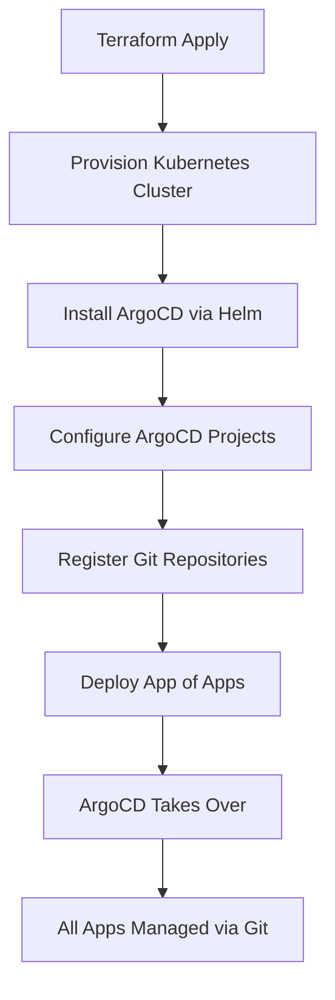

# How to Bootstrap ArgoCD with Terraform

Author: [nawazdhandala](https://github.com/nawazdhandala)

Tags: ArgoCD, GitOps, Kubernetes, Terraform, Bootstrap

Description: Learn how to bootstrap a complete ArgoCD installation with Terraform, from cluster provisioning to ArgoCD deployment and initial application configuration in a single pipeline.

---

Bootstrapping is the chicken-and-egg problem of GitOps: you need ArgoCD to manage your cluster, but you need a cluster to run ArgoCD. Terraform solves this elegantly by provisioning the cluster, installing ArgoCD, configuring it, and deploying the initial App of Apps - all in a single pipeline. Once the bootstrap is complete, ArgoCD takes over and manages everything else through Git.

This guide walks through a complete bootstrap workflow that takes you from zero to a fully functional GitOps-managed cluster.

## The Bootstrap Architecture

Here is what the bootstrap pipeline looks like:



After the initial bootstrap, Terraform only manages the cluster infrastructure and ArgoCD itself. All application deployments flow through ArgoCD and Git.

## Step 1: Provision the Kubernetes Cluster

Start with your cluster. This example uses AWS EKS, but the same pattern works for GKE, AKS, or any Kubernetes cluster:

```hcl
# providers.tf
terraform {
  required_version = ">= 1.5.0"

  required_providers {
    aws = {
      source  = "hashicorp/aws"
      version = "~> 5.30"
    }
    helm = {
      source  = "hashicorp/helm"
      version = "~> 2.12"
    }
    kubernetes = {
      source  = "hashicorp/kubernetes"
      version = "~> 2.25"
    }
    argocd = {
      source  = "oboukili/argocd"
      version = "~> 6.0"
    }
  }

  backend "s3" {
    bucket = "my-terraform-state"
    key    = "clusters/production/terraform.tfstate"
    region = "us-east-1"
  }
}

# EKS cluster
module "eks" {
  source  = "terraform-aws-modules/eks/aws"
  version = "~> 19.21"

  cluster_name    = "${var.environment}-cluster"
  cluster_version = "1.29"

  vpc_id     = module.vpc.vpc_id
  subnet_ids = module.vpc.private_subnets

  eks_managed_node_groups = {
    general = {
      instance_types = ["m5.large"]
      min_size       = 3
      max_size       = 10
      desired_size   = 3

      labels = {
        role = "general"
      }
    }
  }

  # Enable OIDC provider for IRSA
  enable_irsa = true
}
```

## Step 2: Configure Kubernetes and Helm Providers

Set up the providers to connect to the newly created cluster:

```hcl
# Configure kubernetes provider
provider "kubernetes" {
  host                   = module.eks.cluster_endpoint
  cluster_ca_certificate = base64decode(module.eks.cluster_certificate_authority_data)

  exec {
    api_version = "client.authentication.k8s.io/v1beta1"
    command     = "aws"
    args        = ["eks", "get-token", "--cluster-name", module.eks.cluster_name]
  }
}

# Configure helm provider
provider "helm" {
  kubernetes {
    host                   = module.eks.cluster_endpoint
    cluster_ca_certificate = base64decode(module.eks.cluster_certificate_authority_data)

    exec {
      api_version = "client.authentication.k8s.io/v1beta1"
      command     = "aws"
      args        = ["eks", "get-token", "--cluster-name", module.eks.cluster_name]
    }
  }
}
```

## Step 3: Install ArgoCD with Helm

Deploy ArgoCD using the Helm provider:

```hcl
resource "kubernetes_namespace" "argocd" {
  metadata {
    name = "argocd"

    labels = {
      "app.kubernetes.io/managed-by" = "terraform"
    }
  }

  depends_on = [module.eks]
}

resource "helm_release" "argocd" {
  name       = "argocd"
  repository = "https://argoproj.github.io/argo-helm"
  chart      = "argo-cd"
  version    = "5.55.0"
  namespace  = kubernetes_namespace.argocd.metadata[0].name

  values = [yamlencode({
    global = {
      domain = "argocd.${var.domain}"
    }

    configs = {
      params = {
        "server.insecure" = true
      }

      cm = {
        "admin.enabled" = true
        # Configure SSO if needed
        "url" = "https://argocd.${var.domain}"
      }

      rbac = {
        "policy.default" = "role:readonly"
        "policy.csv"     = <<-EOT
          g, platform-admins, role:admin
          g, developers, role:readonly
        EOT
      }
    }

    server = {
      replicas = var.environment == "production" ? 2 : 1

      ingress = {
        enabled    = true
        ingressClassName = "nginx"
        hosts      = ["argocd.${var.domain}"]
        tls = [{
          secretName = "argocd-tls"
          hosts      = ["argocd.${var.domain}"]
        }]
      }

      resources = {
        requests = {
          cpu    = "100m"
          memory = "256Mi"
        }
        limits = {
          cpu    = "500m"
          memory = "512Mi"
        }
      }
    }

    controller = {
      replicas = var.environment == "production" ? 2 : 1

      resources = {
        requests = {
          cpu    = "250m"
          memory = "512Mi"
        }
        limits = {
          cpu    = "1"
          memory = "1Gi"
        }
      }
    }

    repoServer = {
      replicas = var.environment == "production" ? 2 : 1
    }
  })]

  wait          = true
  wait_for_jobs = true

  depends_on = [kubernetes_namespace.argocd]
}
```

## Step 4: Configure the ArgoCD Provider

Now that ArgoCD is running, configure the ArgoCD Terraform provider:

```hcl
# Wait for ArgoCD to be ready, then configure the provider
provider "argocd" {
  port_forward_with_namespace = "argocd"
  username                    = "admin"
  password                    = var.argocd_admin_password

  # Or use the server URL if accessible
  # server_addr = "argocd.${var.domain}:443"
}
```

The `port_forward_with_namespace` option is useful during bootstrap because the ingress might not be ready yet.

## Step 5: Register Repositories and Create Projects

```hcl
# Register the GitOps repository
resource "argocd_repository" "gitops" {
  repo     = var.gitops_repo_url
  type     = "git"
  username = "argocd-bot"
  password = var.git_token

  depends_on = [helm_release.argocd]
}

# Create the main project
resource "argocd_project" "apps" {
  metadata {
    name      = "applications"
    namespace = "argocd"
  }

  spec {
    description = "Application deployments"

    source_repos = [var.gitops_repo_url]

    destination {
      server    = "https://kubernetes.default.svc"
      namespace = "*"
    }

    cluster_resource_whitelist {
      group = "*"
      kind  = "*"
    }

    namespace_resource_whitelist {
      group = "*"
      kind  = "*"
    }
  }

  depends_on = [helm_release.argocd]
}

# Create infrastructure project
resource "argocd_project" "infra" {
  metadata {
    name      = "infrastructure"
    namespace = "argocd"
  }

  spec {
    description = "Infrastructure components"

    source_repos = [
      var.gitops_repo_url,
      "https://charts.bitnami.com/bitnami",
      "https://prometheus-community.github.io/helm-charts",
    ]

    destination {
      server    = "https://kubernetes.default.svc"
      namespace = "*"
    }

    cluster_resource_whitelist {
      group = "*"
      kind  = "*"
    }
  }

  depends_on = [helm_release.argocd]
}
```

## Step 6: Deploy the App of Apps

The App of Apps pattern is the cornerstone of the bootstrap. One ArgoCD Application manages all other Applications:

```hcl
resource "argocd_application" "app_of_apps" {
  metadata {
    name      = "app-of-apps"
    namespace = "argocd"
    labels = {
      "app.kubernetes.io/part-of" = "bootstrap"
    }
  }

  spec {
    project = argocd_project.apps.metadata[0].name

    source {
      repo_url        = var.gitops_repo_url
      target_revision = "main"
      path            = "apps"

      directory {
        recurse = true
      }
    }

    destination {
      server    = "https://kubernetes.default.svc"
      namespace = "argocd"
    }

    sync_policy {
      automated {
        prune     = true
        self_heal = true
      }
    }
  }

  depends_on = [
    argocd_project.apps,
    argocd_repository.gitops,
  ]
}

# Infrastructure App of Apps
resource "argocd_application" "infra_apps" {
  metadata {
    name      = "infrastructure-apps"
    namespace = "argocd"
  }

  spec {
    project = argocd_project.infra.metadata[0].name

    source {
      repo_url        = var.gitops_repo_url
      target_revision = "main"
      path            = "infrastructure"
    }

    destination {
      server    = "https://kubernetes.default.svc"
      namespace = "argocd"
    }

    sync_policy {
      automated {
        prune     = true
        self_heal = true
      }
    }
  }

  depends_on = [
    argocd_project.infra,
    argocd_repository.gitops,
  ]
}
```

## The GitOps Repository Structure

Your GitOps repository should be organized to support this bootstrap:

```text
gitops-repo/
  apps/
    api-service.yaml        # ArgoCD Application manifests
    frontend.yaml
    worker.yaml
  infrastructure/
    monitoring.yaml         # Prometheus, Grafana
    cert-manager.yaml
    ingress-nginx.yaml
    external-secrets.yaml
  base/                     # Shared base manifests
    api-service/
    frontend/
    worker/
  overlays/                 # Per-environment overrides
    staging/
    production/
```

Each file in `apps/` is an ArgoCD Application manifest that ArgoCD picks up automatically through the App of Apps.

## Variables and Outputs

```hcl
# variables.tf
variable "environment" {
  type        = string
  description = "Environment name (staging, production)"
}

variable "domain" {
  type        = string
  description = "Base domain for services"
}

variable "gitops_repo_url" {
  type        = string
  description = "URL of the GitOps repository"
}

variable "git_token" {
  type        = string
  sensitive   = true
  description = "Git access token for ArgoCD"
}

variable "argocd_admin_password" {
  type        = string
  sensitive   = true
  description = "ArgoCD admin password"
}

# outputs.tf
output "argocd_url" {
  value = "https://argocd.${var.domain}"
}

output "cluster_endpoint" {
  value = module.eks.cluster_endpoint
}

output "argocd_project_apps" {
  value = argocd_project.apps.metadata[0].name
}
```

## Running the Bootstrap

Execute the full bootstrap:

```bash
# Initialize Terraform
terraform init

# Plan the deployment
terraform plan -var-file="environments/production.tfvars"

# Apply everything
terraform apply -var-file="environments/production.tfvars"
```

After the bootstrap completes, ArgoCD is running, configured, and managing all your applications through Git. From this point forward, you deploy by pushing to Git, not by running Terraform.

For more on managing ArgoCD with the Terraform provider specifically, see our guide on [using the Terraform ArgoCD provider](https://oneuptime.com/blog/post/2026-02-26-terraform-argocd-provider/view).

## Day-Two Operations

After bootstrap, Terraform is only needed for:

- Scaling the cluster (node groups, instance types)
- Updating ArgoCD itself (Helm chart version)
- Adding new ArgoCD projects or repositories
- Managing cluster-level infrastructure

Everything else flows through ArgoCD and Git.

## Best Practices

1. **Keep bootstrap minimal** - Terraform should set up the foundation. Let ArgoCD manage everything else.
2. **Use a separate state file** - Keep the bootstrap Terraform state separate from application Terraform state.
3. **Secure the admin password** - Generate a random password during bootstrap and store it in a secrets manager immediately.
4. **Enable auto-sync on the App of Apps** - This ensures new applications in Git are automatically picked up.
5. **Test bootstrap in a disposable environment** - Run the full bootstrap against a temporary cluster before touching production.
6. **Document the bootstrap process** - Make sure more than one person knows how to run it.
7. **Version pin everything** - Pin Helm chart versions, Terraform provider versions, and Kubernetes versions.

Bootstrapping ArgoCD with Terraform gives you a repeatable, auditable path from zero to a fully operational GitOps platform. Run it once, and ArgoCD handles the rest.
