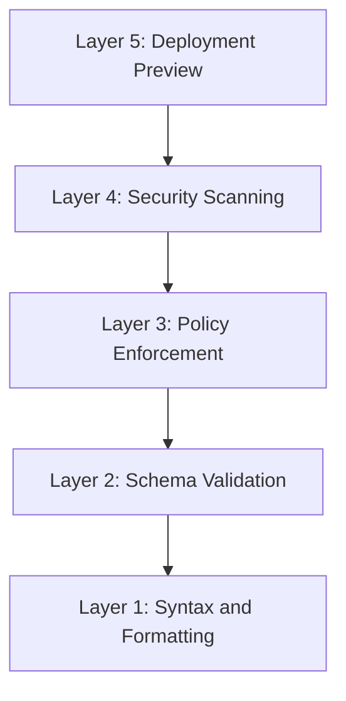

# How to Set Up CI/CD Checks for ArgoCD Configurations

Author: [nawazdhandala](https://github.com/nawazdhandala)

Tags: ArgoCD, GitOps, Kubernetes, CI/CD, Automation

Description: Learn how to build a comprehensive CI/CD pipeline that validates ArgoCD configurations including manifest validation, policy checks, security scanning, and deployment previews.

---

Your GitOps repository is the gateway to production. Every manifest that passes through it will eventually be applied to your Kubernetes clusters by ArgoCD. Without CI/CD checks on this repository, you are relying on human reviewers to catch YAML syntax errors, deprecated API versions, security misconfigurations, and policy violations.

This guide builds a comprehensive CI/CD pipeline for ArgoCD configuration repositories, layering checks from simple syntax validation to full deployment simulation.

## The CI/CD Check Pyramid

Think of CI checks as a pyramid where each layer catches different types of issues:



Each layer builds on the previous one. A manifest must pass all layers before it is safe to merge.

## Layer 1: Syntax and Formatting

The fastest checks that catch the most basic errors:

```yaml
# .github/workflows/validate.yaml
name: ArgoCD Config Validation
on:
  pull_request:
    paths:
    - 'apps/**'
    - 'charts/**'
    - 'infrastructure/**'

jobs:
  syntax:
    name: YAML Syntax and Formatting
    runs-on: ubuntu-latest
    steps:
    - uses: actions/checkout@v4

    - name: Install yamllint
      run: pip install yamllint

    - name: Lint YAML files
      run: |
        yamllint -c .yamllint.yaml \
          apps/ charts/ infrastructure/

    - name: Check for trailing whitespace
      run: |
        if grep -rn ' $' apps/ charts/ infrastructure/ --include="*.yaml" --include="*.yml"; then
          echo "FAIL: Trailing whitespace found"
          exit 1
        fi

    - name: Check for tab characters
      run: |
        if grep -rPn '\t' apps/ charts/ infrastructure/ --include="*.yaml" --include="*.yml"; then
          echo "FAIL: Tab characters found (use spaces)"
          exit 1
        fi
```

## Layer 2: Schema Validation

Validate manifests against the Kubernetes API schema:

```yaml
  schema:
    name: Kubernetes Schema Validation
    runs-on: ubuntu-latest
    needs: syntax
    strategy:
      matrix:
        k8s-version: ['1.27.0', '1.28.0', '1.29.0']
    steps:
    - uses: actions/checkout@v4

    - name: Install tools
      run: |
        # kubeconform
        curl -sL https://github.com/yannh/kubeconform/releases/latest/download/kubeconform-linux-amd64.tar.gz | \
          sudo tar xz -C /usr/local/bin

        # kustomize
        curl -s "https://raw.githubusercontent.com/kubernetes-sigs/kustomize/master/hack/install_kustomize.sh" | bash
        sudo mv kustomize /usr/local/bin/

        # helm
        curl https://raw.githubusercontent.com/helm/helm/main/scripts/get-helm-3 | bash

    - name: Validate plain manifests
      run: |
        find apps/ -name "*.yaml" -not -name "kustomization.yaml" | \
          xargs kubeconform -strict -summary \
            -kubernetes-version ${{ matrix.k8s-version }} \
            -ignore-missing-schemas \
            -schema-location default \
            -schema-location 'https://raw.githubusercontent.com/datreeio/CRDs-catalog/main/{{.Group}}/{{.ResourceKind}}_{{.ResourceAPIVersion}}.json'

    - name: Validate Kustomize overlays
      run: |
        for overlay in apps/*/overlays/*/; do
          [ -f "$overlay/kustomization.yaml" ] || continue
          echo "Validating: $overlay"
          kustomize build "$overlay" | kubeconform -strict -summary \
            -kubernetes-version ${{ matrix.k8s-version }} \
            -ignore-missing-schemas
        done

    - name: Validate Helm charts
      run: |
        for chart in charts/*/; do
          [ -f "$chart/Chart.yaml" ] || continue
          echo "Linting: $chart"
          helm lint "$chart" --strict

          for values in "$chart"/values*.yaml; do
            [ -f "$values" ] || continue
            echo "Validating: $chart with $values"
            helm template test "$chart" --values "$values" | \
              kubeconform -strict -summary \
                -kubernetes-version ${{ matrix.k8s-version }} \
                -ignore-missing-schemas
          done
        done
```

## Layer 3: Policy Enforcement

Enforce organizational policies with Conftest:

```yaml
  policy:
    name: Policy Checks
    runs-on: ubuntu-latest
    needs: schema
    steps:
    - uses: actions/checkout@v4

    - name: Install tools
      run: |
        # conftest
        curl -sL https://github.com/open-policy-agent/conftest/releases/latest/download/conftest_Linux_x86_64.tar.gz | \
          sudo tar xz -C /usr/local/bin

        # kustomize
        curl -s "https://raw.githubusercontent.com/kubernetes-sigs/kustomize/master/hack/install_kustomize.sh" | bash
        sudo mv kustomize /usr/local/bin/

    - name: Run policy tests on plain manifests
      run: |
        conftest test --all-namespaces apps/**/*.yaml \
          --ignore "kustomization.yaml"

    - name: Run policy tests on rendered Kustomize
      run: |
        for overlay in apps/*/overlays/*/; do
          [ -f "$overlay/kustomization.yaml" ] || continue
          echo "Policy check: $overlay"
          kustomize build "$overlay" | conftest test --all-namespaces -
        done

    - name: Verify Conftest policies pass their own tests
      run: conftest verify
```

Key policies to enforce:

```rego
# policy/security.rego
package security

# No containers running as root
deny[msg] {
  input.kind == "Deployment"
  container := input.spec.template.spec.containers[_]
  not container.securityContext.runAsNonRoot
  msg := sprintf("Container '%s' must set runAsNonRoot: true", [container.name])
}

# No privileged containers
deny[msg] {
  input.kind == "Deployment"
  container := input.spec.template.spec.containers[_]
  container.securityContext.privileged == true
  msg := sprintf("Container '%s' must not run as privileged", [container.name])
}
```

```rego
# policy/reliability.rego
package reliability

# Require resource limits on all containers
deny[msg] {
  input.kind == "Deployment"
  container := input.spec.template.spec.containers[_]
  not container.resources.limits
  msg := sprintf("Container '%s' must have resource limits", [container.name])
}

# Require health probes for production
deny[msg] {
  input.kind == "Deployment"
  input.metadata.namespace == "production"
  container := input.spec.template.spec.containers[_]
  not container.readinessProbe
  msg := sprintf("Container '%s' in production must have a readiness probe", [container.name])
}
```

## Layer 4: Security Scanning

Scan manifests for security issues:

```yaml
  security:
    name: Security Scanning
    runs-on: ubuntu-latest
    needs: schema
    steps:
    - uses: actions/checkout@v4

    - name: Install tools
      run: |
        # trivy for misconfiguration scanning
        curl -sfL https://raw.githubusercontent.com/aquasecurity/trivy/main/contrib/install.sh | \
          sudo sh -s -- -b /usr/local/bin

        # kustomize
        curl -s "https://raw.githubusercontent.com/kubernetes-sigs/kustomize/master/hack/install_kustomize.sh" | bash
        sudo mv kustomize /usr/local/bin/

    - name: Scan manifests with Trivy
      run: |
        trivy config apps/ --severity HIGH,CRITICAL --exit-code 1

    - name: Scan rendered Kustomize overlays
      run: |
        for overlay in apps/*/overlays/*/; do
          [ -f "$overlay/kustomization.yaml" ] || continue
          echo "Scanning: $overlay"
          kustomize build "$overlay" > /tmp/rendered.yaml
          trivy config /tmp/rendered.yaml --severity HIGH,CRITICAL
        done

    - name: Check for plain Secrets
      run: |
        # Fail if any plain Kubernetes Secrets are found
        if grep -rn "kind: Secret" apps/ --include="*.yaml" | \
           grep -v "kind: SealedSecret" | \
           grep -v "kind: ExternalSecret"; then
          echo "FAIL: Plain Kubernetes Secrets detected. Use SealedSecrets or ExternalSecrets."
          exit 1
        fi

    - name: Check for latest image tags
      run: |
        if grep -rn "image:.*:latest" apps/ charts/ --include="*.yaml"; then
          echo "FAIL: 'latest' image tags are not allowed"
          exit 1
        fi
```

## Layer 5: Deployment Preview

The most comprehensive check - actually rendering what ArgoCD would deploy:

```yaml
  preview:
    name: Deployment Preview
    runs-on: ubuntu-latest
    needs: [policy, security]
    steps:
    - uses: actions/checkout@v4
      with:
        fetch-depth: 0

    - name: Install tools
      run: |
        curl -s "https://raw.githubusercontent.com/kubernetes-sigs/kustomize/master/hack/install_kustomize.sh" | bash
        sudo mv kustomize /usr/local/bin/
        sudo wget -qO /usr/local/bin/yq https://github.com/mikefarah/yq/releases/latest/download/yq_linux_amd64
        sudo chmod +x /usr/local/bin/yq

    - name: Generate change report
      id: report
      run: |
        REPORT=""

        # Find changed application directories
        CHANGED=$(git diff --name-only origin/main | grep "^apps/" | cut -d/ -f1-2 | sort -u)

        for app_dir in $CHANGED; do
          [ -d "$app_dir" ] || continue
          APP=$(basename "$app_dir")

          for overlay in "$app_dir"/overlays/*/; do
            [ -d "$overlay" ] || continue
            ENV=$(basename "$overlay")

            echo "Generating report for $APP ($ENV)..."

            # Current branch output
            if kustomize build "$overlay" > /tmp/current.yaml 2>/dev/null; then
              RESOURCES=$(cat /tmp/current.yaml | yq eval-all '.kind + "/" + .metadata.name' - | sort)
              RESOURCE_COUNT=$(echo "$RESOURCES" | wc -l)

              REPORT="${REPORT}\n### ${APP} (${ENV})\n"
              REPORT="${REPORT}\n**Resources**: ${RESOURCE_COUNT}\n"
              REPORT="${REPORT}\n<details><summary>Resource List</summary>\n\n\`\`\`\n${RESOURCES}\n\`\`\`\n</details>\n"

              # Diff against main branch
              git stash 2>/dev/null
              git checkout origin/main -- "$app_dir" 2>/dev/null
              if kustomize build "$overlay" > /tmp/main.yaml 2>/dev/null; then
                DIFF=$(diff -u /tmp/main.yaml /tmp/current.yaml || true)
                if [ -n "$DIFF" ]; then
                  REPORT="${REPORT}\n<details><summary>Manifest Changes</summary>\n\n\`\`\`diff\n${DIFF}\n\`\`\`\n</details>\n"
                else
                  REPORT="${REPORT}\nNo manifest changes.\n"
                fi
              fi
              git checkout - -- "$app_dir" 2>/dev/null
              git stash pop 2>/dev/null || true
            fi
          done
        done

        echo "report<<EOF" >> $GITHUB_OUTPUT
        echo -e "$REPORT" >> $GITHUB_OUTPUT
        echo "EOF" >> $GITHUB_OUTPUT

    - name: Comment on PR
      uses: actions/github-script@v7
      if: steps.report.outputs.report != ''
      with:
        script: |
          const report = `${{ steps.report.outputs.report }}`;
          github.rest.issues.createComment({
            issue_number: context.issue.number,
            owner: context.repo.owner,
            repo: context.repo.repo,
            body: `## Deployment Preview\n\n${report}\n\n---\n*Generated by ArgoCD Config CI*`
          });
```

## Branch Protection Rules

Configure your repository to require all checks before merging:

```bash
# Using GitHub CLI to set branch protection
gh api repos/org/gitops-repo/branches/main/protection \
  --method PUT \
  --input - <<EOF
{
  "required_status_checks": {
    "strict": true,
    "contexts": [
      "YAML Syntax and Formatting",
      "Kubernetes Schema Validation (1.28.0)",
      "Policy Checks",
      "Security Scanning",
      "Deployment Preview"
    ]
  },
  "enforce_admins": true,
  "required_pull_request_reviews": {
    "required_approving_review_count": 1
  }
}
EOF
```

## Monitoring CI Check Health

Track the effectiveness of your CI checks over time:

- **Check failure rate**: How often do PRs fail each check? High failure rates on syntax checks suggest a need for better local tooling (pre-commit hooks).
- **Time to fix**: How long after a CI failure does the developer push a fix? Long times suggest checks are unclear about what is wrong.
- **False positive rate**: How often do checks fail incorrectly? This erodes trust and leads to people ignoring or bypassing checks.

For monitoring your ArgoCD deployments after configurations pass CI checks and get deployed, integrate with [OneUptime](https://oneuptime.com/blog/post/2026-02-26-argocd-alerts-failed-syncs/view) to track deployment health end to end.

## Summary

A comprehensive CI/CD pipeline for ArgoCD configurations has five layers: YAML syntax validation catches formatting errors, schema validation catches invalid Kubernetes resources, policy enforcement catches organizational standard violations, security scanning catches misconfigurations and vulnerabilities, and deployment preview gives reviewers visibility into the actual cluster impact. Implement these layers incrementally, starting with syntax and schema validation, then adding policy and security checks as your policies mature. Require all checks to pass before merging to the main branch. The result is a GitOps pipeline where every change reaching ArgoCD has been validated for correctness, compliance, and security.
