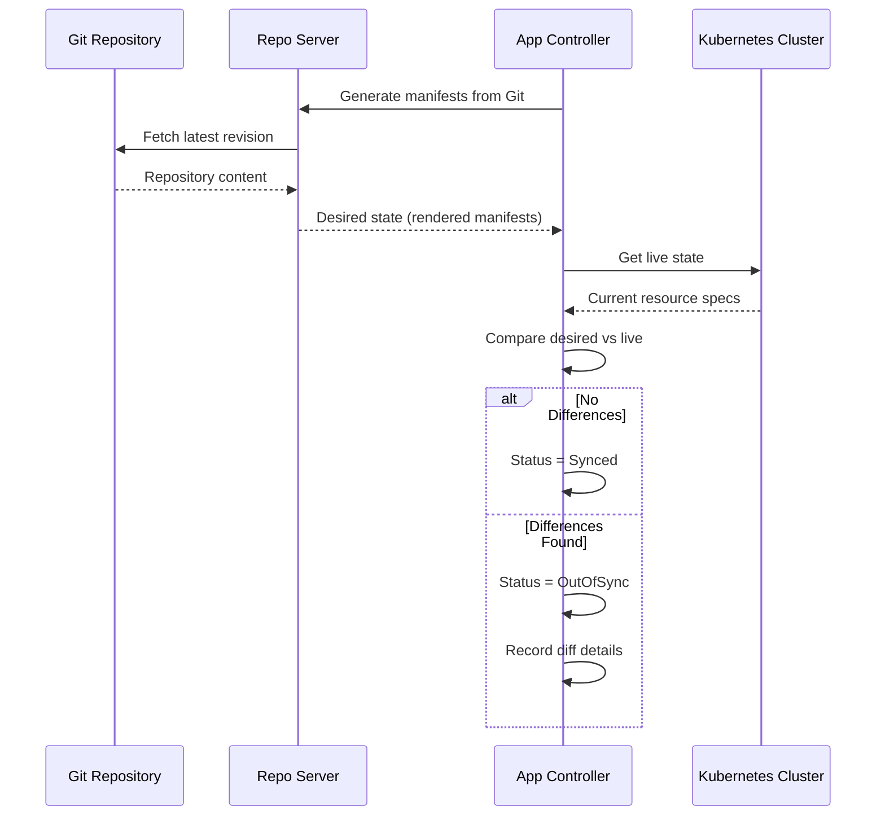

# How Configuration Drift Detection Works in GitOps

Author: [nawazdhandala](https://github.com/nawazdhandala)

Tags: ArgoCD, GitOps, Kubernetes, Drift Detection, Security

Description: Understand how configuration drift detection works in GitOps with ArgoCD including how differences are calculated, common drift sources, and remediation strategies.

---

Configuration drift is the silent killer of reliable infrastructure. It happens when the actual state of your Kubernetes cluster diverges from the desired state defined in your Git repository. Without drift detection, you end up in a situation where nobody knows what is actually running in production versus what the manifests say should be running.

GitOps tools like ArgoCD make drift detection a first-class feature. But understanding how it works under the hood - and why it sometimes produces unexpected results - is essential for operating a healthy GitOps environment.

## How ArgoCD Detects Drift

ArgoCD uses a continuous reconciliation loop to detect drift. Every few minutes (configurable, default 3 minutes), the application controller performs the following steps:



The comparison is a structured diff between the rendered manifests from Git and the live resources from the Kubernetes API server.

## The Diff Algorithm

ArgoCD does not do a simple text comparison. It performs a semantic diff that understands Kubernetes resource structure:

1. **Normalize both sides**: Remove server-generated fields like `resourceVersion`, `uid`, `creationTimestamp`, and `managedFields`.

2. **Apply default values**: Kubernetes adds default values to resources when they are created. ArgoCD accounts for these so that a manifest missing an explicit `strategy` field does not show as drifted when Kubernetes adds the default `RollingUpdate` strategy.

3. **Compare field by field**: Each field in the desired state is compared to the corresponding field in the live state.

4. **Report differences**: Fields that differ are reported with their expected and actual values.

```bash
# View the diff for an application
argocd app diff my-app

# Example output:
# ===== apps/Deployment my-app/payment-api ======
# --- desired
# +++ live
# @@ -15,7 +15,7 @@
#        containers:
#        - name: payment-api
# -        image: payment-api:v2.0.9
# +        image: payment-api:v2.1.0
#          resources:
# -          limits:
# -            memory: "512Mi"
# +          limits:
# +            memory: "1Gi"
```

## Common Sources of Drift

### 1. Manual kubectl Changes

The most obvious source of drift. Someone runs `kubectl edit` or `kubectl scale` and changes a resource directly:

```bash
# This creates drift
kubectl scale deployment payment-api --replicas=5 -n production
# Git says replicas: 3, cluster now has replicas: 5
```

ArgoCD detects this on the next reconciliation cycle and marks the application as OutOfSync.

### 2. Kubernetes Mutating Webhooks

Mutating admission webhooks modify resources during creation. Common examples:

- **Istio sidecar injection**: Adds an istio-proxy container
- **Vault agent injection**: Adds vault-agent init containers
- **Resource defaulting**: Adds default CPU/memory requests

These mutations exist in the live state but not in Git, causing ArgoCD to report drift on every reconciliation.

**Fix**: Configure ArgoCD to ignore webhook-managed fields:

```yaml
spec:
  ignoreDifferences:
  - group: apps
    kind: Deployment
    jqPathExpressions:
    # Ignore Istio sidecar container
    - '.spec.template.spec.containers[] | select(.name == "istio-proxy")'
    # Ignore Istio init containers
    - '.spec.template.spec.initContainers[] | select(.name == "istio-init")'
```

### 3. Horizontal Pod Autoscaler

If you use an HPA, it continuously adjusts the replica count based on metrics. The replica count in Git becomes stale almost immediately:

```yaml
# Git says replicas: 3
# HPA adjusts to replicas: 7 based on CPU
# ArgoCD reports drift on replicas field
```

**Fix**: Ignore the replicas field when using HPA:

```yaml
spec:
  ignoreDifferences:
  - group: apps
    kind: Deployment
    jsonPointers:
    - /spec/replicas
```

### 4. Kubernetes Controller Mutations

Some Kubernetes controllers modify resource specifications. For example, the StatefulSet controller may reorder volume claims, or the Service controller may assign a ClusterIP:

```yaml
# You defined:
spec:
  type: ClusterIP

# Kubernetes added:
spec:
  type: ClusterIP
  clusterIP: 10.96.45.123
  clusterIPs:
  - 10.96.45.123
```

**Fix**: Use server-side diff which understands field ownership:

```yaml
apiVersion: v1
kind: ConfigMap
metadata:
  name: argocd-cmd-params-cm
  namespace: argocd
data:
  controller.diff.server.side: "true"
```

Server-side diff uses Kubernetes' built-in understanding of which controller owns which fields, eliminating false drift reports from controller-managed fields.

### 5. Secrets Managed by External Systems

If you use External Secrets Operator or Sealed Secrets, the actual Secret resource in the cluster will have different content than what is in Git (because Git contains the ExternalSecret or SealedSecret, not the plain Secret):

```yaml
# Git has this:
apiVersion: external-secrets.io/v1beta1
kind: ExternalSecret
metadata:
  name: db-credentials

# Cluster has this (created by External Secrets Operator):
apiVersion: v1
kind: Secret
metadata:
  name: db-credentials
  ownerReferences:
  - apiVersion: external-secrets.io/v1beta1
    kind: ExternalSecret
    name: db-credentials
```

This is not really drift - it is expected behavior. ArgoCD manages the ExternalSecret resource, and the operator manages the resulting Secret.

## Self-Healing: Automatic Drift Correction

ArgoCD can automatically correct detected drift through self-healing:

```yaml
syncPolicy:
  automated:
    selfHeal: true
```

When drift is detected, ArgoCD performs a sync to bring the cluster back to the desired state. This happens within the reconciliation interval (default 3 minutes).

Self-healing is powerful but can be disruptive if not configured carefully:

```yaml
# Good: Self-heal with appropriate ignore rules
syncPolicy:
  automated:
    selfHeal: true
ignoreDifferences:
- group: apps
  kind: Deployment
  jsonPointers:
  - /spec/replicas  # Let HPA manage this

# Bad: Self-heal without ignore rules
# Will fight with HPA, mutating webhooks, etc.
syncPolicy:
  automated:
    selfHeal: true
```

## Drift Detection Metrics

Monitor drift patterns to understand your environment's health:

```promql
# Applications currently out of sync
count(argocd_app_info{sync_status="OutOfSync"})

# Drift events over time
sum(increase(argocd_app_sync_total{reason="drift"}[24h]))

# Self-heal corrections
sum(increase(argocd_app_sync_total{trigger="self-heal"}[24h]))
```

A healthy GitOps environment shows:
- Zero or near-zero OutOfSync applications (excluding those with manual sync policies)
- Decreasing drift events over time as ignore rules are refined
- Low self-heal frequency (high frequency indicates something is fighting ArgoCD)

## Investigating Drift

When you find an application in OutOfSync status, investigate the cause:

```bash
# See what is different
argocd app diff my-app

# Check the application's sync status details
argocd app get my-app --show-operation

# Look at the application's event history
kubectl get events -n argocd --field-selector involvedObject.name=my-app
```

Categorize each drift event:
- **Unauthorized change**: Someone modified a resource directly. Address through training and RBAC.
- **Controller mutation**: A Kubernetes controller modified a field. Add an ignore rule.
- **Webhook injection**: A mutating webhook added content. Add an ignore rule.
- **Legitimate override**: An HPA or operator manages the field. Add an ignore rule.

## Setting Up Drift Alerts

Configure ArgoCD notifications to alert on drift:

```yaml
apiVersion: v1
kind: ConfigMap
metadata:
  name: argocd-notifications-cm
  namespace: argocd
data:
  trigger.on-sync-status-unknown: |
    - when: app.status.sync.status == 'OutOfSync'
      send: [drift-alert]
  template.drift-alert: |
    message: |
      Application {{.app.metadata.name}} has drifted from Git.
      Sync Status: {{.app.status.sync.status}}
      Health: {{.app.status.health.status}}
```

For comprehensive drift monitoring across your entire ArgoCD deployment, integrate with [OneUptime](https://oneuptime.com/blog/post/2026-02-26-argocd-alerts-outofsync-applications/view) to get immediate alerts when applications drift out of sync.

## Summary

Configuration drift detection is one of the most valuable features of GitOps. ArgoCD detects drift through continuous reconciliation, comparing rendered manifests from Git against live cluster state using a semantic diff algorithm. Common drift sources include manual kubectl changes, mutating webhooks, HPA scaling, and controller mutations. Configure ignore rules for expected mutations, enable self-healing for automatic correction, and monitor drift metrics to track environmental health. The goal is to make all detected drift actionable - either it is a legitimate issue that needs correction, or it is an expected behavior that should be explicitly ignored.
