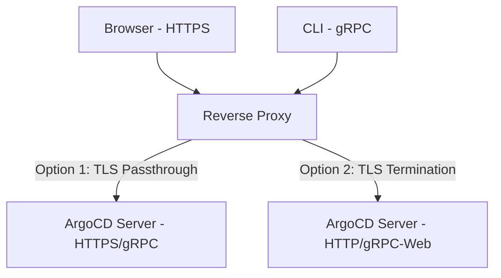

# How to Configure ArgoCD Behind a Reverse Proxy

Author: [nawazdhandala](https://github.com/nawazdhandala)

Tags: ArgoCD, GitOps, Kubernetes, Networking

Description: Learn how to configure ArgoCD to work behind reverse proxies like NGINX, Traefik, HAProxy, and cloud load balancers with proper TLS, gRPC, and WebSocket support.

---

Running ArgoCD behind a reverse proxy is the standard production setup. Instead of exposing the ArgoCD server directly, you put it behind NGINX, Traefik, HAProxy, or a cloud load balancer that handles TLS termination, domain routing, and potentially authentication. The tricky part is that ArgoCD uses both HTTPS for the web UI and gRPC (HTTP/2) for the CLI, and many proxy configurations break one or the other.

This guide covers configuring ArgoCD behind the most common reverse proxies, handling the gRPC challenge, and troubleshooting the issues you are most likely to hit.

## The gRPC Challenge

ArgoCD's CLI communicates with the server using gRPC, which runs over HTTP/2. The web UI uses standard HTTPS. Both go to the same port. This creates a challenge for reverse proxies because:

1. **TLS termination breaks gRPC**: If the proxy terminates TLS and forwards plain HTTP to ArgoCD, gRPC may not work because it needs HTTP/2 end-to-end
2. **TLS passthrough fixes gRPC but prevents routing**: If the proxy passes TLS through without terminating, it cannot inspect the request to do path-based routing

ArgoCD offers two solutions:

- **gRPC-Web**: A browser-compatible variant of gRPC that works over HTTP/1.1 (the CLI supports this with `--grpc-web`)
- **Run ArgoCD in insecure mode**: Let the proxy handle TLS, and run ArgoCD on plain HTTP internally



## Configure ArgoCD for Reverse Proxy

For most reverse proxy setups, run ArgoCD in insecure mode and let the proxy handle TLS.

```yaml
# argocd-cmd-params-cm.yaml
apiVersion: v1
kind: ConfigMap
metadata:
  name: argocd-cmd-params-cm
  namespace: argocd
data:
  # Run without TLS (proxy handles it)
  server.insecure: "true"
```

```bash
kubectl apply -f argocd-cmd-params-cm.yaml
kubectl rollout restart deployment argocd-server -n argocd
```

Also set the external URL in argocd-cm so links and redirects work correctly.

```yaml
# argocd-cm.yaml
apiVersion: v1
kind: ConfigMap
metadata:
  name: argocd-cm
  namespace: argocd
data:
  url: https://argocd.yourdomain.com
```

## NGINX Configuration

### NGINX Ingress Controller (Kubernetes)

This is the most common setup. Create an Ingress resource.

#### Option A: TLS Termination at NGINX (Recommended)

ArgoCD runs in insecure mode, NGINX handles TLS.

```yaml
# argocd-ingress.yaml
apiVersion: networking.k8s.io/v1
kind: Ingress
metadata:
  name: argocd-server-ingress
  namespace: argocd
  annotations:
    # Handle large payloads (ArgoCD can send big diffs)
    nginx.ingress.kubernetes.io/proxy-body-size: "0"
    # Increase timeouts for long sync operations
    nginx.ingress.kubernetes.io/proxy-read-timeout: "600"
    nginx.ingress.kubernetes.io/proxy-send-timeout: "600"
    # Force HTTPS
    nginx.ingress.kubernetes.io/force-ssl-redirect: "true"
    # Enable gRPC-Web support
    nginx.ingress.kubernetes.io/backend-protocol: "HTTP"
spec:
  ingressClassName: nginx
  tls:
  - hosts:
    - argocd.yourdomain.com
    secretName: argocd-server-tls
  rules:
  - host: argocd.yourdomain.com
    http:
      paths:
      - path: /
        pathType: Prefix
        backend:
          service:
            name: argocd-server
            port:
              number: 80
```

With this setup, the CLI needs to use gRPC-Web:

```bash
argocd login argocd.yourdomain.com --grpc-web
```

#### Option B: TLS Passthrough

ArgoCD handles its own TLS, NGINX passes through encrypted traffic.

```yaml
# argocd-ingress-passthrough.yaml
apiVersion: networking.k8s.io/v1
kind: Ingress
metadata:
  name: argocd-server-ingress
  namespace: argocd
  annotations:
    nginx.ingress.kubernetes.io/ssl-passthrough: "true"
spec:
  ingressClassName: nginx
  rules:
  - host: argocd.yourdomain.com
    http:
      paths:
      - path: /
        pathType: Prefix
        backend:
          service:
            name: argocd-server
            port:
              number: 443
```

With passthrough, the CLI works normally:

```bash
argocd login argocd.yourdomain.com --insecure
```

### Standalone NGINX (Non-Kubernetes)

If you are running NGINX outside Kubernetes (on a VM or bare metal):

```nginx
# /etc/nginx/conf.d/argocd.conf

# Upstream definition
upstream argocd {
    server <argocd-server-ip>:8080;
}

# HTTP to HTTPS redirect
server {
    listen 80;
    server_name argocd.yourdomain.com;
    return 301 https://$host$request_uri;
}

# HTTPS server
server {
    listen 443 ssl http2;
    server_name argocd.yourdomain.com;

    ssl_certificate /etc/ssl/certs/argocd.crt;
    ssl_certificate_key /etc/ssl/private/argocd.key;

    # Proxy settings
    location / {
        proxy_pass http://argocd;
        proxy_http_version 1.1;
        proxy_set_header Host $host;
        proxy_set_header X-Real-IP $remote_addr;
        proxy_set_header X-Forwarded-For $proxy_add_x_forwarded_for;
        proxy_set_header X-Forwarded-Proto $scheme;

        # WebSocket support
        proxy_set_header Upgrade $http_upgrade;
        proxy_set_header Connection "upgrade";

        # Timeouts
        proxy_read_timeout 600s;
        proxy_send_timeout 600s;

        # Large payload support
        client_max_body_size 0;
    }

    # gRPC support (for CLI without --grpc-web)
    location /argocd. {
        grpc_pass grpc://argocd;
        grpc_read_timeout 600s;
        grpc_send_timeout 600s;
    }
}
```

## Traefik Configuration

### Traefik Ingress (Kubernetes)

#### TLS Termination

```yaml
# argocd-ingress-traefik.yaml
apiVersion: networking.k8s.io/v1
kind: Ingress
metadata:
  name: argocd-server-ingress
  namespace: argocd
  annotations:
    traefik.ingress.kubernetes.io/router.entrypoints: websecure
    traefik.ingress.kubernetes.io/router.tls: "true"
spec:
  rules:
  - host: argocd.yourdomain.com
    http:
      paths:
      - path: /
        pathType: Prefix
        backend:
          service:
            name: argocd-server
            port:
              number: 80
```

#### TLS Passthrough with IngressRoute

```yaml
# argocd-ingressroute.yaml
apiVersion: traefik.io/v1alpha1
kind: IngressRouteTCP
metadata:
  name: argocd-server
  namespace: argocd
spec:
  entryPoints:
    - websecure
  routes:
  - match: HostSNI(`argocd.yourdomain.com`)
    services:
    - name: argocd-server
      port: 443
  tls:
    passthrough: true
```

## HAProxy Configuration

```haproxy
# /etc/haproxy/haproxy.cfg

frontend argocd_front
    bind *:443 ssl crt /etc/ssl/argocd.pem
    mode http
    option httplog

    # Route based on content type
    acl is_grpc hdr(content-type) -i application/grpc

    use_backend argocd_grpc if is_grpc
    default_backend argocd_http

backend argocd_http
    mode http
    option httpchk GET /healthz
    server argocd1 <argocd-ip>:8080 check

backend argocd_grpc
    mode http
    option httpchk GET /healthz
    server argocd1 <argocd-ip>:8080 check proto h2
```

## Cloud Load Balancers

### AWS Application Load Balancer

AWS ALB supports both HTTPS and gRPC natively.

```yaml
# argocd-ingress-alb.yaml
apiVersion: networking.k8s.io/v1
kind: Ingress
metadata:
  name: argocd-server-ingress
  namespace: argocd
  annotations:
    kubernetes.io/ingress.class: alb
    alb.ingress.kubernetes.io/scheme: internet-facing
    alb.ingress.kubernetes.io/certificate-arn: arn:aws:acm:region:account:certificate/xxx
    alb.ingress.kubernetes.io/listen-ports: '[{"HTTPS":443}]'
    alb.ingress.kubernetes.io/backend-protocol: HTTP
    alb.ingress.kubernetes.io/target-type: ip
    # Enable HTTP/2 for gRPC support
    alb.ingress.kubernetes.io/load-balancer-attributes: routing.http2.enabled=true
    alb.ingress.kubernetes.io/healthcheck-path: /healthz
spec:
  rules:
  - host: argocd.yourdomain.com
    http:
      paths:
      - path: /
        pathType: Prefix
        backend:
          service:
            name: argocd-server
            port:
              number: 80
```

### Google Cloud Load Balancer

```yaml
# argocd-ingress-gce.yaml
apiVersion: networking.k8s.io/v1
kind: Ingress
metadata:
  name: argocd-server-ingress
  namespace: argocd
  annotations:
    kubernetes.io/ingress.class: gce
    kubernetes.io/ingress.global-static-ip-name: argocd-ip
    networking.gke.io/managed-certificates: argocd-cert
spec:
  rules:
  - host: argocd.yourdomain.com
    http:
      paths:
      - path: /
        pathType: Prefix
        backend:
          service:
            name: argocd-server
            port:
              number: 80
```

## Subpath Configuration

If you want to serve ArgoCD under a subpath (e.g., `https://yourdomain.com/argocd/`), configure the root path.

```yaml
# argocd-cmd-params-cm.yaml
apiVersion: v1
kind: ConfigMap
metadata:
  name: argocd-cmd-params-cm
  namespace: argocd
data:
  server.insecure: "true"
  server.rootpath: "/argocd"
```

```bash
kubectl apply -f argocd-cmd-params-cm.yaml
kubectl rollout restart deployment argocd-server -n argocd
```

Update the NGINX Ingress:

```yaml
apiVersion: networking.k8s.io/v1
kind: Ingress
metadata:
  name: argocd-server-ingress
  namespace: argocd
  annotations:
    nginx.ingress.kubernetes.io/backend-protocol: "HTTP"
    nginx.ingress.kubernetes.io/rewrite-target: /$2
spec:
  rules:
  - host: yourdomain.com
    http:
      paths:
      - path: /argocd(/|$)(.*)
        pathType: ImplementationSpecific
        backend:
          service:
            name: argocd-server
            port:
              number: 80
```

## Troubleshooting

### "Upstream Connect Error or Disconnect/Reset Before Headers"

This usually means the proxy cannot connect to the ArgoCD backend. Check:

```bash
# Is ArgoCD running?
kubectl get pods -n argocd

# Can the proxy reach ArgoCD?
kubectl exec -n <proxy-namespace> <proxy-pod> -- curl -v http://argocd-server.argocd.svc:80/healthz
```

### gRPC Errors ("code = Unavailable desc = transport is closing")

The proxy is not forwarding gRPC correctly. Solutions:

```bash
# Use grpc-web mode in the CLI
argocd login argocd.yourdomain.com --grpc-web

# Or set it globally
export ARGOCD_OPTS="--grpc-web"
```

### SSO Redirect Loop

The external URL does not match what ArgoCD expects. Fix the URL in argocd-cm:

```bash
kubectl patch configmap argocd-cm -n argocd --type merge \
  -p '{"data":{"url":"https://argocd.yourdomain.com"}}'
```

### WebSocket Connection Failures

Make sure your proxy supports WebSocket upgrades. For NGINX:

```nginx
proxy_set_header Upgrade $http_upgrade;
proxy_set_header Connection "upgrade";
```

### Mixed Content Errors in UI

ArgoCD is generating HTTP URLs when it should use HTTPS. Set the forwarded headers:

```nginx
proxy_set_header X-Forwarded-Proto $scheme;
proxy_set_header X-Forwarded-Host $host;
proxy_set_header X-Forwarded-Port $server_port;
```

## Further Reading

- Custom port configuration: [ArgoCD custom port](https://oneuptime.com/blog/post/2026-02-26-argocd-custom-port/view)
- TLS with cert-manager: [ArgoCD installation guide](https://oneuptime.com/blog/post/2026-02-02-argocd-installation-configuration/view)
- ArgoCD SSO: [ArgoCD SSO with OIDC](https://oneuptime.com/blog/post/2026-01-25-sso-oidc-argocd/view)

The key to running ArgoCD behind a reverse proxy is choosing between TLS termination (simpler but requires gRPC-Web) and TLS passthrough (native gRPC but less flexible routing). For most teams, TLS termination with gRPC-Web is the better choice because it works with all proxy software and gives you full control over TLS at the proxy level.
