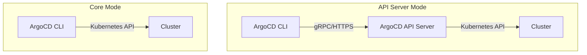

# How to Configure ArgoCD CLI with Your Cluster

Author: [nawazdhandala](https://github.com/nawazdhandala)

Tags: ArgoCD, GitOps, Kubernetes, CLI

Description: Learn how to configure the ArgoCD CLI to connect with your Kubernetes cluster, including authentication, context management, and CI/CD integration.

---

After installing the ArgoCD CLI, you need to configure it to talk to your ArgoCD server. This is not the same as configuring kubectl - the ArgoCD CLI has its own connection settings, authentication mechanism, and context system. Getting this right is essential for day-to-day operations and CI/CD automation.

This guide covers every connection method: direct login, token-based authentication, core mode, and multi-server setups.

## Understanding CLI Connection Modes

The ArgoCD CLI connects to your cluster in two ways:

1. **API Server mode** (default) - The CLI talks to the ArgoCD API server, which talks to Kubernetes
2. **Core mode** - The CLI talks directly to the Kubernetes API using your kubeconfig, bypassing the ArgoCD API server entirely



## Method 1: Connect via ArgoCD API Server

This is the standard approach. The CLI connects to the ArgoCD server using gRPC over HTTPS.

### Find Your ArgoCD Server Address

The server address depends on how you exposed ArgoCD.

```bash
# If using port-forward
kubectl port-forward svc/argocd-server -n argocd 8080:443 &
# Server address: localhost:8080

# If using LoadBalancer
kubectl get svc argocd-server -n argocd -o jsonpath='{.status.loadBalancer.ingress[0].ip}'
# Server address: <external-ip>

# If using Ingress
kubectl get ingress argocd-server-ingress -n argocd -o jsonpath='{.spec.rules[0].host}'
# Server address: argocd.yourdomain.com
```

### Login with Username and Password

```bash
# Login to ArgoCD server
argocd login <server-address> --username admin --password <password>

# If using self-signed certificates
argocd login <server-address> --username admin --password <password> --insecure

# Example with port-forward
argocd login localhost:8080 --username admin --password mypassword --insecure
```

After login, the CLI stores credentials in `~/.config/argocd/config`.

### Login with SSO

If ArgoCD is configured with SSO (OIDC, SAML, etc.):

```bash
# This opens your browser for SSO authentication
argocd login <server-address> --sso

# For headless environments (CI/CD), use SSO with a port redirect
argocd login <server-address> --sso --sso-port 8085
```

### Login with a Token

For automation and CI/CD, use an authentication token instead of interactive login.

```bash
# First, generate a token (do this once, interactively)
argocd account generate-token --account admin

# Then use the token for non-interactive login
export ARGOCD_AUTH_TOKEN="eyJhbGciOiJIUzI1NiIs..."
argocd login <server-address> --auth-token $ARGOCD_AUTH_TOKEN

# Or pass it directly
argocd app list --server <server-address> --auth-token $ARGOCD_AUTH_TOKEN
```

You can also create a dedicated service account for CI/CD:

```bash
# Create a CI/CD account in argocd-cm
kubectl patch configmap argocd-cm -n argocd --type merge \
  -p '{"data":{"accounts.cicd":"apiKey"}}'

# Set RBAC for the account
kubectl patch configmap argocd-rbac-cm -n argocd --type merge \
  -p '{"data":{"policy.csv":"p, role:cicd, applications, sync, */*, allow\ng, cicd, role:cicd"}}'

# Generate a token for the CI/CD account
argocd account generate-token --account cicd
```

## Method 2: Core Mode (Direct Kubernetes Access)

Core mode is useful when:
- You did not install the ArgoCD API server (core-only installation)
- You want to use your existing kubeconfig instead of ArgoCD credentials
- You want to manage ArgoCD from scripts without an API server

```bash
# Use core mode with a flag
argocd app list --core

# Or set it globally via environment variable
export ARGOCD_OPTS="--core"
argocd app list  # Now uses core mode by default

# Core mode uses your current kubeconfig context
kubectl config current-context
```

In core mode, the CLI reads Application CRDs directly from the Kubernetes API. You need kubectl-level access to the `argocd` namespace.

```bash
# Make sure you can access the argocd namespace
kubectl get applications -n argocd
```

## Managing Multiple ArgoCD Contexts

If you work with multiple ArgoCD instances (dev, staging, production), the CLI manages separate contexts.

```bash
# Login to multiple servers
argocd login argocd-dev.example.com --name dev --insecure
argocd login argocd-staging.example.com --name staging --insecure
argocd login argocd-prod.example.com --name prod --insecure

# List all contexts
argocd context

# Switch to a specific context
argocd context dev

# Run a command against a specific context without switching
argocd app list --server argocd-prod.example.com
```

### View and Edit the Config File

The CLI configuration is stored in a YAML file.

```bash
# Default config location
cat ~/.config/argocd/config
```

The config file structure:

```yaml
contexts:
- name: dev
  server: argocd-dev.example.com
  user: admin
- name: staging
  server: argocd-staging.example.com
  user: admin
- name: prod
  server: argocd-prod.example.com
  user: admin
current-context: dev
servers:
- grpc-web-root-path: ""
  server: argocd-dev.example.com
users:
- auth-token: eyJhbGciOiJIUzI1NiIs...
  name: admin
  refresh-token: eyJhbGciOiJSUzI1NiIs...
```

## CI/CD Integration

### GitHub Actions

```yaml
# .github/workflows/deploy.yaml
name: Deploy with ArgoCD
on:
  push:
    branches: [main]

jobs:
  deploy:
    runs-on: ubuntu-latest
    steps:
    - name: Install ArgoCD CLI
      run: |
        curl -sSL -o argocd https://github.com/argoproj/argo-cd/releases/latest/download/argocd-linux-amd64
        chmod +x argocd
        sudo mv argocd /usr/local/bin/

    - name: Sync Application
      env:
        ARGOCD_SERVER: ${{ secrets.ARGOCD_SERVER }}
        ARGOCD_AUTH_TOKEN: ${{ secrets.ARGOCD_AUTH_TOKEN }}
      run: |
        argocd app sync my-app \
          --server $ARGOCD_SERVER \
          --auth-token $ARGOCD_AUTH_TOKEN \
          --insecure
        argocd app wait my-app \
          --server $ARGOCD_SERVER \
          --auth-token $ARGOCD_AUTH_TOKEN \
          --insecure \
          --sync --health --timeout 300
```

### GitLab CI

```yaml
# .gitlab-ci.yml
deploy:
  image: argoproj/argocd:v2.13.3
  script:
    - argocd app sync my-app
      --server $ARGOCD_SERVER
      --auth-token $ARGOCD_AUTH_TOKEN
      --insecure
    - argocd app wait my-app
      --server $ARGOCD_SERVER
      --auth-token $ARGOCD_AUTH_TOKEN
      --insecure
      --sync --health --timeout 300
  variables:
    ARGOCD_SERVER: argocd.example.com
```

### Jenkins Pipeline

```groovy
pipeline {
    agent any
    environment {
        ARGOCD_AUTH_TOKEN = credentials('argocd-token')
        ARGOCD_SERVER = 'argocd.example.com'
    }
    stages {
        stage('Deploy') {
            steps {
                sh '''
                    curl -sSL -o argocd https://github.com/argoproj/argo-cd/releases/latest/download/argocd-linux-amd64
                    chmod +x argocd
                    ./argocd app sync my-app --server $ARGOCD_SERVER --auth-token $ARGOCD_AUTH_TOKEN --insecure
                    ./argocd app wait my-app --server $ARGOCD_SERVER --auth-token $ARGOCD_AUTH_TOKEN --insecure --sync --health
                '''
            }
        }
    }
}
```

## Connection Configuration Options

Here are all the ways to configure the CLI connection:

| Method | Best For | Example |
|---|---|---|
| `--server` flag | One-off commands | `argocd app list --server argocd.example.com` |
| `argocd login` | Interactive sessions | `argocd login argocd.example.com` |
| `ARGOCD_SERVER` env var | CI/CD pipelines | `export ARGOCD_SERVER=argocd.example.com` |
| `ARGOCD_AUTH_TOKEN` env var | Automated scripts | `export ARGOCD_AUTH_TOKEN=eyJ...` |
| `ARGOCD_OPTS` env var | Default flags | `export ARGOCD_OPTS="--insecure --core"` |
| Config file | Multi-server setups | `~/.config/argocd/config` |

## TLS Configuration

### Trust a Custom CA

If your ArgoCD server uses a certificate signed by a custom CA:

```bash
# Specify the CA cert
argocd login argocd.example.com --certificate-authority /path/to/ca.crt

# Or add it to the config
argocd login argocd.example.com --grpc-web-root-path "" --certificate-authority /path/to/ca.crt
```

### Skip TLS Verification

For development environments with self-signed certificates:

```bash
# Skip TLS verification
argocd login argocd.example.com --insecure

# Or set globally
export ARGOCD_OPTS="--insecure"
```

### gRPC-Web

If your proxy does not support HTTP/2 (needed for gRPC), use gRPC-Web:

```bash
argocd login argocd.example.com --grpc-web
```

## Troubleshooting

### "FATA[0000] rpc error: code = Unavailable"

The CLI cannot reach the ArgoCD server. Check:

```bash
# Is the server accessible?
curl -sk https://argocd.example.com/healthz

# Is port-forwarding active?
kubectl get svc argocd-server -n argocd
```

### "FATA[0000] rpc error: code = Unauthenticated"

Your token has expired or is invalid.

```bash
# Re-login
argocd login <server-address>

# Or generate a new token
argocd account generate-token
```

### "FATA[0000] dial tcp: lookup argocd.example.com: no such host"

DNS resolution is failing. Check your DNS configuration or use the IP address directly.

## Further Reading

- First-time login walkthrough: [Login to ArgoCD CLI](https://oneuptime.com/blog/post/2026-02-26-login-argocd-cli-first-time/view)
- Get the admin password: [Retrieve ArgoCD admin password](https://oneuptime.com/blog/post/2026-02-26-retrieve-argocd-admin-password/view)
- RBAC configuration: [ArgoCD RBAC](https://oneuptime.com/blog/post/2026-01-25-rbac-policies-argocd/view)

Configuring the ArgoCD CLI properly sets the foundation for everything you do with ArgoCD from the command line. Get the connection right once, set up your contexts, and the CLI becomes the fastest way to manage your GitOps workflows.
