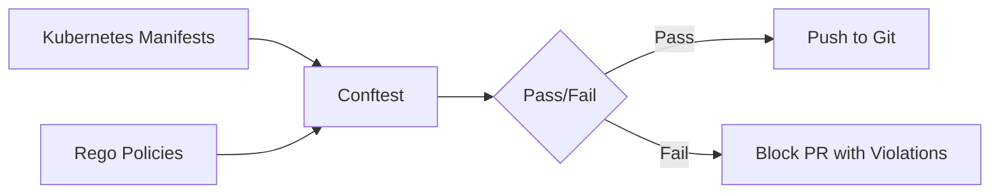

# How to Use Conftest to Test ArgoCD Policies

Author: [nawazdhandala](https://github.com/nawazdhandala)

Tags: ArgoCD, GitOps, Kubernetes, Conftest, Policy Testing

Description: Learn how to use Conftest with Open Policy Agent to test and enforce organizational policies on ArgoCD application manifests before deployment.

---

Schema validation tells you if your manifests are valid Kubernetes resources. Policy testing tells you if they meet your organization's standards. Did the developer set resource limits? Are they using an approved container registry? Do production deployments have at least 2 replicas?

Conftest uses Open Policy Agent (OPA) Rego policies to answer these questions. Combined with ArgoCD, it creates a policy enforcement layer that catches violations before they reach your clusters.

## What Conftest Does

Conftest evaluates structured data (YAML, JSON, HCL) against policies written in Rego. For Kubernetes manifests, this means you can enforce any rule you can express about the structure of your resources:



## Installing Conftest

```bash
# macOS
brew install conftest

# Linux
curl -sL https://github.com/open-policy-agent/conftest/releases/latest/download/conftest_Linux_x86_64.tar.gz | \
  sudo tar xz -C /usr/local/bin

# Docker
docker pull openpolicyagent/conftest:latest

# Verify
conftest --version
```

## Writing Your First Policy

Conftest policies live in a `policy/` directory by default. Each policy is a `.rego` file:

```bash
mkdir -p policy
```

### Policy: Require Resource Limits

```rego
# policy/resource_limits.rego
package main

# Deny deployments without resource limits
deny[msg] {
  input.kind == "Deployment"
  container := input.spec.template.spec.containers[_]
  not container.resources.limits
  msg := sprintf("Container '%s' in Deployment '%s' must have resource limits", [container.name, input.metadata.name])
}

# Deny deployments without resource requests
deny[msg] {
  input.kind == "Deployment"
  container := input.spec.template.spec.containers[_]
  not container.resources.requests
  msg := sprintf("Container '%s' in Deployment '%s' must have resource requests", [container.name, input.metadata.name])
}
```

Test it:

```bash
# Test against a manifest
conftest test apps/my-app/production/deployment.yaml

# Output if failing:
# FAIL - apps/my-app/production/deployment.yaml - main -
#   Container 'my-app' in Deployment 'my-app' must have resource limits
```

### Policy: Require Approved Container Registries

```rego
# policy/approved_registries.rego
package main

# List of approved registries
approved_registries := [
  "gcr.io/my-org",
  "us-docker.pkg.dev/my-org",
  "my-org.azurecr.io",
]

# Deny containers from unapproved registries
deny[msg] {
  input.kind == "Deployment"
  container := input.spec.template.spec.containers[_]
  image := container.image
  not approved_registry(image)
  msg := sprintf("Container '%s' uses unapproved image '%s'. Approved registries: %v", [container.name, image, approved_registries])
}

approved_registry(image) {
  registry := approved_registries[_]
  startswith(image, registry)
}
```

### Policy: Production Minimum Replicas

```rego
# policy/production_replicas.rego
package main

# Deny production deployments with fewer than 2 replicas
deny[msg] {
  input.kind == "Deployment"
  input.metadata.namespace == "production"
  replicas := input.spec.replicas
  replicas < 2
  msg := sprintf("Deployment '%s' in production must have at least 2 replicas, got %d", [input.metadata.name, replicas])
}
```

### Policy: Require Labels

```rego
# policy/required_labels.rego
package main

required_labels := ["app", "team", "environment"]

# Deny resources missing required labels
deny[msg] {
  input.kind == "Deployment"
  label := required_labels[_]
  not input.metadata.labels[label]
  msg := sprintf("Deployment '%s' is missing required label '%s'", [input.metadata.name, label])
}
```

## Testing Against Rendered Manifests

For Helm charts and Kustomize overlays, test against the rendered output:

```bash
# Test rendered Helm chart
helm template my-app ./charts/my-app \
  --values charts/my-app/values-production.yaml \
  --namespace production | \
  conftest test -

# Test rendered Kustomize overlay
kustomize build apps/my-app/overlays/production | \
  conftest test -
```

## Testing ArgoCD Application Resources

Write policies specifically for ArgoCD Application resources:

```rego
# policy/argocd_applications.rego
package main

# Deny ArgoCD applications without a project
deny[msg] {
  input.kind == "Application"
  input.apiVersion == "argoproj.io/v1alpha1"
  input.spec.project == "default"
  msg := sprintf("Application '%s' must not use the 'default' project. Assign it to a specific project.", [input.metadata.name])
}

# Deny ArgoCD applications with auto-sync in production
deny[msg] {
  input.kind == "Application"
  input.apiVersion == "argoproj.io/v1alpha1"
  input.spec.destination.namespace == "production"
  input.spec.syncPolicy.automated
  not input.spec.syncPolicy.automated.prune == false
  msg := sprintf("Application '%s' targeting production must not have auto-prune enabled", [input.metadata.name])
}

# Warn on applications without sync retry
warn[msg] {
  input.kind == "Application"
  input.apiVersion == "argoproj.io/v1alpha1"
  not input.spec.syncPolicy.retry
  msg := sprintf("Application '%s' should have a sync retry policy configured", [input.metadata.name])
}
```

## Using Warnings vs Denials

Conftest supports both `deny` (hard failure) and `warn` (advisory) rules:

```rego
# Hard failure - blocks the pipeline
deny[msg] {
  input.kind == "Deployment"
  not input.spec.template.spec.containers[0].resources.limits
  msg := "Deployment must have resource limits"
}

# Warning - shown but does not block
warn[msg] {
  input.kind == "Deployment"
  not input.spec.template.spec.containers[0].readinessProbe
  msg := "Deployment should have a readiness probe"
}
```

```bash
# Run with both deny and warn
conftest test deployment.yaml
# WARN - deployment.yaml - main - Deployment should have a readiness probe
# 1 test, 0 failures, 1 warning
```

## Organizing Policies

For larger organizations, organize policies by concern:

```
policy/
  security/
    no_privileged.rego
    approved_registries.rego
    no_host_network.rego
  reliability/
    resource_limits.rego
    health_probes.rego
    min_replicas.rego
  compliance/
    required_labels.rego
    required_annotations.rego
  argocd/
    project_assignment.rego
    sync_policy.rego
```

Use namespaces to control which policies apply:

```rego
# policy/security/no_privileged.rego
package security

deny[msg] {
  input.kind == "Deployment"
  container := input.spec.template.spec.containers[_]
  container.securityContext.privileged == true
  msg := sprintf("Container '%s' must not run in privileged mode", [container.name])
}
```

```bash
# Test only security policies
conftest test --namespace security deployment.yaml

# Test all policies
conftest test --all-namespaces deployment.yaml
```

## CI Pipeline Integration

```yaml
# GitHub Actions
name: Policy Validation
on:
  pull_request:
    paths:
    - 'apps/**'

jobs:
  conftest:
    runs-on: ubuntu-latest
    steps:
    - uses: actions/checkout@v4

    - name: Install Conftest
      run: |
        curl -sL https://github.com/open-policy-agent/conftest/releases/latest/download/conftest_Linux_x86_64.tar.gz | \
          sudo tar xz -C /usr/local/bin

    - name: Test plain manifests
      run: |
        conftest test --all-namespaces apps/*/production/*.yaml

    - name: Test Kustomize overlays
      run: |
        for overlay in apps/*/overlays/production; do
          kustomize build "$overlay" | conftest test --all-namespaces -
        done

    - name: Test ArgoCD applications
      run: |
        conftest test --namespace argocd argocd-apps/*.yaml
```

## Testing Policies Themselves

Rego policies can have bugs too. Write unit tests for your policies:

```rego
# policy/resource_limits_test.rego
package main

# Test that a deployment without limits is denied
test_deny_missing_limits {
  deny["Container 'app' in Deployment 'test' must have resource limits"] with input as {
    "kind": "Deployment",
    "metadata": {"name": "test"},
    "spec": {"template": {"spec": {"containers": [{"name": "app", "image": "test:v1"}]}}}
  }
}

# Test that a deployment with limits passes
test_allow_with_limits {
  count(deny) == 0 with input as {
    "kind": "Deployment",
    "metadata": {"name": "test"},
    "spec": {"template": {"spec": {"containers": [{
      "name": "app",
      "image": "test:v1",
      "resources": {"limits": {"cpu": "1", "memory": "512Mi"}, "requests": {"cpu": "500m", "memory": "256Mi"}}
    }]}}}
  }
}
```

Run policy tests:

```bash
conftest verify
# PASS - 2/2 - policy/resource_limits_test.rego
```

For monitoring policy compliance across your deployed applications, consider setting up dashboards with [OneUptime](https://oneuptime.com/blog/post/2026-02-26-argocd-alerts-outofsync-applications/view) to track applications that may have bypassed policy checks.

## Summary

Conftest with OPA Rego policies provides organizational policy enforcement for ArgoCD manifests. Write deny rules for hard requirements (resource limits, approved registries, production replica counts) and warn rules for best practices (health probes, annotations). Test policies against rendered Helm and Kustomize output. Write unit tests for the policies themselves. Integrate conftest into CI pipelines to catch violations on pull requests before manifests reach the GitOps repository. This creates a defense-in-depth approach where kubeconform validates schema correctness and conftest validates organizational compliance.
