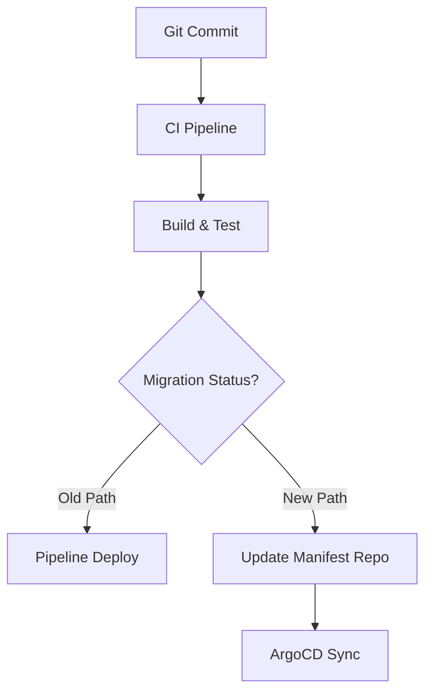

# How to Convince Your Team to Adopt GitOps

Author: [nawazdhandala](https://github.com/nawazdhandala)

Tags: ArgoCD, GitOps, Kubernetes, DevOps, Team Management

Description: Practical strategies for convincing engineering teams to adopt GitOps workflows including addressing common objections, building a proof of concept, and measuring success.

---

You have read the blog posts. You have watched the conference talks. You are convinced that GitOps is the right approach for your team's Kubernetes deployments. But convincing your team - engineers who have been doing CI/CD pipelines for years, managers who care about velocity, and security folks who worry about any change - is a different challenge entirely.

I have been through this process at three different organizations. Some adoptions succeeded, one failed spectacularly. Here is what I learned about making the case for GitOps in a way that actually sticks.

## Start with the Pain, Not the Technology

Nobody cares about GitOps as a concept. They care about their problems. Start by identifying the specific pains your team currently experiences:

**"We had a production incident because someone ran kubectl edit in prod"** - GitOps solves this with drift detection and self-healing.

**"We cannot figure out what changed when production broke"** - GitOps provides a complete Git audit trail.

**"Our staging environment drifts from production constantly"** - GitOps enforces consistency through identical reconciliation processes.

**"Three teams need cluster access for deployments, which is a security nightmare"** - GitOps eliminates the need for teams to have direct cluster access.

Write down the top three pains your team experiences. For each one, explain how GitOps addresses it specifically. Do not lead with "GitOps is the future." Lead with "here is how we fix the problem that cost us four hours last Tuesday."

## Address the Common Objections

Every team raises the same objections. Prepare for them:

### "This is just adding complexity"

This is the most common objection and it is partially valid. GitOps does add a new component (ArgoCD) to your infrastructure. The counter-argument is not that it is simple, but that it moves complexity from ad-hoc scripts to a managed system:

```yaml
# Before: Complex pipeline scripts that nobody understands
deploy:
  script: |
    aws eks update-kubeconfig --name prod-cluster
    helm upgrade --install app ./chart \
      --values values-prod.yaml \
      --set image.tag=$CI_COMMIT_SHA \
      --set replicas=5 \
      --wait --timeout 300s
    kubectl rollout status deployment/app -n production
    if [ $? -ne 0 ]; then
      helm rollback app
    fi

# After: Declarative configuration in Git
apiVersion: argoproj.io/v1alpha1
kind: Application
metadata:
  name: my-app
spec:
  source:
    repoURL: https://github.com/org/deploy
    path: apps/my-app/production
  syncPolicy:
    automated:
      selfHeal: true
```

The complexity does not disappear. It gets declared explicitly rather than buried in pipeline scripts.

### "Our developers already know how to use CI/CD"

GitOps does not replace CI/CD. It replaces the deployment step. Your CI pipeline still builds images, runs tests, and generates artifacts. The change is in how those artifacts reach the cluster:


Developers still commit code the same way. The CI pipeline still runs. The only change is that instead of `kubectl apply` at the end, the pipeline updates a manifest in a Git repository.

### "What about database migrations?"

This is a legitimate concern. GitOps handles this through ArgoCD sync hooks:

```yaml
apiVersion: batch/v1
kind: Job
metadata:
  name: db-migration
  annotations:
    argocd.argoproj.io/hook: PreSync
    argocd.argoproj.io/hook-delete-policy: HookSucceeded
spec:
  template:
    spec:
      containers:
      - name: migrate
        image: app:latest
        command: ["./migrate.sh"]
      restartPolicy: Never
```

Pre-sync hooks run database migrations before the application is deployed. If the migration fails, the sync stops.

### "We need canary deployments and progressive delivery"

GitOps works with progressive delivery tools like Argo Rollouts:

```yaml
apiVersion: argoproj.io/v1alpha1
kind: Rollout
metadata:
  name: my-app
spec:
  strategy:
    canary:
      steps:
      - setWeight: 10
      - pause: {duration: 5m}
      - setWeight: 50
      - pause: {duration: 10m}
```

GitOps does not mean all-at-once deployments. It means the deployment strategy is declared in Git alongside the application configuration.

## Build a Proof of Concept

Abstract arguments only go so far. Build a proof of concept that demonstrates the value:

1. **Pick a non-critical service**: Choose an internal tool or development-only service.
2. **Set up ArgoCD in a development cluster**: A single-namespace installation takes 10 minutes.
3. **Migrate one application**: Move it from pipeline-based deployment to GitOps.
4. **Demonstrate the key scenarios**:
   - Make a deployment by committing to Git
   - Show the audit trail in Git history
   - Manually change something in the cluster and watch ArgoCD revert it
   - Roll back by reverting a Git commit

```bash
# Quick PoC setup
kubectl create namespace argocd
kubectl apply -n argocd \
  -f https://raw.githubusercontent.com/argoproj/argo-cd/stable/manifests/install.yaml

# Create a demo application
argocd app create demo \
  --repo https://github.com/org/demo-app \
  --path k8s \
  --dest-server https://kubernetes.default.svc \
  --dest-namespace demo \
  --sync-policy automated
```

Let team members interact with it. The best way to overcome skepticism is hands-on experience.

## Build a Migration Plan, Not a Big Bang

The surest way to fail is to propose migrating everything to GitOps at once. Instead, propose a phased approach:

**Phase 1 (Week 1-2)**: Install ArgoCD. Migrate one non-critical service. Document the process.

**Phase 2 (Week 3-4)**: Migrate 3 to 5 development environment services. Let the team get comfortable.

**Phase 3 (Month 2)**: Migrate staging environment services. Refine Git repository structure.

**Phase 4 (Month 3)**: Begin migrating production services, starting with the least critical.

**Phase 5 (Month 4+)**: Complete production migration. Decommission old deployment pipelines.

Each phase has a clear checkpoint where the team evaluates whether to continue.

## Measure and Share Results

After the PoC, measure concrete improvements:

- **Deployment frequency**: How often are deployments happening? GitOps typically increases deployment frequency because deployments become less scary.
- **Mean time to recovery**: How quickly can you roll back? Git revert is faster than re-running a pipeline.
- **Drift incidents**: How many times has the cluster state diverged from the intended state? GitOps makes this visible.
- **Time spent on deployment issues**: Track the hours your team spends troubleshooting deployment failures.

Share these numbers with your team and management. "We reduced our mean time to recovery from 45 minutes to 3 minutes" is more convincing than any architectural diagram.

## Get Management Buy-In

Managers care about different things than engineers. Frame the conversation around:

- **Risk reduction**: GitOps provides automatic drift detection and reversion. Fewer production incidents from unauthorized changes.
- **Compliance**: Complete audit trail of every deployment change, who made it, and when. This matters for SOC2, HIPAA, and PCI compliance.
- **Velocity**: Teams can deploy more frequently with less risk.
- **Cost**: Fewer incidents means less on-call burden and fewer engineering hours spent on firefighting.

## Handle the Transition Gracefully

During the transition, run both systems in parallel. Do not rip out CI/CD pipelines before GitOps is proven:



This lets teams compare the two approaches side by side and builds confidence before committing fully.

For monitoring your GitOps adoption progress, setting up dashboards with [OneUptime](https://oneuptime.com/blog/post/2026-02-26-argocd-alerts-outofsync-applications/view) can help track sync success rates across your fleet.

## Summary

Convincing your team to adopt GitOps requires leading with pain points, not technology. Address common objections about complexity, developer experience, and specific scenarios like database migrations. Build a small proof of concept that demonstrates tangible value. Propose a phased migration plan with clear checkpoints. Measure concrete improvements and share them with both engineering and management. The goal is not to sell GitOps as an ideology but to demonstrate it as a practical solution to real problems your team faces today.
