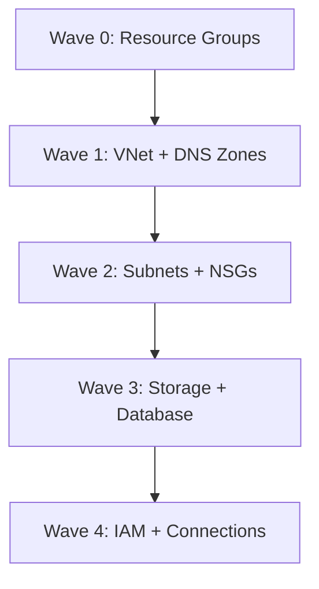

# How to Manage Azure Resources with Crossplane and ArgoCD

Author: [nawazdhandala](https://github.com/nawazdhandala)

Tags: ArgoCD, GitOps, Kubernetes, Crossplane, Azure

Description: Learn how to provision and manage Azure resources like SQL databases, storage accounts, and virtual networks using Crossplane and ArgoCD for a unified GitOps infrastructure workflow.

---

Azure resource management through Crossplane and ArgoCD follows the same pattern as any other Kubernetes workload: define it in YAML, commit to Git, and let the GitOps pipeline handle provisioning. Instead of clicking through the Azure Portal or running `az` CLI commands, your entire Azure infrastructure becomes declarative manifests managed by ArgoCD.

This guide covers setting up the Crossplane Azure provider and managing common Azure resources through a GitOps workflow.

## Installing the Azure Provider

With Crossplane already running in your cluster, install the Azure providers:

```yaml
# crossplane/provider-azure.yaml
apiVersion: pkg.crossplane.io/v1
kind: Provider
metadata:
  name: provider-azure-storage
spec:
  package: xpkg.upbound.io/upbound/provider-azure-storage:v1.0.0
---
apiVersion: pkg.crossplane.io/v1
kind: Provider
metadata:
  name: provider-azure-dbforpostgresql
spec:
  package: xpkg.upbound.io/upbound/provider-azure-dbforpostgresql:v1.0.0
---
apiVersion: pkg.crossplane.io/v1
kind: Provider
metadata:
  name: provider-azure-network
spec:
  package: xpkg.upbound.io/upbound/provider-azure-network:v1.0.0
---
apiVersion: pkg.crossplane.io/v1
kind: Provider
metadata:
  name: provider-azure-azure
spec:
  package: xpkg.upbound.io/upbound/provider-azure-azure:v1.0.0
```

## Configuring Azure Authentication

Create an Azure Service Principal and configure the provider:

```bash
# Create a service principal for Crossplane
az ad sp create-for-rbac \
  --name "crossplane-provider" \
  --role Contributor \
  --scopes /subscriptions/YOUR_SUBSCRIPTION_ID \
  --sdk-auth
```

Store the credentials as a Kubernetes Secret:

```yaml
apiVersion: v1
kind: Secret
metadata:
  name: azure-credentials
  namespace: crossplane-system
type: Opaque
stringData:
  credentials: |
    {
      "clientId": "...",
      "clientSecret": "...",
      "subscriptionId": "...",
      "tenantId": "...",
      "activeDirectoryEndpointUrl": "https://login.microsoftonline.com",
      "resourceManagerEndpointUrl": "https://management.azure.com/",
      "activeDirectoryGraphResourceId": "https://graph.windows.net/",
      "sqlManagementEndpointUrl": "https://management.core.windows.net:8443/",
      "galleryEndpointUrl": "https://gallery.azure.com/",
      "managementEndpointUrl": "https://management.core.windows.net/"
    }
---
apiVersion: azure.upbound.io/v1beta1
kind: ProviderConfig
metadata:
  name: default
spec:
  credentials:
    source: Secret
    secretRef:
      namespace: crossplane-system
      name: azure-credentials
      key: credentials
```

For AKS clusters, use Pod Identity or Workload Identity for stronger security:

```yaml
apiVersion: azure.upbound.io/v1beta1
kind: ProviderConfig
metadata:
  name: default
spec:
  credentials:
    source: SystemAssignedManagedIdentity
```

## Managing Resource Groups

Every Azure resource needs a resource group. Create them through Crossplane:

```yaml
# azure/resource-groups.yaml
apiVersion: azure.upbound.io/v1beta1
kind: ResourceGroup
metadata:
  name: app-production-rg
spec:
  forProvider:
    location: eastus
    tags:
      environment: production
      managed-by: crossplane
      team: platform
  providerConfigRef:
    name: default
```

## Provisioning Azure Database for PostgreSQL

Create a flexible server PostgreSQL instance:

```yaml
# azure/database/app-postgres.yaml
apiVersion: dbforpostgresql.azure.upbound.io/v1beta1
kind: FlexibleServer
metadata:
  name: app-postgres
  labels:
    app: my-application
spec:
  forProvider:
    resourceGroupNameRef:
      name: app-production-rg
    location: eastus

    version: "15"
    skuName: GP_Standard_D2s_v3
    storageMb: 65536

    administratorLogin: pgadmin
    administratorPasswordSecretRef:
      name: postgres-admin-password
      namespace: crossplane-system
      key: password

    # Use private networking
    delegatedSubnetIdRef:
      name: postgres-subnet
    privateDnsZoneIdRef:
      name: postgres-private-dns

    backup:
      - geoRedundantBackupEnabled: true
        backupRetentionDays: 14

    highAvailability:
      - mode: ZoneRedundant
        standbyAvailabilityZone: "2"

    maintenanceWindow:
      - dayOfWeek: 0
        startHour: 3
        startMinute: 0

    tags:
      environment: production
      managed-by: crossplane

  writeConnectionSecretToRef:
    name: app-postgres-connection
    namespace: default
---
# Create a database on the server
apiVersion: dbforpostgresql.azure.upbound.io/v1beta1
kind: FlexibleServerDatabase
metadata:
  name: myapp-db
spec:
  forProvider:
    serverIdRef:
      name: app-postgres
    charset: UTF8
    collation: en_US.utf8
---
# Firewall rule for AKS subnet access
apiVersion: dbforpostgresql.azure.upbound.io/v1beta1
kind: FlexibleServerFirewallRule
metadata:
  name: allow-aks-subnet
spec:
  forProvider:
    serverIdRef:
      name: app-postgres
    startIpAddress: 10.0.0.0
    endIpAddress: 10.0.255.255
```

## Managing Storage Accounts

Create Azure Storage accounts for blob storage, queues, and tables:

```yaml
# azure/storage/app-storage.yaml
apiVersion: storage.azure.upbound.io/v1beta1
kind: Account
metadata:
  name: myappstorage
  labels:
    app: my-application
spec:
  forProvider:
    resourceGroupNameRef:
      name: app-production-rg
    location: eastus

    accountTier: Standard
    accountReplicationType: GRS
    accountKind: StorageV2
    minTlsVersion: TLS1_2

    blobProperties:
      - deleteRetentionPolicy:
          - days: 30
        containerDeleteRetentionPolicy:
          - days: 7
        versioningEnabled: true

    networkRules:
      - defaultAction: Deny
        bypass:
          - AzureServices
        virtualNetworkSubnetIdRefs:
          - name: app-subnet

    tags:
      environment: production
      managed-by: crossplane
  providerConfigRef:
    name: default
---
# Create a blob container
apiVersion: storage.azure.upbound.io/v1beta1
kind: Container
metadata:
  name: app-uploads
spec:
  forProvider:
    storageAccountNameRef:
      name: myappstorage
    containerAccessType: private
```

## Creating Virtual Networks

Set up the networking foundation:

```yaml
# azure/networking/vnet.yaml
apiVersion: network.azure.upbound.io/v1beta1
kind: VirtualNetwork
metadata:
  name: app-vnet
spec:
  forProvider:
    resourceGroupNameRef:
      name: app-production-rg
    location: eastus
    addressSpace:
      - 10.0.0.0/16
    tags:
      environment: production
  providerConfigRef:
    name: default
---
apiVersion: network.azure.upbound.io/v1beta1
kind: Subnet
metadata:
  name: app-subnet
spec:
  forProvider:
    resourceGroupNameRef:
      name: app-production-rg
    virtualNetworkNameRef:
      name: app-vnet
    addressPrefixes:
      - 10.0.1.0/24
    serviceEndpoints:
      - Microsoft.Storage
      - Microsoft.Sql
---
apiVersion: network.azure.upbound.io/v1beta1
kind: Subnet
metadata:
  name: postgres-subnet
spec:
  forProvider:
    resourceGroupNameRef:
      name: app-production-rg
    virtualNetworkNameRef:
      name: app-vnet
    addressPrefixes:
      - 10.0.2.0/24
    delegation:
      - name: postgresql
        serviceDelegation:
          - name: Microsoft.DBforPostgreSQL/flexibleServers
            actions:
              - Microsoft.Network/virtualNetworks/subnets/join/action
---
# Private DNS zone for PostgreSQL
apiVersion: network.azure.upbound.io/v1beta1
kind: PrivateDNSZone
metadata:
  name: postgres-private-dns
spec:
  forProvider:
    resourceGroupNameRef:
      name: app-production-rg
    name: myapp.private.postgres.database.azure.com
---
apiVersion: network.azure.upbound.io/v1beta1
kind: PrivateDNSZoneVirtualNetworkLink
metadata:
  name: postgres-dns-link
spec:
  forProvider:
    resourceGroupNameRef:
      name: app-production-rg
    privateDnsZoneNameRef:
      name: postgres-private-dns
    virtualNetworkIdRef:
      name: app-vnet
    registrationEnabled: false
```

## ArgoCD Application for Azure Resources

```yaml
apiVersion: argoproj.io/v1alpha1
kind: Application
metadata:
  name: azure-infrastructure
  namespace: argocd
spec:
  project: infrastructure
  source:
    repoURL: https://github.com/myorg/gitops-repo.git
    targetRevision: main
    path: azure
    directory:
      recurse: true
  destination:
    server: https://kubernetes.default.svc
  syncPolicy:
    automated:
      prune: false
      selfHeal: true
    syncOptions:
      - RespectIgnoreDifferences=true
  ignoreDifferences:
    - group: dbforpostgresql.azure.upbound.io
      kind: FlexibleServer
      jsonPointers:
        - /spec/forProvider/version
```

## Dependency Ordering with Sync Waves

Azure resources have complex dependencies. Order them with sync waves:



```yaml
# Resource groups first
metadata:
  annotations:
    argocd.argoproj.io/sync-wave: "0"

# Networking second
metadata:
  annotations:
    argocd.argoproj.io/sync-wave: "1"

# Subnets depend on VNet
metadata:
  annotations:
    argocd.argoproj.io/sync-wave: "2"

# Databases and storage after networking
metadata:
  annotations:
    argocd.argoproj.io/sync-wave: "3"
```

## Monitoring Azure Resource Health

Track provisioning status and health:

```bash
# Check all Azure managed resources
kubectl get managed -l crossplane.io/provider-azure

# Get detailed status of a specific resource
kubectl describe flexibleserver app-postgres

# Check for errors
kubectl get managed -o custom-columns=\
NAME:.metadata.name,\
READY:.status.conditions[?(@.type=='Ready')].status,\
SYNCED:.status.conditions[?(@.type=='Synced')].status
```

For managing GCP resources with the same pattern, see our guide on [GCP resources with Crossplane and ArgoCD](https://oneuptime.com/blog/post/2026-02-26-crossplane-argocd-gcp-resources/view). For AWS, see [AWS resources with Crossplane and ArgoCD](https://oneuptime.com/blog/post/2026-02-26-crossplane-argocd-aws-resources/view). Use OneUptime to monitor the availability and performance of your Crossplane-provisioned Azure resources.

## Best Practices

1. **Use Managed Identity** - Prefer Azure Managed Identity over service principal secrets.
2. **Disable auto-prune** - Set `prune: false` for infrastructure to prevent accidental deletion.
3. **Use private networking** - Connect databases and storage through VNet service endpoints or private endpoints.
4. **Enable geo-redundancy** - Use GRS for storage and zone-redundant HA for databases in production.
5. **Resource group per environment** - Separate production and staging into different resource groups.
6. **Tag consistently** - Apply environment, team, and managed-by tags to all resources.
7. **Start with storage** - Storage accounts are the safest Azure resource to start with before moving to databases and networking.

Crossplane and ArgoCD bring GitOps discipline to Azure infrastructure management. Your entire cloud environment becomes a set of YAML files in Git, with full audit trail, peer review, and automated provisioning.
