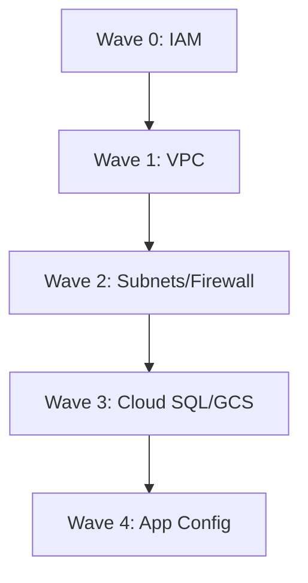

# How to Manage GCP Resources with Crossplane and ArgoCD

Author: [nawazdhandala](https://github.com/nawazdhandala)

Tags: ArgoCD, GitOps, Kubernetes, Crossplane, GCP

Description: Learn how to provision and manage Google Cloud Platform resources like Cloud SQL, GCS buckets, and VPC networks using Crossplane and ArgoCD for GitOps-driven infrastructure management.

---

Google Cloud Platform resources can be managed the same way you manage Kubernetes workloads - through YAML manifests in Git. Crossplane's GCP provider translates Kubernetes custom resources into actual GCP API calls, and ArgoCD ensures your Git repository stays in sync with reality. The result is a single GitOps workflow for both your applications and your cloud infrastructure.

This guide walks through setting up the Crossplane GCP provider and managing common GCP resources through ArgoCD.

## Installing the GCP Provider

After Crossplane is installed in your cluster, add the GCP provider:

```yaml
# crossplane/provider-gcp.yaml
apiVersion: pkg.crossplane.io/v1
kind: Provider
metadata:
  name: provider-gcp-storage
spec:
  package: xpkg.upbound.io/upbound/provider-gcp-storage:v1.0.0
---
apiVersion: pkg.crossplane.io/v1
kind: Provider
metadata:
  name: provider-gcp-sql
spec:
  package: xpkg.upbound.io/upbound/provider-gcp-sql:v1.0.0
---
apiVersion: pkg.crossplane.io/v1
kind: Provider
metadata:
  name: provider-gcp-compute
spec:
  package: xpkg.upbound.io/upbound/provider-gcp-compute:v1.0.0
---
apiVersion: pkg.crossplane.io/v1
kind: Provider
metadata:
  name: provider-gcp-cloudplatform
spec:
  package: xpkg.upbound.io/upbound/provider-gcp-cloudplatform:v1.0.0
```

## Configuring GCP Authentication

The recommended approach uses Workload Identity for GKE clusters:

```yaml
# crossplane/gcp-provider-config.yaml
apiVersion: gcp.upbound.io/v1beta1
kind: ProviderConfig
metadata:
  name: default
spec:
  projectID: my-gcp-project
  credentials:
    source: InjectedIdentity
```

For non-GKE clusters or development environments, use a service account key:

```yaml
apiVersion: v1
kind: Secret
metadata:
  name: gcp-credentials
  namespace: crossplane-system
type: Opaque
stringData:
  credentials.json: |
    {
      "type": "service_account",
      "project_id": "my-gcp-project",
      "private_key_id": "...",
      "private_key": "...",
      "client_email": "crossplane@my-gcp-project.iam.gserviceaccount.com",
      ...
    }
---
apiVersion: gcp.upbound.io/v1beta1
kind: ProviderConfig
metadata:
  name: default
spec:
  projectID: my-gcp-project
  credentials:
    source: Secret
    secretRef:
      namespace: crossplane-system
      name: gcp-credentials
      key: credentials.json
```

## Managing Cloud Storage Buckets

Create and configure GCS buckets:

```yaml
# gcp/storage/app-assets-bucket.yaml
apiVersion: storage.gcp.upbound.io/v1beta1
kind: Bucket
metadata:
  name: my-app-assets
  labels:
    app: my-application
    environment: production
spec:
  forProvider:
    location: US
    storageClass: STANDARD
    uniformBucketLevelAccess: true

    versioning:
      - enabled: true

    lifecycleRule:
      - action:
          - type: Delete
        condition:
          - age: 365
            withState: ARCHIVED

    labels:
      environment: production
      managed-by: crossplane
  providerConfigRef:
    name: default
---
# Bucket IAM binding
apiVersion: storage.gcp.upbound.io/v1beta1
kind: BucketIAMMember
metadata:
  name: my-app-assets-reader
spec:
  forProvider:
    bucketRef:
      name: my-app-assets
    role: roles/storage.objectViewer
    member: serviceAccount:my-app@my-gcp-project.iam.gserviceaccount.com
```

## Provisioning Cloud SQL Instances

Create a PostgreSQL Cloud SQL instance:

```yaml
# gcp/sql/app-database.yaml
apiVersion: sql.gcp.upbound.io/v1beta1
kind: DatabaseInstance
metadata:
  name: app-database
  labels:
    app: my-application
spec:
  forProvider:
    region: us-central1
    databaseVersion: POSTGRES_15

    settings:
      - tier: db-custom-2-8192
        availabilityType: REGIONAL

        ipConfiguration:
          - ipv4Enabled: false
            privateNetworkRef:
              name: app-vpc

        backupConfiguration:
          - enabled: true
            startTime: "03:00"
            pointInTimeRecoveryEnabled: true
            transactionLogRetentionDays: 7
            backupRetentionSettings:
              - retainedBackups: 14

        maintenanceWindow:
          - day: 7
            hour: 4
            updateTrack: stable

        insightsConfig:
          - queryInsightsEnabled: true
            queryStringLength: 1024
            recordApplicationTags: true

        databaseFlags:
          - name: log_min_duration_statement
            value: "1000"
          - name: max_connections
            value: "200"

    deletionProtection: true
  providerConfigRef:
    name: default
---
# Create the database
apiVersion: sql.gcp.upbound.io/v1beta1
kind: Database
metadata:
  name: app-db
spec:
  forProvider:
    instanceRef:
      name: app-database
    charset: UTF8
    collation: en_US.UTF8
---
# Create a user
apiVersion: sql.gcp.upbound.io/v1beta1
kind: User
metadata:
  name: app-db-user
spec:
  forProvider:
    instanceRef:
      name: app-database
    passwordSecretRef:
      name: cloud-sql-password
      namespace: crossplane-system
      key: password
  writeConnectionSecretToRef:
    name: app-database-connection
    namespace: default
```

## Managing VPC Networks

Create a VPC with subnets for your GKE cluster and Cloud SQL:

```yaml
# gcp/networking/vpc.yaml
apiVersion: compute.gcp.upbound.io/v1beta1
kind: Network
metadata:
  name: app-vpc
spec:
  forProvider:
    autoCreateSubnetworks: false
    routingMode: REGIONAL
  providerConfigRef:
    name: default
---
apiVersion: compute.gcp.upbound.io/v1beta1
kind: Subnetwork
metadata:
  name: app-subnet-primary
spec:
  forProvider:
    region: us-central1
    networkRef:
      name: app-vpc
    ipCidrRange: 10.0.0.0/20
    privateIpGoogleAccess: true

    secondaryIpRange:
      - rangeName: pods
        ipCidrRange: 10.4.0.0/14
      - rangeName: services
        ipCidrRange: 10.8.0.0/20
  providerConfigRef:
    name: default
---
# Private Service Access for Cloud SQL
apiVersion: compute.gcp.upbound.io/v1beta1
kind: GlobalAddress
metadata:
  name: private-ip-range
spec:
  forProvider:
    purpose: VPC_PEERING
    addressType: INTERNAL
    prefixLength: 16
    networkRef:
      name: app-vpc
---
apiVersion: servicenetworking.gcp.upbound.io/v1beta1
kind: Connection
metadata:
  name: private-service-connection
spec:
  forProvider:
    networkRef:
      name: app-vpc
    reservedPeeringRanges:
      - private-ip-range
    service: servicenetworking.googleapis.com
```

## Managing IAM Service Accounts

Create GCP service accounts and bind permissions:

```yaml
# gcp/iam/app-service-account.yaml
apiVersion: cloudplatform.gcp.upbound.io/v1beta1
kind: ServiceAccount
metadata:
  name: my-app-sa
spec:
  forProvider:
    displayName: "My Application Service Account"
    description: "Service account for the application workload"
  providerConfigRef:
    name: default
---
apiVersion: cloudplatform.gcp.upbound.io/v1beta1
kind: ProjectIAMMember
metadata:
  name: my-app-sa-storage
spec:
  forProvider:
    project: my-gcp-project
    role: roles/storage.objectAdmin
    member: serviceAccount:my-app-sa@my-gcp-project.iam.gserviceaccount.com
---
apiVersion: cloudplatform.gcp.upbound.io/v1beta1
kind: ProjectIAMMember
metadata:
  name: my-app-sa-sql
spec:
  forProvider:
    project: my-gcp-project
    role: roles/cloudsql.client
    member: serviceAccount:my-app-sa@my-gcp-project.iam.gserviceaccount.com
---
# Workload Identity binding for GKE
apiVersion: cloudplatform.gcp.upbound.io/v1beta1
kind: ServiceAccountIAMMember
metadata:
  name: my-app-workload-identity
spec:
  forProvider:
    serviceAccountIdRef:
      name: my-app-sa
    role: roles/iam.workloadIdentityUser
    member: serviceAccount:my-gcp-project.svc.id.goog[default/my-app]
```

## ArgoCD Application for GCP Resources

Set up an ArgoCD Application to manage all GCP infrastructure:

```yaml
apiVersion: argoproj.io/v1alpha1
kind: Application
metadata:
  name: gcp-infrastructure
  namespace: argocd
spec:
  project: infrastructure
  source:
    repoURL: https://github.com/myorg/gitops-repo.git
    targetRevision: main
    path: gcp
    directory:
      recurse: true
  destination:
    server: https://kubernetes.default.svc
  syncPolicy:
    automated:
      prune: false
      selfHeal: true
    syncOptions:
      - RespectIgnoreDifferences=true
  ignoreDifferences:
    - group: sql.gcp.upbound.io
      kind: DatabaseInstance
      jsonPointers:
        - /spec/forProvider/settings/0/tier
```

Setting `prune: false` for infrastructure is recommended to prevent accidental deletion of databases and storage.

## Sync Wave Ordering

GCP resources have dependencies. Use sync waves:

```yaml
# Wave 0: IAM and service accounts
# Wave 1: VPC networking
# Wave 2: Firewall rules and subnets
# Wave 3: Cloud SQL, GCS, and other services
# Wave 4: Application-level configurations
```



## Monitoring Crossplane Resources

Check the status of your GCP resources:

```bash
# List all managed GCP resources
kubectl get managed -l crossplane.io/provider-gcp

# Check a specific resource
kubectl describe databaseinstance app-database

# Watch for readiness
kubectl get databaseinstance app-database -w
```

Crossplane resources have conditions that show their provisioning state. The `Ready` condition turns `True` when the resource is fully provisioned and available.

For managing AWS resources with the same pattern, see our guide on [managing AWS resources with Crossplane and ArgoCD](https://oneuptime.com/blog/post/2026-02-26-crossplane-argocd-aws-resources/view). Use OneUptime to monitor the availability of your Crossplane-managed GCP resources and get alerts when provisioning fails.

## Best Practices

1. **Use Workload Identity** - Avoid service account key files. Workload Identity is more secure and easier to manage.
2. **Set deletion protection** - Enable deletion protection on databases and critical storage resources.
3. **Disable auto-prune for infrastructure** - Use `prune: false` to prevent accidental resource deletion.
4. **Use Compositions for self-service** - Let teams create databases through simple claims without needing GCP expertise.
5. **Tag resources consistently** - Use labels on all GCP resources for cost allocation and management.
6. **Monitor provisioning time** - GCP resources like Cloud SQL can take 10 to 15 minutes to provision. Set appropriate health check timeouts in ArgoCD.
7. **Use private networking** - Always use private IPs for Cloud SQL and other sensitive resources. Disable public IP access.

Managing GCP resources through Crossplane and ArgoCD brings the same GitOps discipline to your cloud infrastructure that you already apply to your Kubernetes workloads. Define it in YAML, commit to Git, and let the pipeline handle the rest.
