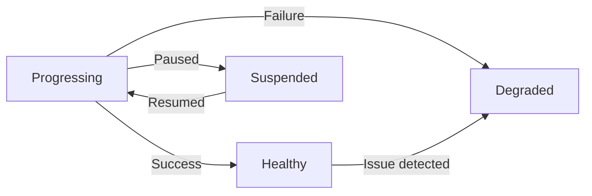

# How to Use Custom Health Checks for CRD Resources in ArgoCD

Author: [nawazdhandala](https://github.com/nawazdhandala)

Tags: ArgoCD, GitOps, Kubernetes, CRDs, Health Checks

Description: Learn how to write custom Lua health checks in ArgoCD so it correctly understands the health status of your CRD-based resources.

---

ArgoCD knows how to check the health of built-in Kubernetes resources like Deployments, Services, and StatefulSets. But when you deploy Custom Resource Definitions, ArgoCD has no idea what "healthy" means for your custom resources. Without custom health checks, ArgoCD will either always show your CRs as healthy (when they might be broken) or always show them as progressing (blocking your sync waves). Writing custom health checks in Lua fixes this.

## Why Default Health Checks Fall Short

By default, ArgoCD applies a generic health check to unknown resource types. It looks for a `.status.conditions` field and tries to interpret it. If your custom resource does not follow that convention, or uses a different status structure, ArgoCD either marks it as "Missing" or "Healthy" regardless of its actual state.

Consider a custom database resource:

```yaml
apiVersion: databases.example.com/v1
kind: PostgresCluster
metadata:
  name: my-db
status:
  phase: "Initializing"
  ready: false
  conditions:
    - type: Ready
      status: "False"
      reason: "DatabaseStarting"
```

ArgoCD might show this as Healthy because the resource exists, even though the database is still starting up. That is a problem when you have sync waves that depend on the database being ready.

## Where to Define Custom Health Checks

Custom health checks are defined in the `argocd-cm` ConfigMap in the `argocd` namespace. The key format is:

```
resource.customizations.health.<group>_<kind>
```

For example, for a `PostgresCluster` in the `databases.example.com` group:

```yaml
apiVersion: v1
kind: ConfigMap
metadata:
  name: argocd-cm
  namespace: argocd
data:
  resource.customizations.health.databases.example.com_PostgresCluster: |
    hs = {}
    if obj.status ~= nil then
      if obj.status.phase == "Running" and obj.status.ready == true then
        hs.status = "Healthy"
        hs.message = "Database is running and ready"
      elseif obj.status.phase == "Failed" then
        hs.status = "Degraded"
        hs.message = obj.status.message or "Database has failed"
      else
        hs.status = "Progressing"
        hs.message = "Database is " .. (obj.status.phase or "unknown")
      end
    else
      hs.status = "Progressing"
      hs.message = "Waiting for status"
    end
    return hs
```

## Understanding the Lua Health Check API

The Lua script receives `obj`, which is the full Kubernetes resource object. You must return a table with these fields:

- `hs.status` - One of: `Healthy`, `Progressing`, `Degraded`, `Suspended`, `Missing`
- `hs.message` - A human-readable message explaining the status

Here is what each status means:



- **Healthy** - Resource is operating normally
- **Progressing** - Resource is still reconciling. ArgoCD waits in sync waves.
- **Degraded** - Resource has a problem. Shown as a warning.
- **Suspended** - Resource is intentionally paused.
- **Missing** - Resource does not exist.

## Real-World Examples

### Cert-Manager Certificate Health Check

```yaml
resource.customizations.health.cert-manager.io_Certificate: |
  hs = {}
  if obj.status ~= nil then
    if obj.status.conditions ~= nil then
      for i, condition in ipairs(obj.status.conditions) do
        if condition.type == "Ready" then
          if condition.status == "True" then
            hs.status = "Healthy"
            hs.message = "Certificate is ready"
            return hs
          elseif condition.status == "False" then
            if condition.reason == "Failed" then
              hs.status = "Degraded"
              hs.message = condition.message or "Certificate failed"
              return hs
            end
          end
        end
      end
    end
  end
  hs.status = "Progressing"
  hs.message = "Waiting for certificate to be issued"
  return hs
```

### Sealed Secrets Health Check

```yaml
resource.customizations.health.bitnami.com_SealedSecret: |
  hs = {}
  if obj.status ~= nil then
    if obj.status.conditions ~= nil then
      for i, condition in ipairs(obj.status.conditions) do
        if condition.type == "Synced" then
          if condition.status == "True" then
            hs.status = "Healthy"
            hs.message = "SealedSecret has been decrypted"
            return hs
          else
            hs.status = "Degraded"
            hs.message = condition.message or "Failed to decrypt"
            return hs
          end
        end
      end
    end
  end
  hs.status = "Progressing"
  hs.message = "Waiting for SealedSecret to sync"
  return hs
```

### Kafka Topic Health Check (Strimzi)

```yaml
resource.customizations.health.kafka.strimzi.io_KafkaTopic: |
  hs = {}
  if obj.status ~= nil then
    if obj.status.conditions ~= nil then
      for i, condition in ipairs(obj.status.conditions) do
        if condition.type == "Ready" then
          if condition.status == "True" then
            hs.status = "Healthy"
            hs.message = "Topic is ready"
            return hs
          else
            hs.status = "Degraded"
            hs.message = condition.message or "Topic not ready"
            return hs
          end
        end
      end
    end
  end
  hs.status = "Progressing"
  hs.message = "Waiting for topic creation"
  return hs
```

### Prometheus ServiceMonitor Health Check

ServiceMonitors do not have a status field. They are configuration objects - if they exist, they are healthy:

```yaml
resource.customizations.health.monitoring.coreos.com_ServiceMonitor: |
  hs = {}
  hs.status = "Healthy"
  hs.message = "ServiceMonitor is configured"
  return hs
```

This is the simplest possible health check. It prevents ArgoCD from showing ServiceMonitors with an unknown health status.

## Handling Complex Status Structures

Some CRDs use deeply nested status fields. The Lua script can navigate these:

```yaml
resource.customizations.health.kustomize.toolkit.fluxcd.io_Kustomization: |
  hs = {}
  if obj.status ~= nil then
    if obj.status.conditions ~= nil then
      -- Look for the Ready condition
      local ready = false
      local readyMessage = ""
      local reconciling = false

      for i, condition in ipairs(obj.status.conditions) do
        if condition.type == "Ready" then
          if condition.status == "True" then
            ready = true
            readyMessage = condition.message or ""
          elseif condition.reason == "ProgressingWithRetry" then
            hs.status = "Degraded"
            hs.message = condition.message or "Reconciliation failing"
            return hs
          end
        end
        if condition.type == "Reconciling" and condition.status == "True" then
          reconciling = true
        end
      end

      if ready then
        hs.status = "Healthy"
        hs.message = readyMessage
        return hs
      end

      if reconciling then
        hs.status = "Progressing"
        hs.message = "Reconciliation in progress"
        return hs
      end
    end

    -- Check observedGeneration to detect stale status
    if obj.status.observedGeneration ~= nil and obj.metadata.generation ~= nil then
      if obj.status.observedGeneration < obj.metadata.generation then
        hs.status = "Progressing"
        hs.message = "Waiting for controller to process update"
        return hs
      end
    end
  end

  hs.status = "Progressing"
  hs.message = "Waiting for status"
  return hs
```

## Testing Health Checks Locally

You can test your Lua health checks without deploying them to ArgoCD. Use the `argocd admin` CLI tool:

```bash
# Save your Lua script to a file
cat > health.lua << 'EOF'
hs = {}
if obj.status ~= nil then
  if obj.status.phase == "Running" then
    hs.status = "Healthy"
    hs.message = "Running"
  else
    hs.status = "Progressing"
    hs.message = obj.status.phase or "Unknown"
  end
else
  hs.status = "Progressing"
  hs.message = "No status"
end
return hs
EOF

# Test with a sample resource
cat > resource.json << 'EOF'
{
  "apiVersion": "databases.example.com/v1",
  "kind": "PostgresCluster",
  "metadata": {"name": "test"},
  "status": {"phase": "Running", "ready": true}
}
EOF

# Run the health check
argocd admin settings resource-overrides health resource.json \
  --argocd-cm-path argocd-cm.yaml
```

## Using observedGeneration for Accuracy

Many well-designed CRDs include `status.observedGeneration` which tells you the last generation the controller processed. Comparing it against `metadata.generation` prevents reporting stale health:

```yaml
resource.customizations.health.apps.example.com_MyApp: |
  hs = {}
  if obj.status ~= nil then
    -- Check if controller has seen the latest spec
    if obj.metadata.generation ~= nil and obj.status.observedGeneration ~= nil then
      if obj.status.observedGeneration < obj.metadata.generation then
        hs.status = "Progressing"
        hs.message = "Controller processing update (gen " ..
          tostring(obj.status.observedGeneration) .. " / " ..
          tostring(obj.metadata.generation) .. ")"
        return hs
      end
    end

    if obj.status.ready == true then
      hs.status = "Healthy"
      hs.message = "Application is ready"
    else
      hs.status = "Progressing"
      hs.message = obj.status.message or "Waiting for readiness"
    end
  else
    hs.status = "Progressing"
    hs.message = "Waiting for status"
  end
  return hs
```

## Summary

Custom health checks bridge the gap between ArgoCD and your CRD-based resources. Without them, ArgoCD cannot correctly assess whether your custom resources are actually working. Write Lua scripts that check the specific status fields your CRD uses, handle edge cases like missing status or stale generations, and test them locally before deploying. The effort pays off immediately - your sync waves work correctly, your dashboard shows accurate health, and you catch real problems instead of seeing false greens.
