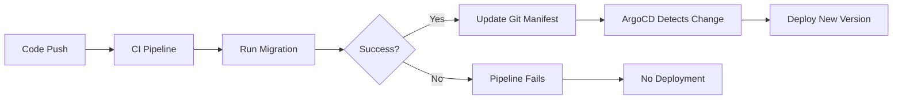

# How to Handle Database Changes with ArgoCD GitOps

Author: [nawazdhandala](https://github.com/nawazdhandala)

Tags: ArgoCD, GitOps, Kubernetes, Database, Migrations

Description: Learn strategies for managing database schema migrations and changes within an ArgoCD GitOps workflow without breaking deployments.

---

Database migrations are the thorn in the side of every GitOps workflow. Your application code deploys cleanly through ArgoCD, but database schema changes do not fit the declarative model. You cannot just "apply" a database state the way you apply Kubernetes manifests. Migrations are sequential, stateful, and often irreversible.

This guide covers the practical strategies for handling database changes in an ArgoCD-managed environment.

## Why Database Migrations Are Hard for GitOps

GitOps works on a simple principle: the desired state is in Git, and the tool reconciles the cluster to match. But database migrations break this model in several ways.

1. **Migrations are imperative, not declarative**: You run migration steps in order. You cannot just declare "the database should look like this."
2. **Migrations are stateful**: The migration that needs to run depends on the current database state.
3. **Migrations are often irreversible**: A sync retry should not re-run a migration that already completed.
4. **Timing matters**: The migration must run before the new application code starts.

## Strategy 1: Init Container Migrations

The most common approach is running migrations as an init container in the application's Deployment. The migration runs before the application container starts.

```yaml
apiVersion: apps/v1
kind: Deployment
metadata:
  name: my-api
spec:
  replicas: 3
  selector:
    matchLabels:
      app: my-api
  template:
    spec:
      initContainers:
        - name: run-migrations
          image: my-api:v2.0.0
          command: ["./migrate", "up"]
          env:
            - name: DATABASE_URL
              valueFrom:
                secretKeyRef:
                  name: db-credentials
                  key: url
      containers:
        - name: my-api
          image: my-api:v2.0.0
          ports:
            - containerPort: 8080
```

**Pros**:
- Simple to implement
- Migration runs before the app starts
- ArgoCD does not need special configuration
- Works with any migration tool (Flyway, Liquibase, golang-migrate, Alembic)

**Cons**:
- Every pod runs the migration on startup (most tools handle this with locking)
- Slow migrations delay pod readiness
- If migration fails, the pod never starts (which is actually a safety feature)
- Rolling updates mean old pods run alongside new pods during migration

**Making it safe**: Most migration tools support advisory locking, which means only one instance runs the migration while others wait.

```yaml
initContainers:
  - name: run-migrations
    image: my-api:v2.0.0
    command:
      - ./migrate
      - up
      - --lock-timeout=60s  # Wait up to 60s for the migration lock
```

## Strategy 2: Kubernetes Job with Sync Waves

Use an ArgoCD sync wave to run a migration Job before the Deployment updates.

```yaml
# Migration Job - runs first (sync wave -1)
apiVersion: batch/v1
kind: Job
metadata:
  name: my-api-migration-v2-0-0
  annotations:
    argocd.argoproj.io/sync-wave: "-1"
    argocd.argoproj.io/hook: PreSync
    argocd.argoproj.io/hook-delete-policy: HookSucceeded
spec:
  template:
    spec:
      restartPolicy: Never
      containers:
        - name: migrate
          image: my-api:v2.0.0
          command: ["./migrate", "up"]
          env:
            - name: DATABASE_URL
              valueFrom:
                secretKeyRef:
                  name: db-credentials
                  key: url
  backoffLimit: 3
---
# Application Deployment - runs after migration (sync wave 0)
apiVersion: apps/v1
kind: Deployment
metadata:
  name: my-api
  annotations:
    argocd.argoproj.io/sync-wave: "0"
spec:
  replicas: 3
  template:
    spec:
      containers:
        - name: my-api
          image: my-api:v2.0.0
```

**Pros**:
- Migration runs exactly once per deployment
- If migration fails, the deployment does not proceed
- Clear separation between migration and application
- ArgoCD UI shows the migration status

**Cons**:
- Job names must be unique per version (or use `hook-delete-policy`)
- Need to manage Job cleanup
- More complex manifest management

The `argocd.argoproj.io/hook: PreSync` annotation tells ArgoCD to run this Job before the main sync. The `HookSucceeded` delete policy removes the Job after it completes successfully.

## Strategy 3: Operator-Managed Migrations

Some database operators (like SchemaHero or Atlas Operator) provide a declarative way to manage schemas that works naturally with GitOps.

```yaml
# Using SchemaHero
apiVersion: schemas.schemahero.io/v1alpha4
kind: Migration
metadata:
  name: create-users-table
spec:
  databaseName: my-database
  tableSchema:
    postgres:
      primaryKey:
        - id
      columns:
        - name: id
          type: uuid
          default: uuid_generate_v4()
        - name: email
          type: varchar(255)
          constraints:
            notNull: true
        - name: created_at
          type: timestamp
          default: now()
```

**Pros**:
- Declarative - fits the GitOps model
- Operator handles migration ordering and rollback
- ArgoCD manages the Migration resources like any other Kubernetes resource

**Cons**:
- Additional operator to install and maintain
- May not support all migration scenarios
- Less control over migration SQL

## Strategy 4: CI Pipeline Migrations (Outside ArgoCD)

Run migrations in your CI pipeline before updating the Git manifests that ArgoCD watches. This keeps migrations completely separate from the GitOps workflow.

```yaml
# GitHub Actions workflow
name: Deploy
on:
  push:
    branches: [main]
jobs:
  migrate:
    runs-on: ubuntu-latest
    steps:
      - uses: actions/checkout@v4
      - name: Run database migrations
        run: |
          # Connect to the database and run migrations
          DATABASE_URL=${{ secrets.DATABASE_URL }}
          ./migrate up
      - name: Update deployment manifest
        run: |
          # Only update the manifest after migration succeeds
          yq e '.spec.template.spec.containers[0].image = "my-api:${{ github.sha }}"' \
            -i k8s/production/deployment.yaml
          git commit -am "Deploy my-api:${{ github.sha }}"
          git push
```



**Pros**:
- Migration failures prevent deployment entirely
- No ArgoCD-specific configuration needed
- Works with any migration tool
- Clear separation of concerns

**Cons**:
- CI needs database access (may require VPN or bastion)
- Migration is not visible in ArgoCD
- Does not follow pure GitOps (migration happens outside the Git-to-cluster flow)

## Handling Backward Compatibility

Regardless of which strategy you use, your migrations must be backward compatible during rollouts. During a rolling update, old and new application versions run simultaneously.

**Expand-and-contract pattern**: Split breaking changes into multiple migrations.

```
# Step 1: Add new column (backward compatible)
ALTER TABLE users ADD COLUMN email_new VARCHAR(255);

# Step 2: Deploy new code that writes to both columns
# (application update via ArgoCD)

# Step 3: Migrate data
UPDATE users SET email_new = email WHERE email_new IS NULL;

# Step 4: Deploy code that reads from new column
# (another application update via ArgoCD)

# Step 5: Drop old column
ALTER TABLE users DROP COLUMN email;
```

Each step is a separate deployment. This is more work but prevents any downtime or errors during the migration.

## Rollback Considerations

GitOps rollback (reverting a Git commit) works for application code but is tricky for databases.

**Forward-only migrations**: Many teams adopt a forward-only approach. If a migration has a problem, you create a new migration to fix it rather than trying to roll back.

**Reversible migrations**: If you need rollback capability, make sure every migration has a corresponding down migration.

```bash
# Migration files
migrations/
  001_create_users_up.sql
  001_create_users_down.sql
  002_add_email_up.sql
  002_add_email_down.sql
```

**Separate rollback Job**: You can create a rollback Job in ArgoCD that runs the down migration.

## Monitoring Migration Health

Failed migrations can leave your database in an inconsistent state. Monitor migration status alongside your ArgoCD deployments.

[OneUptime](https://oneuptime.com) can monitor your application health after deployments and alert you when database-related errors spike, which often indicates a migration issue.

The key takeaway is that database migrations require explicit handling in a GitOps workflow. The init container approach is the simplest starting point, and the PreSync Job approach gives you the most control. Choose the strategy that matches your team's complexity needs and evolve as you encounter more demanding scenarios.
