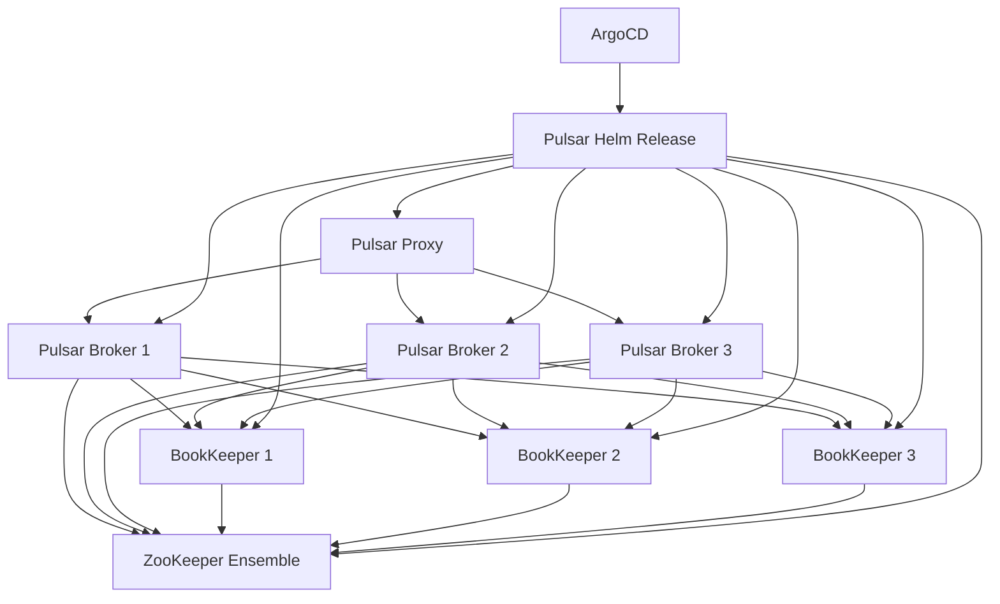

# How to Deploy Apache Pulsar with ArgoCD

Author: [nawazdhandala](https://github.com/nawazdhandala)

Tags: ArgoCD, GitOps, Kubernetes, Apache Pulsar, Messaging

Description: Learn how to deploy Apache Pulsar on Kubernetes using ArgoCD for GitOps-managed event streaming with multi-tenancy, tiered storage, and geo-replication.

---

Apache Pulsar is a distributed messaging and event streaming platform designed for multi-tenancy, geo-replication, and tiered storage. Its architecture separates compute (brokers) from storage (BookKeeper), allowing independent scaling of each layer. Deploying Pulsar on Kubernetes is complex because of its multiple components, but ArgoCD makes it manageable by keeping the entire configuration in Git and automating reconciliation.

This guide covers deploying Pulsar with all its components - ZooKeeper, BookKeeper, brokers, and proxies - using ArgoCD and the official Pulsar Helm chart.

## Prerequisites

- Kubernetes cluster (1.25+) with at least 6 nodes
- ArgoCD installed and configured
- A Git repository for manifests
- Fast storage class (SSD-backed) for BookKeeper journals

## Understanding Pulsar Architecture



- **ZooKeeper** - metadata storage and coordination
- **BookKeeper** - persistent message storage
- **Brokers** - handle produce and consume operations
- **Proxy** - stateless entry point for clients

## Step 1: Deploy Pulsar with ArgoCD

The Apache Pulsar Helm chart is the recommended way to deploy on Kubernetes.

```yaml
# argocd/pulsar.yaml
apiVersion: argoproj.io/v1alpha1
kind: Application
metadata:
  name: pulsar-production
  namespace: argocd
  finalizers:
    - resources-finalizer.argocd.argoproj.io
spec:
  project: default
  source:
    chart: pulsar
    repoURL: https://pulsar.apache.org/charts
    targetRevision: 3.5.0
    helm:
      releaseName: pulsar
      values: |
        # ZooKeeper configuration
        zookeeper:
          replicaCount: 3
          resources:
            requests:
              cpu: 200m
              memory: 512Mi
            limits:
              cpu: "1"
              memory: 1Gi
          volumes:
            data:
              size: 20Gi
              storageClassName: gp3-encrypted
          configData:
            PULSAR_MEM: "-Xms256m -Xmx512m"

        # BookKeeper configuration
        bookkeeper:
          replicaCount: 3
          resources:
            requests:
              cpu: "1"
              memory: 4Gi
            limits:
              cpu: "2"
              memory: 8Gi
          volumes:
            journal:
              size: 50Gi
              storageClassName: gp3-io2  # Fast SSD for journals
            ledgers:
              size: 200Gi
              storageClassName: gp3-encrypted
          configData:
            PULSAR_MEM: "-Xms2g -Xmx4g -XX:MaxDirectMemorySize=2g"
            # Journal configuration
            journalMaxGroupWaitMSec: "1"
            journalAdaptiveGroupWrites: "true"
            # Ledger configuration
            managedLedgerDefaultEnsembleSize: "3"
            managedLedgerDefaultWriteQuorum: "3"
            managedLedgerDefaultAckQuorum: "2"

        # Broker configuration
        broker:
          replicaCount: 3
          resources:
            requests:
              cpu: "2"
              memory: 4Gi
            limits:
              cpu: "4"
              memory: 8Gi
          configData:
            PULSAR_MEM: "-Xms2g -Xmx4g -XX:MaxDirectMemorySize=2g"
            # Retention
            defaultRetentionTimeInMinutes: "10080"  # 7 days
            defaultRetentionSizeInMB: "-1"
            # Performance tuning
            maxMessageSize: "5242880"  # 5MB
            brokerDeduplicationEnabled: "true"
            # Schema enforcement
            isSchemaValidationEnforced: "true"
            schemaCompatibilityStrategy: "BACKWARD"
          podAntiAffinity:
            zone: true

        # Proxy configuration
        proxy:
          replicaCount: 2
          resources:
            requests:
              cpu: 500m
              memory: 1Gi
            limits:
              cpu: "2"
              memory: 2Gi
          service:
            type: ClusterIP
          configData:
            PULSAR_MEM: "-Xms512m -Xmx1g"

        # Pulsar Manager (UI)
        pulsar_manager:
          enabled: true
          resources:
            requests:
              cpu: 100m
              memory: 256Mi
            limits:
              cpu: 500m
              memory: 512Mi

        # Monitoring
        monitoring:
          prometheus: true
          grafana: false  # Use external Grafana

        # Authentication
        auth:
          authentication:
            enabled: true
            provider: jwt
            usingSecretKey: true
          superUsers:
            broker: "admin"
            proxy: "proxy-admin"
            client: "super-user"
  destination:
    server: https://kubernetes.default.svc
    namespace: pulsar
  syncPolicy:
    automated:
      prune: false
      selfHeal: true
    syncOptions:
      - CreateNamespace=true
      - ServerSideApply=true
    retry:
      limit: 10
      backoff:
        duration: 60s
        factor: 2
        maxDuration: 30m
```

The retry configuration is generous because Pulsar has many components that start in sequence. ZooKeeper must be ready before BookKeeper, and BookKeeper must be ready before brokers.

## Step 2: Generate JWT Tokens for Authentication

Create a Job that generates JWT keys and tokens for Pulsar authentication.

```yaml
# pulsar/jwt-setup.yaml
apiVersion: batch/v1
kind: Job
metadata:
  name: pulsar-jwt-init
  namespace: pulsar
  annotations:
    argocd.argoproj.io/hook: PreSync
    argocd.argoproj.io/hook-delete-policy: BeforeHookCreation
spec:
  template:
    spec:
      containers:
        - name: jwt-init
          image: apachepulsar/pulsar:3.3.0
          command:
            - /bin/bash
            - -c
            - |
              # Check if secret already exists
              if kubectl get secret pulsar-token-keys -n pulsar 2>/dev/null; then
                echo "JWT keys already exist, skipping"
                exit 0
              fi

              # Generate secret key
              bin/pulsar tokens create-secret-key \
                --output /tmp/secret.key

              # Generate tokens for each role
              ADMIN_TOKEN=$(bin/pulsar tokens create \
                --secret-key /tmp/secret.key \
                --subject admin)

              PROXY_TOKEN=$(bin/pulsar tokens create \
                --secret-key /tmp/secret.key \
                --subject proxy-admin)

              CLIENT_TOKEN=$(bin/pulsar tokens create \
                --secret-key /tmp/secret.key \
                --subject super-user)

              # Create Kubernetes secret
              kubectl create secret generic pulsar-token-keys \
                -n pulsar \
                --from-file=SECRETKEY=/tmp/secret.key \
                --from-literal=ADMIN_TOKEN=$ADMIN_TOKEN \
                --from-literal=PROXY_TOKEN=$PROXY_TOKEN \
                --from-literal=CLIENT_TOKEN=$CLIENT_TOKEN

              rm /tmp/secret.key
      serviceAccountName: pulsar-jwt-init
      restartPolicy: OnFailure
  backoffLimit: 3
```

## Step 3: Configure Tenants and Namespaces

Pulsar's multi-tenancy model uses tenants and namespaces. Set them up with a PostSync hook.

```yaml
# pulsar/tenant-setup.yaml
apiVersion: batch/v1
kind: Job
metadata:
  name: pulsar-tenant-setup
  namespace: pulsar
  annotations:
    argocd.argoproj.io/hook: PostSync
    argocd.argoproj.io/hook-delete-policy: BeforeHookCreation
spec:
  template:
    spec:
      containers:
        - name: setup
          image: apachepulsar/pulsar:3.3.0
          command:
            - /bin/bash
            - -c
            - |
              # Wait for brokers
              until bin/pulsar-admin \
                --admin-url http://pulsar-broker.pulsar.svc:8080 \
                brokers list; do
                echo "Waiting for Pulsar brokers..."
                sleep 10
              done

              # Create tenants
              bin/pulsar-admin tenants create platform \
                --admin-url http://pulsar-broker.pulsar.svc:8080 \
                || echo "Tenant platform exists"

              bin/pulsar-admin tenants create analytics \
                --admin-url http://pulsar-broker.pulsar.svc:8080 \
                || echo "Tenant analytics exists"

              # Create namespaces
              bin/pulsar-admin namespaces create platform/orders \
                --admin-url http://pulsar-broker.pulsar.svc:8080 \
                || echo "Namespace exists"

              bin/pulsar-admin namespaces create platform/notifications \
                --admin-url http://pulsar-broker.pulsar.svc:8080 \
                || echo "Namespace exists"

              # Set retention policies
              bin/pulsar-admin namespaces set-retention \
                platform/orders \
                --admin-url http://pulsar-broker.pulsar.svc:8080 \
                --size -1 \
                --time 7d

              echo "Tenant and namespace setup complete"
      restartPolicy: OnFailure
  backoffLimit: 3
```

## Step 4: Configure Tiered Storage

Pulsar's tiered storage offloads old data from BookKeeper to object storage, reducing costs.

Add this to your broker configuration:

```yaml
broker:
  configData:
    # Tiered storage - S3
    managedLedgerOffloadDriver: "aws-s3"
    s3ManagedLedgerOffloadBucket: "pulsar-tiered-storage"
    s3ManagedLedgerOffloadRegion: "us-east-1"
    managedLedgerOffloadAutoTriggerSizeThresholdBytes: "1073741824"  # 1GB
```

## Step 5: Monitoring Integration

With Prometheus monitoring enabled, Pulsar exposes metrics on each component. Create ServiceMonitors for comprehensive observability.

```yaml
# pulsar/monitoring.yaml
apiVersion: monitoring.coreos.com/v1
kind: ServiceMonitor
metadata:
  name: pulsar-broker-monitor
  namespace: pulsar
  labels:
    release: prometheus
spec:
  selector:
    matchLabels:
      component: broker
  endpoints:
    - port: http
      path: /metrics
      interval: 30s
---
apiVersion: monitoring.coreos.com/v1
kind: ServiceMonitor
metadata:
  name: pulsar-bookkeeper-monitor
  namespace: pulsar
  labels:
    release: prometheus
spec:
  selector:
    matchLabels:
      component: bookkeeper
  endpoints:
    - port: http
      path: /metrics
      interval: 30s
```

Monitor key metrics with [OneUptime](https://oneuptime.com) for alerting on backlog growth, broker load, and BookKeeper storage utilization.

## Scaling Components

One of Pulsar's key advantages is independent component scaling:

```yaml
# Scale brokers for more throughput
broker:
  replicaCount: 5  # was 3

# Scale BookKeeper for more storage
bookkeeper:
  replicaCount: 5  # was 3

# Scale proxy for more client connections
proxy:
  replicaCount: 4  # was 2
```

Commit, push, and ArgoCD handles the rest. Brokers and proxies are stateless, so scaling them is fast. BookKeeper nodes require data rebalancing which the system handles automatically.

## Conclusion

Deploying Apache Pulsar with ArgoCD tames the complexity of its multi-component architecture. By defining ZooKeeper, BookKeeper, brokers, and proxies in a single Helm values file, and managing tenants and namespaces through PostSync hooks, you get a fully GitOps-managed streaming platform. The retry configuration is essential since Pulsar components have strict startup ordering. Use tiered storage to manage costs, enable JWT authentication for security, and monitor all components to catch issues before they affect your event streaming pipeline.
