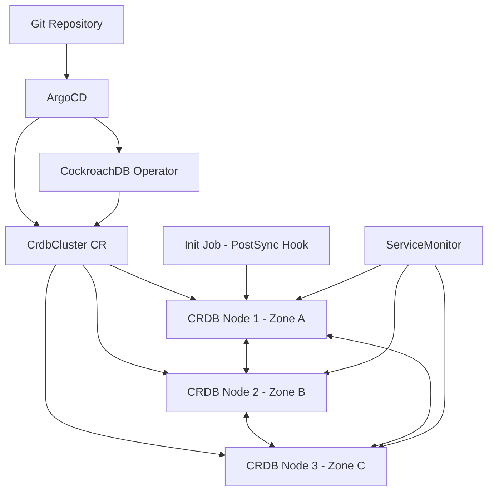

# How to Deploy CockroachDB with ArgoCD

Author: [nawazdhandala](https://github.com/nawazdhandala)

Tags: ArgoCD, GitOps, Kubernetes, CockroachDB, Database

Description: Learn how to deploy CockroachDB distributed SQL database on Kubernetes using ArgoCD for GitOps-driven provisioning, scaling, and lifecycle management.

---

CockroachDB is a distributed SQL database designed for global scale, strong consistency, and automated failover. Running it on Kubernetes is natural since both systems embrace distributed architectures. But deploying and managing CockroachDB manually introduces drift and risk. With ArgoCD, your entire CockroachDB deployment - from the operator to cluster topology - is declared in Git and automatically reconciled.

This guide walks through deploying the CockroachDB Operator via ArgoCD, provisioning clusters, configuring multi-region topologies, and handling the stateful nuances that come with database management through GitOps.

## Prerequisites

- Kubernetes cluster (1.25+)
- ArgoCD installed and running
- A Git repository for manifests
- Storage class with dynamic provisioning

## Step 1: Deploy the CockroachDB Operator

CockroachDB provides an official Kubernetes operator. Install it through an ArgoCD Application.

```yaml
# argocd/cockroachdb-operator.yaml
apiVersion: argoproj.io/v1alpha1
kind: Application
metadata:
  name: cockroachdb-operator
  namespace: argocd
  finalizers:
    - resources-finalizer.argocd.argoproj.io
spec:
  project: default
  source:
    repoURL: https://github.com/your-org/k8s-manifests.git
    targetRevision: main
    path: operators/cockroachdb
  destination:
    server: https://kubernetes.default.svc
    namespace: cockroach-operator-system
  syncPolicy:
    automated:
      prune: true
      selfHeal: true
    syncOptions:
      - CreateNamespace=true
      - ServerSideApply=true
```

Place the operator manifests in your Git repository. Download them from the CockroachDB releases:

```yaml
# operators/cockroachdb/kustomization.yaml
apiVersion: kustomize.config.k8s.io/v1beta1
kind: Kustomization
resources:
  - https://raw.githubusercontent.com/cockroachdb/cockroach-operator/v2.14.0/install/operator.yaml
patches:
  - target:
      kind: Deployment
      name: cockroach-operator-manager
    patch: |
      - op: replace
        path: /spec/replicas
        value: 2
```

## Step 2: Define a CockroachDB Cluster

Create a `CrdbCluster` custom resource that describes your desired database topology.

```yaml
# databases/cockroachdb/production-cluster.yaml
apiVersion: crdb.cockroachlabs.com/v1alpha1
kind: CrdbCluster
metadata:
  name: production-crdb
  namespace: databases
spec:
  # Number of nodes in the cluster
  nodes: 3

  # CockroachDB version
  cockroachDBVersion: v24.2.4

  # Data store configuration
  dataStore:
    pvc:
      spec:
        accessModes:
          - ReadWriteOnce
        resources:
          requests:
            storage: 100Gi
        storageClassName: gp3-encrypted
        volumeMode: Filesystem

  # Resource allocation
  resources:
    requests:
      cpu: "2"
      memory: 8Gi
    limits:
      cpu: "4"
      memory: 16Gi

  # TLS configuration
  tlsEnabled: true

  # Pod placement
  affinity:
    podAntiAffinity:
      preferredDuringSchedulingIgnoredDuringExecution:
        - weight: 100
          podAffinityTerm:
            labelSelector:
              matchLabels:
                app.kubernetes.io/instance: production-crdb
            topologyKey: kubernetes.io/hostname

  # Topology spread for zone distribution
  topologySpreadConstraints:
    - maxSkew: 1
      topologyKey: topology.kubernetes.io/zone
      whenUnsatisfiable: DoNotSchedule
      labelSelector:
        matchLabels:
          app.kubernetes.io/instance: production-crdb

  # Additional command-line flags
  additionalArgs:
    - "--cache=2GB"
    - "--max-sql-memory=2GB"
    - "--locality=region=us-east-1"
```

## Step 3: Create the ArgoCD Application for Clusters

```yaml
# argocd/cockroachdb-clusters.yaml
apiVersion: argoproj.io/v1alpha1
kind: Application
metadata:
  name: cockroachdb-clusters
  namespace: argocd
spec:
  project: default
  source:
    repoURL: https://github.com/your-org/k8s-manifests.git
    targetRevision: main
    path: databases/cockroachdb
  destination:
    server: https://kubernetes.default.svc
    namespace: databases
  syncPolicy:
    automated:
      prune: false  # Never auto-delete database clusters
      selfHeal: true
    syncOptions:
      - CreateNamespace=true
```

## Step 4: Initialize the Cluster

CockroachDB requires a one-time initialization after the pods are running. You can handle this with a Kubernetes Job that runs during sync.

```yaml
# databases/cockroachdb/init-job.yaml
apiVersion: batch/v1
kind: Job
metadata:
  name: crdb-init
  namespace: databases
  annotations:
    argocd.argoproj.io/sync-wave: "2"
    argocd.argoproj.io/hook: PostSync
    argocd.argoproj.io/hook-delete-policy: HookSucceeded
spec:
  template:
    spec:
      containers:
        - name: init
          image: cockroachdb/cockroach:v24.2.4
          command:
            - /cockroach/cockroach
            - init
            - --host=production-crdb-0.production-crdb.databases.svc.cluster.local
            - --certs-dir=/cockroach/cockroach-certs
          volumeMounts:
            - name: client-certs
              mountPath: /cockroach/cockroach-certs
      volumes:
        - name: client-certs
          projected:
            sources:
              - secret:
                  name: production-crdb-node
                  items:
                    - key: ca.crt
                      path: ca.crt
                    - key: tls.crt
                      path: client.root.crt
                    - key: tls.key
                      path: client.root.key
      restartPolicy: OnFailure
```

Using the `PostSync` hook means this Job runs only after ArgoCD successfully applies all the cluster manifests. The `HookSucceeded` delete policy cleans up the Job after it completes.

## Step 5: Custom Health Check

```yaml
# argocd-cm ConfigMap
data:
  resource.customizations.health.crdb.cockroachlabs.com_CrdbCluster: |
    hs = {}
    if obj.status ~= nil then
      if obj.status.clusterStatus == "Initialized" then
        hs.status = "Healthy"
        hs.message = "CockroachDB cluster is initialized and running"
      elseif obj.status.clusterStatus == "Creating" or
             obj.status.clusterStatus == "Initializing" then
        hs.status = "Progressing"
        hs.message = obj.status.clusterStatus
      else
        hs.status = "Degraded"
        hs.message = obj.status.clusterStatus or "Unknown"
      end
    else
      hs.status = "Progressing"
      hs.message = "Waiting for cluster status"
    end
    return hs
```

## Step 6: Configure Monitoring

CockroachDB exposes a Prometheus-compatible metrics endpoint. Create a ServiceMonitor to scrape it.

```yaml
# databases/cockroachdb/service-monitor.yaml
apiVersion: monitoring.coreos.com/v1
kind: ServiceMonitor
metadata:
  name: production-crdb-monitor
  namespace: databases
  labels:
    release: prometheus
spec:
  selector:
    matchLabels:
      app.kubernetes.io/instance: production-crdb
  endpoints:
    - port: http
      path: /_status/vars
      interval: 30s
```

## Architecture Overview



## Scaling the Cluster

To add nodes, update the `nodes` field in your CrdbCluster manifest:

```yaml
spec:
  nodes: 5  # was 3
```

CockroachDB automatically rebalances data across the new nodes. ArgoCD syncs the change, and the operator provisions the additional pods with their persistent volumes.

## Decommissioning Nodes Safely

When scaling down, CockroachDB needs to decommission nodes before they are removed to ensure data is migrated. The operator handles this automatically when you reduce the node count. However, this process takes time depending on data volume. Configure a longer sync timeout in ArgoCD:

```yaml
spec:
  syncPolicy:
    syncOptions:
      - ApplyOutOfSyncOnly=true
    retry:
      limit: 5
      backoff:
        duration: 5s
        factor: 2
        maxDuration: 10m
```

## Handling Version Upgrades

CockroachDB supports rolling upgrades. Update the version in your manifest:

```yaml
spec:
  cockroachDBVersion: v24.3.0  # was v24.2.4
```

The operator performs a rolling restart, one node at a time, and finalizes the upgrade after all nodes are running the new version. Monitor the upgrade progress in the CockroachDB admin UI or through your monitoring stack with [OneUptime](https://oneuptime.com).

## Conclusion

Deploying CockroachDB through ArgoCD gives you a production-grade distributed SQL database that is fully managed through Git. The combination of the CockroachDB Operator for lifecycle management and ArgoCD for declarative deployment ensures your database infrastructure is consistent, auditable, and easy to scale. Key practices: use PostSync hooks for initialization, disable auto-pruning, spread nodes across availability zones, and configure proper health checks for accurate ArgoCD status reporting.
