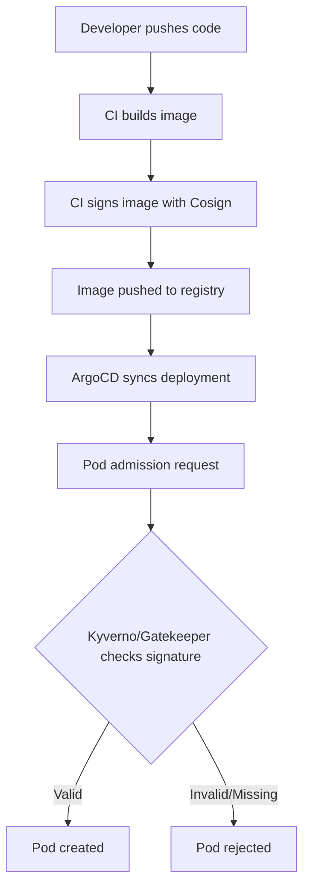

# How to Deploy Cosign Verification Policies with ArgoCD

Author: [nawazdhandala](https://github.com/nawazdhandala)

Tags: ArgoCD, GitOps, Kubernetes, Cosign, Security

Description: Learn how to deploy and enforce container image signature verification policies using Cosign, Kyverno, and ArgoCD for supply chain security.

---

Container image signing and verification is a critical part of software supply chain security. Cosign, part of the Sigstore project, lets you sign container images with cryptographic signatures. But signing alone is not enough - you also need to verify those signatures at deployment time. By deploying verification policies through ArgoCD, you create a GitOps-managed supply chain security gate that ensures only signed and trusted images run in your clusters.

This guide covers setting up image signature verification using Cosign with either Kyverno or OPA Gatekeeper as the policy engine, all managed through ArgoCD.

## Understanding Image Signing with Cosign

Cosign provides several signing methods:

- **Key-pair signing**: Traditional public/private key pairs
- **Keyless signing**: Uses OIDC identity (GitHub, Google, etc.) with Fulcio and Rekor transparency log
- **Attestation verification**: Verifies build provenance and SBOM attestations

The verification policies we deploy will check that images have valid signatures before they can be admitted to the cluster.

## Repository Structure

```text
security/
  cosign-policies/
    kyverno/
      verify-images.yaml
      verify-attestations.yaml
    gatekeeper/
      template-verify-image.yaml
      constraint-verify-image.yaml
    configmap-public-keys.yaml
```

## Approach 1: Cosign Verification with Kyverno

Kyverno has built-in support for Cosign image verification, making it the simplest approach.

### Image Verification Policy

```yaml
# security/cosign-policies/kyverno/verify-images.yaml
apiVersion: kyverno.io/v1
kind: ClusterPolicy
metadata:
  name: verify-image-signatures
  annotations:
    policies.kyverno.io/title: Verify Image Signatures
    policies.kyverno.io/category: Supply Chain Security
    policies.kyverno.io/severity: high
    policies.kyverno.io/description: >-
      Verifies that all container images are signed with Cosign.
      Images without valid signatures are blocked.
spec:
  validationFailureAction: Enforce
  webhookTimeoutSeconds: 30
  background: false
  rules:
    # Verify with static key
    - name: verify-signature-with-key
      match:
        any:
          - resources:
              kinds:
                - Pod
      exclude:
        any:
          - resources:
              namespaces:
                - kube-system
                - kyverno
                - argocd
      verifyImages:
        - imageReferences:
            - "your-registry.com/*"
          attestors:
            - entries:
                - keys:
                    publicKeys: |-
                      -----BEGIN PUBLIC KEY-----
                      MFkwEwYHKoZIzj0CAQYIKoZIzj0DAQcDQgAE...
                      -----END PUBLIC KEY-----
          mutateDigest: true
          verifyDigest: true
          required: true

    # Verify with keyless signing (Sigstore)
    - name: verify-keyless-signature
      match:
        any:
          - resources:
              kinds:
                - Pod
      exclude:
        any:
          - resources:
              namespaces:
                - kube-system
                - kyverno
                - argocd
      verifyImages:
        - imageReferences:
            - "ghcr.io/your-org/*"
          attestors:
            - entries:
                - keyless:
                    subject: "https://github.com/your-org/*"
                    issuer: "https://token.actions.githubusercontent.com"
                    rekor:
                      url: https://rekor.sigstore.dev
          mutateDigest: true
          verifyDigest: true
          required: true
```

### Attestation Verification Policy

Verify not just signatures but also build provenance and SBOMs.

```yaml
# security/cosign-policies/kyverno/verify-attestations.yaml
apiVersion: kyverno.io/v1
kind: ClusterPolicy
metadata:
  name: verify-image-attestations
  annotations:
    policies.kyverno.io/title: Verify Image Attestations
    policies.kyverno.io/category: Supply Chain Security
    policies.kyverno.io/severity: high
spec:
  validationFailureAction: Audit
  webhookTimeoutSeconds: 30
  background: false
  rules:
    - name: verify-slsa-provenance
      match:
        any:
          - resources:
              kinds:
                - Pod
      exclude:
        any:
          - resources:
              namespaces:
                - kube-system
                - kyverno
                - argocd
      verifyImages:
        - imageReferences:
            - "your-registry.com/*"
          attestations:
            - type: https://slsa.dev/provenance/v0.2
              attestors:
                - entries:
                    - keys:
                        publicKeys: |-
                          -----BEGIN PUBLIC KEY-----
                          MFkwEwYHKoZIzj0CAQYIKoZIzj0DAQcDQgAE...
                          -----END PUBLIC KEY-----
              conditions:
                - all:
                    # Verify the image was built by our CI system
                    - key: "{{ builder.id }}"
                      operator: Equals
                      value: "https://github.com/your-org/build-pipeline"

    - name: verify-sbom-attestation
      match:
        any:
          - resources:
              kinds:
                - Pod
      verifyImages:
        - imageReferences:
            - "your-registry.com/*"
          attestations:
            - type: https://spdx.dev/Document
              attestors:
                - entries:
                    - keys:
                        publicKeys: |-
                          -----BEGIN PUBLIC KEY-----
                          MFkwEwYHKoZIzj0CAQYIKoZIzj0DAQcDQgAE...
                          -----END PUBLIC KEY-----
```

## Approach 2: Cosign Verification with Gatekeeper

If you use Gatekeeper instead of Kyverno, you need an external data provider for Cosign verification.

### Deploy the Cosign GateKeeper Provider

```yaml
# security/cosign-policies/gatekeeper/cosign-provider.yaml
apiVersion: apps/v1
kind: Deployment
metadata:
  name: cosign-gatekeeper-provider
  namespace: gatekeeper-system
spec:
  replicas: 2
  selector:
    matchLabels:
      app: cosign-gatekeeper-provider
  template:
    metadata:
      labels:
        app: cosign-gatekeeper-provider
    spec:
      containers:
        - name: provider
          image: ghcr.io/sigstore/cosign-gatekeeper-provider:latest
          ports:
            - containerPort: 8090
          args:
            - --log-level=info
          volumeMounts:
            - name: cosign-keys
              mountPath: /etc/cosign-keys
              readOnly: true
      volumes:
        - name: cosign-keys
          configMap:
            name: cosign-public-keys
---
apiVersion: v1
kind: Service
metadata:
  name: cosign-gatekeeper-provider
  namespace: gatekeeper-system
spec:
  selector:
    app: cosign-gatekeeper-provider
  ports:
    - port: 8090
      targetPort: 8090
---
apiVersion: externaldata.gatekeeper.sh/v1beta1
kind: Provider
metadata:
  name: cosign-provider
spec:
  url: http://cosign-gatekeeper-provider.gatekeeper-system.svc.cluster.local:8090/validate
  timeout: 10
```

## Storing Public Keys

Store your Cosign public keys in a ConfigMap managed by ArgoCD.

```yaml
# security/cosign-policies/configmap-public-keys.yaml
apiVersion: v1
kind: ConfigMap
metadata:
  name: cosign-public-keys
  namespace: gatekeeper-system
data:
  cosign.pub: |
    -----BEGIN PUBLIC KEY-----
    MFkwEwYHKoZIzj0CAQYIKoZIzj0DAQcDQgAE...
    -----END PUBLIC KEY-----
```

For production, use Sealed Secrets or an external secrets operator for the keys.

## Signing Images in CI/CD

Before verification works, you need to sign images in your CI pipeline. Here is an example GitHub Actions step.

```yaml
# .github/workflows/build.yaml
- name: Sign image with Cosign
  uses: sigstore/cosign-installer@v3
- run: |
    # Keyless signing using GitHub OIDC
    cosign sign --yes ${{ env.IMAGE_NAME }}@${{ steps.build.outputs.digest }}

    # Or key-based signing
    cosign sign --key cosign.key ${{ env.IMAGE_NAME }}@${{ steps.build.outputs.digest }}

    # Attach SBOM attestation
    cosign attest --predicate sbom.spdx.json \
      --type spdxjson \
      --key cosign.key \
      ${{ env.IMAGE_NAME }}@${{ steps.build.outputs.digest }}
```

## ArgoCD Application for Cosign Policies

```yaml
apiVersion: argoproj.io/v1alpha1
kind: Application
metadata:
  name: cosign-policies
  namespace: argocd
spec:
  project: security
  source:
    repoURL: https://github.com/your-org/gitops-repo.git
    targetRevision: main
    path: security/cosign-policies/kyverno
  destination:
    server: https://kubernetes.default.svc
  syncPolicy:
    automated:
      prune: true
      selfHeal: true
```

## Verification Flow



## Rollout Strategy

Do not enable enforcement immediately. Follow this progression:

1. **Audit mode**: Deploy policies in Audit mode and monitor which images would be blocked
2. **Sign existing images**: Work with teams to sign their images in CI
3. **Warn mode**: Switch to warn to notify without blocking
4. **Enforce mode**: Once all critical images are signed, switch to Enforce

```yaml
# Phase 1: Audit
spec:
  validationFailureAction: Audit

# Phase 2: Warn (Kyverno only)
spec:
  validationFailureAction: Audit
  rules:
    - name: verify-signature
      validate:
        message: "WARNING: Image is not signed"

# Phase 3: Enforce
spec:
  validationFailureAction: Enforce
```

## Summary

Deploying Cosign verification policies with ArgoCD creates a supply chain security gate that ensures only signed and trusted container images run in your clusters. By managing these policies through GitOps, every change to your trust boundaries is reviewed and tracked. Start with Kyverno for the simplest integration, use audit mode during rollout, and gradually enforce as teams adopt image signing in their CI pipelines.
