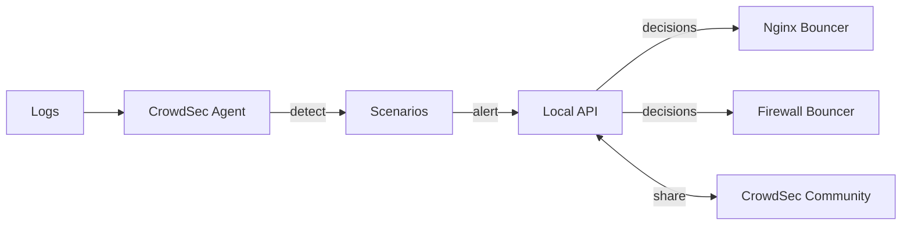

# How to Deploy CrowdSec with ArgoCD

Author: [nawazdhandala](https://github.com/nawazdhandala)

Tags: ArgoCD, GitOps, Kubernetes, CrowdSec, Security

Description: Learn how to deploy CrowdSec for collaborative intrusion detection and prevention using ArgoCD with custom scenarios, bouncers, and community blocklists.

---

CrowdSec is an open-source, collaborative intrusion detection and prevention system. It analyzes logs to detect malicious behavior, then shares threat intelligence with the CrowdSec community to create a crowd-sourced blocklist. Think of it as fail2ban but collaborative and Kubernetes-native. Deploying CrowdSec with ArgoCD means your intrusion detection rules, bouncer configurations, and community collections are all managed through GitOps.

This guide covers deploying CrowdSec's Security Engine and bouncers on Kubernetes using ArgoCD, configuring scenarios for common attacks, and integrating with your ingress controller for active blocking.

## How CrowdSec Works

CrowdSec has three main components:

- **Security Engine (Agent)**: Parses logs, detects attacks using scenarios, and makes ban decisions
- **Local API (LAPI)**: Central component that stores decisions and manages communication between agents and bouncers
- **Bouncers**: Enforcement components that apply decisions (block IPs, present CAPTCHAs, etc.)

The flow is: logs are parsed, scenarios detect attacks, decisions are made, and bouncers enforce them.



## Repository Structure

```text
security/
  crowdsec/
    Chart.yaml
    values.yaml
  crowdsec-bouncers/
    nginx-bouncer.yaml
    traefik-bouncer.yaml
  crowdsec-config/
    custom-scenarios/
      k8s-brute-force.yaml
    custom-parsers/
      custom-nginx-parser.yaml
```

## Deploying CrowdSec

### Wrapper Chart

```yaml
# security/crowdsec/Chart.yaml
apiVersion: v2
name: crowdsec
description: Wrapper chart for CrowdSec
type: application
version: 1.0.0
dependencies:
  - name: crowdsec
    version: "0.12.0"
    repository: "https://crowdsecurity.github.io/helm-charts"
```

### CrowdSec Values

```yaml
# security/crowdsec/values.yaml
crowdsec:
  # Container runtime for log collection
  container_runtime: containerd

  # LAPI (Local API) - central decision engine
  lapi:
    replicas: 1
    resources:
      requests:
        cpu: 250m
        memory: 256Mi
      limits:
        memory: 512Mi

    persistentVolume:
      data:
        enabled: true
        size: 5Gi
        storageClassName: gp3
      config:
        enabled: true
        size: 1Gi
        storageClassName: gp3

    # Dashboard for viewing alerts and decisions
    dashboard:
      enabled: true

    # Environment variables
    env:
      # Register with CrowdSec Central API for community blocklists
      - name: ENROLL_KEY
        valueFrom:
          secretKeyRef:
            name: crowdsec-enrollment
            key: enroll-key
      - name: ENROLL_INSTANCE_NAME
        value: "production-cluster"
      - name: ENROLL_TAGS
        value: "kubernetes,production"

  # Agent (DaemonSet) for log collection and analysis
  agent:
    # Collections to install - these include parsers and scenarios
    acquisition:
      # Read Nginx Ingress Controller logs
      - namespace: ingress-nginx
        podName: ingress-nginx-controller-*
        program: nginx
      # Read ArgoCD logs
      - namespace: argocd
        podName: argocd-server-*
        program: argocd
      # Read SSH logs from nodes
      - filenames:
          - /var/log/auth.log
          - /var/log/syslog
        labels:
          type: syslog

    resources:
      requests:
        cpu: 100m
        memory: 128Mi
      limits:
        memory: 256Mi

    tolerations:
      - effect: NoSchedule
        operator: Exists

    # Install community collections
    env:
      - name: COLLECTIONS
        value: >-
          crowdsecurity/linux
          crowdsecurity/nginx
          crowdsecurity/http-cve
          crowdsecurity/whitelist-good-actors
          crowdsecurity/sshd
      - name: SCENARIOS
        value: >-
          crowdsecurity/http-bf-wordpress_bf
          crowdsecurity/http-path-traversal-probing
          crowdsecurity/http-sqli-probing
          crowdsecurity/http-xss-probing

    # Persistent volume for agent data
    persistentVolume:
      config:
        enabled: true
        size: 1Gi
        storageClassName: gp3
```

### ArgoCD Application for CrowdSec

```yaml
apiVersion: argoproj.io/v1alpha1
kind: Application
metadata:
  name: crowdsec
  namespace: argocd
  finalizers:
    - resources-finalizer.argocd.argoproj.io
spec:
  project: security
  source:
    repoURL: https://github.com/your-org/gitops-repo.git
    targetRevision: main
    path: security/crowdsec
    helm:
      valueFiles:
        - values.yaml
  destination:
    server: https://kubernetes.default.svc
    namespace: crowdsec
  syncPolicy:
    automated:
      prune: true
      selfHeal: true
    syncOptions:
      - CreateNamespace=true
    retry:
      limit: 3
      backoff:
        duration: 5s
        factor: 2
        maxDuration: 3m
```

## Deploying the Nginx Ingress Bouncer

The bouncer integrates with your ingress controller to block malicious IPs.

```yaml
# security/crowdsec-bouncers/nginx-bouncer.yaml
apiVersion: apps/v1
kind: Deployment
metadata:
  name: crowdsec-bouncer-nginx
  namespace: crowdsec
spec:
  replicas: 1
  selector:
    matchLabels:
      app: crowdsec-bouncer-nginx
  template:
    metadata:
      labels:
        app: crowdsec-bouncer-nginx
    spec:
      containers:
        - name: bouncer
          image: crowdsecurity/lua-bouncer-plugin:latest
          env:
            - name: CROWDSEC_BOUNCER_API_KEY
              valueFrom:
                secretKeyRef:
                  name: crowdsec-bouncer-key
                  key: api-key
            - name: CROWDSEC_BOUNCER_LAPI_URL
              value: "http://crowdsec-service.crowdsec.svc.cluster.local:8080"
          resources:
            requests:
              cpu: 50m
              memory: 64Mi
            limits:
              memory: 128Mi
```

For Nginx Ingress Controller, a simpler approach is to use the CrowdSec Lua bouncer as a plugin.

```yaml
# In your ingress-nginx values
controller:
  config:
    plugins: "crowdsec"
    lua-shared-dicts: "crowdsec_cache: 50m"
  extraVolumes:
    - name: crowdsec-bouncer-plugin
      configMap:
        name: crowdsec-bouncer-config
  extraVolumeMounts:
    - name: crowdsec-bouncer-plugin
      mountPath: /etc/nginx/lua/plugins/crowdsec
```

## Custom Scenarios

Write custom scenarios for Kubernetes-specific threats.

```yaml
# security/crowdsec-config/custom-scenarios/k8s-api-brute-force.yaml
type: leaky
name: custom/k8s-api-brute-force
description: "Detect brute force attempts against Kubernetes API"
filter: "evt.Meta.log_type == 'k8s-audit' && evt.Meta.verb in ['create', 'update', 'delete'] && evt.Meta.responseCode == '403'"
groupby: evt.Meta.sourceIP
capacity: 5
leakspeed: 30s
blackhole: 5m
labels:
  type: brute_force
  service: kubernetes
  remediation: true
```

```yaml
# security/crowdsec-config/custom-scenarios/high-rate-404.yaml
type: leaky
name: custom/high-rate-404
description: "Detect high rate of 404 errors indicating scanning"
filter: "evt.Meta.log_type == 'nginx' && evt.Meta.http_status == '404'"
groupby: evt.Meta.source_ip
capacity: 20
leakspeed: 10s
blackhole: 10m
labels:
  type: scan
  service: http
  remediation: true
```

## Whitelisting Trusted IPs

Create whitelists for your infrastructure IPs to prevent false positives.

```yaml
# security/crowdsec-config/whitelists/infrastructure.yaml
name: custom/whitelist-infra
description: "Whitelist infrastructure IPs"
whitelist:
  reason: "Infrastructure services"
  ip:
    - "10.0.0.0/8"       # Internal network
    - "172.16.0.0/12"     # Internal network
    - "192.168.0.0/16"    # Internal network
  expression:
    - evt.Meta.source_ip startsWith "10."
```

## Managing Bouncer API Keys

Generate bouncer API keys and store them as Sealed Secrets.

```bash
# Generate a bouncer API key (run inside the LAPI pod)
kubectl exec -n crowdsec deploy/crowdsec-lapi -- cscli bouncers add nginx-bouncer -o json

# Create a Sealed Secret with the key
```

```yaml
apiVersion: bitnami.com/v1alpha1
kind: SealedSecret
metadata:
  name: crowdsec-bouncer-key
  namespace: crowdsec
spec:
  encryptedData:
    api-key: AgBy3i4OJSWK+PiTySYZZA9r...
```

## Monitoring CrowdSec

CrowdSec exposes Prometheus metrics. Create a ServiceMonitor and Grafana dashboard.

```yaml
apiVersion: monitoring.coreos.com/v1
kind: ServiceMonitor
metadata:
  name: crowdsec
  namespace: crowdsec
  labels:
    release: kube-prometheus-stack
spec:
  selector:
    matchLabels:
      app: crowdsec-lapi
  endpoints:
    - port: metrics
      interval: 30s
```

## Verifying the Deployment

```bash
# Check CrowdSec pods
kubectl get pods -n crowdsec

# Check CrowdSec metrics and status
kubectl exec -n crowdsec deploy/crowdsec-lapi -- cscli metrics

# List active decisions (banned IPs)
kubectl exec -n crowdsec deploy/crowdsec-lapi -- cscli decisions list

# List installed scenarios
kubectl exec -n crowdsec deploy/crowdsec-lapi -- cscli scenarios list

# List installed collections
kubectl exec -n crowdsec deploy/crowdsec-lapi -- cscli collections list

# List registered bouncers
kubectl exec -n crowdsec deploy/crowdsec-lapi -- cscli bouncers list

# Check alerts
kubectl exec -n crowdsec deploy/crowdsec-lapi -- cscli alerts list

# Check ArgoCD sync status
argocd app get crowdsec
```

## Summary

Deploying CrowdSec with ArgoCD provides a GitOps-managed intrusion detection and prevention system that benefits from community-shared threat intelligence. Custom scenarios, parsers, and whitelists are version-controlled in Git, while the bouncer integration with your ingress controller provides active blocking of malicious traffic. The community aspect means your cluster benefits from the collective threat detection of the entire CrowdSec network, and you contribute back to help protect others.
