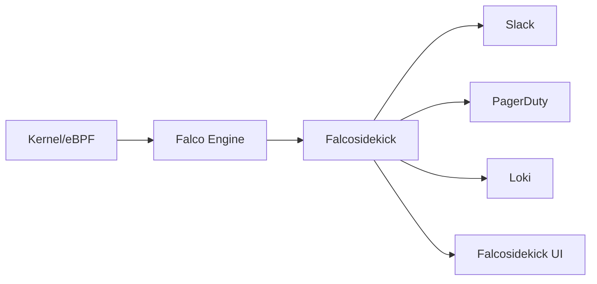

# How to Deploy Falco with ArgoCD

Author: [nawazdhandala](https://github.com/nawazdhandala)

Tags: ArgoCD, GitOps, Kubernetes, Falco, Security

Description: Learn how to deploy Falco runtime security with ArgoCD for GitOps-managed threat detection, custom rules, and alerting on Kubernetes clusters.

---

Falco is the de facto standard for runtime security on Kubernetes. Created by Sysdig and now a CNCF graduated project, Falco uses system calls to detect anomalous activity in containers and hosts. It can detect shell access to containers, unexpected network connections, file access violations, privilege escalation attempts, and much more. Deploying Falco with ArgoCD means your security policies are version-controlled, reviewable, and automatically kept in sync across clusters.

This guide covers deploying Falco using its Helm chart through ArgoCD, writing custom rules, and setting up alerting through Falcosidekick.

## How Falco Works

Falco operates by:

1. Capturing system calls using either a kernel module or an eBPF probe
2. Processing events through a rules engine
3. Generating alerts when rules are violated

The rules engine uses a YAML-based syntax that lets you define conditions based on system call information, Kubernetes metadata, and container properties.

## Repository Structure

```text
security/
  falco/
    Chart.yaml
    values.yaml
    custom-rules/
      custom-rules.yaml
  falcosidekick/
    Chart.yaml
    values.yaml
```

## Deploying Falco

### Wrapper Chart

```yaml
# security/falco/Chart.yaml
apiVersion: v2
name: falco
description: Wrapper chart for Falco runtime security
type: application
version: 1.0.0
dependencies:
  - name: falco
    version: "4.12.0"
    repository: "https://falcosecurity.github.io/charts"
```

### Falco Values

```yaml
# security/falco/values.yaml
falco:
  # Use modern eBPF driver instead of kernel module
  driver:
    kind: modern_ebpf
    modernEbpf:
      leastPrivileged: true

  # Falco configuration
  falco:
    # JSON output for structured logging
    json_output: true
    json_include_output_property: true
    json_include_tags_property: true

    # Log level
    log_level: info

    # Output channels
    http_output:
      enabled: true
      url: http://falcosidekick.security.svc.cluster.local:2801

    # Priority filtering
    priority: notice

    # Rules files
    rules_file:
      - /etc/falco/falco_rules.yaml
      - /etc/falco/falco_rules.local.yaml
      - /etc/falco/rules.d

    # Buffered outputs
    buffered_outputs: true
    outputs_rate: 0
    outputs_max_burst: 200

  # Falcoctl for rules auto-update
  falcoctl:
    artifact:
      install:
        enabled: true
      follow:
        enabled: true
    config:
      artifact:
        install:
          refs:
            - falco-rules:3
        follow:
          refs:
            - falco-rules:3

  # Resources for the DaemonSet
  resources:
    requests:
      cpu: 100m
      memory: 512Mi
    limits:
      memory: 1Gi

  # Tolerations to run on all nodes
  tolerations:
    - effect: NoSchedule
      operator: Exists
    - effect: NoExecute
      operator: Exists

  # ServiceMonitor for metrics
  serviceMonitor:
    enabled: true
    labels:
      release: kube-prometheus-stack

  # Custom rules
  customRules:
    custom-rules.yaml: |
      # Detect crypto mining processes
      - rule: Detect Crypto Mining
        desc: Detect common crypto mining processes in containers
        condition: >
          spawned_process and container and
          (proc.name in (xmrig, minerd, minergate, stratum, cpuminer) or
           proc.cmdline contains "stratum+tcp" or
           proc.cmdline contains "cryptonight")
        output: >
          Crypto mining process detected
          (user=%user.name container=%container.name
          image=%container.image.repository command=%proc.cmdline
          pod=%k8s.pod.name namespace=%k8s.ns.name)
        priority: CRITICAL
        tags: [crypto, mining, security]

      # Detect reverse shell
      - rule: Reverse Shell in Container
        desc: Detect reverse shell connections from containers
        condition: >
          spawned_process and container and
          ((proc.name = "bash" or proc.name = "sh") and
          (proc.cmdline contains "/dev/tcp/" or
           proc.cmdline contains "nc -e" or
           proc.cmdline contains "ncat -e"))
        output: >
          Reverse shell detected
          (user=%user.name container=%container.name
          image=%container.image.repository command=%proc.cmdline
          pod=%k8s.pod.name namespace=%k8s.ns.name)
        priority: CRITICAL
        tags: [shell, reverse_shell, security]

      # Detect kubectl exec
      - rule: Kubectl Exec to Pod
        desc: Alert when kubectl exec is used on pods in production namespaces
        condition: >
          kevt and pod and
          ka.verb = "create" and
          ka.target.subresource = "exec" and
          not ka.target.namespace in (kube-system, monitoring)
        output: >
          Kubectl exec detected
          (user=%ka.user.name pod=%ka.target.name
          namespace=%ka.target.namespace)
        priority: WARNING
        tags: [exec, audit, security]

      # Detect sensitive file access
      - rule: Read Sensitive Files in Container
        desc: Detect reads to sensitive files like /etc/shadow
        condition: >
          open_read and container and
          fd.name in (/etc/shadow, /etc/passwd, /etc/sudoers) and
          not proc.name in (login, passwd, su, sudo, sshd)
        output: >
          Sensitive file read
          (user=%user.name file=%fd.name container=%container.name
          image=%container.image.repository
          pod=%k8s.pod.name namespace=%k8s.ns.name)
        priority: WARNING
        tags: [filesystem, sensitive, security]
```

### ArgoCD Application for Falco

```yaml
apiVersion: argoproj.io/v1alpha1
kind: Application
metadata:
  name: falco
  namespace: argocd
spec:
  project: security
  source:
    repoURL: https://github.com/your-org/gitops-repo.git
    targetRevision: main
    path: security/falco
    helm:
      valueFiles:
        - values.yaml
  destination:
    server: https://kubernetes.default.svc
    namespace: security
  syncPolicy:
    automated:
      prune: true
      selfHeal: true
    syncOptions:
      - CreateNamespace=true
    retry:
      limit: 3
      backoff:
        duration: 10s
        factor: 2
        maxDuration: 3m
```

## Deploying Falcosidekick for Alerting

Falcosidekick receives Falco alerts and forwards them to multiple destinations like Slack, PagerDuty, or your SIEM.

```yaml
# security/falcosidekick/Chart.yaml
apiVersion: v2
name: falcosidekick
description: Wrapper chart for Falcosidekick
type: application
version: 1.0.0
dependencies:
  - name: falcosidekick
    version: "0.8.5"
    repository: "https://falcosecurity.github.io/charts"
```

```yaml
# security/falcosidekick/values.yaml
falcosidekick:
  replicaCount: 2

  resources:
    requests:
      cpu: 50m
      memory: 64Mi
    limits:
      memory: 128Mi

  config:
    # Slack alerts
    slack:
      webhookurl: ""  # Set via secret
      channel: "#security-alerts"
      outputformat: "all"
      minimumpriority: "warning"

    # Forward to Loki for log storage
    loki:
      hostport: http://loki-gateway.logging.svc.cluster.local
      minimumpriority: "notice"

    # Forward to Prometheus via push gateway
    prometheus:
      extralabels: "source:falco"

  # UI for viewing events
  webui:
    enabled: true
    replicaCount: 1
    redis:
      enabled: true

  serviceMonitor:
    enabled: true
    labels:
      release: kube-prometheus-stack
```

```yaml
apiVersion: argoproj.io/v1alpha1
kind: Application
metadata:
  name: falcosidekick
  namespace: argocd
spec:
  project: security
  source:
    repoURL: https://github.com/your-org/gitops-repo.git
    targetRevision: main
    path: security/falcosidekick
    helm:
      valueFiles:
        - values.yaml
  destination:
    server: https://kubernetes.default.svc
    namespace: security
  syncPolicy:
    automated:
      prune: true
      selfHeal: true
```

## Alert Flow



## Managing Rules Through GitOps

The biggest advantage of deploying Falco with ArgoCD is managing security rules through Git. When your security team identifies a new threat pattern, they create a pull request with a new rule. The team reviews it, merges it, and ArgoCD automatically deploys it to all clusters.

This review process is critical for security rules because a poorly written rule can either miss threats or generate excessive false positives that lead to alert fatigue.

## Verifying the Deployment

```bash
# Check Falco DaemonSet
kubectl get ds -n security -l app.kubernetes.io/name=falco

# Check Falco logs for rule loading
kubectl logs -n security -l app.kubernetes.io/name=falco --tail=30

# Test with a shell exec into a pod
kubectl exec -it deploy/test-app -- /bin/sh
# You should see a Falco alert in Falcosidekick

# Check Falcosidekick is receiving events
kubectl logs -n security -l app.kubernetes.io/name=falcosidekick --tail=20
```

## Summary

Deploying Falco with ArgoCD brings GitOps principles to runtime security. Security rules become code that is version-controlled, reviewed, and automatically deployed. The combination of Falco for detection, Falcosidekick for alert routing, and ArgoCD for deployment management creates a robust security pipeline where every policy change is traceable and every cluster stays in compliance.
