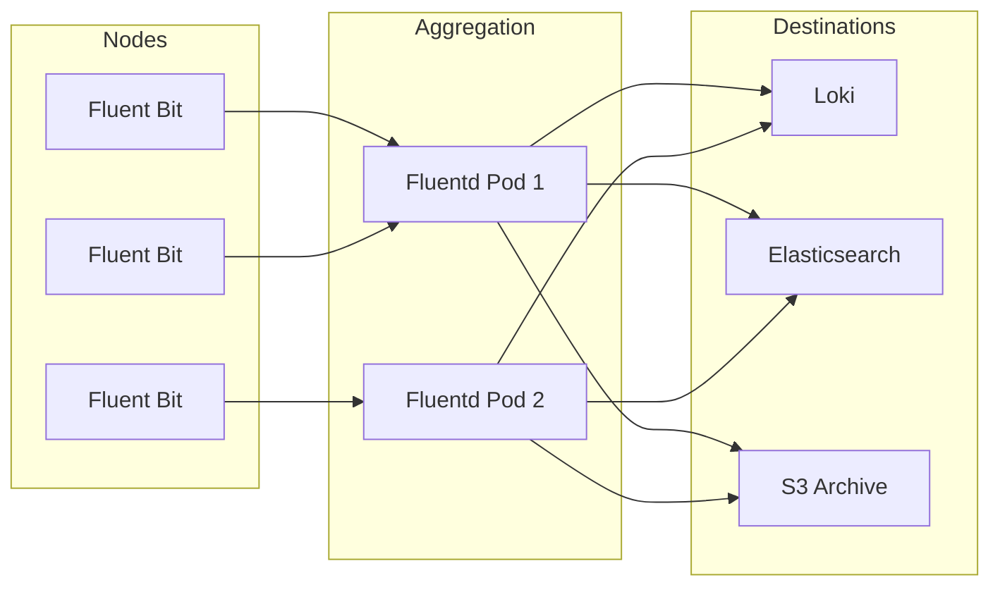

# How to Deploy Fluentbit and Fluentd with ArgoCD

Author: [nawazdhandala](https://github.com/nawazdhandala)

Tags: ArgoCD, GitOps, Kubernetes, Fluentbit, Logging

Description: Learn how to deploy Fluent Bit and Fluentd for log collection and forwarding using ArgoCD with production-ready configurations and multi-destination routing.

---

Fluent Bit and Fluentd are two of the most popular log collection tools in the Kubernetes ecosystem. Fluent Bit is a lightweight log shipper designed for edge and container environments, while Fluentd is a more feature-rich log aggregator with a vast plugin ecosystem. In many production setups, they are used together - Fluent Bit as a DaemonSet on every node collecting logs and forwarding them to Fluentd, which handles parsing, enrichment, and routing to multiple destinations.

Deploying this stack with ArgoCD means your logging pipeline configuration is version-controlled, reviewable, and automatically reconciled.

## Fluent Bit vs Fluentd - When to Use Which

| Feature | Fluent Bit | Fluentd |
|---------|-----------|---------|
| Memory footprint | ~10 MB | ~40 MB |
| Plugin ecosystem | Limited but growing | Extensive (700+ plugins) |
| Written in | C | Ruby/C |
| Best for | Log collection at the edge | Log aggregation and routing |
| Kubernetes DaemonSet | Ideal | Works but heavier |

For most Kubernetes deployments:

- **Fluent Bit only**: Use when you have a single log destination and simple parsing needs
- **Fluent Bit + Fluentd**: Use when you need complex routing, multiple destinations, or custom plugins
- **Fluentd only**: Use when you need specific Fluentd plugins not available in Fluent Bit

## Repository Structure

```
logging/
  fluent-bit/
    Chart.yaml
    values.yaml
  fluentd/
    Chart.yaml
    values.yaml
  custom-parsers/
    parsers.conf
```

## Deploying Fluent Bit as a DaemonSet

### Wrapper Chart

```yaml
# logging/fluent-bit/Chart.yaml
apiVersion: v2
name: fluent-bit
description: Wrapper chart for Fluent Bit
type: application
version: 1.0.0
dependencies:
  - name: fluent-bit
    version: "0.47.10"
    repository: "https://fluent.github.io/helm-charts"
```

### Fluent Bit Values

```yaml
# logging/fluent-bit/values.yaml
fluent-bit:
  # DaemonSet configuration
  kind: DaemonSet

  resources:
    requests:
      cpu: 50m
      memory: 64Mi
    limits:
      memory: 128Mi

  tolerations:
    - effect: NoSchedule
      operator: Exists
    - effect: NoExecute
      operator: Exists

  # Configuration
  config:
    # Service section
    service: |
      [SERVICE]
          Daemon Off
          Flush 5
          Log_Level info
          Parsers_File /fluent-bit/etc/parsers.conf
          Parsers_File /fluent-bit/etc/custom_parsers.conf
          HTTP_Server On
          HTTP_Listen 0.0.0.0
          HTTP_Port 2020
          Health_Check On
          storage.path /var/log/flb-storage/
          storage.sync normal
          storage.checksum off
          storage.backlog.mem_limit 5M

    # Input: collect container logs
    inputs: |
      [INPUT]
          Name tail
          Path /var/log/containers/*.log
          multiline.parser docker, cri
          Tag kube.*
          Mem_Buf_Limit 10MB
          Skip_Long_Lines On
          Refresh_Interval 10
          storage.type filesystem
          Read_from_Head false

      [INPUT]
          Name systemd
          Tag host.*
          Systemd_Filter _SYSTEMD_UNIT=kubelet.service
          Read_From_Tail On
          Strip_Underscores On

    # Filters: parse and enrich
    filters: |
      [FILTER]
          Name kubernetes
          Match kube.*
          Merge_Log On
          Merge_Log_Key log_processed
          Keep_Log Off
          K8S-Logging.Parser On
          K8S-Logging.Exclude On
          Labels On
          Annotations Off
          Buffer_Size 256k

      [FILTER]
          Name modify
          Match kube.*
          Remove time
          Remove logtag

      [FILTER]
          Name nest
          Match kube.*
          Operation lift
          Nested_under kubernetes
          Add_prefix k8s_

      [FILTER]
          Name grep
          Match kube.*
          Exclude k8s_namespace_name kube-system

    # Output: forward to Fluentd
    outputs: |
      [OUTPUT]
          Name forward
          Match *
          Host fluentd-aggregator.logging.svc.cluster.local
          Port 24224
          Retry_Limit 5
          storage.total_limit_size 500M

    # Custom parsers
    customParsers: |
      [PARSER]
          Name json_log
          Format json
          Time_Key time
          Time_Format %Y-%m-%dT%H:%M:%S.%L%z

      [PARSER]
          Name spring_boot
          Format regex
          Regex ^(?<timestamp>\d{4}-\d{2}-\d{2}\s\d{2}:\d{2}:\d{2}.\d{3})\s+(?<level>[A-Z]+)\s+(?<pid>\d+)\s+---\s+\[(?<thread>[^\]]+)\]\s+(?<logger>[^\s]+)\s+:\s+(?<message>.*)$
          Time_Key timestamp
          Time_Format %Y-%m-%d %H:%M:%S.%L

  # Monitoring
  serviceMonitor:
    enabled: true
    additionalLabels:
      release: kube-prometheus-stack

  # Persistent buffer storage
  volumeMounts:
    - name: flb-storage
      mountPath: /var/log/flb-storage/

  volumes:
    - name: flb-storage
      hostPath:
        path: /var/log/flb-storage
```

### ArgoCD Application for Fluent Bit

```yaml
apiVersion: argoproj.io/v1alpha1
kind: Application
metadata:
  name: fluent-bit
  namespace: argocd
spec:
  project: logging
  source:
    repoURL: https://github.com/your-org/gitops-repo.git
    targetRevision: main
    path: logging/fluent-bit
    helm:
      valueFiles:
        - values.yaml
  destination:
    server: https://kubernetes.default.svc
    namespace: logging
  syncPolicy:
    automated:
      prune: true
      selfHeal: true
    syncOptions:
      - CreateNamespace=true
```

## Deploying Fluentd as an Aggregator

### Wrapper Chart

```yaml
# logging/fluentd/Chart.yaml
apiVersion: v2
name: fluentd
description: Wrapper chart for Fluentd aggregator
type: application
version: 1.0.0
dependencies:
  - name: fluentd
    version: "0.5.2"
    repository: "https://fluent.github.io/helm-charts"
```

### Fluentd Values

```yaml
# logging/fluentd/values.yaml
fluentd:
  kind: Deployment
  replicaCount: 2

  resources:
    requests:
      cpu: 500m
      memory: 512Mi
    limits:
      memory: 1Gi

  # Receive from Fluent Bit
  service:
    type: ClusterIP
    ports:
      - name: forward
        port: 24224
        protocol: TCP

  # Buffer storage
  persistence:
    enabled: true
    size: 20Gi
    storageClass: gp3

  # Fluentd configuration
  fileConfigs:
    01_sources.conf: |
      <source>
        @type forward
        port 24224
        bind 0.0.0.0
        <transport tcp>
        </transport>
      </source>

    02_filters.conf: |
      # Parse JSON logs
      <filter kube.**>
        @type parser
        key_name log
        reserve_data true
        remove_key_name_field true
        <parse>
          @type json
          json_parser json
        </parse>
      </filter>

      # Add environment tag
      <filter **>
        @type record_transformer
        <record>
          environment production
          cluster_name my-cluster
        </record>
      </filter>

    03_dispatch.conf: |
      # Route logs to different outputs based on namespace
      <match kube.monitoring.**>
        @type copy
        <store>
          @type elasticsearch
          host elasticsearch.logging.svc.cluster.local
          port 9200
          logstash_format true
          logstash_prefix monitoring
          <buffer>
            @type file
            path /var/log/fluentd/buffers/monitoring
            flush_mode interval
            flush_interval 10s
            chunk_limit_size 10M
            total_limit_size 2G
            retry_max_interval 30
            retry_forever true
          </buffer>
        </store>
      </match>

      <match kube.**>
        @type copy
        <store>
          @type loki
          url http://loki-gateway.logging.svc.cluster.local
          <label>
            namespace $.k8s_namespace_name
            pod $.k8s_pod_name
            container $.k8s_container_name
            app $.k8s_labels.app
          </label>
          <buffer>
            @type file
            path /var/log/fluentd/buffers/loki
            flush_mode interval
            flush_interval 10s
            chunk_limit_size 5M
            total_limit_size 1G
            retry_max_interval 30
            retry_forever true
          </buffer>
        </store>
        # Also send to S3 for long-term archival
        <store>
          @type s3
          s3_bucket logs-archive
          s3_region us-east-1
          path logs/%Y/%m/%d/
          <buffer time>
            @type file
            path /var/log/fluentd/buffers/s3
            timekey 3600
            timekey_wait 10m
            chunk_limit_size 50M
          </buffer>
        </store>
      </match>

    04_metrics.conf: |
      <source>
        @type prometheus
        port 24231
      </source>
      <source>
        @type prometheus_monitor
      </source>
      <source>
        @type prometheus_output_monitor
      </source>

  serviceMonitor:
    enabled: true
    additionalLabels:
      release: kube-prometheus-stack
```

### ArgoCD Application for Fluentd

```yaml
apiVersion: argoproj.io/v1alpha1
kind: Application
metadata:
  name: fluentd
  namespace: argocd
spec:
  project: logging
  source:
    repoURL: https://github.com/your-org/gitops-repo.git
    targetRevision: main
    path: logging/fluentd
    helm:
      valueFiles:
        - values.yaml
  destination:
    server: https://kubernetes.default.svc
    namespace: logging
  syncPolicy:
    automated:
      prune: true
      selfHeal: true
    syncOptions:
      - CreateNamespace=true
```

## Architecture Overview



## Verifying the Deployment

```bash
# Check Fluent Bit DaemonSet
kubectl get ds -n logging -l app.kubernetes.io/name=fluent-bit

# Check Fluentd pods
kubectl get pods -n logging -l app.kubernetes.io/name=fluentd

# Verify Fluent Bit is collecting logs
kubectl logs -n logging -l app.kubernetes.io/name=fluent-bit --tail=20

# Verify Fluentd is receiving and forwarding
kubectl logs -n logging -l app.kubernetes.io/name=fluentd --tail=20

# Check buffer health
kubectl exec -n logging -it deploy/fluentd -- ls -la /var/log/fluentd/buffers/
```

## Summary

Deploying Fluent Bit and Fluentd with ArgoCD provides a robust, GitOps-managed logging pipeline. Fluent Bit handles efficient log collection on every node with minimal resource usage, while Fluentd provides powerful aggregation, parsing, and multi-destination routing. With ArgoCD managing both components, configuration changes to your logging pipeline go through the same review and deployment process as your application code.
