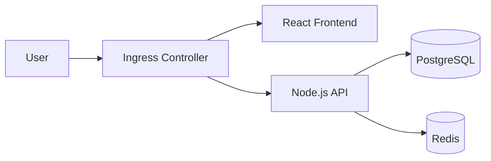

# How to Deploy a Full-Stack Application with ArgoCD

Author: [nawazdhandala](https://github.com/nawazdhandala)

Tags: ArgoCD, GitOps, Kubernetes, Full-Stack Deployment

Description: Complete guide to deploying a full-stack application with frontend, backend, and database components using ArgoCD and GitOps practices on Kubernetes.

---

Deploying a full-stack application with ArgoCD involves coordinating multiple components - a frontend, a backend API, a database, and all the supporting infrastructure like ConfigMaps, Secrets, and Ingress rules. This guide walks through deploying a realistic full-stack application using ArgoCD and GitOps principles.

## Architecture Overview

We will deploy a typical three-tier application:



The application consists of:
- **Frontend** - React app served by Nginx
- **Backend** - Node.js API server
- **Database** - PostgreSQL with persistent storage
- **Cache** - Redis for session management

## Repository Structure

Organize your Git repository with a clean separation between components:

```text
fullstack-app/
  base/
    frontend/
      deployment.yaml
      service.yaml
    backend/
      deployment.yaml
      service.yaml
      configmap.yaml
    database/
      statefulset.yaml
      service.yaml
      pvc.yaml
    redis/
      deployment.yaml
      service.yaml
    ingress.yaml
    namespace.yaml
    kustomization.yaml
  overlays/
    staging/
      kustomization.yaml
      patches/
    production/
      kustomization.yaml
      patches/
```

## Step 1: Define the Base Manifests

### Namespace

```yaml
# base/namespace.yaml
apiVersion: v1
kind: Namespace
metadata:
  name: fullstack-app
```

### PostgreSQL Database

The database uses a StatefulSet with persistent storage so data survives pod restarts.

```yaml
# base/database/statefulset.yaml
apiVersion: apps/v1
kind: StatefulSet
metadata:
  name: postgres
  namespace: fullstack-app
spec:
  serviceName: postgres
  replicas: 1
  selector:
    matchLabels:
      app: postgres
  template:
    metadata:
      labels:
        app: postgres
    spec:
      containers:
        - name: postgres
          image: postgres:16.1
          ports:
            - containerPort: 5432
          env:
            - name: POSTGRES_DB
              value: appdb
            - name: POSTGRES_USER
              valueFrom:
                secretKeyRef:
                  name: postgres-credentials
                  key: username
            - name: POSTGRES_PASSWORD
              valueFrom:
                secretKeyRef:
                  name: postgres-credentials
                  key: password
          volumeMounts:
            - name: postgres-data
              mountPath: /var/lib/postgresql/data
          resources:
            requests:
              cpu: 250m
              memory: 512Mi
            limits:
              cpu: 500m
              memory: 1Gi
  volumeClaimTemplates:
    - metadata:
        name: postgres-data
      spec:
        accessModes: ["ReadWriteOnce"]
        resources:
          requests:
            storage: 10Gi
```

```yaml
# base/database/service.yaml
apiVersion: v1
kind: Service
metadata:
  name: postgres
  namespace: fullstack-app
spec:
  type: ClusterIP
  ports:
    - port: 5432
      targetPort: 5432
  selector:
    app: postgres
```

### Redis Cache

```yaml
# base/redis/deployment.yaml
apiVersion: apps/v1
kind: Deployment
metadata:
  name: redis
  namespace: fullstack-app
spec:
  replicas: 1
  selector:
    matchLabels:
      app: redis
  template:
    metadata:
      labels:
        app: redis
    spec:
      containers:
        - name: redis
          image: redis:7.2-alpine
          ports:
            - containerPort: 6379
          resources:
            requests:
              cpu: 100m
              memory: 128Mi
            limits:
              cpu: 250m
              memory: 256Mi
```

### Backend API

```yaml
# base/backend/deployment.yaml
apiVersion: apps/v1
kind: Deployment
metadata:
  name: backend
  namespace: fullstack-app
spec:
  replicas: 2
  selector:
    matchLabels:
      app: backend
  template:
    metadata:
      labels:
        app: backend
    spec:
      containers:
        - name: backend
          image: myregistry.io/fullstack-app/backend:v1.0.0
          ports:
            - containerPort: 3000
          env:
            - name: DATABASE_URL
              valueFrom:
                secretKeyRef:
                  name: backend-config
                  key: database-url
            - name: REDIS_URL
              value: "redis://redis:6379"
            - name: NODE_ENV
              valueFrom:
                configMapKeyRef:
                  name: backend-config
                  key: node-env
          readinessProbe:
            httpGet:
              path: /health
              port: 3000
            initialDelaySeconds: 10
            periodSeconds: 5
          resources:
            requests:
              cpu: 200m
              memory: 256Mi
            limits:
              cpu: 500m
              memory: 512Mi
```

```yaml
# base/backend/configmap.yaml
apiVersion: v1
kind: ConfigMap
metadata:
  name: backend-config
  namespace: fullstack-app
data:
  node-env: "production"
  log-level: "info"
```

### Frontend

```yaml
# base/frontend/deployment.yaml
apiVersion: apps/v1
kind: Deployment
metadata:
  name: frontend
  namespace: fullstack-app
spec:
  replicas: 2
  selector:
    matchLabels:
      app: frontend
  template:
    metadata:
      labels:
        app: frontend
    spec:
      containers:
        - name: frontend
          image: myregistry.io/fullstack-app/frontend:v1.0.0
          ports:
            - containerPort: 80
          resources:
            requests:
              cpu: 100m
              memory: 128Mi
            limits:
              cpu: 250m
              memory: 256Mi
```

### Ingress

```yaml
# base/ingress.yaml
apiVersion: networking.k8s.io/v1
kind: Ingress
metadata:
  name: fullstack-app
  namespace: fullstack-app
  annotations:
    nginx.ingress.kubernetes.io/rewrite-target: /
spec:
  ingressClassName: nginx
  rules:
    - host: app.example.com
      http:
        paths:
          - path: /
            pathType: Prefix
            backend:
              service:
                name: frontend
                port:
                  number: 80
          - path: /api
            pathType: Prefix
            backend:
              service:
                name: backend
                port:
                  number: 3000
```

### Kustomization File

```yaml
# base/kustomization.yaml
apiVersion: kustomize.config.k8s.io/v1beta1
kind: Kustomization
resources:
  - namespace.yaml
  - database/statefulset.yaml
  - database/service.yaml
  - redis/deployment.yaml
  - redis/service.yaml
  - backend/deployment.yaml
  - backend/service.yaml
  - backend/configmap.yaml
  - frontend/deployment.yaml
  - frontend/service.yaml
  - ingress.yaml
```

## Step 2: Create Environment Overlays

### Production Overlay

```yaml
# overlays/production/kustomization.yaml
apiVersion: kustomize.config.k8s.io/v1beta1
kind: Kustomization
resources:
  - ../../base
patches:
  - target:
      kind: Deployment
      name: backend
    patch: |
      - op: replace
        path: /spec/replicas
        value: 4
  - target:
      kind: Deployment
      name: frontend
    patch: |
      - op: replace
        path: /spec/replicas
        value: 4
images:
  - name: myregistry.io/fullstack-app/backend
    newTag: v1.2.0
  - name: myregistry.io/fullstack-app/frontend
    newTag: v1.2.0
```

## Step 3: Use Sync Waves for Ordering

The database must be ready before the backend starts, and the backend must be ready before the frontend makes sense. Use sync waves to enforce this order.

Add annotations to your resources:

```yaml
# Database resources - deploy first (wave 0)
metadata:
  annotations:
    argocd.argoproj.io/sync-wave: "0"

# Redis - deploy alongside database (wave 0)
metadata:
  annotations:
    argocd.argoproj.io/sync-wave: "0"

# Backend - deploy after data layer is ready (wave 1)
metadata:
  annotations:
    argocd.argoproj.io/sync-wave: "1"

# Frontend - deploy after backend is ready (wave 2)
metadata:
  annotations:
    argocd.argoproj.io/sync-wave: "2"

# Ingress - deploy last (wave 3)
metadata:
  annotations:
    argocd.argoproj.io/sync-wave: "3"
```

## Step 4: Create the ArgoCD Application

```yaml
# argocd-app.yaml
apiVersion: argoproj.io/v1alpha1
kind: Application
metadata:
  name: fullstack-app-production
  namespace: argocd
  finalizers:
    - resources-finalizer.argocd.argoproj.io
spec:
  project: default
  source:
    repoURL: https://github.com/myorg/fullstack-app.git
    targetRevision: main
    path: overlays/production
  destination:
    server: https://kubernetes.default.svc
    namespace: fullstack-app
  syncPolicy:
    automated:
      prune: true
      selfHeal: true
    syncOptions:
      - CreateNamespace=true
      - PrunePropagationPolicy=foreground
    retry:
      limit: 3
      backoff:
        duration: 5s
        factor: 2
        maxDuration: 3m
```

Apply the Application:

```bash
kubectl apply -f argocd-app.yaml
```

## Step 5: Managing Secrets

For secrets like database credentials, use Sealed Secrets or External Secrets Operator. Never commit plain Kubernetes Secrets to Git.

```bash
# Using Sealed Secrets
kubeseal --format yaml < postgres-secret.yaml > sealed-postgres-secret.yaml

# Add the sealed secret to your manifests
```

For more on secret management with ArgoCD, see [How to Handle ArgoCD Secrets with Sealed Secrets](https://oneuptime.com/blog/post/2026-01-27-argocd-sealed-secrets/view).

## Step 6: Verify the Full Deployment

```bash
# Check the ArgoCD application status
argocd app get fullstack-app-production

# Verify all pods are running
kubectl get pods -n fullstack-app

# Check sync wave execution order
argocd app get fullstack-app-production --show-operation

# Test the application
kubectl port-forward -n fullstack-app svc/frontend 8080:80
```

## Handling Updates

When you need to update any component, simply update the manifests in Git:

```bash
# Update backend image tag in the overlay
# Edit overlays/production/kustomization.yaml
# Change backend newTag from v1.2.0 to v1.3.0

git commit -am "Deploy backend v1.3.0 to production"
git push
```

ArgoCD will detect the change, render the new manifests with Kustomize, and apply only the changed resources. The sync waves ensure that if you update multiple components simultaneously, they still deploy in the correct order.

## Monitoring Your Full-Stack Application

Once deployed, keep an eye on the health of each component in the ArgoCD UI. The resource tree view shows you exactly which resources belong to each component and their health status. If any component fails, ArgoCD will show it as Degraded, letting you identify issues quickly.

For production monitoring beyond ArgoCD, consider setting up comprehensive observability with [OneUptime](https://oneuptime.com) to track uptime, performance, and errors across your full stack.

## Key Takeaways

Deploying a full-stack application with ArgoCD requires careful planning around resource ordering, secret management, and environment-specific configuration. By using Kustomize overlays for environment differences, sync waves for deployment ordering, and automated sync policies for hands-off operation, you get a production-ready GitOps workflow that scales from a single application to hundreds.
