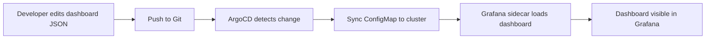

# How to Deploy Grafana Dashboards with ArgoCD

Author: [nawazdhandala](https://github.com/nawazdhandala)

Tags: ArgoCD, GitOps, Kubernetes, Grafana, Monitoring

Description: Learn how to manage and deploy Grafana dashboards as code using ArgoCD, including ConfigMap-based provisioning and dashboard lifecycle management.

---

Grafana dashboards are essential for visualizing metrics in any Kubernetes monitoring setup. But managing dashboards manually through the Grafana UI creates problems - dashboards get modified without tracking, they are lost during upgrades, and there is no way to review changes before they go live. By managing Grafana dashboards through ArgoCD, you bring the full power of GitOps to your observability layer.

This guide covers multiple approaches to deploying Grafana dashboards with ArgoCD, from simple ConfigMap-based provisioning to using the Grafana Operator for more advanced use cases.

## The Problem with Manual Dashboard Management

When teams manage Grafana dashboards through the UI, several issues arise:

- No version history for dashboard changes
- No review process before changes go live
- Dashboards are lost when Grafana pods restart (without persistent storage)
- No way to promote dashboards across environments (dev to staging to production)
- Dashboard sprawl with no ownership tracking

ArgoCD solves all of these by treating dashboards as code stored in Git.

## Approach 1: ConfigMap-Based Dashboard Provisioning

The simplest approach is to store dashboard JSON in Kubernetes ConfigMaps. Grafana's sidecar container watches for ConfigMaps with specific labels and automatically loads them as dashboards.

### Enabling the Sidecar in kube-prometheus-stack

If you are using kube-prometheus-stack (see [deploying kube-prometheus-stack with ArgoCD](https://oneuptime.com/blog/post/2026-02-26-deploy-kube-prometheus-stack-argocd/view)), the sidecar is enabled by default. Make sure these values are set.

```yaml
kube-prometheus-stack:
  grafana:
    sidecar:
      dashboards:
        enabled: true
        label: grafana_dashboard
        labelValue: "1"
        # Search all namespaces for dashboard ConfigMaps
        searchNamespace: ALL
        folderAnnotation: grafana_folder
        provider:
          foldersFromFilesStructure: true
```

### Creating Dashboard ConfigMaps

Export your dashboard JSON from Grafana, then wrap it in a ConfigMap.

```yaml
# dashboards/kubernetes-cluster-overview.yaml
apiVersion: v1
kind: ConfigMap
metadata:
  name: grafana-dashboard-k8s-cluster
  namespace: monitoring
  labels:
    grafana_dashboard: "1"
  annotations:
    grafana_folder: "Kubernetes"
data:
  kubernetes-cluster-overview.json: |
    {
      "annotations": {
        "list": []
      },
      "editable": true,
      "fiscalYearStartMonth": 0,
      "graphTooltip": 0,
      "id": null,
      "links": [],
      "panels": [
        {
          "datasource": {
            "type": "prometheus",
            "uid": "prometheus"
          },
          "fieldConfig": {
            "defaults": {
              "thresholds": {
                "mode": "absolute",
                "steps": [
                  { "color": "green", "value": null },
                  { "color": "red", "value": 80 }
                ]
              }
            }
          },
          "gridPos": { "h": 8, "w": 12, "x": 0, "y": 0 },
          "title": "CPU Usage by Node",
          "type": "timeseries",
          "targets": [
            {
              "expr": "100 - (avg by(instance)(rate(node_cpu_seconds_total{mode=\"idle\"}[5m])) * 100)",
              "legendFormat": "{{ instance }}"
            }
          ]
        }
      ],
      "title": "Kubernetes Cluster Overview",
      "uid": "k8s-cluster-overview",
      "version": 1
    }
```

### Organizing Dashboards in Git

Structure your repository to keep dashboards organized by category.

```
dashboards/
  kubernetes/
    cluster-overview.yaml
    node-resources.yaml
    pod-resources.yaml
  application/
    http-requests.yaml
    error-rates.yaml
  infrastructure/
    etcd-dashboard.yaml
    coredns-dashboard.yaml
```

### Creating the ArgoCD Application for Dashboards

```yaml
apiVersion: argoproj.io/v1alpha1
kind: Application
metadata:
  name: grafana-dashboards
  namespace: argocd
spec:
  project: monitoring
  source:
    repoURL: https://github.com/your-org/gitops-repo.git
    targetRevision: main
    path: dashboards
  destination:
    server: https://kubernetes.default.svc
    namespace: monitoring
  syncPolicy:
    automated:
      prune: true
      selfHeal: true
```

When someone adds a new dashboard YAML file and pushes to Git, ArgoCD will automatically create the ConfigMap, and Grafana's sidecar will pick it up within seconds.

## Approach 2: Using Grafana Dashboard CRDs

If you install the Grafana Operator, you get a `GrafanaDashboard` custom resource that provides richer functionality than raw ConfigMaps.

```yaml
apiVersion: grafana.integreatly.org/v1beta1
kind: GrafanaDashboard
metadata:
  name: k8s-cluster-overview
  namespace: monitoring
spec:
  instanceSelector:
    matchLabels:
      dashboards: grafana
  json: |
    {
      "title": "Kubernetes Cluster Overview",
      "uid": "k8s-cluster-overview",
      "panels": [...]
    }
```

The Grafana Operator also supports loading dashboards from URLs, which is useful for community dashboards.

```yaml
apiVersion: grafana.integreatly.org/v1beta1
kind: GrafanaDashboard
metadata:
  name: node-exporter-full
  namespace: monitoring
spec:
  instanceSelector:
    matchLabels:
      dashboards: grafana
  url: "https://grafana.com/api/dashboards/1860/revisions/37/download"
  datasources:
    - inputName: "DS_PROMETHEUS"
      datasourceName: "Prometheus"
```

## Approach 3: Jsonnet and Grafonnet for Dashboard as Code

For teams that want to generate dashboards programmatically, Jsonnet with the Grafonnet library is a powerful option.

Create a Jsonnet file that generates dashboard JSON.

```jsonnet
// dashboards/api-overview.jsonnet
local grafana = import 'grafonnet/grafana.libsonnet';
local dashboard = grafana.dashboard;
local prometheus = grafana.prometheus;
local graphPanel = grafana.graphPanel;

dashboard.new(
  'API Overview',
  tags=['api', 'kubernetes'],
  time_from='now-1h',
)
.addPanel(
  graphPanel.new(
    'Request Rate',
    datasource='Prometheus',
  )
  .addTarget(
    prometheus.target(
      'sum(rate(http_requests_total[5m])) by (status_code)',
      legendFormat='{{ status_code }}',
    )
  ),
  gridPos={ h: 8, w: 12, x: 0, y: 0 },
)
```

You can use an ArgoCD Config Management Plugin (CMP) to compile Jsonnet during sync.

```yaml
# argocd-cmp-config.yaml
apiVersion: v1
kind: ConfigMap
metadata:
  name: argocd-cmp-jsonnet
  namespace: argocd
data:
  plugin.yaml: |
    apiVersion: argoproj.io/v1alpha1
    kind: ConfigManagementPlugin
    metadata:
      name: jsonnet-dashboards
    spec:
      generate:
        command: ["/bin/sh", "-c"]
        args:
          - |
            for f in *.jsonnet; do
              name=$(basename "$f" .jsonnet)
              json=$(jsonnet "$f")
              cat <<YAML
            ---
            apiVersion: v1
            kind: ConfigMap
            metadata:
              name: grafana-dashboard-${name}
              labels:
                grafana_dashboard: "1"
            data:
              ${name}.json: |
                ${json}
            YAML
            done
```

## Managing Dashboard Variables Across Environments

Different environments often need different datasource names or default variable values. Use ArgoCD's Helm value overrides or Kustomize patches.

```yaml
# kustomization.yaml for staging
apiVersion: kustomize.config.k8s.io/v1beta1
kind: Kustomization
resources:
  - ../../base/dashboards
patches:
  - target:
      kind: ConfigMap
      labelSelector: grafana_dashboard=1
    patch: |
      - op: replace
        path: /metadata/annotations/grafana_folder
        value: "Staging"
```

## Preventing Dashboard Edits in the UI

To enforce GitOps discipline, you can make dashboards read-only in Grafana by setting `editable: false` in the dashboard JSON and configuring the provisioning provider to disallow deletion.

```yaml
kube-prometheus-stack:
  grafana:
    sidecar:
      dashboards:
        provider:
          allowUiUpdates: false
          disableDeletion: true
```

This means all dashboard changes must go through Git and ArgoCD, which gives you full audit history and review processes.

## Dashboard Lifecycle Management

When you want to remove a dashboard, simply delete the YAML file from Git. ArgoCD's prune functionality will remove the ConfigMap, and the Grafana sidecar will delete the dashboard. This full lifecycle management through Git is one of the biggest advantages of this approach.



## Summary

Managing Grafana dashboards through ArgoCD transforms dashboards from fragile UI artifacts into version-controlled, reviewable infrastructure. Whether you use simple ConfigMaps, the Grafana Operator, or Jsonnet-based generation, ArgoCD ensures your dashboards are consistent across environments and recoverable after any failure. Start with the ConfigMap approach for simplicity, and graduate to Jsonnet or the Grafana Operator as your dashboard library grows.
