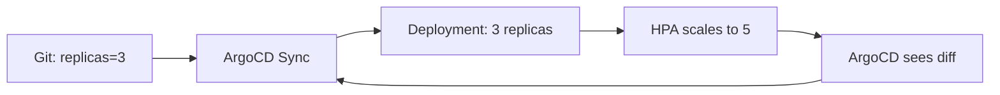

# How to Deploy HPA Configuration with ArgoCD

Author: [nawazdhandala](https://github.com/nawazdhandala)

Tags: ArgoCD, GitOps, Kubernetes, HPA, Autoscaling

Description: Learn how to deploy and manage Horizontal Pod Autoscaler configurations with ArgoCD while avoiding sync conflicts with replica counts.

---

The Horizontal Pod Autoscaler (HPA) is one of the most commonly used autoscaling mechanisms in Kubernetes. It automatically adjusts the number of pod replicas based on CPU utilization, memory usage, or custom metrics. But deploying HPAs with ArgoCD creates a fundamental conflict - ArgoCD wants to set the replica count from Git, while the HPA wants to set it based on live metrics. This guide shows you how to make them work together.

## The Core Conflict

When you define a Deployment in Git with `replicas: 3`, ArgoCD ensures the live Deployment has 3 replicas. When the HPA scales the Deployment to 5 replicas based on CPU load, ArgoCD sees a diff and wants to scale it back to 3. This creates a fight:



If ArgoCD has self-heal enabled, it will continuously fight the HPA, scaling down and back up in a loop.

## Solution 1: Remove Replicas from Deployment Spec

The cleanest solution is to omit the `replicas` field from your Deployment manifest entirely. When `replicas` is not specified, Kubernetes defaults to 1, but the HPA immediately takes over:

```yaml
# deployment.yaml - No replicas field
apiVersion: apps/v1
kind: Deployment
metadata:
  name: backend-api
spec:
  # replicas field is intentionally omitted
  # HPA controls the replica count
  selector:
    matchLabels:
      app: backend-api
  template:
    metadata:
      labels:
        app: backend-api
    spec:
      containers:
        - name: api
          image: myorg/backend-api:v2.3.5
          resources:
            requests:
              cpu: 200m
              memory: 256Mi
            limits:
              cpu: "1"
              memory: 1Gi
```

And the HPA definition:

```yaml
# hpa.yaml
apiVersion: autoscaling/v2
kind: HorizontalPodAutoscaler
metadata:
  name: backend-api
spec:
  scaleTargetRef:
    apiVersion: apps/v1
    kind: Deployment
    name: backend-api
  minReplicas: 3
  maxReplicas: 20
  metrics:
    - type: Resource
      resource:
        name: cpu
        target:
          type: Utilization
          averageUtilization: 70
    - type: Resource
      resource:
        name: memory
        target:
          type: Utilization
          averageUtilization: 80
  behavior:
    scaleDown:
      stabilizationWindowSeconds: 300
      policies:
        - type: Percent
          value: 10
          periodSeconds: 60
    scaleUp:
      stabilizationWindowSeconds: 60
      policies:
        - type: Percent
          value: 50
          periodSeconds: 60
        - type: Pods
          value: 4
          periodSeconds: 60
      selectPolicy: Max
```

The HPA's `minReplicas: 3` ensures you always have at least 3 pods, replacing the need for the Deployment's `replicas` field.

## Solution 2: Ignore Replica Differences

If you want to keep the `replicas` field in Git as a default starting point, tell ArgoCD to ignore differences in that field:

```yaml
apiVersion: argoproj.io/v1alpha1
kind: Application
metadata:
  name: backend-api
spec:
  source:
    repoURL: https://github.com/myorg/backend-api-config
    targetRevision: main
    path: overlays/production
  destination:
    server: https://kubernetes.default.svc
    namespace: production
  ignoreDifferences:
    - group: apps
      kind: Deployment
      jsonPointers:
        - /spec/replicas
  syncPolicy:
    automated:
      prune: true
      selfHeal: true
```

The `ignoreDifferences` configuration tells ArgoCD to not compare the `replicas` field between Git and the live cluster. The HPA can adjust replicas freely without triggering an OutOfSync status.

## Solution 3: Server-Side Diff with Ignore

For more granular control, use server-side diff:

```yaml
apiVersion: argoproj.io/v1alpha1
kind: Application
metadata:
  name: backend-api
  annotations:
    argocd.argoproj.io/compare-options: ServerSideDiff=true
spec:
  ignoreDifferences:
    - group: apps
      kind: Deployment
      managedFieldsManagers:
        - kube-controller-manager  # HPA changes come through this manager
```

This approach ignores any field changes made by the kube-controller-manager (which is what modifies replicas on behalf of the HPA), while still tracking changes made by other controllers.

## Kustomize Configuration for HPA

When using Kustomize, organize your HPA configs per environment:

```yaml
# base/kustomization.yaml
apiVersion: kustomize.config.k8s.io/v1beta1
kind: Kustomization

resources:
  - deployment.yaml
  - service.yaml
  - hpa.yaml
```

```yaml
# base/hpa.yaml
apiVersion: autoscaling/v2
kind: HorizontalPodAutoscaler
metadata:
  name: backend-api
spec:
  scaleTargetRef:
    apiVersion: apps/v1
    kind: Deployment
    name: backend-api
  minReplicas: 2
  maxReplicas: 10
  metrics:
    - type: Resource
      resource:
        name: cpu
        target:
          type: Utilization
          averageUtilization: 70
```

Override per environment:

```yaml
# overlays/production/patches/hpa.yaml
apiVersion: autoscaling/v2
kind: HorizontalPodAutoscaler
metadata:
  name: backend-api
spec:
  minReplicas: 5      # Higher minimum for production
  maxReplicas: 50     # Allow more scaling headroom
  metrics:
    - type: Resource
      resource:
        name: cpu
        target:
          type: Utilization
          averageUtilization: 60  # Scale earlier in production
  behavior:
    scaleDown:
      stabilizationWindowSeconds: 600  # Slower scale-down in production
```

```yaml
# overlays/dev/patches/hpa.yaml
apiVersion: autoscaling/v2
kind: HorizontalPodAutoscaler
metadata:
  name: backend-api
spec:
  minReplicas: 1      # Minimum for dev
  maxReplicas: 3      # Limited in dev
```

## Custom Metrics with HPA

For services that need to scale on business metrics rather than CPU:

```yaml
apiVersion: autoscaling/v2
kind: HorizontalPodAutoscaler
metadata:
  name: backend-api
spec:
  scaleTargetRef:
    apiVersion: apps/v1
    kind: Deployment
    name: backend-api
  minReplicas: 3
  maxReplicas: 30
  metrics:
    # Scale on CPU
    - type: Resource
      resource:
        name: cpu
        target:
          type: Utilization
          averageUtilization: 70

    # Scale on custom metric: requests per second
    - type: Pods
      pods:
        metric:
          name: http_requests_per_second
        target:
          type: AverageValue
          averageValue: "1000"

    # Scale on external metric: queue depth
    - type: External
      external:
        metric:
          name: queue_depth
          selector:
            matchLabels:
              queue: backend-api-tasks
        target:
          type: AverageValue
          averageValue: "50"
```

For custom metrics, you need a metrics adapter like Prometheus Adapter deployed in your cluster:

```yaml
# prometheus-adapter config
apiVersion: v1
kind: ConfigMap
metadata:
  name: prometheus-adapter-config
  namespace: monitoring
data:
  config.yaml: |
    rules:
      - seriesQuery: 'http_requests_total{namespace!="",pod!=""}'
        resources:
          overrides:
            namespace: {resource: "namespace"}
            pod: {resource: "pod"}
        name:
          matches: "^(.*)_total"
          as: "${1}_per_second"
        metricsQuery: 'sum(rate(<<.Series>>{<<.LabelMatchers>>}[2m])) by (<<.GroupBy>>)'
```

## Health Check for HPA Resources

Add a custom health check so ArgoCD correctly reports HPA health:

```yaml
# In argocd-cm ConfigMap
resource.customizations.health.autoscaling_HorizontalPodAutoscaler: |
  hs = {}
  if obj.status ~= nil then
    if obj.status.conditions ~= nil then
      for _, condition in ipairs(obj.status.conditions) do
        if condition.type == "ScalingActive" then
          if condition.status == "False" then
            hs.status = "Degraded"
            hs.message = condition.message or "HPA scaling is not active"
            return hs
          end
        end
        if condition.type == "AbleToScale" then
          if condition.status == "False" then
            hs.status = "Degraded"
            hs.message = condition.message or "HPA unable to scale"
            return hs
          end
        end
      end
    end

    if obj.status.currentReplicas ~= nil then
      hs.status = "Healthy"
      hs.message = string.format("Current replicas: %d (min: %d, max: %d)",
        obj.status.currentReplicas,
        obj.spec.minReplicas or 1,
        obj.spec.maxReplicas)
    else
      hs.status = "Progressing"
      hs.message = "Waiting for HPA to report current replicas"
    end
  else
    hs.status = "Progressing"
    hs.message = "Waiting for HPA status"
  end
  return hs
```

## Testing HPA with ArgoCD

Verify your HPA works correctly after ArgoCD deployment:

```bash
# Check HPA status
kubectl get hpa backend-api -n production

# Watch HPA behavior
kubectl get hpa backend-api -n production -w

# Generate load to test scaling
kubectl run load-generator --image=busybox --restart=Never -- /bin/sh -c \
  "while true; do wget -q -O- http://backend-api.production:8080/api/v1/status; done"

# Check that ArgoCD does not show the app as OutOfSync during scaling
argocd app get backend-api-production
```

## Common Pitfalls

1. **Forgetting ignoreDifferences** - Without it, ArgoCD fights the HPA constantly
2. **Setting replicas in both Deployment and HPA** - Remove `replicas` from the Deployment or use ignoreDifferences
3. **No resource requests** - HPA cannot calculate CPU utilization without resource requests defined
4. **Aggressive scale-down** - Set stabilizationWindowSeconds to prevent flapping
5. **Missing metrics server** - HPA needs metrics-server for CPU/memory metrics

## Summary

Deploying HPAs with ArgoCD requires resolving the conflict between GitOps-defined replica counts and autoscaler-managed replica counts. The cleanest approach is to omit the `replicas` field from your Deployment spec and let the HPA's `minReplicas` serve as the minimum. If you keep `replicas` in Git, use `ignoreDifferences` to prevent ArgoCD from fighting the autoscaler. Use Kustomize overlays to configure different scaling parameters per environment, and add custom health checks so ArgoCD accurately reports HPA health status.
