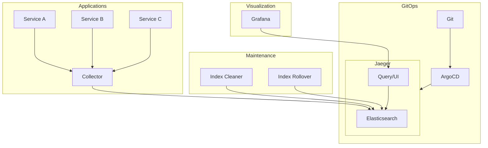

# How to Deploy Jaeger with ArgoCD

Author: [nawazdhandala](https://github.com/nawazdhandala)

Tags: ArgoCD, GitOps, Kubernetes, Jaeger, Tracing

Description: Learn how to deploy Jaeger for distributed tracing using ArgoCD with the Jaeger Operator, production storage backends, and OpenTelemetry integration.

---

Jaeger is one of the most widely adopted distributed tracing systems, originally developed at Uber and now a graduated CNCF project. It helps you monitor and troubleshoot microservices by tracking requests as they flow through your system. Deploying Jaeger with ArgoCD means your entire tracing infrastructure is declared in Git, with automated deployment, drift detection, and self-healing.

This guide covers deploying Jaeger using the Jaeger Operator through ArgoCD, with both in-memory and production-grade Elasticsearch or Cassandra backends.

## Jaeger Components

Jaeger consists of several components:

- **Agent**: Receives spans from applications via UDP and forwards them to the collector
- **Collector**: Receives spans, processes them, and writes to storage
- **Query**: Serves the Jaeger UI and an API for trace retrieval
- **Ingester**: Reads from Kafka (when using streaming deployment) and writes to storage

The Jaeger Operator simplifies management by providing a `Jaeger` custom resource that declares the desired state of your Jaeger installation.

## Repository Structure

```
tracing/
  jaeger-operator/
    Chart.yaml
    values.yaml
  jaeger-instances/
    production.yaml
    development.yaml
```

## Deploying the Jaeger Operator

### Wrapper Chart

```yaml
# tracing/jaeger-operator/Chart.yaml
apiVersion: v2
name: jaeger-operator
description: Wrapper chart for Jaeger Operator
type: application
version: 1.0.0
dependencies:
  - name: jaeger-operator
    version: "2.56.0"
    repository: "https://jaegertracing.github.io/helm-charts"
```

### Operator Values

```yaml
# tracing/jaeger-operator/values.yaml
jaeger-operator:
  # Watch all namespaces
  rbac:
    clusterRole: true

  resources:
    requests:
      cpu: 100m
      memory: 128Mi
    limits:
      memory: 256Mi

  # Install CRDs
  crd:
    install: true

  serviceMonitor:
    enabled: true
    additionalLabels:
      release: kube-prometheus-stack
```

### ArgoCD Application for the Operator

```yaml
apiVersion: argoproj.io/v1alpha1
kind: Application
metadata:
  name: jaeger-operator
  namespace: argocd
  annotations:
    argocd.argoproj.io/sync-wave: "-1"
spec:
  project: tracing
  source:
    repoURL: https://github.com/your-org/gitops-repo.git
    targetRevision: main
    path: tracing/jaeger-operator
    helm:
      valueFiles:
        - values.yaml
  destination:
    server: https://kubernetes.default.svc
    namespace: observability
  syncPolicy:
    automated:
      prune: true
      selfHeal: true
    syncOptions:
      - CreateNamespace=true
      - ServerSideApply=true
  ignoreDifferences:
    - group: admissionregistration.k8s.io
      kind: MutatingWebhookConfiguration
      jqPathExpressions:
        - '.webhooks[]?.clientConfig.caBundle'
```

## Creating Jaeger Instances

### Development Instance (All-in-One)

For development environments, use the all-in-one strategy with in-memory storage.

```yaml
# tracing/jaeger-instances/development.yaml
apiVersion: jaegertracing.io/v1
kind: Jaeger
metadata:
  name: jaeger-dev
  namespace: observability
spec:
  strategy: allInOne
  allInOne:
    image: jaegertracing/all-in-one:1.62.0
    options:
      log-level: info
      memory:
        max-traces: 100000
  resources:
    requests:
      cpu: 100m
      memory: 256Mi
    limits:
      memory: 512Mi
  storage:
    type: memory
```

### Production Instance with Elasticsearch

For production, use the production strategy with Elasticsearch as the storage backend.

```yaml
# tracing/jaeger-instances/production.yaml
apiVersion: jaegertracing.io/v1
kind: Jaeger
metadata:
  name: jaeger
  namespace: observability
spec:
  strategy: production

  collector:
    replicas: 2
    maxReplicas: 5
    resources:
      requests:
        cpu: 500m
        memory: 512Mi
      limits:
        memory: 1Gi
    options:
      collector:
        num-workers: 100
        queue-size: 10000
    autoscale: true

  query:
    replicas: 2
    resources:
      requests:
        cpu: 250m
        memory: 256Mi
      limits:
        memory: 512Mi
    options:
      query:
        base-path: /jaeger

  # Elasticsearch storage
  storage:
    type: elasticsearch
    options:
      es:
        server-urls: https://elasticsearch-master.logging.svc.cluster.local:9200
        index-prefix: jaeger
        tls:
          ca: /es/certificates/ca.crt
        num-shards: 3
        num-replicas: 1
    secretName: jaeger-es-credentials
    esIndexCleaner:
      enabled: true
      numberOfDays: 14
      schedule: "55 23 * * *"
    esRollover:
      conditions: '{"max_age": "1d"}'
      readTTL: 336h  # 14 days
      schedule: "0 0 * * *"

  # Volume mounts for ES TLS certificates
  volumeMounts:
    - name: es-certs
      mountPath: /es/certificates
      readOnly: true
  volumes:
    - name: es-certs
      secret:
        secretName: elasticsearch-master-certs

  # Sampling configuration
  sampling:
    options:
      default_strategy:
        type: probabilistic
        param: 0.1  # Sample 10% of traces
      per_operation_strategies:
        - service: critical-api
          type: probabilistic
          param: 1.0  # Sample 100% of critical-api traces
```

### ArgoCD Application for Jaeger Instances

```yaml
apiVersion: argoproj.io/v1alpha1
kind: Application
metadata:
  name: jaeger-instances
  namespace: argocd
  annotations:
    argocd.argoproj.io/sync-wave: "0"
spec:
  project: tracing
  source:
    repoURL: https://github.com/your-org/gitops-repo.git
    targetRevision: main
    path: tracing/jaeger-instances
  destination:
    server: https://kubernetes.default.svc
    namespace: observability
  syncPolicy:
    automated:
      prune: true
      selfHeal: true
```

## Configuring Applications to Send Traces

### Using OpenTelemetry SDK

Modern applications should use the OpenTelemetry SDK to send traces to Jaeger's OTLP endpoint.

```yaml
# Environment variables for your application
env:
  - name: OTEL_EXPORTER_OTLP_ENDPOINT
    value: "http://jaeger-collector.observability.svc.cluster.local:4317"
  - name: OTEL_EXPORTER_OTLP_PROTOCOL
    value: "grpc"
  - name: OTEL_SERVICE_NAME
    value: "my-service"
```

### Using Jaeger Client (Legacy)

For applications still using the Jaeger client libraries, configure the agent endpoint.

```yaml
env:
  - name: JAEGER_AGENT_HOST
    value: "jaeger-agent.observability.svc.cluster.local"
  - name: JAEGER_AGENT_PORT
    value: "6831"
  - name: JAEGER_SERVICE_NAME
    value: "my-service"
  - name: JAEGER_SAMPLER_TYPE
    value: "probabilistic"
  - name: JAEGER_SAMPLER_PARAM
    value: "0.1"
```

## Integrating Jaeger with Grafana

Add Jaeger as a datasource in Grafana for unified observability.

```yaml
kube-prometheus-stack:
  grafana:
    additionalDataSources:
      - name: Jaeger
        type: jaeger
        url: http://jaeger-query.observability.svc.cluster.local:16686
        access: proxy
        jsonData:
          tracesToLogs:
            datasourceUid: loki
            tags: ['service.name']
            filterByTraceID: true
          nodeGraph:
            enabled: true
```

## Production Architecture



## Migrating from Jaeger to Tempo

If you are considering migrating from Jaeger to Grafana Tempo (see [deploying Tempo with ArgoCD](https://oneuptime.com/blog/post/2026-02-26-deploy-tempo-argocd/view)), you can run both in parallel during the transition. Configure your OpenTelemetry Collector to fan out traces to both backends.

## Verifying the Deployment

```bash
# Check operator
kubectl get pods -n observability -l app.kubernetes.io/name=jaeger-operator

# Check Jaeger instance
kubectl get jaeger -n observability

# Check all Jaeger components
kubectl get pods -n observability -l app.kubernetes.io/instance=jaeger

# Access the Jaeger UI
kubectl port-forward -n observability svc/jaeger-query 16686:16686

# Check ArgoCD sync status
argocd app get jaeger-instances
```

## Summary

Deploying Jaeger with ArgoCD through the Jaeger Operator gives you a declarative, GitOps-managed distributed tracing system. The operator handles the complexity of managing collectors, query services, and storage backends, while ArgoCD ensures the configuration stays in sync with Git. For new deployments, consider Grafana Tempo as a simpler alternative, but for existing Jaeger installations, the operator-plus-ArgoCD approach provides a clean migration path to full GitOps management.
