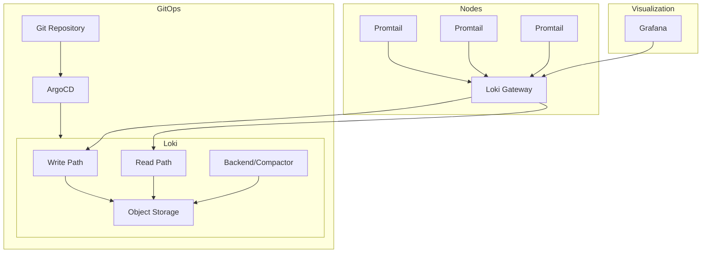

# How to Deploy Loki with ArgoCD

Author: [nawazdhandala](https://github.com/nawazdhandala)

Tags: ArgoCD, GitOps, Kubernetes, Loki, Logging

Description: Learn how to deploy Grafana Loki for log aggregation using ArgoCD with production-ready configuration, storage backends, and retention policies.

---

Grafana Loki is a horizontally scalable, highly available log aggregation system designed to be cost-effective and easy to operate. Unlike Elasticsearch, Loki indexes only metadata (labels) rather than the full text of log lines, which makes it significantly cheaper to run. Deploying Loki with ArgoCD gives you a GitOps-managed logging pipeline that is reproducible and self-healing.

This guide covers deploying Loki in both single-binary mode for smaller environments and microservices mode for production workloads.

## Understanding Loki Deployment Modes

Loki has three deployment modes:

- **Monolithic (single binary)**: All components run in a single process. Good for development and small clusters.
- **Simple Scalable**: Read and write paths are separated into two targets. Good for medium workloads.
- **Microservices**: Each component runs independently. Best for large-scale production deployments.

For most ArgoCD-managed deployments, the Simple Scalable mode provides the best balance of scalability and operational simplicity.

## Repository Structure

```text
logging/
  loki/
    Chart.yaml
    values.yaml
    values-production.yaml
  promtail/
    Chart.yaml
    values.yaml
```

## Setting Up the Wrapper Chart

Create a wrapper chart that pulls in the official Loki Helm chart.

```yaml
# logging/loki/Chart.yaml
apiVersion: v2
name: loki
description: Wrapper chart for Grafana Loki
type: application
version: 1.0.0
dependencies:
  - name: loki
    version: "6.16.0"
    repository: "https://grafana.github.io/helm-charts"
```

## Configuring Loki for Simple Scalable Mode

The values file configures Loki with S3-compatible object storage, which is essential for any production deployment.

```yaml
# logging/loki/values.yaml
loki:
  # Deploy in simple scalable mode
  deploymentMode: SimpleScalable

  loki:
    # Authentication is handled externally
    auth_enabled: false

    # Schema configuration
    schemaConfig:
      configs:
        - from: "2024-04-01"
          store: tsdb
          object_store: s3
          schema: v13
          index:
            prefix: loki_index_
            period: 24h

    # Storage configuration - using S3
    storage:
      type: s3
      bucketNames:
        chunks: loki-chunks
        ruler: loki-ruler
        admin: loki-admin
      s3:
        endpoint: null  # Uses AWS default endpoint
        region: us-east-1
        secretAccessKey: null  # Use IRSA or pod identity
        accessKeyId: null
        s3ForcePathStyle: false
        insecure: false

    # Limits configuration
    limits_config:
      retention_period: 720h  # 30 days
      max_query_series: 500
      max_query_parallelism: 32
      ingestion_rate_mb: 10
      ingestion_burst_size_mb: 20
      per_stream_rate_limit: 5MB
      per_stream_rate_limit_burst: 15MB

    # Compactor handles retention
    compactor:
      retention_enabled: true
      delete_request_store: s3
      working_directory: /var/loki/compactor

  # Read replicas
  read:
    replicas: 3
    resources:
      requests:
        cpu: 500m
        memory: 1Gi
      limits:
        memory: 2Gi

  # Write replicas
  write:
    replicas: 3
    persistence:
      size: 20Gi
      storageClass: gp3
    resources:
      requests:
        cpu: 500m
        memory: 1Gi
      limits:
        memory: 2Gi

  # Backend (compactor, ruler, etc.)
  backend:
    replicas: 3
    persistence:
      size: 20Gi
      storageClass: gp3
    resources:
      requests:
        cpu: 250m
        memory: 512Mi
      limits:
        memory: 1Gi

  # Gateway - nginx reverse proxy
  gateway:
    replicas: 2
    resources:
      requests:
        cpu: 100m
        memory: 128Mi

  # Disable components not needed in simple scalable mode
  singleBinary:
    replicas: 0

  # Monitoring
  monitoring:
    serviceMonitor:
      enabled: true
      labels:
        release: kube-prometheus-stack
    selfMonitoring:
      enabled: false
    lokiCanary:
      enabled: true
```

## Creating the ArgoCD Application for Loki

```yaml
apiVersion: argoproj.io/v1alpha1
kind: Application
metadata:
  name: loki
  namespace: argocd
  finalizers:
    - resources-finalizer.argocd.argoproj.io
spec:
  project: logging
  source:
    repoURL: https://github.com/your-org/gitops-repo.git
    targetRevision: main
    path: logging/loki
    helm:
      valueFiles:
        - values.yaml
        - values-production.yaml
  destination:
    server: https://kubernetes.default.svc
    namespace: logging
  syncPolicy:
    automated:
      prune: true
      selfHeal: true
    syncOptions:
      - CreateNamespace=true
      - ServerSideApply=true
    retry:
      limit: 5
      backoff:
        duration: 5s
        factor: 2
        maxDuration: 3m
```

## Deploying Promtail as the Log Collector

Loki needs a log shipper to send logs from your nodes. Promtail is the most common choice for Kubernetes.

```yaml
# logging/promtail/Chart.yaml
apiVersion: v2
name: promtail
description: Wrapper chart for Grafana Promtail
type: application
version: 1.0.0
dependencies:
  - name: promtail
    version: "6.16.6"
    repository: "https://grafana.github.io/helm-charts"
```

```yaml
# logging/promtail/values.yaml
promtail:
  config:
    clients:
      - url: http://loki-gateway.logging.svc.cluster.local/loki/api/v1/push
        tenant_id: ""

    snippets:
      # Add Kubernetes metadata to logs
      pipelineStages:
        - cri: {}
        - multiline:
            firstline: '^\d{4}-\d{2}-\d{2}'
            max_wait_time: 3s
        - labeldrop:
            - filename
            - stream

  # DaemonSet resources
  resources:
    requests:
      cpu: 100m
      memory: 128Mi
    limits:
      memory: 256Mi

  # Tolerations to run on all nodes
  tolerations:
    - effect: NoSchedule
      operator: Exists

  serviceMonitor:
    enabled: true
    labels:
      release: kube-prometheus-stack
```

Create a separate ArgoCD Application for Promtail.

```yaml
apiVersion: argoproj.io/v1alpha1
kind: Application
metadata:
  name: promtail
  namespace: argocd
spec:
  project: logging
  source:
    repoURL: https://github.com/your-org/gitops-repo.git
    targetRevision: main
    path: logging/promtail
    helm:
      valueFiles:
        - values.yaml
  destination:
    server: https://kubernetes.default.svc
    namespace: logging
  syncPolicy:
    automated:
      prune: true
      selfHeal: true
    syncOptions:
      - CreateNamespace=true
```

## Setting Up IAM for S3 Access

On AWS, use IAM Roles for Service Accounts (IRSA) rather than static credentials.

```yaml
# In your values-production.yaml
loki:
  loki:
    storage:
      s3:
        region: us-east-1
  serviceAccount:
    annotations:
      eks.amazonaws.com/role-arn: arn:aws:iam::123456789012:role/loki-s3-access
```

## Adding Loki as a Grafana Datasource

If you are running Grafana through kube-prometheus-stack, add Loki as a datasource in your values.

```yaml
kube-prometheus-stack:
  grafana:
    additionalDataSources:
      - name: Loki
        type: loki
        url: http://loki-gateway.logging.svc.cluster.local
        access: proxy
        isDefault: false
        jsonData:
          maxLines: 1000
```

## Verifying the Deployment

After ArgoCD syncs both applications, verify the logging pipeline.

```bash
# Check Loki pods
kubectl get pods -n logging -l app.kubernetes.io/name=loki

# Check Promtail DaemonSet
kubectl get ds -n logging

# Test log ingestion using logcli
kubectl port-forward -n logging svc/loki-gateway 3100:80
logcli query '{namespace="default"}' --addr=http://localhost:3100

# Verify through Grafana Explore
kubectl port-forward -n monitoring svc/kube-prometheus-stack-grafana 3000:80
```

## Architecture Overview



## Summary

Deploying Loki with ArgoCD gives you a GitOps-managed logging pipeline where configuration changes are tracked, reviewed, and automatically applied. Use the Simple Scalable mode for most production environments, configure S3-compatible object storage for durability, and pair Loki with Promtail for comprehensive log collection. The combination of Loki, Promtail, Grafana, and ArgoCD provides a modern, cost-effective logging stack that is fully declarative and self-healing.
