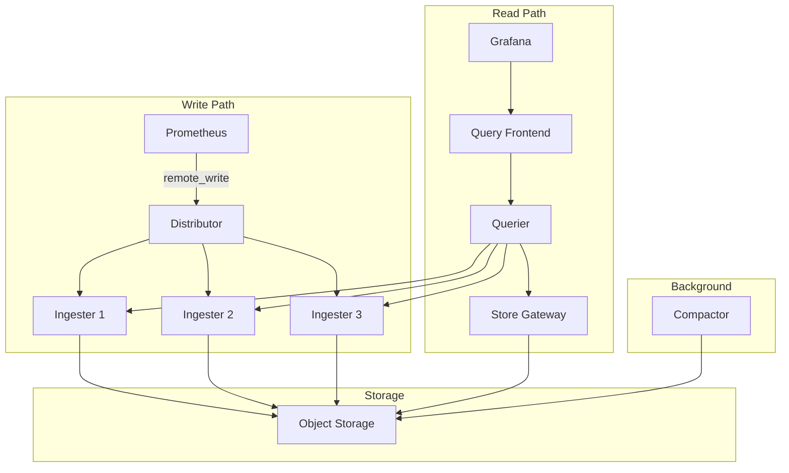

# How to Deploy Mimir with ArgoCD

Author: [nawazdhandala](https://github.com/nawazdhandala)

Tags: ArgoCD, GitOps, Kubernetes, Mimir, Metrics

Description: Learn how to deploy Grafana Mimir for long-term metrics storage using ArgoCD with scalable configuration, multi-tenancy, and object storage backends.

---

Grafana Mimir is an open-source, horizontally scalable, highly available metrics backend that provides long-term storage for Prometheus metrics. It is the successor to Cortex and can handle billions of active time series. Deploying Mimir with ArgoCD gives you a GitOps-managed metrics backend that scales with your infrastructure while keeping all configuration in version control.

This guide walks you through deploying Mimir in distributed mode using ArgoCD, configuring it with object storage, and integrating it with Prometheus for remote write.

## Why Mimir Over Standalone Prometheus

Standalone Prometheus has limitations for large-scale deployments:

- Single-node storage means data is lost if the pod restarts without persistent volumes
- No native horizontal scaling for ingestion or query
- Retention is limited by local disk size
- No built-in multi-tenancy

Mimir solves all of these by providing a scalable, multi-tenant metrics backend that uses cheap object storage for long-term retention.

## Mimir Architecture



## Repository Structure

```text
metrics/
  mimir/
    Chart.yaml
    values.yaml
    values-production.yaml
    runtime-config.yaml
```

## Creating the Wrapper Chart

```yaml
# metrics/mimir/Chart.yaml
apiVersion: v2
name: mimir
description: Wrapper chart for Grafana Mimir
type: application
version: 1.0.0
dependencies:
  - name: mimir-distributed
    version: "5.5.1"
    repository: "https://grafana.github.io/helm-charts"
```

## Configuring Mimir

```yaml
# metrics/mimir/values.yaml
mimir-distributed:
  # Global image settings
  global:
    extraEnvFrom:
      - secretRef:
          name: mimir-s3-credentials
          optional: true

  # Mimir configuration
  mimir:
    structuredConfig:
      # Multi-tenancy
      multitenancy_enabled: false

      # Limits - global defaults
      limits:
        max_global_series_per_user: 1500000
        max_global_series_per_metric: 50000
        ingestion_rate: 200000
        ingestion_burst_size: 400000
        compactor_blocks_retention_period: 365d  # 1 year retention
        max_label_names_per_series: 30
        max_label_value_length: 2048

      # Blocks storage configuration
      blocks_storage:
        backend: s3
        s3:
          bucket_name: mimir-blocks
          endpoint: s3.us-east-1.amazonaws.com
          region: us-east-1
        tsdb:
          dir: /data/tsdb
          block_ranges_period: [2h]
          retention_period: 24h
        bucket_store:
          sync_dir: /data/tsdb-sync
          index_cache:
            backend: memcached
            memcached:
              addresses: dns+mimir-index-cache-memcached.metrics.svc.cluster.local:11211

      # Ruler storage
      ruler_storage:
        backend: s3
        s3:
          bucket_name: mimir-ruler
          endpoint: s3.us-east-1.amazonaws.com
          region: us-east-1

      # Alertmanager storage
      alertmanager_storage:
        backend: s3
        s3:
          bucket_name: mimir-alertmanager
          endpoint: s3.us-east-1.amazonaws.com
          region: us-east-1

  # Distributor
  distributor:
    replicas: 2
    resources:
      requests:
        cpu: 500m
        memory: 1Gi
      limits:
        memory: 2Gi

  # Ingester
  ingester:
    replicas: 3
    persistentVolume:
      enabled: true
      size: 50Gi
      storageClass: gp3
    resources:
      requests:
        cpu: 1
        memory: 4Gi
      limits:
        memory: 8Gi
    zoneAwareReplication:
      enabled: false

  # Store gateway
  store_gateway:
    replicas: 2
    persistentVolume:
      enabled: true
      size: 20Gi
      storageClass: gp3
    resources:
      requests:
        cpu: 500m
        memory: 2Gi
      limits:
        memory: 4Gi

  # Compactor
  compactor:
    replicas: 1
    persistentVolume:
      enabled: true
      size: 50Gi
      storageClass: gp3
    resources:
      requests:
        cpu: 1
        memory: 2Gi
      limits:
        memory: 4Gi

  # Query frontend
  query_frontend:
    replicas: 2
    resources:
      requests:
        cpu: 500m
        memory: 512Mi
      limits:
        memory: 1Gi

  # Querier
  querier:
    replicas: 2
    resources:
      requests:
        cpu: 500m
        memory: 1Gi
      limits:
        memory: 2Gi

  # Ruler
  ruler:
    replicas: 1
    resources:
      requests:
        cpu: 250m
        memory: 512Mi
      limits:
        memory: 1Gi

  # Nginx gateway
  nginx:
    enabled: true
    replicas: 2
    resources:
      requests:
        cpu: 100m
        memory: 128Mi

  # Memcached for caching
  chunks-cache:
    enabled: true
    replicas: 2
    allocatedMemory: 4096
    resources:
      requests:
        cpu: 250m
        memory: 4608Mi
      limits:
        memory: 5120Mi

  index-cache:
    enabled: true
    replicas: 2
    allocatedMemory: 2048
    resources:
      requests:
        cpu: 250m
        memory: 2560Mi
      limits:
        memory: 3072Mi

  metadata-cache:
    enabled: true
    replicas: 1
    allocatedMemory: 512
    resources:
      requests:
        cpu: 100m
        memory: 640Mi
      limits:
        memory: 768Mi

  results-cache:
    enabled: true
    replicas: 1
    allocatedMemory: 512
    resources:
      requests:
        cpu: 100m
        memory: 640Mi
      limits:
        memory: 768Mi

  # Monitoring
  metaMonitoring:
    serviceMonitor:
      enabled: true
      labels:
        release: kube-prometheus-stack

  # Rollout operator for safe ingester updates
  rollout_operator:
    enabled: true
```

## Creating the ArgoCD Application

```yaml
apiVersion: argoproj.io/v1alpha1
kind: Application
metadata:
  name: mimir
  namespace: argocd
  finalizers:
    - resources-finalizer.argocd.argoproj.io
spec:
  project: metrics
  source:
    repoURL: https://github.com/your-org/gitops-repo.git
    targetRevision: main
    path: metrics/mimir
    helm:
      valueFiles:
        - values.yaml
        - values-production.yaml
  destination:
    server: https://kubernetes.default.svc
    namespace: metrics
  syncPolicy:
    automated:
      prune: true
      selfHeal: true
    syncOptions:
      - CreateNamespace=true
      - ServerSideApply=true
    retry:
      limit: 5
      backoff:
        duration: 10s
        factor: 2
        maxDuration: 5m
  ignoreDifferences:
    - group: apps
      kind: StatefulSet
      jqPathExpressions:
        - '.spec.volumeClaimTemplates[]?.spec.resources'
```

## Configuring Prometheus Remote Write

Point your existing Prometheus instances to write metrics to Mimir.

```yaml
# In kube-prometheus-stack values
kube-prometheus-stack:
  prometheus:
    prometheusSpec:
      remoteWrite:
        - url: http://mimir-nginx.metrics.svc.cluster.local/api/v1/push
          writeRelabelConfigs:
            # Drop high-cardinality metrics to reduce cost
            - sourceLabels: [__name__]
              regex: 'container_memory_failures_total|container_tasks_state'
              action: drop
          queueConfig:
            capacity: 10000
            maxSamplesPerSend: 5000
            batchSendDeadline: 5s
            maxShards: 30
```

## Adding Mimir as a Grafana Datasource

```yaml
kube-prometheus-stack:
  grafana:
    additionalDataSources:
      - name: Mimir
        type: prometheus
        url: http://mimir-nginx.metrics.svc.cluster.local/prometheus
        access: proxy
        isDefault: false
        jsonData:
          timeInterval: 15s
          httpMethod: POST
```

## Runtime Configuration for Tenant Overrides

Mimir supports runtime configuration that can be updated without restarting pods. Store it as a ConfigMap.

```yaml
# metrics/mimir/runtime-config.yaml
apiVersion: v1
kind: ConfigMap
metadata:
  name: mimir-runtime-config
  namespace: metrics
data:
  runtime.yaml: |
    overrides:
      # Per-tenant overrides when multi-tenancy is enabled
      tenant-a:
        max_global_series_per_user: 3000000
        ingestion_rate: 500000
      tenant-b:
        max_global_series_per_user: 500000
        ingestion_rate: 100000
```

## Verifying the Deployment

```bash
# Check all Mimir components
kubectl get pods -n metrics -l app.kubernetes.io/name=mimir

# Verify ingester ring membership
kubectl port-forward -n metrics svc/mimir-nginx 8080:80
curl http://localhost:8080/ingester/ring

# Verify metrics are being ingested
curl -G http://localhost:8080/prometheus/api/v1/query --data-urlencode 'query=up'

# Check ArgoCD sync status
argocd app get mimir
```

## Handling Ingester Rollouts

Ingesters are stateful and hold in-memory data. The Mimir rollout operator handles safe updates by ensuring data is flushed before pods are terminated. Make sure it is enabled in your values, and ArgoCD will coordinate with it during syncs.

If you need to force a sync that updates ingesters, set the sync wave annotations to ensure the rollout operator deploys before the ingesters.

## Summary

Deploying Mimir with ArgoCD provides a production-grade, long-term metrics storage solution that is fully managed through GitOps. The key configuration areas are object storage setup, cache layer sizing, and ingester resource allocation. With Mimir receiving metrics via Prometheus remote write and ArgoCD keeping the deployment in sync with Git, you have a scalable metrics backend that can grow with your infrastructure while maintaining full auditability of every configuration change.
