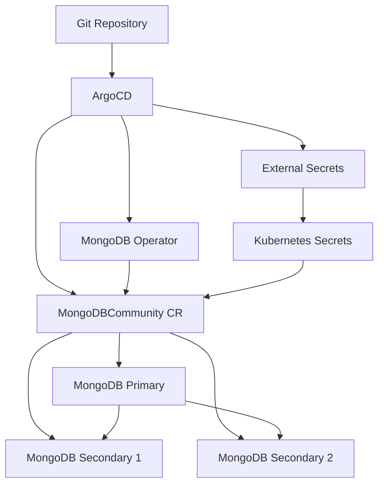

# How to Deploy MongoDB Community Operator with ArgoCD

Author: [nawazdhandala](https://github.com/nawazdhandala)

Tags: ArgoCD, GitOps, Kubernetes, MongoDB, Database

Description: Learn how to deploy the MongoDB Community Operator using ArgoCD to manage MongoDB replica sets on Kubernetes with a full GitOps workflow.

---

The MongoDB Community Operator allows you to run MongoDB replica sets on Kubernetes with automated provisioning, scaling, and failover. When paired with ArgoCD, every MongoDB deployment becomes a Git commit - reviewable, auditable, and automatically reconciled against the live state of your cluster.

This post covers the full lifecycle: installing the operator, creating replica sets, handling credentials, configuring health checks, and managing upgrades, all through ArgoCD.

## Prerequisites

- Kubernetes cluster (1.24+)
- ArgoCD installed and configured
- A Git repository for your Kubernetes manifests
- A storage class with dynamic provisioning support

## Step 1: Install the MongoDB Community Operator

The Community Operator is available through a Helm chart maintained by MongoDB. Create an ArgoCD Application to install it.

```yaml
# argocd/mongodb-operator.yaml
apiVersion: argoproj.io/v1alpha1
kind: Application
metadata:
  name: mongodb-community-operator
  namespace: argocd
  finalizers:
    - resources-finalizer.argocd.argoproj.io
spec:
  project: default
  source:
    chart: community-operator
    repoURL: https://mongodb.github.io/helm-charts
    targetRevision: 0.10.0
    helm:
      releaseName: mongodb-community-operator
      values: |
        operator:
          resources:
            limits:
              cpu: 200m
              memory: 256Mi
            requests:
              cpu: 100m
              memory: 128Mi
          # Watch all namespaces or specific ones
          watchNamespace: "*"
  destination:
    server: https://kubernetes.default.svc
    namespace: mongodb-operator
  syncPolicy:
    automated:
      prune: true
      selfHeal: true
    syncOptions:
      - CreateNamespace=true
      - ServerSideApply=true
```

## Step 2: Create the Database Application in ArgoCD

Keep database instances in a separate ArgoCD Application from the operator itself.

```yaml
# argocd/mongodb-instances.yaml
apiVersion: argoproj.io/v1alpha1
kind: Application
metadata:
  name: mongodb-instances
  namespace: argocd
spec:
  project: default
  source:
    repoURL: https://github.com/your-org/k8s-manifests.git
    targetRevision: main
    path: databases/mongodb
  destination:
    server: https://kubernetes.default.svc
    namespace: databases
  syncPolicy:
    automated:
      prune: false  # Protect against accidental database deletion
      selfHeal: true
    syncOptions:
      - CreateNamespace=true
```

## Step 3: Define a MongoDB Replica Set

The core resource is `MongoDBCommunity`. This creates a 3-member replica set with automatic primary election.

```yaml
# databases/mongodb/production-replicaset.yaml
apiVersion: mongodbcommunity.mongodb.com/v1
kind: MongoDBCommunity
metadata:
  name: production-mongodb
  namespace: databases
spec:
  members: 3
  type: ReplicaSet
  version: "7.0.14"

  # Security configuration
  security:
    authentication:
      modes: ["SCRAM"]

  # Database users
  users:
    - name: app-user
      db: admin
      passwordSecretRef:
        name: mongodb-app-user-password
      roles:
        - name: readWrite
          db: application
        - name: clusterMonitor
          db: admin
      scramCredentialsSecretName: app-user-scram

    - name: backup-user
      db: admin
      passwordSecretRef:
        name: mongodb-backup-user-password
      roles:
        - name: backup
          db: admin
        - name: clusterMonitor
          db: admin
      scramCredentialsSecretName: backup-user-scram

  # Additional MongoDB configuration
  additionalMongodConfig:
    storage.wiredTiger.engineConfig.journalCompressor: zlib
    net.maxIncomingConnections: 500
    operationProfiling.mode: slowOp
    operationProfiling.slowOpThresholdMs: 100

  # StatefulSet override for resources and storage
  statefulSet:
    spec:
      template:
        spec:
          containers:
            - name: mongod
              resources:
                requests:
                  cpu: "1"
                  memory: 2Gi
                limits:
                  cpu: "2"
                  memory: 4Gi
            - name: mongodb-agent
              resources:
                requests:
                  cpu: 50m
                  memory: 64Mi
                limits:
                  cpu: 100m
                  memory: 128Mi
          affinity:
            podAntiAffinity:
              requiredDuringSchedulingIgnoredDuringExecution:
                - labelSelector:
                    matchLabels:
                      app: production-mongodb-svc
                  topologyKey: kubernetes.io/hostname
      volumeClaimTemplates:
        - metadata:
            name: data-volume
          spec:
            accessModes: ["ReadWriteOnce"]
            storageClassName: gp3-encrypted
            resources:
              requests:
                storage: 50Gi
        - metadata:
            name: logs-volume
          spec:
            accessModes: ["ReadWriteOnce"]
            storageClassName: gp3
            resources:
              requests:
                storage: 10Gi
```

## Step 4: Manage Secrets Properly

User passwords must exist as Kubernetes Secrets before the MongoDBCommunity resource is created. Use External Secrets or Sealed Secrets.

```yaml
# databases/mongodb/external-secrets.yaml
apiVersion: external-secrets.io/v1beta1
kind: ExternalSecret
metadata:
  name: mongodb-app-user-password
  namespace: databases
  annotations:
    argocd.argoproj.io/sync-wave: "-1"  # Create before MongoDB
spec:
  refreshInterval: 1h
  secretStoreRef:
    name: aws-secrets-manager
    kind: ClusterSecretStore
  target:
    name: mongodb-app-user-password
  data:
    - secretKey: password
      remoteRef:
        key: /production/mongodb/app-user
        property: password
---
apiVersion: external-secrets.io/v1beta1
kind: ExternalSecret
metadata:
  name: mongodb-backup-user-password
  namespace: databases
  annotations:
    argocd.argoproj.io/sync-wave: "-1"
spec:
  refreshInterval: 1h
  secretStoreRef:
    name: aws-secrets-manager
    kind: ClusterSecretStore
  target:
    name: mongodb-backup-user-password
  data:
    - secretKey: password
      remoteRef:
        key: /production/mongodb/backup-user
        property: password
```

## Step 5: Add ArgoCD Health Checks

Tell ArgoCD how to assess the health of MongoDB resources.

```yaml
# argocd-cm ConfigMap
data:
  resource.customizations.health.mongodbcommunity.mongodb.com_MongoDBCommunity: |
    hs = {}
    if obj.status ~= nil then
      if obj.status.phase == "Running" then
        hs.status = "Healthy"
        hs.message = "MongoDB replica set is running with " ..
          (obj.status.currentStatefulSetReplicas or 0) .. " members"
      elseif obj.status.phase == "Pending" then
        hs.status = "Progressing"
        hs.message = "MongoDB replica set is being provisioned"
      else
        hs.status = "Degraded"
        hs.message = obj.status.phase or "Unknown state"
      end
    else
      hs.status = "Progressing"
      hs.message = "Waiting for status"
    end
    return hs
```

## Architecture



## Connection String

Once the replica set is running, applications connect through the generated connection string:

```
mongodb://app-user:<password>@production-mongodb-0.production-mongodb-svc.databases.svc.cluster.local:27017,production-mongodb-1.production-mongodb-svc.databases.svc.cluster.local:27017,production-mongodb-2.production-mongodb-svc.databases.svc.cluster.local:27017/application?replicaSet=production-mongodb&authSource=admin
```

The operator creates a ConfigMap with the connection string that your applications can reference.

## Scaling the Replica Set

To add more members, update the `members` field and push to Git:

```yaml
spec:
  members: 5  # was 3
```

ArgoCD detects the drift and syncs. The operator adds two new secondaries, provisions their storage, and integrates them into the replica set automatically.

## Version Upgrades

MongoDB version upgrades work the same way. Update the version field:

```yaml
spec:
  version: "8.0.0"  # was 7.0.14
```

The operator performs a rolling upgrade, one member at a time, stepping down the primary when its turn comes and waiting for elections to complete before proceeding.

## Monitoring Integration

The MongoDB Community Operator exposes metrics compatible with the Prometheus MongoDB exporter. You can deploy it alongside your replica set and monitor everything through [OneUptime](https://oneuptime.com) for unified observability.

## Conclusion

Managing MongoDB Community Operator through ArgoCD creates a clean separation between operator lifecycle and database instance management. Your database configurations live in Git, changes go through pull requests, and ArgoCD ensures the cluster state always matches your declarations. Remember to disable auto-pruning for database resources, use sync waves for dependency ordering, and add custom health checks for accurate status reporting in the ArgoCD dashboard.
