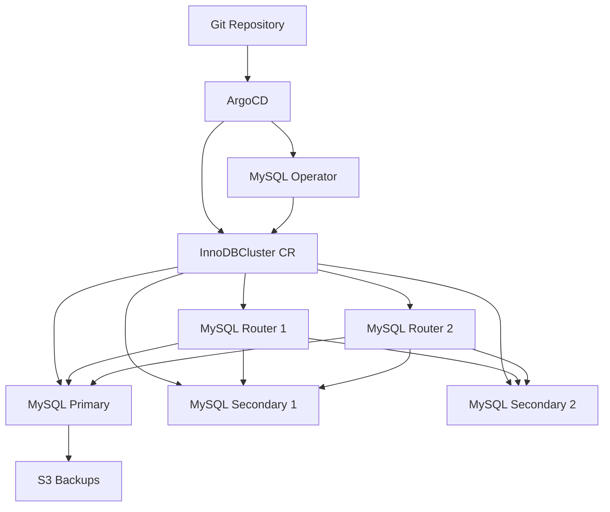

# How to Deploy MySQL Operator with ArgoCD

Author: [nawazdhandala](https://github.com/nawazdhandala)

Tags: ArgoCD, GitOps, Kubernetes, MySQL, Database

Description: Learn how to deploy the MySQL Operator for Kubernetes using ArgoCD to manage MySQL InnoDB Clusters with GitOps workflows for automated provisioning and lifecycle management.

---

The MySQL Operator for Kubernetes, maintained by Oracle, automates the deployment and management of MySQL InnoDB Clusters. It handles group replication, automatic failover, MySQL Router integration, and backup scheduling. When you combine it with ArgoCD, you get a fully GitOps-driven MySQL infrastructure where every database change is tracked in version control.

This guide covers deploying the operator, provisioning MySQL InnoDB Clusters, configuring backups, and handling the nuances of managing stateful workloads through ArgoCD.

## Prerequisites

- Kubernetes cluster (1.24+)
- ArgoCD installed and running
- A Git repository for manifests
- Storage class that supports dynamic provisioning

## Step 1: Deploy the MySQL Operator via ArgoCD

The MySQL Operator is available through the Oracle Helm chart repository. Create an ArgoCD Application to install it.

```yaml
# argocd/mysql-operator.yaml
apiVersion: argoproj.io/v1alpha1
kind: Application
metadata:
  name: mysql-operator
  namespace: argocd
  finalizers:
    - resources-finalizer.argocd.argoproj.io
spec:
  project: default
  source:
    chart: mysql-operator
    repoURL: https://mysql.github.io/mysql-operator/
    targetRevision: 2.2.1
    helm:
      releaseName: mysql-operator
      values: |
        # Run two replicas for operator HA
        replicas: 2
        # Resource limits
        resources:
          requests:
            cpu: 100m
            memory: 128Mi
          limits:
            cpu: 200m
            memory: 256Mi
  destination:
    server: https://kubernetes.default.svc
    namespace: mysql-operator
  syncPolicy:
    automated:
      prune: true
      selfHeal: true
    syncOptions:
      - CreateNamespace=true
      - ServerSideApply=true
```

## Step 2: Create an ArgoCD Application for MySQL Clusters

Separate the operator from the database instances. This way you can manage operator upgrades independently from database provisioning.

```yaml
# argocd/mysql-clusters.yaml
apiVersion: argoproj.io/v1alpha1
kind: Application
metadata:
  name: mysql-clusters
  namespace: argocd
spec:
  project: default
  source:
    repoURL: https://github.com/your-org/k8s-manifests.git
    targetRevision: main
    path: databases/mysql
  destination:
    server: https://kubernetes.default.svc
    namespace: databases
  syncPolicy:
    automated:
      prune: false  # Never auto-delete databases
      selfHeal: true
    syncOptions:
      - CreateNamespace=true
```

## Step 3: Define an InnoDB Cluster

The MySQL Operator uses the `InnoDBCluster` custom resource. Place this manifest in your Git repository.

```yaml
# databases/mysql/production-cluster.yaml
apiVersion: mysql.oracle.com/v2
kind: InnoDBCluster
metadata:
  name: production-mysql
  namespace: databases
spec:
  # Number of MySQL server instances
  instances: 3

  # MySQL version
  version: 8.4.0

  # MySQL Router configuration for connection routing
  router:
    instances: 2
    resources:
      requests:
        cpu: 100m
        memory: 128Mi
      limits:
        cpu: 500m
        memory: 256Mi

  # Storage for data
  datadirVolumeClaimTemplate:
    accessModes:
      - ReadWriteOnce
    resources:
      requests:
        storage: 100Gi
    storageClassName: gp3-encrypted

  # MySQL configuration
  mycnf: |
    [mysqld]
    max_connections=300
    innodb_buffer_pool_size=2G
    innodb_log_file_size=512M
    innodb_flush_log_at_trx_commit=1
    sync_binlog=1
    group_replication_consistency=BEFORE_ON_PRIMARY_FAILOVER

  # Resource allocation for MySQL pods
  podSpec:
    resources:
      requests:
        cpu: "1"
        memory: 4Gi
      limits:
        cpu: "2"
        memory: 8Gi
    # Spread pods across nodes
    affinity:
      podAntiAffinity:
        requiredDuringSchedulingIgnoredDuringExecution:
          - labelSelector:
              matchLabels:
                mysql.oracle.com/cluster: production-mysql
            topologyKey: kubernetes.io/hostname

  # Secret with root credentials
  secretName: mysql-root-credentials
```

## Step 4: Manage Credentials Securely

Never store database passwords in Git. Use External Secrets Operator to pull them from your secrets manager.

```yaml
# databases/mysql/credentials.yaml
apiVersion: external-secrets.io/v1beta1
kind: ExternalSecret
metadata:
  name: mysql-root-credentials
  namespace: databases
spec:
  refreshInterval: 1h
  secretStoreRef:
    name: aws-secrets-manager
    kind: ClusterSecretStore
  target:
    name: mysql-root-credentials
    template:
      data:
        rootUser: "{{ .rootUser }}"
        rootHost: "%"
        rootPassword: "{{ .rootPassword }}"
  data:
    - secretKey: rootUser
      remoteRef:
        key: /production/mysql/root
        property: username
    - secretKey: rootPassword
      remoteRef:
        key: /production/mysql/root
        property: password
```

## Step 5: Configure Backups

The MySQL Operator supports scheduled backups to object storage. Define backup profiles and schedules.

```yaml
# databases/mysql/backup-schedule.yaml
apiVersion: mysql.oracle.com/v2
kind: MySQLBackup
metadata:
  name: production-mysql-backup-schedule
  namespace: databases
spec:
  clusterName: production-mysql
  backupProfileName: s3-backup
  deleteBackupData: false
---
# Add to your InnoDBCluster spec:
# spec.backupProfiles and spec.backupSchedules
```

To include backup configuration directly in the cluster, add these fields to your InnoDBCluster:

```yaml
spec:
  backupProfiles:
    - name: s3-backup
      dumpInstance:
        storage:
          s3:
            bucketName: mysql-backups
            prefix: /production
            config: s3-backup-config
            profile: default
  backupSchedules:
    - name: nightly-backup
      schedule: "0 3 * * *"
      backupProfileName: s3-backup
      enabled: true
```

## Step 6: Add Custom Health Checks to ArgoCD

ArgoCD needs to understand what a healthy MySQL InnoDB Cluster looks like.

```yaml
# argocd-cm ConfigMap
data:
  resource.customizations.health.mysql.oracle.com_InnoDBCluster: |
    hs = {}
    if obj.status ~= nil then
      if obj.status.cluster ~= nil then
        if obj.status.cluster.status == "ONLINE" then
          hs.status = "Healthy"
          hs.message = "Cluster is online with " ..
            (obj.status.cluster.onlineInstances or 0) .. " instances"
        elseif obj.status.cluster.status == "ONLINE_PARTIAL" then
          hs.status = "Degraded"
          hs.message = "Cluster partially online"
        else
          hs.status = "Progressing"
          hs.message = obj.status.cluster.status or "Initializing"
        end
      else
        hs.status = "Progressing"
        hs.message = "Waiting for cluster status"
      end
    end
    return hs
```

## Architecture Diagram

Here is how the MySQL Operator deployment looks when managed by ArgoCD:



## Handling Upgrades Through Git

To upgrade MySQL versions, update the `version` field in your InnoDBCluster manifest and commit. The operator performs a rolling restart - upgrading one instance at a time while maintaining group replication availability.

```yaml
# Change version in your manifest
spec:
  version: 8.4.1  # was 8.4.0
```

The operator coordinates the upgrade: it removes each instance from the group, upgrades it, and adds it back. ArgoCD tracks the rollout progress through the health check.

## Connection Routing

MySQL Router pods deployed by the operator provide transparent connection routing. Applications connect to the Router service, which directs read-write traffic to the primary and optionally distributes reads across secondaries.

```yaml
# Your application connects to:
# production-mysql.databases.svc.cluster.local:6446  (read-write)
# production-mysql.databases.svc.cluster.local:6447  (read-only)
```

## Sync Waves for Dependencies

When using an App of Apps pattern, ensure proper ordering:

```yaml
# Operator first (wave -1)
metadata:
  annotations:
    argocd.argoproj.io/sync-wave: "-1"

# Secrets next (wave 0)
metadata:
  annotations:
    argocd.argoproj.io/sync-wave: "0"

# Cluster last (wave 1)
metadata:
  annotations:
    argocd.argoproj.io/sync-wave: "1"
```

## Conclusion

Deploying MySQL Operator with ArgoCD creates a robust, GitOps-driven database platform. The combination of InnoDB Group Replication for high availability and ArgoCD for declarative management means your MySQL infrastructure is both resilient and auditable. Key practices to follow: always disable pruning for database resources, use external secrets for credentials, add custom health checks, and use sync waves to ensure proper deployment ordering.
